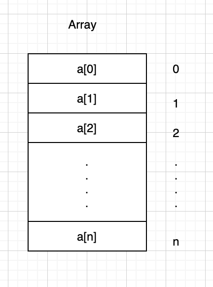

[toc]


# 数组 (线性表)

在每一种编程语言中，基本都会有数组这种数据类型。不过，它不仅仅是一种编程语言中的数据类型，还是一种最基础的数据结构

数组(**Array**)是一种线性表数据结构。它用一组连续的内存空间，来存储一组具有相同类型的数据 



连续的内存空间和相同类型的数据这两个限制，才会有堪称“杀手锏”的特性:“随机访问”。但有利就有弊，这两个限制也让数组的很多操作变得非常低效，比如要想在数组中删除、插入一个数据，为了保证连续性，就需要做大量的数据搬移工作 

访问数组的本质就是访问一段连续内存，只要数组通过偏移计算得到的内存地址是可用的，那么程序就可能不会报任何错误


## 特点

数组是适合查找操作，但是查找的时间复杂度并不为O(1)。即便是排好序的数组，你用二分查找，时间复杂度也是O(logn)

所以，正确的表述应该是，数组支持随机访问，根据下标随机访问的时间复杂度为O(1) 

数组为了保持内存数据的连续性，会导致插入、删除这两个操作比较低效


## 插入 （低效）

假设数组的长度为n，现在，如果我们需要将一个数据插入到数组中的第k个位置。为了把第k个位置腾出来，给新来的数据，我们需要将第k~n这部分的元素都顺序地往后挪一位。那插入操作的时间复杂度是多少呢 

如果在数组的末尾插入元素，那就不需要移动数据了，这时的时间复杂度为O(1)。但如果在数组的开头插入元素，那所有的数据都需要依次往后移动一位，所以 最坏时间复杂度是O(n)。 因为我们在每个位置插入元素的概率是一样的，所以平均情况时间复杂度为
$$
\frac{(1+2+...n)}{n}=O(n)
$$
如果数组中的数据是有序的，我们在某个位置插入一个新的元素时，就必须按照刚才的方法搬移k之后的数据。

但如果数组中存储的数据并没有任何规律，数组只是被当作一个存储数据的集合。在这种情况下，如果要将某个数组插入到第k个位置，为了避免大规模的数据搬移，我们还有一个简单的办法就是，直接将第k位的数据搬移到数组元素的最后，把新的元素直接放入第k个位置。 

假设数组a[10]中存储了如下5个元素: a，b，c，d，e。 我们现在需要将元素x插入到第3个位置。我们只需要将c放入到a[5]，将a[2]赋值为x即可。最后，数组中的元素如下: a，b，x，d，e，c。 

利用这种处理技巧，在特定场景下，在第k个位置插入一个元素的时间复杂度就会降为O(1)。这个处理思想在快排中也会用到 


## 删除 （低效）

跟插入数据类似，如果我们要删除第k个位置的数据，为了内存的连续性，也需要搬移数据，不然中间就会出现空洞，内存就不连续了。 和插入类似，如果删除数组末尾的数据，则最好情况时间复杂度为O(1);如果删除开头的数据，则最坏情况时间复杂度为O(n);平均情况时间复杂度也为O(n)

实际上，在某些特殊场景下，我们并不一定非得追求数组中数据的连续性。如果我们将多次删除操作集中在一起执行，删除的效率是不是会提高很多呢? 

看例子。数组a[10]中存储了8个元素:a，b，c，d，e，f，g，h。现在，我们要依次删除a，b，c三个元素。 

为了避免d，e，f，g，h这几个数据会被搬移三次，我们可以先记录下已经删除的数据。每次的删除操作并不是真正地搬移数据，只是记录数据已经被删除。当数组没有更多空间存储数据时，我们再触发执行一次真正的删除操作，这样就大大减少了删除操作导致的数据搬移。 


### JVM标记清除算法

如果你了解JVM，你会发现，这不就是JVM标记清除垃圾回收算法的核心思想吗?没错，数据结构和算法的魅力就在于此，很多时候我们并不是要去死记硬背某 个数据结构或者算法，而是要学习它背后的思想和处理技巧，这些东西才是最有价值的。 

大多数主流虚拟机采用可达性分析算法来判断对象是否存活，在标记阶段，会遍历所有 GC ROOTS，将所有 GC ROOTS 可达的对象标记为存活。只有当标记工作完成后，清理工作才会开始。

不足之处

1.效率问题。标记和清理效率都不高，但是当知道只有少量垃圾产生时会很高效。

2.空间问题。会产生不连续的内存空间碎片。


## 访问元素（下标随机访问）

一个长度为10的int类型的数组int[] a = new int[10]来举例，计算机给数组a[10]，分配了一块连续内存空间1000~1039，其中，内存块的首地址为base_address = 1000 

```
int[] a = new int[10]
```

计算机会给每个内存单元分配一个地址，计算机通过地址来访问内存中的数据。当计算机需要随机访问数组中的某个元素时，它会首先通过下面的寻址公式，计算出该元素存储的内存地址:

```
a[i]_address = base_address + i * data_type_size
```

> data_type_size表示数组中每个元素的大小 , 数组中存储的是int类型数据，所以data_type_size就为4个字节 


## 数组偏移量

为什么大多数编程语言中，数组要从0开始编号，而不是从1开始呢?

从数组存储的内存模型上来看，“下标”最确切的定义应该是“偏移(offset)”。前面也讲到，如果用a来表示数组的首地址，a[0]就是偏移为0的位置，也就是首地址，a[k]就表示偏移k个type_size的位置，所以计算a[k]的内存地址只需要用这个公式:

```
a[k]_address = base_address + k * type_size 
```

但是，如果数组从1开始计数，那我们计算数组元素a[k]的内存地址就会变为: 

```
a[k]_address = base_address + (k-1)*type_size
```

对比两个公式，我们不难发现，从1开始编号，每次随机访问数组元素都多了一次减法运算，对于CPU来说，就是多了一次减法指令。
数组作为非常基础的数据结构，通过下标随机访问数组元素又是其非常基础的编程操作，效率的优化就要尽可能做到极致。所以为了减少一次减法操作，数组选择了从0开始编号，而不是从1开始。


# 越界检查

很多计算机病毒也正是利用到了代码中的数组越界可以访问非法地址的漏洞，来攻击系统，所以写代码的时候一定要警惕数组越界

并非所有的语言都像C一样，把数组越界检查的工作丢给程序员来做，像Java本身就会做越界检查，比如下面这几行Java代码，就会抛出java.lang.ArrayIndexOutOfBoundsException

```java
int[] a = new int[3];
a[3] = 10;
```


## C语言数组的访问越界

数组越界在C语言中是一种未决行为，并没有规定数组访问越界时编译器应该如何处理。

```c
int main(int argc, char* argv[]) {
    int i = 0;
    int arr[3] = {0};
    for (; i<=3; i++) {
        arr[i] = 0;
        printf("hello world\n");
    }
    return 0;
}
```

> gcc有一个编译选项(-fno-stack-protector)用于关闭堆栈保护功能。默认情况下启动了堆栈保护，不管i声明在前还是在后，i都会在数组之后压栈，只会循环4次;如果关闭堆栈保护功能，则会出现死循环
> 
> 在x86架构下，这段代码的运行结果并非是打印三行“hello word”，而是会无限打印“hello world”
> 
> 数组大小为3，a[0]，a[1]，a[2]，而我们的代码因为书写错误，导致for循环的结束条件错写为了i<=3而非i<3，所以当i=3时，数组a[3]访问越界
> 
> 在C语言中，只要不是访问受限的内存，所有的内存空间都是可以自由访问的。根据我们前面讲的数组寻址公式，a[3]也会被定位到某块不属于数组的内存地址上，而这个地址正好是存储变量i的内存地址，那么a[3]=0就相当于i=0，所以就会导致代码无限循环
> 
> 函数体内的局部变量存在栈上，且是连续压栈。在Linux进程的内存布局中，栈区在高地址空间，从高向低增长。变量i和arr在相邻地址，且i比arr的地址大，
> 
> 所以arr越界正好访问到i。当然，前提是i和arr元素同类型，否则那段代码仍是未决行为
> 

# 容器类

针对数组类型，很多语言都提供了容器类，比如Java中的ArrayList、C++ STL中的vector

## Java ArrayList

ArrayList最大的优势就是可以将很多数组操作的细节封装起来。比如前面提到的数组插入、删除数据时需要搬移其他数据等。另外，它还有一个优势，就是支持动态扩容

数组本身在定义的时候需要预先指定大小，因为需要分配连续的内存空间。如果我们申请了大小为10的数组，当第11个数据需要存储到数组中时，我们就需要重新分配一块更大的空间，将原来的数据复制过去，然后再将新的数据插入。

如果使用ArrayList，我们就完全不需要关心底层的扩容逻辑，ArrayList已经帮我们实现好了。每次存储空间不够的时候，它都会将空间自动扩容为1.5倍大小

因为扩容操作涉及内存申请和数据搬移，是比较耗时的。所以，如果事先能确定需要存储的数据大小，最好在创建ArrayList的时候事先指定数据大小

# 数组应用

由于Java ArrayList无法存储基本类型，比如int、long，需要封装为Integer、Long类，而Autoboxing、Unboxing则有一定的性能消耗，所以如果特别关注性能，或者希望使用基本类型，就可以选用数组。

如果数据大小事先已知，并且对数据的操作非常简单，用不到ArrayList提供的大部分方法，也可以直接使用数组

当要表示多维数组时，用数组往往会更加直观。比如Object[][] array;而用容器的话则需要这样定义:`ArrayList<ArrayList > array`

对于业务开发，直接使用容器就足够了，省时省力。毕竟损耗一丢丢性能，完全不会影响到系统整体的性能。但如果你是做一些非常底层的开发，比如开发网络框架，性能的优化需要做到极致，这个时候数组就会优于容器，成为首选


# Hello World


## python

```
class Myarray:

    def __init__(self, capacity: int):
        self._data = []
        self._capacity = capacity

    def __getitem__(self, position: int) -> object:
        """
        Index Operation, get data
        """
        return self._data[position]

    def __setitem__(self, index: int, value: object):
        """
        Index Operation, set data
        """
        self._data[index] = value

    def __len__(self) -> int:
        return len(self._data)

    def __iter__(self):
        for item in self._data:
            yield item

    def find(self, index: int) -> object:
        try:
            return self._data[index]
        except IndexError:
            return None

    def delete(self, index: int) -> bool:
        try:
            self._data.pop(index)
            return True
        except IndexError:
            return False

    def insert(self, index: int, value: int) -> bool:
        if len(self) >= self._capacity:
            return False
        else:
            return self._data.insert(index, value)

    def print_all(self):
        for item in self:
            print(item)


def test_myarray():
    array = Myarray(5)
    array.insert(0, 0)
    array.insert(1, 1)
    array.insert(2, 2)
    array.insert(3, 3)
    array.insert(4, 4)
    assert array.insert(5, 5) is False
    assert len(array) == 5
    assert array.find(1) == 1
    assert array.delete(4) is True
    array.print_all()


if __name__ == '__main__':
    test_myarray()

>>>
0
1
2
3
```


# Appendix

https://www.ibm.com/developerworks/cn/linux/l-cn-gccstack/index.html

