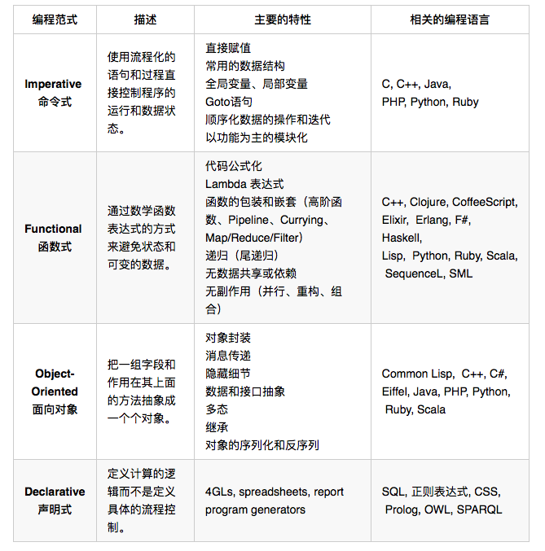

[toc]

# 编程范式

可以简单分成这几类：**声明式**、**命名式**、**逻辑的**、**函数式**、**面向对象的**、**面向过程的**

> - 中间两个声明式编程范式（函数式和逻辑式）偏向于你定义要什么，而不是去怎么做。
> - 而两边的命令式编程范式和面向对象编程范式，偏向于怎么做，而不是要做什么。

# 语言特性

- 变量定义
- 算术运算
- for 循环语句，while 循环语句
- 函数定义，函数调用
- 递归
- 静态类型系统
- 类型推导
- lambda 函数
- 面向对象
- 垃圾回收
- 指针算术
- goto 语句

每一种语言里面必然有一套“通用”的特性。比如变量，函数，整数和浮点数运算，等等。这些是每个通用程序语言里面都必须有的，一个都不能少。你只要通过“某种语言”学会了这些特性，掌握这些特性的根本概念，就能随时把这些知识应用到任何其它语言。你为此投入的时间基本不会浪费。所以初学者纠结要“先学哪种语言”，这种时间花的很不值得，还不如随便挑一个语言，跳进去。

不管是初学者还是资深程序员，应该专注于语言特性，而不是纠结于整个的“语言品牌”。只有这样才能达到融会贯通，拿起任何语言几乎立即就会用，并且写出高质量的代码。

