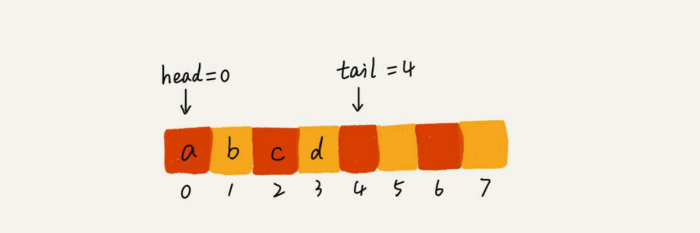
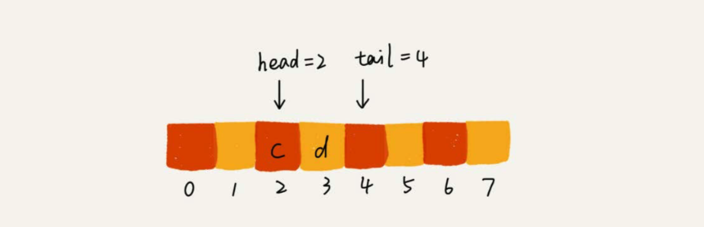
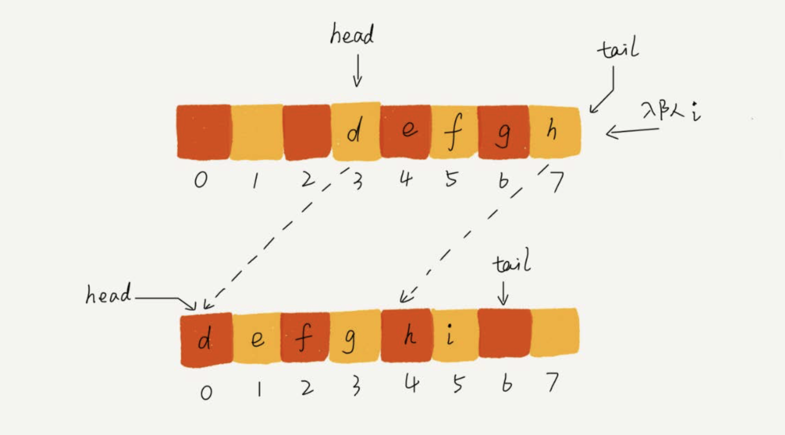
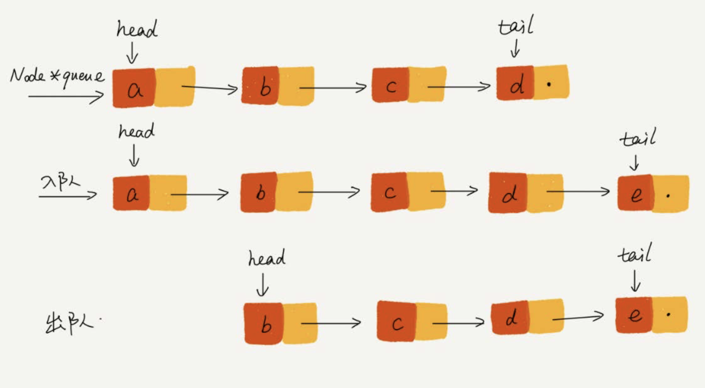

---

title: "queue"
date: 2020-01-14 08:44
---
[toc]


# 队列

队列跟栈非常相似，支持的操作也很有限，最基本的操作也是两个:入队**enqueue()**，放一个数据到 队列尾部;出队**dequeue()**，从队列头部取一个元素。


队列跟栈一样，也是一种操作受限的线性表数据结构。


## 操作队列

队列的概念很好理解，基本操作也很容易掌握。作为一种非常基础的数据结构，队列的应用也非常广泛，特别是一些具有某些额外特性的队列，比如循环队列、阻塞队列、并发队列。它们在很多偏底层系统、框架、中间件的开发中，起着关键性的作用。比如高性能队列Disruptor、Linux环形缓存，都用到了循环并发队列

Java concurrent并发包利用ArrayBlockingQueue来实现公平锁等。


## 顺序队列和链式队列

跟栈一样，队列可以用数组来实现，也可以用链表来实现。

用数组实现的栈叫作顺序栈，用链表实现的栈叫作链式栈。同样，用数组实现的队列叫作顺序队列，用链表实现的队列叫作链式队列。


### 数组实现

```
// 用数组实现的队列
public class ArrayQueue {
		// 数组:items，数组大小:n
		private String[] items;
		private int n = 0;
		// head表示队头下标，tail表示队尾下标
		private int head = 0;
		private int tail = 0;
		
		// 申请一个大小为capacity的数组
		public ArrayQueue(int capacity) {
			 	items = new String[capacity];
			 	n = capacity;
		}
		
		// 入队
		public boolean enqueue(String item) {
				// 如果tail == n 表示队列已经满了
				if (tail == n) return false;
				items[tail] = item;
				++tail;
				return true;
		}
		
		// 出队
		public String dequeue() {
				// 如果head == tail 表示队列为空
				if (head == tail) {
						return null;
				}
				String ret = items[head];
				++head;
				return ret;
		}
}
```


队列需要两个指针:一个是head指针，指向队头;一个是tail指针，指向队尾。



> 两次出队操作之后，队列中head指针指向下标为2的位置，tail指针仍然指向下标为4的位置。




> 随着不停地进行入队、出队操作，head和tail都会持续往后移动。当tail移动到最右边，即使数组中还有空闲空间，也无法继续往队列中添加数据了。


数组的删除操作会导致数组中的数据不连续。你还记得我们当时是怎么解决的吗?对，用数据搬 移!但是，每次进行出队操作都相当于删除数组下标为0的数据，要搬移整个队列中的数据，这样出队操作的时间复杂度就会从原来的O(1)变为O(n)。能不能优化一下呢? 

实际上，我们在出队时可以不用搬移数据。如果没有空闲空间了，我们只需要在入队时，再集中触发一次数据的搬移操作。借助这个思想，出队函数dequeue()保持不变，我们稍加改造一下入队函数enqueue()的实现，就可以轻松解决刚才的问题了。


```
// 入队操作，将item放入队尾
public boolean enqueue(String item) {
		// tail == n表示队列末尾没有空间了
		if (tail == n) {
				// tail ==n && head==0，表示整个队列都占满了
				if (head == 0) {
						return false;
				}
				// 数据搬移
				for (int i = head; i < tail; ++i) {
						items[i-head] = items[i];
				}
				// 搬移完之后重新更新head和tail
				tail -= head;
				head = 0;
		}
		items[tail] = item;
		++tail;
		return true;
}
```

当队列的tail指针移动到数组的最右边后，如果有新的数据入队，我们可以将head到tail之间的数据，整体搬移到数组中0到tail-head的位置。



> 这种实现思路中，出队操作的时间复杂度仍然是O(1)，但入队操作的时间复杂度还是O(1)吗?你可以用我们第3节、第4节讲的算法复杂度分析方法，自己试着分析 一下。


### 链表实现

基于链表的实现，我们同样需要两个指针:head指针和tail指针。它们分别指向链表的第一个结点和最后一个结点。如图所示，入队时，tail->next= new_node, tail = tail->next;出队时，head = head->next。




