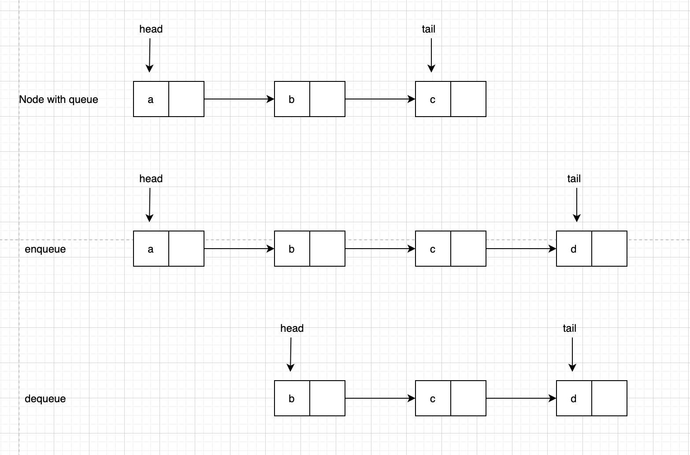

---

title: "queue"
date: 2020-01-14 08:44
---
[toc]


# 队列

队列跟栈非常相似，支持的操作也很有限，最基本的操作也是两个:

入队**enqueue()**，放一个数据到 队列尾部


出队**dequeue()**，从队列头部取一个元素


队列跟栈一样，也是一种操作受限的线性表数据结构。


## 特点

队列的概念很好理解，基本操作也很容易掌握。作为一种非常基础的数据结构，队列的应用也非常广泛，特别是一些具有某些额外特性的队列，比如循环队列、阻塞队列、并发队列。它们在很多偏底层系统、框架、中间件的开发中，起着关键性的作用。比如高性能队列Disruptor、Linux环形缓存，都用到了循环并发队列


Java concurrent并发包利用ArrayBlockingQueue来实现公平锁等。


# 队列实现


## 顺序队列

跟栈一样，队列可以用数组来实现，也可以用链表来实现。

用数组实现的队列叫作顺序队列


### Java

```
// 用数组实现的队列
public class ArrayQueue {
		// 数组:items，数组大小:n
		private String[] items;
		private int n = 0;
		// head表示队头下标，tail表示队尾下标
		private int head = 0;
		private int tail = 0;
		
		// 申请一个大小为capacity的数组
		public ArrayQueue(int capacity) {
			 	items = new String[capacity];
			 	n = capacity;
		}
		
		// 入队
		public boolean enqueue(String item) {
				// 如果tail == n 表示队列已经满了
				if (tail == n) return false;
				items[tail] = item;
				++tail;
				return true;
		}
		
		// 出队
		public String dequeue() {
				// 如果head == tail 表示队列为空
				if (head == tail) {
						return null;
				}
				String ret = items[head];
				++head;
				return ret;
		}
}
```


队列需要两个指针:一个是head指针，指向队头;一个是tail指针，指向队尾。

随着不停地进行入队、出队操作，head和tail都会持续往后移动。当tail移动到最右边，即使数组中还有空闲空间，也无法继续往队列中添加数据了。


数组的删除操作会导致数组中的数据不连续。你还记得我们当时是怎么解决的吗?对，用数据搬 移!但是，每次进行出队操作都相当于删除数组下标为0的数据，要搬移整个队列中的数据，这样出队操作的时间复杂度就会从原来的O(1)变为O(n)。能不能优化一下呢? 

实际上，我们在出队时可以不用搬移数据。如果没有空闲空间了，我们只需要在入队时，再集中触发一次数据的搬移操作。借助这个思想，出队函数dequeue()保持不变，我们稍加改造一下入队函数enqueue()的实现，就可以轻松解决刚才的问题了。

```
// 入队操作，将item放入队尾
public boolean enqueue(String item) {
		// tail == n表示队列末尾没有空间了
		if (tail == n) {
				// tail ==n && head==0，表示整个队列都占满了
				if (head == 0) {
						return false;
				}
				// 数据搬移
				for (int i = head; i < tail; ++i) {
						items[i-head] = items[i];
				}
				// 搬移完之后重新更新head和tail
				tail -= head;
				head = 0;
		}
		items[tail] = item;
		++tail;
		return true;
}
```


### Python

```
from typing import Optional


class ArrayQueue:
    def __init__(self, capacity: int):
        self._items = []
        self._capacity = capacity
        self._head = 0
        self._tail = 0

    def enqueue(self, item: str) -> bool:
        if self._tail == self._capacity:  # queue is full
            return False
        self._items.insert(self._tail, item)
        self._tail += 1
        return True

    def dequeue(self) -> Optional[str]:
        if self._head == self._tail:  # queue is empty
            return False
        item = self._items[self._head]
        self._head += 1
        return item

    def __repr__(self) -> str:
        return ", ".join(item for item in self._items[self._head: self._tail])


if __name__ == '__main__':
    q = ArrayQueue(7)
    q.enqueue('a')
    print(f"q={q}")
    q.enqueue('b')
    print(f"q={q}")
    q.enqueue('c')
    print(f"q={q}")
    item = q.dequeue()
    print(f"item={item}, q={q}")
    item = q.dequeue()
    print(f"item={item}, q={q}")
    item = q.dequeue()
    print(f"item={item}, q={q}")
```

> ```
> >>>
> q=a
> q=a, b
> q=a, b, c
> item=a, q=b, c
> item=b, q=c
> item=c, q=
> ```


```
from typing import Optional


class DynamicArrayQueue:

    def __init__(self, capacity: int):
        self._items = []
        self._capacity = capacity
        self._head = 0
        self._tail = 0

    def enqueue(self, item: str) -> bool:
        if self._tail == self._capacity:
            if self._head == 0: 
                return False

            self._items[0: self._tail - self._head] = self._items[self._head: self._tail]
            self._tail -= self._head
            self._head = 0

        if self._tail == len(self._items):
            self._items.append(item)
        else:
            self._items[self._tail] = item
        self._tail += 1
        return True

    def dequeue(self) -> Optional[str]:
        if self._head != self._tail:
            item = self._items[self._head]
            self._head += 1
            return item

    def __repr__(self) -> str:
        return " ".join(item for item in self._items[self._head:self._tail])


if __name__ == "__main__":
    q = DynamicArrayQueue(10)
    for i in range(10):
        q.enqueue(str(i))
    print(q)

    for _ in range(3):
        q.dequeue()
    print(q)

    q.enqueue("7")
    q.enqueue("8")
    print(q)
```

> ```
> >>>
> 0 1 2 3 4 5 6 7 8 9
> 3 4 5 6 7 8 9
> 3 4 5 6 7 8 9 7 8
> ```
>
> 


## 链式队列

用链表实现的队列叫作链式队列

基于链表的实现，我们同样需要两个指针:head指针和tail指针。

它们分别指向链表的第一个结点和最后一个结点

入队时，`tail->next= new_node, tail = tail->next`

出队时，`head = head->next`




### Python 

```
from typing import Optional


class Node:
    def __init__(self, data: str, next_addr=None):
        self.data = data
        self.next_addr = next_addr


class LinkedListQueue:
    def __init__(self):
        self._head: Optional[Node] = None
        self._tail: Optional[Node] = None

    def enqueue(self, value: str):
        new_node = Node(value)
        if self._tail:
            self._tail.next_addr = new_node
        else:
            self._head = new_node  # queue is empty
        self._tail = new_node

    def dequeue(self) -> Optional[str]:
        if self._head:
            get_value = self._head.data
            self._head = self._head.next_addr
            if not self._head:
                self._tail = None
            return get_value

    def __repr__(self) -> str:
        values = []
        set_current_add = self._head
        while set_current_add:
            values.append(set_current_add.data)
            set_current_add = set_current_add.next_addr
        return "->".join(value for value in values)


if __name__ == '__main__':
    q = LinkedListQueue()
    for i in range(10):
        q.enqueue(str(i))
    print(f"q={q}")

    for _ in range(3):
        q.dequeue()
    print(f"dequeued 0, 1, 2")
    print(f"q={q}")
```

> ```
> >>>
> q=0->1->2->3->4->5->6->7->8->9
> dequeued 0, 1, 2
> q=3->4->5->6->7->8->9
> ```


## 循环队列 circular queue

循环队列，顾名思义，它长得像一个环。原本数组是有头有尾的，是一条直线。现在我们把首尾相连，扳成了一个环。


图中这个队列的大小为 8，当前 head=4，tail=7。当有一个新的元素 d 入队时，我们放入下标为 7 的位置。但这个时候，我们并不把 tail 更新为 8，而是将其在环中后移一位，到下标为 0 的位置


当队列满时，tail指向的位置实际上是没有存储数据的。所以，循环队列会浪费一个数组的存储空间。


### Java

```
public class CircularQueue {
		// 数组:items，数组大小:n
		private String[] items;
		private int n = 0;
		
		// head表示队头下标，tail表示队尾下标
		private int head = 0; 
		private int tail = 0;
		
		// 申请一个大小为capacity的数组
		public CircularQueue(int capacity) {
				items = new String[capacity];
				n = capacity;
		}
		
		// 入队
		public boolean enqueue() {
				// 队列满了
				if ((tail + 1) % n == head) return false;
				items[tail] = item;
				tail = (tail + 1) % n;
				return true;
		}
		
		// 出队
		public String dequeue() {
				// 如果head == tail 表示队列为空
				if (head == tail) return null;
				String ret = items[head];
				head = (head + 1) % n;
				return ret;
		}
}
```


### Python

```
from itertools import chain
from typing import Optional


class CircularQueue:
    def __init__(self, capacity: int):
        self._items = []
        self._capacity = capacity + 1
        self._head = 0
        self._tail = 0

    def enqueue(self, item: str) -> bool:
        if (self._tail + 1) % self._capacity == self._head:  # queue is full
            return False
        self._items.append(item)
        self._tail = (self._tail + 1) % self._capacity
        return True

    def dequeue(self) -> Optional[str]:
        if self._head == self._tail:  # queue is empty
            return False
        get_value = self._items[self._head]
        self._head = (self._head + 1) % self._capacity
        return get_value

    def __repr__(self) -> str:
        if self._tail >= self._head:
            return ", ".join(item for item in self._items[self._head: self._tail])
        else:
            return ", ".join(item for item in chain(self._items[self._head:], self._items[:self._tail]))


if __name__ == "__main__":
    q = CircularQueue(5)
    for i in range(5):
        q.enqueue(str(i))
    print(q)
    q.dequeue()
    q.dequeue()
    q.enqueue(str(5))
    print(q)
```

> ```
> >>>
> 0, 1, 2, 3, 4
> 2, 3, 4, 5
> ```
>
> 


## 阻塞队列

阻塞队列其实就是在队列基础上增加了阻塞操作

简单来说，就是在队列为空的时候，从队头取数据会被阻塞。因为此时还没有数据可取，直到队列中有了数据才能返回；

如果队列已经满了，那么插入数据的操作就会被阻塞，直到队列中有空闲位置后再插入数据，然后再返回。

可以使用阻塞队列，轻松实现一个“生产者 - 消费者模型”


## 并发队列

在多线程情况下，会有多个线程同时操作队列，这个时候就会存在线程安全问题

线程安全的队列我们叫作并发队列。最简单直接的实现方式是直接在 enqueue()、dequeue() 方法上加锁，但是锁粒度大并发度会比较低，同一时刻仅允许一个存或者取操作。

实际上，基于数组的循环队列，利用 CAS(Compare And Swap) 原子操作，可以实现非常高效的并发队列。这也是循环队列比链式队列应用更加广泛的原因。


基于链表的实现方式，可以实现一个支持无限排队的无界队列（unbounded queue），但是可能会导致过多的请求排队等待，请求处理的响应时间过长。所以，针对响应时间比较敏感的系统，基于链表实现的无限排队的线程池是不合适的。

而基于数组实现的有界队列（bounded queue），队列的大小有限，所以线程池中排队的请求超过队列大小时，接下来的请求就会被拒绝，这种方式对响应时间敏感的系统来说，就相对更加合理。不过，设置一个合理的队列大小，也是非常有讲究的。

队列太大导致等待的请求太多，队列太小会导致无法充分利用系统资源、发挥最大性能。


# 队列应用

队列也是一种“操作受限”的线性表，只支持两种基本操作：入队和出队。

队列的应用非常广泛，特别是一些具有某些额外特性的队列，比如循环队列、阻塞队列、并发队列。它们在很多偏底层的系统、框架、中间件的开发中，起着关键性的作用。

比如高性能队列 Disruptor、Linux 环形缓存，都用到了循环并发队列

Java concurrent 并发包利用 ArrayBlockingQueue 来实现公平锁等。


关于如何实现无锁并发队列
可以使用 cas + 数组的方式实现。


队列的其他应用
分布式消息队列，如 kafka 也是一种队列。


# Appendix

https://www.tutorialspoint.com/data_structures_algorithms/dsa_queue.htm