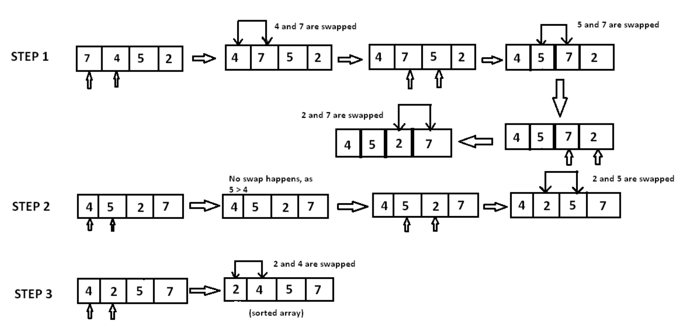

[toc]


# 排序


对于排序算法执行效率的分析，我们一般会从这几个方面来衡量


## 排序分析


**最好情况、最坏情况、平均情况时间复杂度**

我们在分析排序算法的时间复杂度时，要分别给出最好情况、最坏情况、平均情况下的时间复杂度。除此之外，你还要说出最好、最坏时间复杂度对应的要排序的原始数据是什么样的。

为什么要区分这三种时间复杂度呢？

第一，有些排序算法会区分，为了好对比，所以我们最好都做一下区分。

第二，对于要排序的数据，有的接近有序，有的完全无序。有序度不同的数据，对于排序的执行时间肯定是有影响的，我们要知道排序算法在不同数据下的性能表现。


**时间复杂度的系数、常数 、低阶**

我们知道，时间复杂度反映的是数据规模 n 很大的时候的一个增长趋势，所以它表示的时候会忽略系数、常数、低阶。

但是实际的软件开发中，我们排序的可能是 10 个、100 个、1000 个这样规模很小的数据，所以，在对同一阶时间复杂度的排序算法性能对比的时候，我们就要把系数、常数、低阶也考虑进来。


**比较次数和交换（或移动）次数**

基于比较的排序算法的执行过程，会涉及两种操作，一种是元素比较大小，另一种是元素交换或移动。

所以，如果我们在分析排序算法的执行效率的时候，应该把比较次数和交换（或移动）次数也考虑进去。


## 排序算法的内存消耗

我们前面讲过，算法的内存消耗可以通过空间复杂度来衡量，排序算法也不例外

不过，针对排序算法的空间复杂度，我们还引入了一个新的概念，原地排序（Sorted in place）。原地排序算法，就是特指空间复杂度是 O(1) 的排序算法

如heapsort, bubble sort, insertion sort, selection sort, shell sort


## 排序算法的稳定性

仅仅用执行效率和内存消耗来衡量排序算法的好坏是不够的。针对排序算法，我们还有一个重要的度量指标，稳定性。

这个概念是说，如果待排序的序列中存在值相等的元素，经过排序之后，相等元素之间原有的先后顺序不变。


比如我们有一组数据 2，9，3，4，8，3，按照大小排序之后就是 2，3，3，4，8，9。这组数据里有两个 3。经过某种排序算法排序之后，如果两个 3 的前后顺序没有改变，那我们就把这种排序算法叫作稳定的排序算法；如果前后顺序发生变化，那对应的排序算法就叫作不稳定的排序算法。


### 稳定的排序算法

比如说，我们现在要给电商交易系统中的“订单”排序。

订单有两个属性，一个是下单时间，另一个是订单金额。如果我们现在有 10 万条订单数据，我们希望按照金额从小到大对订单数据排序。对于金额相同的订单，我们希望按照下单时间从早到晚有序。对于这样一个排序需求，我们怎么来做呢？

最先想到的方法是：我们先按照金额对订单数据进行排序，然后，再遍历排序之后的订单数据，对于每个金额相同的小区间再按照下单时间排序。这种排序思路理解起来不难，但是实现起来会很复杂。

借助稳定排序算法，这个问题可以非常简洁地解决。

解决思路是这样的：我们先按照下单时间给订单排序，注意是按照下单时间，不是金额。

排序完成之后，我们用稳定排序算法，按照订单金额重新排序。

两遍排序之后，我们得到的订单数据就是按照金额从小到大排序，金额相同的订单按照下单时间从早到晚排序的。为什么呢？

稳定排序算法可以保持金额相同的两个对象，在排序之后的前后顺序不变。

第一次排序之后，所有的订单按照下单时间从早到晚有序了。

在第二次排序中，我们用的是稳定的排序算法，所以经过第二次排序之后，相同金额的订单仍然保持下单时间从早到晚有序。


# 冒泡排序 Bubble Sort

冒泡排序只会操作相邻的两个数据。每次冒泡操作都会对相邻的两个元素进行比较，看是否满足大小关系要求。如果不满足就让它俩互换。一次冒泡会让至少一个元素移动到它应该在的位置，重复 n 次，就完成了 n 个数据的排序工作。

这个算法的名字由来是因为越小的元素会经由交换慢慢“浮”到数列的顶端





## 特点

**原地排序算法**

冒泡的过程只涉及相邻数据的交换操作，只需要常量级的临时空间，所以它的空间复杂度为 O(1)


**稳定的排序算法**

在冒泡排序中，只有交换才可以改变两个元素的前后顺序。为了保证冒泡排序算法的稳定性，当有相邻的两个元素大小相等的时候，我们不做交换，相同大小的数据在排序前后不会改变顺序


**复杂度**

最好情况下，要排序的数据已经是有序的了，我们只需要进行一次冒泡操作，就可以结束了，所以最好情况时间复杂度是 O(n)。

而最坏的情况是，要排序的数据刚好是倒序排列的，我们需要进行 n 次冒泡操作，所以最坏情况时间复杂度为 O(n^2)。

平均复杂度为O(n^2)


## Java

```

// 冒泡排序，a表示数组，n表示数组大小
public void bubbleSort(int[] a, int n) {
  if (n <= 1) return;
 
 for (int i = 0; i < n; ++i) {
    // 提前退出冒泡循环的标志位
    boolean flag = false;
    for (int j = 0; j < n - i - 1; ++j) {
      if (a[j] > a[j+1]) { // 交换
        int tmp = a[j];
        a[j] = a[j+1];
        a[j+1] = tmp;
        flag = true;  // 表示有数据交换      
      }
    }
    if (!flag) break;  // 没有数据交换，提前退出
  }
}
```


## Python

```
class BubbleSort:

    def __init__(self, array: list):
        self._array = array
        self._length = len(self._array)

    def sort(self):
        if self._length <= 1:
            return
        for i in range(self._length):
            flag = False
            for j in range(self._length - i - 1):
                if self._array[j] > self._array[j+1]:
                    self._array[j], self._array[j+1] = self._array[j+1], self._array[j]
                    flag = True
            if not flag:
                break
        return self._array


if __name__ == '__main__':
    my_array = BubbleSort([3, 5, 1, 8, 7])
    print(my_array.sort())
```

> ```
> >>>
> [1, 3, 5, 7, 8]
> ```
>
> 


# 插入排序 Insertion Sort 

插入排序也包含两种操作，一种是元素的比较，一种是元素的移动。

当我们需要将一个数据 a 插入到已排序区间时，需要拿 a 与已排序区间的元素依次比较大小，找到合适的插入位置。

找到插入点之后，我们还需要将插入点之后的元素顺序往后移动一位，这样才能腾出位置给元素 a 插入。

对于不同的查找插入点方法（从头到尾、从尾到头），元素的比较次数是有区别的。但对于一个给定的初始序列，移动操作的次数总是固定的，就等于逆序度。


## 特点

**原地排序算法**

从实现过程可以很明显地看出，插入排序算法的运行并不需要额外的存储空间，所以空间复杂度是 O(1)


**稳定的排序算法**

在插入排序中，对于值相同的元素，我们可以选择将后面出现的元素，插入到前面出现元素的后面，这样就可以保持原有的前后顺序不变


**复杂度**

如果要排序的数据已经是有序的，我们并不需要搬移任何数据。如果我们从尾到头在有序数据组里面查找插入位置，每次只需要比较一个数据就能确定插入的位置。所以这种情况下，最好是时间复杂度为 O(n)

注意，这里是从尾到头遍历已经有序的数据。如果数组是倒序的，每次插入都相当于在数组的第一个位置插入新的数据，所以需要移动大量的数据，所以最坏情况时间复杂度为 O(n^2)

还记得我们在数组中插入一个数据的平均时间复杂度是多少吗？没错，是 O(n)。所以，对于插入排序来说，每次插入操作都相当于在数组中插入一个数据，循环执行 n 次插入操作，所以平均时间复杂度为 O(n^2)


## Java

```
// 插入排序，a表示数组，n表示数组大小
public void insertionSort(int[] a, int n) {
  if (n <= 1) return;

  for (int i = 1; i < n; ++i) {
    int value = a[i];
    int j = i - 1;
    // 查找插入的位置
    for (; j >= 0; --j) {
      if (a[j] > value) {
        a[j+1] = a[j];  // 数据移动
      } else {
        break;
      }
    }
    a[j+1] = value; // 插入数据
  }
}
```


## Python

```
class InsertionSort:

    def __init__(self, array: list):
        self._array = array
        self._length = len(self._array)

    def sort(self):
        if self._length <= 1:
            return

        for i in range(1, self._length):
            get_swap_value = self._array[i]
            position = i - 1
            while position >= 0 and self._array[position] > get_swap_value:
                self._array[position+1] = self._array[position]
                position -= 1
            self._array[position+1] = get_swap_value

        return self._array


if __name__ == '__main__':
    my_array = InsertionSort([1, 4, 7, 2, 3, 8])
    print(my_array.sort())
    
```

> ```
> >>>
> [1, 2, 3, 4, 7, 8]
> ```
>
> 


# 冒泡 vs 插入

冒泡排序不管怎么优化，元素交换的次数是一个固定值，是原始数据的逆序度。插入排序是同样的，不管怎么优化，元素移动的次数也等于原始数据的逆序度。

但是，从代码实现上来看，冒泡排序的数据交换要比插入排序的数据移动要复杂，冒泡排序需要 3 个赋值操作，而插入排序只需要 1 个

```
冒泡排序中数据的交换操作：
if (a[j] > a[j+1]) { // 交换
   int tmp = a[j];
   a[j] = a[j+1];
   a[j+1] = tmp;
   flag = true;
}

插入排序中数据的移动操作：
if (a[j] > value) {
  a[j+1] = a[j];  // 数据移动
} else {
  break;
}
```


我们把执行一个赋值语句的时间粗略地计为单位时间（unit_time），然后分别用冒泡排序和插入排序对同一个逆序度是 K 的数组进行排序。用冒泡排序，需要 K 次交换操作，每次需要 3 个赋值语句，所以交换操作总耗时就是 3*K 单位时间。而插入排序中数据移动操作只需要 K 个单位时间。

# 选择排序 Selection Sort

选择排序算法的实现思路有点类似插入排序，也分已排序区间和未排序区间

但是选择排序每次会从未排序区间中找到最小的元素，将其放到已排序区间的末尾。


## 特点

选择排序空间复杂度为 O(1)，是一种原地排序算法

选择排序的最好情况时间复杂度、最坏情况和平均情况时间复杂度都为 O(n^2)

选择排序是一种不稳定的排序算法。从我前面画的那张图中，你可以看出来，选择排序每次都要找剩余未排序元素中的最小值，并和前面的元素交换位置，这样破坏了稳定性。

比如 5，8，5，2，9 这样一组数据，使用选择排序算法来排序的话，第一次找到最小元素 2，与第一个 5 交换位置，那第一个 5 和中间的 5 顺序就变了，所以就不稳定了。正是因此，相对于冒泡排序和插入排序，选择排序就稍微逊色了。


## Python

```
class SelectionSort:
    def __init__(self, array: []):
        self._array = array
        self._length = len(self._array)

    def sort(self):
        if self._length <= 1:
            return

        for i in range(self._length):
            min_index = i
            min_value = self._array[i]
            for j in range(i, self._length):
                if self._array[j] < min_value:
                    min_value = self._array[j]
                    min_index = j
            self._array[i], self._array[min_index] = self._array[min_index], self._array[i]  # swap min_value at beginning

        return self._array


if __name__ == '__main__':
    my_array = SelectionSort([4, 7, 3, 8])
    print(my_array.sort())

```

> ```
> >>>
> [3, 4, 7, 8]
> ```
>
> 


# 归并排序 Merge Sort

如果要排序一个数组，我们先把数组从中间分成前后两部分，然后对前后两部分分别排序，再将排好序的两部分合并在一起，这样整个数组就都有序了。


归并排序用的是分治思想，可以用递归来实现。

写递归代码的技巧就是，分析得出递推公式，然后找到终止条件，最后将递推公式翻译成递归代码。所以，要想写出归并排序的代码，我们先写出归并排序的递推公式。

```
递推公式：
merge_sort(p…r) = merge(merge_sort(p…q), merge_sort(q+1…r))

终止条件：
p >= r 不用再继续分解
```

> 其中下标 q 等于 p 和 r 的中间位置，也就是 (p+r)/2。当下标从 p 到 q 和从 q+1 到 r 这两个子数组都排好序之后，我们再将两个有序的子数组合并在一起，这样下标从 p 到 r 之间的数据就也排好序了。


## 特点


**稳定的排序算法**

归并排序稳不稳定关键要看 merge() 函数，也就是两个有序子数组合并成一个有序数组的那部分代码。在合并的过程中，如果 A[p...q]和 A[q+1...r]之间有值相同的元素，那我们可以像伪代码中那样，先把 A[p...q]中的元素放入 tmp 数组。这样就保证了值相同的元素，在合并前后的先后顺序不变


归并排序涉及递归，时间复杂度的分析稍微有点复杂。我们正好借此机会来学习一下，如何分析递归代码的时间复杂度。在递归那一节我们讲过，递归的适用场景是，一个问题 a 可以分解为多个子问题 b、c，那求解问题 a 就可以分解为求解问题 b、c。问题 b、c 解决之后，我们再把 b、c 的结果合并成 a 的结果。如果我们定义求解问题 a 的时间是 T(a)，求解问题 b、c 的时间分别是 T(b) 和 T( c)，那我们就可以得到这样的递推关系式：

```
T(a) = T(b) + T(c) + K
```

其中 K 等于将两个子问题 b、c 的结果合并成问题 a 的结果所消耗的时间。从刚刚的分析，我们可以得到一个重要的结论：不仅递归求解的问题可以写成递推公式，递归代码的时间复杂度也可以写成递推公式。


我们假设对 n 个元素进行归并排序需要的时间是 T(n)，那分解成两个子数组排序的时间都是 T(n/2)。我们知道，merge() 函数合并两个有序子数组的时间复杂度是 O(n)。所以，套用前面的公式，归并排序的时间复杂度的计算公式就是：

```
T(1) = C； n=1时，只需要常量级的执行时间，所以表示为C
T(n) = 2*T(n/2) + n； n>1
```

通过这个公式，如何来求解 T(n) 呢？还不够直观？那我们再进一步分解一下计算过程。

```
T(n) = 2*T(n/2) + n
     = 2*(2*T(n/4) + n/2) + n = 4*T(n/4) + 2*n
     = 4*(2*T(n/8) + n/4) + 2*n = 8*T(n/8) + 3*n
     = 8*(2*T(n/16) + n/8) + 3*n = 16*T(n/16) + 4*n
     ......
     = 2^k * T(n/2^k) + k * n
     ......
```


通过这样一步一步分解推导，我们可以得到 T(n) = 2^kT(n/2^k)+kn。当 T(n/2^k)=T(1) 时，也就是 n/2^k=1，我们得到 k=log2n 。我们将 k 值代入上面的公式，得到 T(n)=Cn+nlog2n 。如果我们用大 O 标记法来表示的话，T(n) 就等于 O(nlogn)。所以归并排序的时间复杂度是 O(nlogn)。

从我们的原理分析和伪代码可以看出，归并排序的执行效率与要排序的原始数组的有序程度无关，所以其时间复杂度是非常稳定的，不管是最好情况、最坏情况，还是平均情况，时间复杂度都是 O(nlogn)。


归并排序的时间复杂度任何情况下都是 O(nlogn)，看起来非常优秀。（待会儿你会发现，即便是快速排序，最坏情况下，时间复杂度也是 O(n2)。）但是，归并排序并没有像快排那样，应用广泛，这是为什么呢？因为它有一个致命的“弱点”，那就是归并排序不是原地排序算法。

递归代码的空间复杂度并不能像时间复杂度那样累加。刚刚我们忘记了最重要的一点，那就是，尽管每次合并操作都需要申请额外的内存空间，但在合并完成之后，临时开辟的内存空间就被释放掉了。在任意时刻，CPU 只会有一个函数在执行，也就只会有一个临时的内存空间在使用。临时内存空间最大也不会超过 n 个数据的大小，所以空间复杂度是 O(n)。


## Python

```
from typing import List


class MergeSort:

    @staticmethod
    def sort(array: List[int]):
        MergeSort.merge_sort_between(array, 0, len(array)-1)

    @staticmethod
    def merge_sort_between(array: List[int], low: int, high: int):
        if low < high:
            middle = low + (high - low) // 2
            MergeSort.merge_sort_between(array, low, middle)
            MergeSort.merge_sort_between(array, middle+1, high)
            MergeSort.merge(array, low, middle, high)

    @staticmethod
    def merge(array: List[int], low: int, middle: int, high: int):
        i, j = low, middle+1
        tmp_list = []
        while i <= middle and j <= high:
            if array[i] <= array[j]:
                tmp_list.append(array[i])
                i += 1
            else:
                tmp_list.append(array[j])
                j += 1

        start = i if i <= middle else j
        end = middle if i <= middle else high
        tmp_list.extend(array[start: end+1])
        array[low: high+1] = tmp_list
        return tmp_list


if __name__ == '__main__':
    my_array = [6, 5, 12, 10, 9, 1]
    MergeSort.sort(my_array)
    print(my_array)

```

> ```
> >>>
> [1, 5, 6, 9, 10, 12]
> ```
>
> 


# 快速排序 Quick Sort 

快排的思想是这样的：如果要排序数组中下标从 p 到 r 之间的一组数据，我们选择 p 到 r 之间的任意一个数据作为 pivot（分区点）。

我们遍历 p 到 r 之间的数据，将小于 pivot 的放到左边，将大于 pivot 的放到右边，将 pivot 放到中间。

经过这一步骤之后，数组 p 到 r 之间的数据就被分成了三个部分，前面 p 到 q-1 之间都是小于 pivot 的，中间是 pivot，后面的 q+1 到 r 之间是大于 pivot 的。


如果我们用递推公式来将上面的过程写出来的话，就是这样：

```
quick_sort(p…r) = quick_sort(p…q-1) + quick_sort(q+1… r)

终止条件：
p >= r
```


我们将递推公式转化成递归代码。跟归并排序一样，我还是用伪代码来实现，你可以翻译成你熟悉的任何语言。

```
// 快速排序，A是数组，n表示数组的大小
quick_sort(A, n) {
  quick_sort_c(A, 0, n-1)
}
// 快速排序递归函数，p,r为下标
quick_sort_c(A, p, r) {
  if p >= r then return
  
  q = partition(A, p, r) // 获取分区点
  quick_sort_c(A, p, q-1)
  quick_sort_c(A, q+1, r)
}
```


## 特点

快排是一种原地、不稳定的排序算法。

快排也是用递归来实现的。对于递归代码的时间复杂度，我前面总结的公式，这里也还是适用的。如果每次分区操作，都能正好把数组分成大小接近相等的两个小区间，那快排的时间复杂度递推求解公式跟归并是相同的。所以，快排的时间复杂度也是 O(nlogn)。

```
T(1) = C；   n=1时，只需要常量级的执行时间，所以表示为C。
T(n) = 2*T(n/2) + n； n>1
```


## Python

```
from typing import List
import random


class QuickSort:

    @staticmethod
    def sort(array: List[int]):
        QuickSort.quick_sort_between(array, 0, len(array) - 1)

    @staticmethod
    def quick_sort_between(array: List[int], low: int, high: int):
        if low < high:
            k = random.randint(low, high)
            array[low], array[k] = array[k], array[low]

            m = QuickSort.partition(array, low, high)
            QuickSort.quick_sort_between(array, low, m-1)
            QuickSort.quick_sort_between(array, m+1, high)

    @staticmethod
    def partition(array: List[int], low: int, high: int):
        pivot, j = array[low], low
        for i in range(low+1, high+1):
            if array[i] <= pivot:
                j += 1
                array[j], array[i] = array[i], array[j]
        array[low], array[j] = array[j], array[low]
        return j


if __name__ == '__main__':
    my_array = [6, 5, 12, 10, 9, 1]
    QuickSort.sort(my_array)
    print(my_array)
```

> ```
> >>>
> [1, 5, 6, 9, 10, 12]
> ```
>
> 


### two-way 双向排序

提高非随机输入的性能

不需要额外的空间,在待排序数组本身内部进行排序

基准值通过random随机选取


## Question

现在你有 10 个接口访问日志文件，每个日志文件大小约 300MB，每个文件里的日志都是按照时间戳从小到大排序的。你希望将这 10 个较小的日志文件，合并为 1 个日志文件，合并之后的日志仍然按照时间戳从小到大排列。如果处理上述排序任务的机器内存只有 1GB，你有什么好的解决思路，能“快速”地将这 10 个日志文件合并吗？


先构建十条io流，分别指向十个文件，每条io流读取对应文件的第一条数据，然后比较时间戳，选择出时间戳最小的那条数据，将其写入一个新的文件，然后指向该时间戳的io流读取下一行数据，然后继续刚才的操作，比较选出最小的时间戳数据，写入新文件，io流读取下一行数据，以此类推，完成文件的合并， 这种处理方式，日志文件有n个数据就要比较n次，每次比较选出一条数据来写入，时间复杂度是O（n），空间复杂度是O（1）,几乎不占用内存

# 归并 vs 快排

归并排序的处理过程是由下到上的，先处理子问题，然后再合并。而快排正好相反，它的处理过程是由上到下的，先分区，然后再处理子问题。

归并排序虽然是稳定的、时间复杂度为 O(nlogn) 的排序算法，但是它是非原地排序算法。我们前面讲过，归并之所以是非原地排序算法，主要原因是合并函数无法在原地执行。

快速排序通过设计巧妙的原地分区函数，可以实现原地排序，解决了归并排序占用太多内存的问题。


快速排序算法虽然最坏情况下的时间复杂度是 O(n2)，但是平均情况下时间复杂度都是 O(nlogn)。不仅如此，快速排序算法时间复杂度退化到 O(n2) 的概率非常小，我们可以通过合理地选择 pivot 来避免这种情况。


# 桶排序 Bucket Sort

核心思想是将要排序的数据分到几个有序的桶里，每个桶里的数据再单独进行排序。桶内排完序之后，再把每个桶里的数据按照顺序依次取出，组成的序列就是有序的了。


桶排序的时间复杂度为什么是 O(n) 呢？我们一块儿来分析一下。

如果要排序的数据有 n 个，我们把它们均匀地划分到 m 个桶内，每个桶里就有 k=n/m 个元素。每个桶内部使用快速排序，时间复杂度为 O(k * logk)。m 个桶排序的时间复杂度就是 O(m * k * logk)，因为 k=n/m，所以整个桶排序的时间复杂度就是 O(n*log(n/m))。当桶的个数 m 接近数据个数 n 时，log(n/m) 就是一个非常小的常量，这个时候桶排序的时间复杂度接近 O(n)。


## 劣势

桶排序对要排序数据的要求是非常苛刻的

首先，要排序的数据需要很容易就能划分成 m 个桶，并且，桶与桶之间有着天然的大小顺序。这样每个桶内的数据都排序完之后，桶与桶之间的数据不需要再进行排序。

其次，数据在各个桶之间的分布是比较均匀的。如果数据经过桶的划分之后，有些桶里的数据非常多，有些非常少，很不平均，那桶内数据排序的时间复杂度就不是常量级了。在极端情况下，如果数据都被划分到一个桶里，那就退化为 O(nlogn) 的排序算法了。


## 优势

桶排序比较适合用在外部排序中。所谓的外部排序就是数据存储在外部磁盘中，数据量比较大，内存有限，无法将数据全部加载到内存中。

比如说我们有 10GB 的订单数据，我们希望按订单金额（假设金额都是正整数）进行排序，但是我们的内存有限，只有几百 MB，没办法一次性把 10GB 的数据都加载到内存中。这个时候该怎么办呢？

我们可以先扫描一遍文件，看订单金额所处的数据范围。假设经过扫描之后我们得到，订单金额最小是 1 元，最大是 10 万元。我们将所有订单根据金额划分到 100 个桶里，第一个桶我们存储金额在 1 元到 1000 元之内的订单，第二桶存储金额在 1001 元到 2000 元之内的订单，以此类推。每一个桶对应一个文件，并且按照金额范围的大小顺序编号命名（00，01，02...99）。

理想的情况下，如果订单金额在 1 到 10 万之间均匀分布，那订单会被均匀划分到 100 个文件中，每个小文件中存储大约 100MB 的订单数据，我们就可以将这 100 个小文件依次放到内存中，用快排来排序。等所有文件都排好序之后，我们只需要按照文件编号，从小到大依次读取每个小文件中的订单数据，并将其写入到一个文件中，那这个文件中存储的就是按照金额从小到大排序的订单数据了。


## Python

```
from typing import List
import math


class BucketSort:

    def __init__(self, array: List[int], bucket_size=None):
        self._array = array
        self._length = len(self._array)
        self._bucket_size = bucket_size if bucket_size else 5

    def sort(self):
        if self._length < 2:
            return

        unconcat_bucket = self.create_bucket()
        sorted_bucket_values = self.sort_bucket_dict(unconcat_bucket)
        return sorted_bucket_values

    def create_bucket(self):
        min_value = self._array[0]
        max_value = self._array[1]
        for i in range(len(self._array)):
            if self._array[i] < min_value:
                min_value = self._array[i]
            if self._array[i] > max_value:
                max_value = self._array[i]

        bucket_count_dict = {}
        bucket_count = math.floor((max_value - min_value) / self._bucket_size) + 1

        # generate buckets with index id
        for i in range(bucket_count):
            bucket_count_dict[str(i)] = []

        # put value into their corresponding bucket
        for i in range(len(self._array)):
            bucket_index = math.floor((self._array[i] - min_value) / self._bucket_size)
            bucket_count_dict[str(bucket_index)].append(self._array[i])

        # sorting value in the same bucket, using quick sort
        for i in range(bucket_count-1):
            BucketSort.quick_sort(bucket_count_dict[str(i)], 0, len(bucket_count_dict[str(i)])-1)

        return bucket_count_dict

    def sort_bucket_dict(self, unconcat_bucket: dict):
        sorted_list = []
        for i in range(len(unconcat_bucket)):
            for j in unconcat_bucket[str(i)]:
                sorted_list.append(j)
        return sorted_list

    @staticmethod
    def quick_sort(array: List[int], low: int, high: int):
        if low >= high:
            return

        get_partition_value = BucketSort.partition(array, low, high)
        BucketSort.quick_sort(array, low, get_partition_value-1)
        BucketSort.quick_sort(array, get_partition_value+1, high)

    @staticmethod
    def partition(array: List[int], low: int, high: int):
        pivot, j = array[low], low
        for i in range(low+1, high+1):
            if array[i] <= pivot:
                j += 1
                array[j], array[i] = array[i], array[j]
        array[low], array[j] = array[j], array[low]
        return j


if __name__ == '__main__':
    my_array = [11, 9, 21, 8, 17, 19, 13, 1, 24, 12]
    sorted_my_array = BucketSort(my_array).sort()
    print(sorted_my_array)

```

> ```
> >>>
> [1, 8, 9, 11, 12, 13, 17, 19, 21, 24]
> ```
>
> 


# 计数排序 Counting sort

计数排序其实是桶排序的一种特殊情况

1. 当要排序的 7 个数据，` [4, 2, 2, 8, 3, 3, 1]`，所处的范围并不大的时候，这里最大值是 8，初始化 **最大值+1** 个桶的数组，全部元素为0, 每个桶内存储对应的值，而且数据值都是相同的，省掉了桶内排序的时间
2. 整个数组中，相同元素的计数统计值，找到其在对应的下标中的位置，如数组中元素3共有2个，将2存储在下标为2的位置上，不存在则存储为0，以此得到 `[0, 1, 2, 2, 1, 0, 0, 0, 1]`
3. 数组内依次累加数组元素，并存储到相应下标位置，得到`[0, 1， 3， 5， 6， 6， 6， 6， 7]`
4. 从后往前 ，将源数组中的元素，找到其下标所在的，累加数组的值，减去1得到排序位置下标值，如源数组第一个4，在累加数组下标数组的值为6，减去1得5，即排序后的位置在第5位


计数排序的算法思想就是这么简单，跟桶排序非常类似，只是桶的大小粒度不一样。


## 特点

计数排序只能用在数据范围不大的场景中，如果数据范围 k 比要排序的数据 n 大很多，就不适合用计数排序了。而且，计数排序只能给非负整数排序，如果要排序的数据是其他类型的，要将其在不改变相对大小的情况下，转化为非负整数。


## Java

```

// 计数排序，a是数组，n是数组大小。假设数组中存储的都是非负整数。
public void countingSort(int[] a, int n) {
  if (n <= 1) return;

  // 查找数组中数据的范围
  int max = a[0];
  for (int i = 1; i < n; ++i) {
    if (max < a[i]) {
      max = a[i];
    }
  }

  int[] c = new int[max + 1]; // 申请一个计数数组c，下标大小[0,max]
  for (int i = 0; i <= max; ++i) {
    c[i] = 0;
  }

  // 计算每个元素的个数，放入c中
  for (int i = 0; i < n; ++i) {
    c[a[i]]++;
  }

  // 依次累加
  for (int i = 1; i <= max; ++i) {
    c[i] = c[i-1] + c[i];
  }

  // 临时数组r，存储排序之后的结果
  int[] r = new int[n];
  // 计算排序的关键步骤，有点难理解
  for (int i = n - 1; i >= 0; --i) {
    int index = c[a[i]]-1;
    r[index] = a[i];
    c[a[i]]--;
  }

  // 将结果拷贝给a数组
  for (int i = 0; i < n; ++i) {
    a[i] = r[i];
  }
}
```


## Python


# 基数排序 Radix sort


# Appendix

https://time.geekbang.org/column/article/41802

https://www.hackerearth.com/practice/algorithms/sorting/bubble-sort/tutorial/

https://medium.com/@paulsoham/merge-sort-63d75df76388

https://stackabuse.com/quicksort-in-javascript/

https://www.programiz.com/dsa/bucket-sort

https://www.programiz.com/dsa/counting-sort