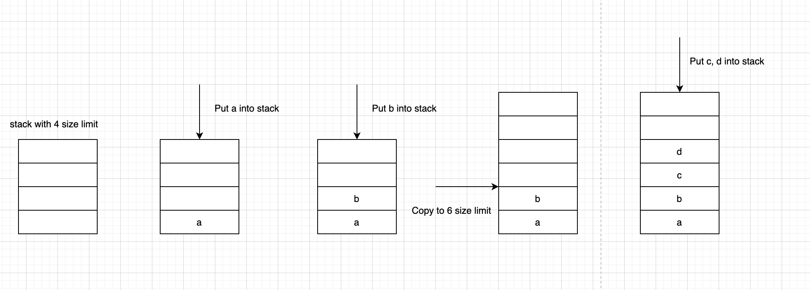
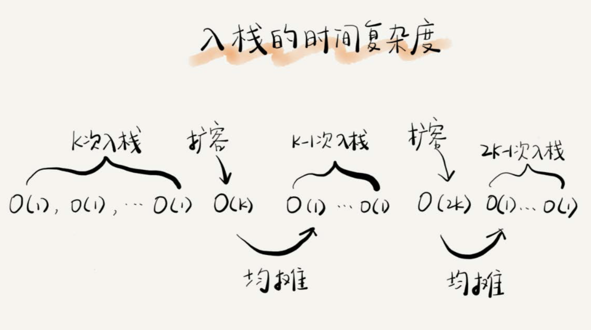

[toc]


# 栈

后进者先出，先进者后出，这就是典型的**“**栈**”**结构

从栈的操作特性上来看，栈是一种**“**操作受限**”**的线性表，只允许在一端插入和删除数据

不管是顺序栈还是链式栈，我们存储数据只需要一个大小为n的数组就够了。

在入栈和出栈过程中，只需要一两个临时变量存储空间，所以空间复杂度是O(1)

注意，这里存储数据需要一个大小为n的数组，并不是说空间复杂度就是O(n)。因为，这n个空间是必须的，无法省掉。所以我们说空间复杂度的时候，是指除了原本的数据存储空间外，算法运行还需要额外的存储空间。


## 特点

事实上，从功能上来说，数组或链表确实可以替代栈，但你要知道，特定的数据结构是对特定场景的抽象，而且，数组或链表暴露了太多的操作接口，操作上的确灵活自由，但使用时就比较不可控，自然也就更容易出错。

当某个数据集合只涉及在一端插入和删除数据，并且满足后进先出、先进后出的特性，这时我们就应该首选“栈”这种数据结构


# 栈的实现

栈主要包含两个操作，入栈和出栈，也就是在栈顶插入一个数据和从栈顶删除一个数据。

栈既可以用数组来实现，也可以用链表来实现。

用数组实现的栈，我们叫作顺序栈，用链表实现的栈，我们叫作链式栈。


## 基于数组的顺序栈


### Java

```
public class ArrayStack {
		private String[] items; // 数组
		private int count; // 栈中元素个数
		private int n; //栈的大小
		
		// 初始化数组，申请一个大小为n的数组空间
		public ArrayStack(int n) {
				this.items = new String[n];
				this.n = n;
				this.count = 0;
		}
		
		// 入栈操作
		public boolean push(String item) {
				// 数组空间不够了，直接返回false，入栈失败。
				if (count == n) return false;
				// 将item放到下标为count的位置，并且count加一
				items[count] = item;
				++count;
				return true;
		}
		
		// 出栈操作
		public String pop() {
				// 栈为空，则直接返回null
				if (count == 0) return null;
				// 返回下标为count-1的数组元素，并且栈中元素个数count减一
				String tmp = items[count-1];
				--count;
				return tmp;
		}
}
```

> 这是一个固定大小的栈，也就是说，在初始化栈时需要事先指定栈的大小。


## 基于链表的链式栈

### Python

```
from typing import Optional


class Node:
    def __init__(self, data: int, next_point_addr=None):
        self.data = data
        self.next_point_addr = next_point_addr


class LinkedListStack:

    def __init__(self):
        self._top = None

    def push(self, value: int):
        new_top = Node(value)
        new_top.next_point_addr = self._top
        self._top = new_top

    def pop(self) -> Optional[int]:
        if self._top:
            value = self._top.data
            self._top = self._top.next_point_addr
            return value
        else:
            return

    def __repr__(self) -> str:
        current_point_addr = self._top
        nums = []
        while current_point_addr:
            nums.append(current_point_addr.data)
            current_point_addr = current_point_addr.next_point_addr
        return "\n|__|\n".join(f"| {num}|" for num in nums)


if __name__ == '__main__':
    stack = LinkedListStack()
    for i in range(9):
        stack.push(i)
    print(stack)
    print("-"*10)
    for _ in range(3):
        stack.pop()
    print(stack)
```

> ```
> >>>
> | 8|
> |__|
> | 7|
> |__|
> | 6|
> |__|
> | 5|
> |__|
> | 4|
> |__|
> | 3|
> |__|
> | 2|
> |__|
> | 1|
> |__|
> | 0|
> ----------
> | 5|
> |__|
> | 4|
> |__|
> | 3|
> |__|
> | 2|
> |__|
> | 1|
> |__|
> | 0|
> ```


## 支持动态扩容的顺序栈 （不常用）

当数组空间不够时，我们就重新申请一块更大的内存，将原来数组中数据统统拷贝过去。这样就实现了一个支持动态扩容的数组。

实际上，支持动态扩容的顺序栈，我们平时开发中并不常用到




### 复杂度

对于出栈操作来说，我们不会涉及内存的重新申请和数据的搬移，所以出栈的时间复杂度仍然是O(1)

但是，对于入栈操作来说，情况就不一样了。当栈中有空闲空间时，入栈操作的时间复杂度为O(1)。但当空间不够时，就需要重新申请内存和数据搬移，所以时间复杂度就变成了O(n)。


#### 入栈时间复杂度

如果当前栈大小为K，并且已满，当再有新的数据要入栈时，就需要重新申请2倍大小的内存，并且做K个数据的搬移操作，然后再入栈。但是，接下来的K-1次入 栈操作，我们都不需要再重新申请内存和搬移数据，所以这K-1次入栈操作都只需要一个simple-push操作就可以完成



> 可以看出来，这K次入栈操作，总共涉及了K个数据的搬移，以及K次simple-push操作。
>
> 将K个数据搬移均摊到K次入栈操作，那每个入栈操作只需要一个数 据搬移和一个simple-push操作。以此类推，入栈操作的均摊时间复杂度就为O(1)。

这个例子的实战分析，也印证了前面讲到的，均摊时间复杂度一般都等于最好情况时间复杂度。因为在大部分情况下，入栈操作的时间复杂度O都是O(1)，只 有在个别时刻才会退化为O(n)，所以把耗时多的入栈操作的时间均摊到其他入栈操作上，平均情况下的耗时就接近O(1)。


# 栈的应用

## 函数调用中的应用

栈作为一个比较基础的数据结构，应用场景还是蛮多的。其中，比较经典的一个应用场景就是函数调用栈。

操作系统给每个线程分配了一块独立的内存空间，这块内存被组织成“栈”这种结构,用来存储函数调用时的临时变量。每进入一个函数，就会将临时变量作为一个栈帧入栈，当被调用函数执行完成，返回之后，将这个函数对应的栈帧出栈

```
int main() {
		int a = 1;
		int ret = 0;
		int res = 0;
		ret = add(3, 5);
		res = a + ret;
		printf("%d", res);
		return 0;
}

int add(int x, int y) {
		int sum = 0;
		sum = x + y;
		return sum;
}
```

> main()函数调用了add()函数，获取计算结果，并且与临时变量a相加，最后打印res的值


## 表达式求值中的应用

另一个常见的应用场景，编译器如何利用栈来实现表达式求值。

将算术表达式简化为只包含加减乘除四则运算，比如:

```
34+13*9+44-12/3
```

对于这个四则运算，我们人脑可以很快求解出答案，但是对于计算机来说，理解这个表达式本身就是个挺难的事儿

实际上，编译器就是通过两个栈来实现的。其中一个保存操作数的栈，另一个是保存运算符的栈

我们从左向右遍历表达式，当遇到数字，我们就直接压入操作数栈

当遇到运算符，就与运算符栈的栈顶元素进行比较

如果比运算符栈顶元素的优先级高，就将当前运算符压入栈

如果比运算符栈顶元素的优先级低或者相同，从运算符栈中取栈顶运算符，从操作数栈的栈顶取2个操作数，然后进行计算，再把计算完的结果压入操作数栈，继续比较


## 括号匹配中的应用

除了用栈来实现表达式求值，我们还可以借助栈来检查表达式中的括号是否匹配。

假设表达式中只包含三种括号，圆括号()、方括号[]和花括号{}，并且它们可以任意嵌套。

比如，

```
{[{}]}
```

或

```
[{()}([])]
```

等都为合法格式， 而

```
{[}()]或[({)]
```

为不合法的格式。

这里也可以用栈来解决

我们用栈来保存未匹配的左括号，从左到右依次扫描字符串

当扫描到左括号时，则将其压入栈中

当扫描到右括号时，从栈顶取出一 个左括号。

如果能够匹配，比如“(”跟“)”匹配，“[”跟“]”匹配，“{”跟“}”匹配，则继续扫描剩下的字符串。

如果扫描的过程中，遇到不能配对的右括号，或者栈中没有数据，则说明为非法格式。

当所有的括号都扫描完成之后，如果栈为空，则说明字符串为合法格式; 否则，说明有未匹配的左括号，为非法格式。


## 浏览器前进后退


* Python

```
from typing import Optional


class Node:
    def __init__(self, data: int, next_point_addr=None):
        self.data = data
        self.next_point_addr = next_point_addr


class LinkedListStack:

    def __init__(self):
        self._top = None

    def push(self, value: int):
        new_top = Node(value)
        new_top.next_point_addr = self._top
        self._top = new_top

    def pop(self) -> Optional[int]:
        if self._top:
            value = self._top.data
            self._top = self._top.next_point_addr
            return value
        else:
            return

    def __repr__(self) -> str:
        current_point_addr = self._top
        nums = []
        while current_point_addr:
            nums.append(current_point_addr.data)
            current_point_addr = current_point_addr.next_point_addr
        return "\n|__|\n".join(f"| {num}|" for num in nums)


class NewLinkedListStack(LinkedListStack):
    def is_empty(self):
        return not self._top


class Browser:

    def __init__(self):
        self.forward = NewLinkedListStack()
        self.back = NewLinkedListStack()

    def can_be_forward(self):
        if self.back.is_empty():
            return False
        return True

    def can_be_back(self):
        if self.forward.is_empty():
            return False
        return True

    def handle_open(self, url):
        print(f"Open new url={url}")
        self.forward.push(url)

    def handle_back(self):
        if self.forward.is_empty():
            return False
        get_top_value = self.forward.pop()
        self.back.push(get_top_value)
        print(f"back to url={get_top_value}")

    def handle_forward(self):
        if self.back.is_empty():
            return False

        get_top_value = self.back.pop()
        self.forward.push(get_top_value)
        print(f"forward to url={get_top_value}")


if __name__ == '__main__':
    browser = Browser()
    browser.handle_open('a')
    browser.handle_open('b')
    browser.handle_open('c')
    if browser.can_be_back():
        browser.handle_back()

    if browser.can_be_forward():
        browser.handle_forward()

    browser.handle_back()
    browser.handle_back()
    browser.handle_back()
```

> ```
> >>>
> Open new url=a
> Open new url=b
> Open new url=c
> back to url=c
> forward to url=c
> back to url=c
> back to url=b
> back to url=a
> ```


# FAQ


## 内存中的堆栈 vs 数据结构堆栈

内存中的堆栈和数据结构堆栈不是一个概念，可以说内存中的堆栈是真实存在的物理区，数据结构中的堆栈是抽象的数据存储结构。

内存空间在逻辑上分为三部分：代码区、静态数据区和动态数据区，动态数据区又分为栈区和堆区

代码区：存储方法体的二进制代码。高级调度（作业调度）、中级调度（内存调度）、低级调度（进程调度）控制代码区执行代码的切换。
静态数据区：存储全局变量、静态变量、常量，常量包括final修饰的常量和String常量。系统自动分配和回收。
栈区：存储运行方法的形参、局部变量、返回值。由系统自动分配和回收。
堆区：new一个对象的引用或地址存储在栈区，指向该对象存储在堆区中的真实数据。

