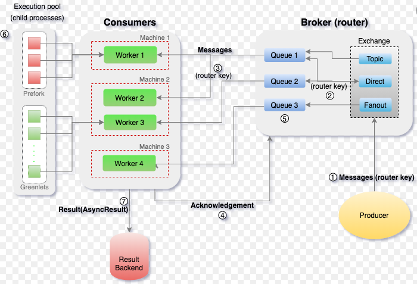

[toc]


# Celery

Celery 是一个简单、灵活且可靠的**分布式任务队列（Distributed Task Queue）**

首先需要明确的是，Celery 虽然称之为分布式任务队列，但其本身并不提供队列服务，它更像是队列的 Controller，而非队列本身。所以应用 Celery 还需要集成第三方的消息队列中间件（e.g. RabbitMQ or Redis）。

那 Celery 和 RabbitMQ 有什么区别呢？简单来说 RabbitMQ 专注于消息队列的管理，而 Celery 专注于实时的任务处理。


## Celery 的应用场景

**即时响应需求**

网页的响应时间是用户体验的关键，Amazon 曾指出响应时间每提高 100ms，他们的收入便会增加 1%。对于一些需要长时间执行的任务，大多会采用异步调用的方式来释放用户操作。Celery 的异步调用特性，和前端使用 Ajax 异步加载类似，能够有效缩短响应时间。

**周期性任务需求（Periodic Task）**

对于心跳测试、日志归档、运维巡检这类指定时间周期执行的任务，可以应用 Celery 任务调度模块 Celery Beat，支持 crontab 定时模式，简单方便

**高并发及可扩展性需求**

解耦应用程序最直接的好处就是可扩展性和并发性能的提高。Celery 支持以多线程、多进程、协程的方式来并发执行任务，同时支持自动动态扩展。


# 架构




## Broker

消息代理，作为临时储存任务的中间媒介，为 Celery 提供了队列服务。生产者将任务发送到 Broker，消费者再从 Broker 获取任务。


## Beat

任务调度器，负责调度并触发 Celery 定时周期任务。

Beat 进程读取 CeleryConfig 中自定义的定时周期任务列表，将到期需要执行的定时任务发送到任务队列中。


## Worker

任务执行单元，实际负责执行任务的服务进程，每一个 Worker 都有一个并发池（Prefork/Eventlet/Gevent/Thread）来支持多并发。Worker 会监听订阅的任务队列，当队列中有任务时，就会获取任务并执行。


## Result Backend/Store

任务执行状态和结果存储，Celery 支持任务实时处理，也就是说 Celery 可以把任务执行的实时状态和最终结果回传生产者。这种回传也需要通过中间存储媒介。


# hello world

安装 Celery & RabbitMQ & Redis

```
pip install celery
pip install redis
sudo apt-get install -yq rabbitmq-server
```

初始化 Celery Proj 项目

```
jmilkfan@aju-dev:/workspace$ tree proj/
proj/
├── app_factory.py       # Celery application 工厂模块
├── celeryconfig.py      # Celery 常规配置文件模块
├── celery.py            # Celery 启动模块
├── __init__.py
└── task                 # 任务包
    ├── api.py           # 任务 API 模块 
    ├── tasks.py         # 任务实现模块
    └── __init__.py
```


