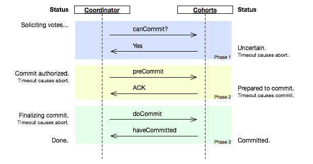
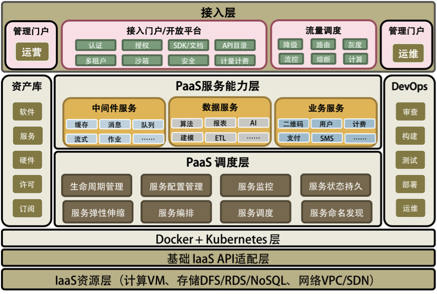
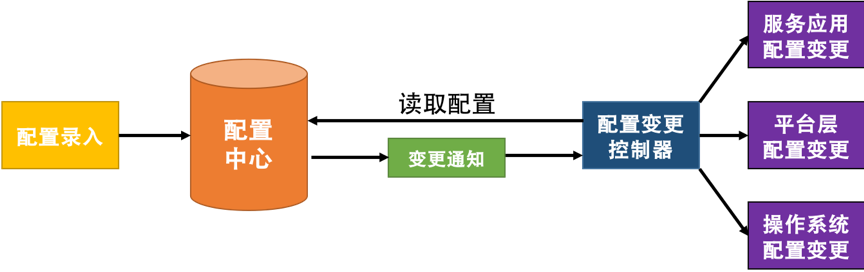
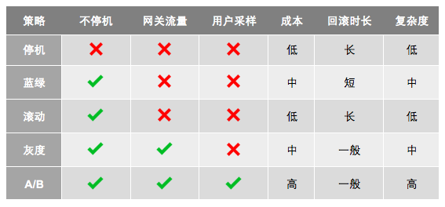

[toc]


# 分布式系统


# 注意的问题

## 异构系统的不标准问题

这主要表现在：

- 软件和应用不标准。
- 通讯协议不标准。
- 数据格式不标准。
- 开发和运维的过程和方法不标准。

很多服务的 API 出错不返回 HTTP 的错误状态码，而是返回个正常的状态码 200，然后在 HTTP Body 里的 JSON 字符串中写着个：error，bla bla error message。这简直就是一种反人类的做法。我实在不明白为什么会有众多这样的设计。这让监控怎么做啊？现在，你应该使用 Swagger 的规范了。


很多公司的软件配置管理里就是一个 key-value 的东西，这样的东西灵活到可以很容易地被滥用。不规范的配置命名，不规范的值，甚至在配置中直接嵌入前端展示内容……

一个好的配置管理，应该分成三层：底层和操作系统相关，中间层和中间件相关，最上面和业务应用相关。于是底层和中间层是不能让用户灵活修改的，而是只让用户选择。比如：操作系统的相关配置应该形成模板来让人选择，而不是让人乱配置的。只有配置系统形成了规范，我们才 hold 得住众多的系统。

再比如：数据通讯协议。通常来说，作为一个协议，一定要有协议头和协议体。协议头定义了最基本的协议数据，而协议体才是真正的业务数据。对于协议头，我们需要非常规范地让每一个使用这个协议的团队都使用一套标准的方式来定义，这样我们才容易对请求进行监控、调度和管理。


## 系统架构中的服务依赖性问题

分布式架构下，服务是会有依赖的，于是一个服务依赖链上，某个服务挂掉了，会导致出现“多米诺骨牌”效应，会倒一片。

所以，在分布式系统中，服务的依赖也会带来一些问题。

- 如果非关键业务被关键业务所依赖，会导致非关键业务变成一个关键业务。
- 服务依赖链中，出现“木桶短板效应”——整个 SLA 由最差的那个服务所决定。

这是服务治理的内容了。服务治理不但需要我们定义出服务的关键程度，还需要我们定义或是描述出关键业务或服务调用的主要路径。没有这个事情，我们将无法运维或是管理整个系统。

这里需要注意的是，很多分布式架构在应用层上做到了业务隔离，然而，在数据库结点上并没有。如果一个非关键业务把数据库拖死，那么会导致全站不可用。所以，数据库方面也需要做相应的隔离。也就是说，最好一个业务线用一套自己的数据库。这就是亚马逊服务器的实践——系统间不能读取对方的数据库，只通过服务接口耦合。这也是微服务的要求。我们不但要拆分服务，还要为每个服务拆分相应的数据库。


## 故障发生的概率更大

运维团队在分布式系统下会非常忙，忙到每时每刻都要处理大大小小的故障。我看到，很多大公司，都在自己的系统里拼命地添加各种监控指标，有的能够添加出几万个监控指标。我觉得这完全是在“使蛮力”。一方面，信息太多等于没有信息，另一方面，SLA 要求我们定义出“Key Metrics”，也就是所谓的关键指标。然而，他们却没有。这其实是一种思维上的懒惰。

所谓 Design for Failure。在设计时就要考虑如何减轻故障。如果无法避免，也要使用自动化的方式恢复故障，减少故障影响面。

因为当机器和服务数量越来越多时，你会发现，人类的缺陷就成为了瓶颈。这个缺陷就是人类无法对复杂的事情做到事无巨细的管理，只有机器自动化才能帮助人类。 也就是，人管代码，代码管机器，人不管机器！


## 多层架构的运维复杂度更大

通常来说，我们可以把系统分成四层：基础层、平台层、应用层和接入层。

- 基础层就是我们的机器、网络和存储设备等。
- 平台层就是我们的中间件层，Tomcat、MySQL、Redis、Kafka 之类的软件。
- 应用层就是我们的业务软件，比如，各种功能的服务。
- 接入层就是接入用户请求的网关、负载均衡或是 CDN、DNS 这样的东西。

对于这四层，我们需要知道：

- 任何一层的问题都会导致整体的问题；
- 没有统一的视图和管理，导致运维被割裂开来，造成更大的复杂度。


很多公司都是按技能分工是，把技术团队分为产品开发、中间件开发、业务运维、系统运维等子团队。这样的分工导致各管一摊，很多事情完全连不在一起。整个系统会像 “多米诺骨牌”一样，一个环节出现问题，就会倒下去一大片。因为没有一个统一的运维视图，不知道一个服务调用是如何经过每一个服务和资源，也就导致我们在出现故障时要花大量的时间在沟通和定位问题上。

**分工不是问题，问题是分工后的协作是否统一和规范**。这点，你一定要重视。


# 分布式事务一致性


从上面这张经典的图中，我们可以看到各种不同方案的对比。

现在，很多公司的分布式系统事务基本上都是两阶段提交的变种。比如：阿里推出的 TCC–Try–Confirm–Cancel，或是我在亚马逊见到的 Plan–Reserve–Confirm 的方式，等等。凡是通过业务补偿，或是在业务应用层上做的分布式事务的玩法，基本上都是两阶段提交，或是两阶段提交的变种。

换句话说，迄今为止，在应用层上解决事务问题，只有“两阶段提交”这样的方式，而在数据层解决事务问题，Paxos 算法则是不二之选。


## 一致性模型

简单说有三种类型（当然，如果细分的话，还有很多一致性模型，如：顺序一致性，FIFO一致性，会话一致性，单读一致性，单写一致性）：

**Weak 弱一致性**：当你写入一个新值后，读操作在数据副本上可能读出来，也可能读不出来。比如：某些cache系统，网络游戏其它玩家的数据和你没什么关系，VOIP这样的系统，或是百度搜索引擎（呵呵）。

**Eventually 最终一致性**：当你写入一个新值后，有可能读不出来，但在某个时间窗口之后保证最终能读出来。比如：DNS，电子邮件、Amazon S3，Google搜索引擎这样的系统。

**Strong 强一致性**：新的数据一旦写入，在任意副本任意时刻都能读到新值。比如：文件系统，RDBMS，Azure Table都是强一致性的。


## Master-Slave

首先是Master-Slave结构，对于这种加构，Slave一般是Master的备份。在这样的系统中，一般是如下设计的：

1）读写请求都由Master负责。
2）写请求写到Master上后，由Master同步到Slave上。

从Master同步到Slave上，你可以使用异步，也可以使用同步，可以使用Master来push，也可以使用Slave来pull。 通常来说是Slave来周期性的pull，所以，是最终一致性。这个设计的问题是，如果Master在pull周期内垮掉了，那么会导致这个时间片内的数据丢失。

Master Slave也可以是强一致性的， 比如：当我们写Master的时候，Master负责先写自己，等成功后，再写Slave，两者都成功后返回成功，整个过程是同步的，如果写Slave失败了，那么两种方法，一种是标记Slave不可用报错并继续服务（等Slave恢复后同步Master的数据，可以有多个Slave，这样少一个，还有备份，就像前面说的写三份那样），另一种是回滚自己并返回写失败。


## Master-Master

Master-Master，又叫[Multi-master](http://en.wikipedia.org/wiki/Multi-master_replication)，是指一个系统存在两个或多个Master，每个Master都提供read-write服务。这个模型是Master-Slave的加强版，数据间同步一般是通过Master间的异步完成，所以是最终一致性。 Master-Master的好处是，一台Master挂了，别的Master可以正常做读写服务，他和Master-Slave一样，当数据没有被复制到别的Master上时，数据会丢失。很多数据库都支持Master-Master的Replication的机制。


如果多个Master对同一个数据进行修改的时候，这个模型的恶梦就出现了——对数据间的冲突合并，这并不是一件容易的事情。看看Dynamo的Vector Clock的设计（记录数据的版本号和修改者）就知道这个事并不那么简单，而且Dynamo对数据冲突这个事是交给用户自己搞的。就像我们的SVN源码冲突一样，对于同一行代码的冲突，只能交给开发者自己来处理。


## Two/Three Phase Commit

这个协议的缩写又叫2PC，中文叫两阶段提交。在分布式系统中，每个节点虽然可以知晓自己的操作时成功或者失败，却无法知道其他节点的操作的成功或失败。当一个事务跨越多个节点时，为了保持事务的ACID特性，需要引入一个作为**协调者**的组件来统一掌控所有节点(称作**参与者**)的操作结果并最终指示这些节点是否要把操作结果进行真正的提交(比如将更新后的数据写入磁盘等等)。 两阶段提交的算法如下：

**第一阶段**：

* 协调者会问所有的参与者结点，是否可以执行提交操作。

* 各个参与者开始事务执行的准备工作：如：为资源上锁，预留资源，写undo/redo log……

* 参与者响应协调者，如果事务的准备工作成功，则回应“可以提交”，否则回应“拒绝提交”。

**第二阶段**：

- 如果所有的参与者都回应“可以提交”，那么，协调者向所有的参与者发送“正式提交”的命令。参与者完成正式提交，并释放所有资源，然后回应“完成”，协调者收集各结点的“完成”回应后结束这个Global Transaction。

- 如果有一个参与者回应“拒绝提交”，那么，协调者向所有的参与者发送“回滚操作”，并释放所有资源，然后回应“回滚完成”，协调者收集各结点的“回滚”回应后，取消这个Global Transaction。


2PC说白了就是第一阶段做Vote，第二阶段做决定的一个算法，也可以看到2PC这个事是强一致性的算法。在前面我们讨论过Master-Slave的强一致性策略，和2PC有点相似，只不过2PC更为保守一些——先尝试再提交。 2PC用的是比较多的，在一些系统设计中，会串联一系列的调用，比如：A -> B -> C -> D，每一步都会分配一些资源或改写一些数据。


另外，我们也可以看到其中的一些问题， A）其中一个是同步阻塞操作，这个事情必然会非常大地影响性能。 B）另一个主要的问题是在TimeOut上，比如，

1）如果第一阶段中，参与者没有收到询问请求，或是参与者的回应没有到达协调者。那么，需要协调者做超时处理，一旦超时，可以当作失败，也可以重试。

2）如果第二阶段中，正式提交发出后，如果有的参与者没有收到，或是参与者提交/回滚后的确认信息没有返回，一旦参与者的回应超时，要么重试，要么把那个参与者标记为问题结点剔除整个集群，这样可以保证服务结点都是数据一致性的。

3）糟糕的情况是，第二阶段中，如果参与者收不到协调者的commit/fallback指令，参与者将处于“状态未知”阶段，参与者完全不知道要怎么办，比如：如果所有的参与者完成第一阶段的回复后（可能全部yes，可能全部no，可能部分yes部分no），如果协调者在这个时候挂掉了。那么所有的结点完全不知道怎么办（问别的参与者都不行）。为了一致性，要么死等协调者，要么重发第一阶段的yes/no命令。

两段提交最大的问题就是第3）项，**如果第一阶段完成后，参与者在第二阶没有收到决策，那么数据结点会进入“不知所措”的状态，这个状态会block住整个事务**。也就是说，协调者Coordinator对于事务的完成非常重要，Coordinator的可用性是个关键。 因些，我们引入三段提交，三段提交在[Wikipedia](http://en.wikipedia.org/wiki/Three-phase_commit_protocol)上的描述如下，他把二段提交的第一个段break成了两段：询问，然后再锁资源。最后真正提交。





三段提交的核心理念是：**在询问的时候并不锁定资源，除非所有人都同意了，才开始锁资源**。


**Timeout是个非常难处理的事情，因为网络上的Timeout在很多时候让你无所事从，你也不知道对方是做了还是没有做。于是你好好的一个状态机就因为Timeout成了个摆设**。

**一个网络服务会有三种状态：1）Success，2）Failure，3）Timeout，第三个绝对是恶梦，尤其在你需要维护状态的时候**。


## Paxos算法

[Wikipedia上的各种Paxos算法](http://en.wikipedia.org/wiki/Paxos_(computer_science))的描述非常详细

Paxos 算法解决的问题是在一个可能发生上述异常的分布式系统中如何就某个值达成一致，保证不论发生以上任何异常，都不会破坏决议的一致性。一个典型的场景是，在一个分布式数据库系统中，如果各节点的初始状态一致，每个节点都执行相同的操作序列，那么他们最后能得到一个一致的状态。为保证每个节点执行相同的命令序列，需要在每一条指令上执行一个「一致性算法」以保证每个节点看到的指令一致。一个通用的一致性算法可以应用在许多场景中，是分布式计算中的重要问题。从20世纪80年代起对于一致性算法的研究就没有停止过。


注：Amazon的AWS中，所有的云服务都基于一个ALF（Async Lock Framework）的框架实现的，这个ALF用的就是Paxos算法。


简单说来，Paxos的目的是让整个集群的结点对某个值的变更达成一致。Paxos算法基本上来说是个民主选举的算法——大多数的决定会成个整个集群的统一决定。任何一个点都可以提出要修改某个数据的提案，是否通过这个提案取决于这个集群中是否有超过半数的结点同意（所以Paxos算法需要集群中的结点是单数）。


### 原理

假设这个有三个结点：A，B，C

**第一阶段：Prepare阶段**

A把申请修改的请求Prepare Request发给所有的结点A，B，C。注意，Paxos算法会有一个Sequence Number（你可以认为是一个提案号，这个数不断递增，而且是唯一的，也就是说A和B不可能有相同的提案号），这个提案号会和修改请求一同发出，任何结点在“Prepare阶段”时都会拒绝其值小于当前提案号的请求。所以，结点A在向所有结点申请修改请求的时候，需要带一个提案号，越新的提案，这个提案号就越是是最大的。

如果接收结点收到的提案号n大于其它结点发过来的提案号，这个结点会回应Yes（本结点上最新的被批准提案号），并保证不接收其它<n的提案。这样一来，结点上在Prepare阶段里总是会对最新的提案做承诺。

优化：在上述 prepare 过程中，如果任何一个结点发现存在一个更高编号的提案，则需要通知 提案人，提醒其中断这次提案。

**第二阶段：Accept阶段**

如果提案者A收到了超过半数的结点返回的Yes，然后他就会向所有的结点发布Accept Request（同样，需要带上提案号n），如果没有超过半数的话，那就返回失败。

当结点们收到了Accept Request后，如果对于接收的结点来说，n是最大的了，那么，它就会修改这个值，如果发现自己有一个更大的提案号，那么，结点就会拒绝修改。

我们可以看以，这似乎就是一个“两段提交”的优化。其实，**2PC/3PC都是分布式一致性算法的残次版本，Google Chubby的作者Mike Burrows说过这个世界上只有一种一致性算法，那就是Paxos，其它的算法都是残次品。**

我们还可以看到：对于同一个值的在不同结点的修改提案就算是在接收方被乱序收到也是没有问题的。

# 数据结点的分布式

真正完整解决数据 Scale 问题的应该还是数据结点自身。只有数据结点自身解决了这个问题，才能做到对上层业务层的透明，业务层可以像操作单机数据库一样来操作分布式数据库，这样才能做到整个分布式服务架构的调度。

也就是说，这个问题应该解决在数据存储方。但是因为数据存储结果有太多不同的 Scheme，所以现在的数据存储也是多种多样的，有文件系统，有对象型的，有 Key-Value 式，有时序的，有搜索型的，有关系型的……

这就是为什么分布式数据存储系统比较难做，因为很难做出来一个放之四海皆准的方案。类比一下编程中的各种不同的数据结构你就会明白为什么会有这么多的数据存储方案了。

这就是为什么分布式数据存储系统比较难做，因为很难做出来一个放之四海皆准的方案。类比一下编程中的各种不同的数据结构你就会明白为什么会有这么多的数据存储方案了。

但是我们可以看到，这个“数据存储的动物园”中，基本上都在解决数据副本、数据一致性和分布式事务的问题。

比如：AWS 的 Aurora，就是改写了 MySQL 的 InnoDB 引擎。为了承诺高可用的 SLA，需要写 6 个副本。其不像国内的 MySQL 的通过 bin log 的数据复制，而是更为“惊艳”地复制 SQL 语句，然后拼命地使用各种 tricky 的方式来降低 latency。比如，使用多线程并行、使用 SQL 操作的 merge 等。

MySQL 官方也有 MySQL Cluster 的技术方案。此外，MongoDB、国内的 PingCAP 的 TiDB、国外的 CockroachDB，还有阿里的 OceanBase 都是为了解决大规模数据的写入和读取的问题而出现的数据库软件。所以，我觉得成熟的可以用到生产线上的分布式数据库这个事估计也不远了。

而对于一些需要文件存储的，则需要分布式文件系统的支持。试想，一个 Kafka 或 ZooKeeper 需要把它们的数据存储到文件系统上。当这个结点有问题时，我们需要再启动一个 Kafka 或 ZooKeeper 的实例，那么也需要把它们持久化的数据搬迁到另一台机器上。

（注意，虽然 Kafka 和 ZooKeeper 是 HA 的，数据会在不同的结点中进行复制，但是我们也应该搬迁数据，这样有利用于新结点的快速启动。否则，新的结点需要等待数据同步，这个时间会比较长，可能会导致数据层的其它问题。）

于是，我们就需要一个底层是分布式的文件系统，这样新的结点只需要做一个简单的远程文件系统的 mount 就可以把数据调度到另外一台机器上了。

所以，真正解决数据结点调度的方案应该是底层的数据结点。在它们上面做这个事才是真正有效和优雅的。而像阿里的用于分库分表的数据库中间件 TDDL 或是别的公司叫什么 DAL
之类的这样的中间件都会成为过渡技术。


# PAAS

一个完整的 PaaS 平台会包括以下几部分。

- PaaS 调度层 – 主要是 PaaS 的自动化和分布式对于高可用高性能的管理。
- PaaS 能力服务层 – 主要是 PaaS 真正提供给用户的服务和能力。
- PaaS 的流量调度 – 主要是与流量调度相关的东西，包括对高并发的管理。
- PaaS 的运营管理 – 软件资源库、软件接入、认证和开放平台门户。
- PaaS 的运维管理 – 主要是 DevOps 相关的东西




# CAP 定理（CAP Theorem）

在任意的分布式系统中，一致性（Consistency），可用性（Availability）和分区容错性（Partition-tolerance）这三种属性最多只能同时存在两个属性。

大部分情况下，系统设计都会保留 P 属性，而在 C 和 A 中二选一


## Consistency

一致性在这里指的是线性一致性（Linearizability Consistency）。在线性一致性的保证下，所有分布式环境下的操作都像是在单机上完成的一样，每次读取要么获得最近写入的数据，要么获得一个错误。

这里需要注意的是，CAP 定理中的一致性与 ACID 数据库事务中的一致性截然不同。


## Availability

在分布式系统中，任意非故障的服务器都必须对客户的请求产生响应。

当系统满足可用性的时候，每次请求都能获得一个（非错误）响应，但不保证返回的是最新写入的数据。


## Partition-tolerance

分区容错性。它分为两个部分，“分区”和“容错”。

尽管任意数量的消息被节点间的网络丢失（或延迟），系统仍继续运行。


## 划分

对于大多数互联网应用来说（如门户网站），因为机器数量庞大，部署节点分散，网络故障是常态，可用性是必须要保证的，所以只有舍弃一致性来保证服务的 AP。而对于银行等，需要确保一致性的场景，通常会权衡 CA 和 CP 模型，CA 模型网络故障时完全不可用，CP 模型具备部分可用性。


### CP 系统

这样的系统关注一致性和分区容忍性。它关注的是系统里大多数人的一致性协议，比如：Paxos 算法 (Quorum 类的算法)。这样的系统只需要保证大多数结点数据一致，而少数的结点会在没有同步到最新版本的数据时变成不可用的状态。这样能够提供一部分的可用性。

Google BigTable, Hbase, MongoDB, Redis, MemCacheDB，这些存储架构都是放弃了高可用性（High Availablity）而选择 CP 属性的。


### AP 系统

这样的系统关心可用性和分区容忍性。因此，这样的系统不能达成一致性，需要给出数据冲突，给出数据冲突就需要维护数据版本。Dynamo 就是这样的系统。

Amazon Dynamo 系统以及它的衍生存储系统 Apache Cassandra 和 Voldemort 都是属于 AP 系统

但DynamoDB 提供两种读模式。一种是 Eventually Consistent Reads，另外一种是 Stongly Consistent Reads。我的理解是，前一种是 AP，后一种是 CP。


### CA 系统

这样的系统关注一致性和可用性，它需要非常严格的全体一致的协议，比如“两阶段提交”（2PC）。CA 系统不能容忍网络错误或节点错误，一旦出现这样的问题，整个系统就会拒绝写请求，因为它并不知道对面的那个结点是否挂掉了

Apache Kafka 是一个比较典型的 CA 系统。

在 Kafka 发布了 0.8 版本之后，Kafka 系统引入了 Replication 的概念。Kafka Relocation 通过将数据复制到不同的节点上，从而增强了数据在系统中的持久性（Durability）和可用性（Availability）。在 Kafka Replication 的系统设计中，所有的数据日志存储是设计在同一个数据中心（Data Center）里面的，也就是说，在同一个数据中心里网络分区出现的可能性是十分之小的。

在 Kafka 数据副本（Data Replication）的设计中，先通过 Zookeeper 选举出一个领导者节点（Leader）。这个领导者节点负责维护一组被称作同步数据副本（In-sync-replica）的节点，所有的数据写入都必须在这个领导者节点中记录。


# 设计模式

## 容错设计/弹力设计

**容错设计又叫弹力设计**，其中着眼于分布式系统的各种“容忍”能力，包括容错能力（服务隔离、异步调用、请求幂等性）、可伸缩性（有 / 无状态的服务）、一致性（补偿事务、重试）、应对大流量的能力（熔断、降级）。可以看到，在确保系统正确性的前提下，系统的可用性是弹力设计保障的重点。


### 系统可用性测量

$$
Availibility = {{MTTF} \over MTTF+MTTR}
$$


> MTTF 是 Mean Time To Failure，平均故障前的时间，即系统平均能够正常运行多长时间才发生一次故障。系统的可靠性越高，MTTF 越长。（注意：从字面上来说，看上去有 Failure 的字样，但其实是正常运行的时间。）
>
> MTTR 是 Mean Time To Recovery，平均修复时间，即从故障出现到故障修复的这段时间，这段时间越短越好。

这个公式就是计算系统可用性的，也就是我们常说的，多少个 9


## 管理

会讲述一些管理分布式系统架构的一些设计模式，比如网关方面的，边车模式，还有一些刚刚开始流行的，如 Service Mesh 相关的设计模式。


## 性能设计

讲述一些缓存、CQRS、索引表、优先级队列、业务分片等相关的架构模式。


# 异步通讯


首先，我们需要知道，为什么要异步通讯。

- 异步通讯最重要的是解耦服务间的依赖。最佳解耦的方式是通过 Broker 的机制。
- 解耦的目的是让各个服务的隔离性更好，这样不会出现“一倒倒一片”的故障。
- 异步通讯的架构可以获得更大的吞吐量，而且各个服务间的性能不受干扰相对独立。
- 利用 Broker 或队列的方式还可以达到把抖动的吞吐量变成均匀的吞吐量，这就是所谓的“削峰”，这对后端系统是个不错的保护。
- 服务相对独立，在部署、扩容和运维上都可以做到独立不受其他服务的干扰。

但我们需要知道这样的方式带来的问题，所以在设计成异步通信的时候需要注意如下事宜。

- 用于异步通讯的中间件 Broker 成为了关键，需要设计成高可用不丢消息的。另外，因为是分布式的，所以可能很难保证消息的顺序，因此你的设计最好不依赖于消息的顺序。
- 异步通讯会导致业务处理流程不那么直观，因为像接力一样，所以在 Broker 上需要有相关的服务消息跟踪机制，否则出现问题后不容易调试。
- 因为服务间只通过消息交互，所以业务状态最好由一个总控方来管理，这个总控方维护一个业务流程的状态变迁逻辑，以便系统发生故障后知道业务处理到了哪一步，从而可以在故障清除后继续处理。

（这样的设计常见于银行的对账程序，银行系统会有大量的外部系统通讯，比如跨行的交易，跨企业的交易，等等。所以，为了保证整体数据的一致性，或是避免漏处理及处理错的交易，需要有对账系统，这其实就是那个总控，这也是为什么银行有的交易是 T+1（隔天结算），就是因为要对个账，确保数据是对的。）

- 消息传递中，可能有的业务逻辑会有像 TCP 协议那样的 send 和 ACK 机制。比如：A 服务发出一个消息之后，开始等待处理方的 ACK，如果等不到的话，就需要做重传。此时，需要处理方有幂等的处理，即同一件消息无论收到多少次都只处理一次。


## 请求响应式

在这种情况下，发送方（sender）会直接请求接收方（receiver），被请求方接收到请求后，直接返回——收到请求，正在处理。

对于返回结果，有两种方法，一种是发送方时不时地去轮询一下，问一下干没干完。另一种方式是发送方注册一个回调方法，也就是接收方处理完后回调请求方。这种架构模型在以前的网上支付中比较常见，页面先从商家跳转到支付宝或银行，商家会把回调的 URL 传给支付页面，支付完后，再跳转回商家的 URL。

很明显，这种情况下还是有一定耦合的。是发送方依赖于接收方，并且要把自己的回调发送给接收方，处理完后回调。


## 事件驱动设计

EDA – Event Driven Architecture

正如前面所说，事件驱动最好是使用 Broker 方式，服务间通过交换消息来完成交流和整个流程的驱动。


事件驱动方式的好处至少有五个。

- 服务间的依赖没有了，服务间是平等的，每个服务都是高度可重用并可被替换的。
- 服务的开发、测试、运维，以及故障处理都是高度隔离的。
- 服务间通过事件关联，所以服务间是不会相互 block 的。
- 在服务间增加一些 Adapter（如日志、认证、版本、限流、降级、熔断等）相当容易。
- 服务间的吞吐也被解开了，各个服务可以按照自己的处理速度处理。

我们知道任何设计都有好有不好的方式。事件驱动的架构也会有一些不好的地方。

- 业务流程不再那么明显和好管理。整个架构变得比较复杂。解决这个问题需要有一些可视化的工具来呈现整体业务流程。
- 事件可能会乱序。这会带来非常 Bug 的事。解决这个问题需要很好地管理一个状态机的控制。
- 事务处理变得复杂。需要使用两阶段提交来做强一致性，或是退缩到最终一致性。


### 通过订阅的方式

这种情况下，接收方（receiver）会来订阅发送方（sender）的消息，发送方会把相关的消息或数据放到接收方所订阅的队列中，而接收方会从队列中获取数据。

这种方式下，发送方并不关心订阅方的处理结果，它只是告诉订阅方有事要干，收完消息后给个 ACK 就好了，你干成啥样我不关心。这个方式常用于像 MVC（Model-View-Control）这样的设计模式下

为什么要做成这样？好了，重点来了！前面那种请求响应的方式就像函数调用一样，这种方式有数据有状态的往来（也就是说需要有请求数据、返回数据，服务里面还可能需要保存调用的状态），所以服务是有状态的。如果我们把服务的状态给去掉（通过第三方的状态服务来保证），那么服务间的依赖就只有事件了。

你知道，分布式系统的服务设计是需要向无状态服务（Stateless）努力的，这其中有太多的好处，无状态意味着你可以非常方便地运维。所以，事件通讯成为了异步通讯中最重要的一个设计模式。

但是，在这种方式下，接收方需要向发送方订阅事件，所以是接收方依赖于发送方。这种方式还是有一定的耦合。


### 通过 Broker 的方式 （最好方法）

所谓 Broker，就是一个中间人，发送方（sender）和接收方（receiver）都互相看不到对方，它们看得到的是一个 Broker，发送方向 Broker 发送消息，接收方向 Broker 订阅消息。


这是完全的解耦。所有的服务都不需要相互依赖，而是依赖于一个中间件 Broker。这个 Broker 是一个像数据总线一样的东西，所有的服务要接收数据和发送数据都发到这个总线上，这个总线就像协议一样，让服务间的通讯变得标准和可控。

在 Broker 这种模式下，发送方的服务和接收方的服务最大程度地解耦。但是所有人都依赖于一个总线，所以这个总线就需要有如下的特性：

- 必需是高可用的，因为它成了整个系统的关键；
- 必需是高性能而且是可以水平扩展的；
- 必需是可以持久化不丢数据的。

要做到这三条还是比较难的。当然，好在现在开源软件或云平台上 Broker 的软件是非常成熟的，所以节省了我们很多的精力。


# 幂等性设计

所谓幂等性设计，就是说，一次和多次请求某一个资源应该具有同样的副作用。用数学的语言来表达就是：f(x) = f(f(x))。

比如，求绝对值的函数，

```
abs(x) = abs(abs(x))
```

为什么我们需要这样的操作？说白了，就是在我们把系统解耦隔离后，服务间的调用可能会有三个状态，一个是成功（Success），一个是失败（Failed），一个是超时（Timeout）。前两者都是明确的状态，而超时则是完全不知道是什么状态。

比如，超时原因是网络传输丢包的问题，可能是请求时就没有请求到，也有可能是请求到了，返回结果时没有返回到等情况。于是我们完不知道下游系统是否收到了请求，而收到了请求是否处理了，成功 / 失败的状态在返回时是否遇到了网络问题。总之，请求方完全不知道是怎么回事。


因为系统超时，而调用户方重试一下，会给我们的系统带来不一致的副作用。

在这种情况下，一般有两种处理方式。

- 一种是需要下游系统提供相应的查询接口。上游系统在 timeout 后去查询一下。如果查到了，就表明已经做了，成功了就不用做了，失败了就走失败流程。
- 另一种是通过幂等性的方式。也就是说，把这个查询操作交给下游系统，我上游系统只管重试，下游系统保证一次和多次的请求结果是一样的。

对于第一种方式，需要对方提供一个查询接口来做配合。而第二种方式则需要下游的系统提供支持幂等性的交易接口。


## 全局 ID

要做到幂等性的交易接口，需要有一个唯一的标识，来标志交易是同一笔交易。而这个交易 ID 由谁来分配是一件比较头疼的事。因为这个标识要能做到全局唯一。

如果由一个中心系统来分配，那么每一次交易都需要找那个中心系统来。 这样增加了程序的性能开销。如果由上游系统来分配，则可能会导致可能会出现分配 ID 重复了的问题。因为上游系统可能会是一个集群，它们同时承担相同的工作。

为了不产生分配冲突，我们需要使用一个不会冲突的算法，比如使用 UUID 这样冲突非常小的算法。但 UUID 的问题是，它的字符串占用的空间比较大，索引的效率非常低，生成的 ID 太过于随机，完全不是人读的，而且没有递增，如果要按前后顺序排序的话，基本不可能。

在全局唯一 ID 的算法中，这里介绍一个 Twitter 的开源项目 Snowflake。它是一个分布式 ID 的生成算法。


## 处理流程

对于幂等性的处理流程来说，说白了就是要过滤一下已经收到的交易。要做到这个事，我们需要一个存储来记录收到的交易。

于是，当收到交易请求的时候，我们就会到这个存储中去查询。如果查找到了，那么就不再做查询了，并把上次做的结果返回。如果没有查到，那么我们就记录下来。


但是，上面这个流程有个问题。因为绝大多数请求应该都不会是重新发过来的，所以让 100% 的请求都到这个存储里去查一下，这会导致处理流程可能会很慢。

所以，最好是当这个存储出现冲突的时候会报错。也就是说，我们收到交易请求后，直接去存储里记录这个 ID（相对于数据的 Insert 操作），如果出现 ID 冲突了的异常，那么我们就知道这个之前已经有人发过来了，所以就不用再做了。比如，数据库中你可以使用 

```
insert into … values … on DUPLICATE KEY UPDATE …
```

这样的操作

对于更新的场景来说，如果只是状态更新，可以使用如下的方式。如果出错，要么是非法操作，要么是已被更新，要么是状态不对，总之多次调用是不会有副作用的。

```
update table set status = "paid" where id = xxx and status = "unpaid";
```

当然，网上还有 MVCC 通过使用版本号的方式，等等方式，我觉得这些都不标准，我们希望我们有一个标准的方式来做这个事，所以，最好还是用一个 ID。

因为我们的幂等性服务也是分布式的，所以，需要这个存储也是共享的。这样每个服务就变成没有状态的了。但是，这个存储就成了一个非常关键的依赖，其扩展性和可用性也成了非常关键的指标。

你可以使用关系型数据库，或是 key-value 的 NoSQL（如 MongoDB）来构建这个存储系统。


## HTTP 的幂等性

**HTTP GET 方法用于获取资源，不应有副作用，所以是幂等的**。比如：GET `http://www.bank.com/account/123456`，不会改变资源的状态，不论调用一次还是 N 次都没有副作用。请注意，这里强调的是一次和 N 次具有相同的副作用，而不是每次 GET 的结果相同。GET `http://www.news.com/latest-news`这个 HTTP 请求可能会每次得到不同的结果，但它本身并没有产生任何副作用，因而是满足幂等性的。

**HTTP HEAD 和 GET 本质是一样的，区别在于 HEAD 不含有呈现数据，而仅仅是 HTTP 头信息，不应用有副作用，也是幂等的**。有的人可能觉得这个方法没什么用，其实不是这样的。想象一个业务情景：欲判断某个资源是否存在，我们通常使用 GET，但这里用 HEAD 则意义更加明确。也就是说，HEAD 方法可以用来做探活使用。

**HTTP OPTIONS 主要用于获取当前 URL 所支持的方法，所以也是幂等的**。若请求成功，则它会在 HTTP 头中包含一个名为“Allow”的头，值是所支持的方法，如“GET, POST”。

**HTTP DELETE 方法用于删除资源，有副作用，但它应该满足幂等性**。比如：DELETE `http://www.forum.com/article/4231`，调用一次和 N 次对系统产生的副作用是相同的，即删掉 ID 为 4231 的帖子。因此，调用者可以多次调用或刷新页面而不必担心引起错误。

**HTTP POST 方法用于创建资源，所对应的 URI 并非创建的资源本身，而是去执行创建动作的操作者，有副作用，不满足幂等性**。比如：POST `http://www.forum.com/articles`的语义是在`http://www.forum.com/articles`下创建一篇帖子，HTTP 响应中应包含帖子的创建状态以及帖子的 URI。两次相同的 POST 请求会在服务器端创建两份资源，它们具有不同的 URI；所以，POST 方法不具备幂等性。

**HTTP PUT 方法用于创建或更新操作，所对应的 URI 是要创建或更新的资源本身，有副作用，它应该满足幂等性**。比如：PUT `http://www.forum/articles/4231`的语义是创建或更新 ID 为 4231 的帖子。对同一 URI 进行多次 PUT 的副作用和一次 PUT 是相同的；因此，PUT 方法具有幂等性。

所以，对于 POST 的方式，很可能会出现多次提交的问题，就好比，我们在论坛中发贴时，所遇到的有时候网络有问题对同一篇贴子出现多次提交的情况。对此的一般的幂等性的设计如下。

- 首先，在表单中需要隐藏一个 token，这个 token 可以是前端生成的一个唯一的 ID。用于防止用户多次点击了表单提交按钮，而导致后端收到了多次请求，却不能分辨是否是重复的提交。这个 token 是表单的唯一标识。（这种情况其实是通过前端生成 ID 把 POST 变成了 PUT。）
- 然后，当用户点击提交后，后端会把用户提示的数据和这个 token 保存在数据库中。如果有重复提交，那么数据库中的 token 会做排它限制，从而做到幂等性。
- 当然，更为稳妥的做法是，后端成功后向前端返回 302 跳转，把用户的前端页跳转到 GET 请求，把刚刚 POST 的数据给展示出来。如果是 Web 上的最好还把之前的表单设置成过期，这样用户不能通过浏览器后退按钮来重新提交。这个模式又叫做 [PRG 模式](https://en.wikipedia.org/wiki/Post/Redirect/Get)（Post/Redirect/Get）。


# 业务补偿

一个好的业务补偿机制需要做到下面这几点。

1. 要能清楚地描述出要达到什么样的状态（比如：请假、机票、酒店这三个都必须成功，租车是可选的），以及如果其中的条件不满足，那么，我们要回退到哪一个状态。这就是所谓的整个业务的起始状态定义。
2. 当整条业务跑起来的时候，我们可以串行或并行地做这些事。对于旅游订票是可以并行的，但是对于网购流程（下单、支付、送货）是不能并行的。总之，我们的系统需要努力地通过一系列的操作达到一个我们想要的状态。如果达不到，就需要通过补偿机制回滚到之前的状态。**这就是所谓的状态拟合**。
3. 对于已经完成的事务进行整体修改。其实可以考虑成一个修改事务。


## 业务补偿的设计重点

业务补偿主要做两件事。

1. 努力地把一个业务流程执行完成。
2. 如果执行不下去，需要启动补偿机制，回滚业务流程。

所以，下面是几个重点。

- 因为要把一个业务流程执行完成，需要这个流程中所涉及的服务方支持幂等性。并且在上游有重试机制。
- 我们需要小心维护和监控整个过程的状态，所以，千万不要把这些状态放到不同的组件中，最好是一个业务流程的控制方来做这个事，也就是一个工作流引擎。所以，这个工作流引擎是需要高可用和稳定的。这就好像旅行代理机构一样，我们把需求告诉它，它会帮我们搞定所有的事。如果有问题，也会帮我们回滚和补偿的。
- 补偿的业务逻辑和流程不一定非得是严格反向操作。有时候可以并行，有时候，可能会更简单。总之，设计业务正向流程的时候，也需要设计业务的反向补偿流程。
- 我们要清楚地知道，业务补偿的业务逻辑是强业务相关的，很难做成通用的。所以必须实现在业务逻辑里
- 下层的业务方最好提供短期的资源预留机制。就像电商中的把货品的库存预先占住等待用户在 15 分钟内支付。如果没有收到用户的支付，则释放库存。然后回滚到之前的下单操作，等待用户重新下单。


# 重试设计


设计重试这个事时，我们需要定义出什么情况下需要重试，例如，调用超时、被调用端返回了某种可以重试的错误（如繁忙中、流控中、维护中、资源不足等）。

而对于一些别的错误，则最好不要重试，比如：业务级的错误（如没有权限、或是非法数据等错误），技术上的错误（如：HTTP 的 503 等，这种原因可能是触发了代码的 bug，重试下去没有意义）。


在重试的设计中，我们一般都会引入，Exponential Backoff 的策略，也就是所谓的 " 指数级退避 "。在这种情况下，每一次重试所需要的休息时间都会翻倍增加。这种机制主要是用来让被调用方能够有更多的时间来从容处理我们的请求。这其实和 TCP 的拥塞控制有点像。


## 重试设计的重点

重试的设计重点主要如下：

- 要确定什么样的错误下需要重试；
- 重试的时间和重试的次数。这种在不同的情况下要有不同的考量。有时候，而对一些不是很重要的问题时，我们应该更快失败而不是重试一段时间若干次。比如一个前端的交互需要用到后端的服务。这种情况下，在面对错误的时候，应该快速度失败报错（比如：网络错误请重试）。而面对其它的一些错误，比如流控，那么应该使用指数退避的方式，以避免造成更多的流量。
- 如果超过重试次数，或是一段时间，那么重试就没有意义了。这个时候，说明这个错误不是一个短暂的错误，那么我们对于新来的请求，就没有必要再进行重试了，这个时候对新的请求直接返回错误就好了。但是，这样一来，如果后端恢复了，我们怎么知道呢，此时需要使用我们的熔断设计了。这个在后面会说。
- 重试还需要考虑被调用方是否有幂等的设计。如果没有，那么重试是不安全的，可能会导致一个相同的操作被执行多次。
- 重试的代码比较简单也比较通用，完全可以不用侵入到业务代码中。这里有两个模式。一个是代码级的，像 Java 那样可以使用 Annotation 的方式（在 Spring 中你可以用到这样的注解），如果没有注解也可以包装在底层库或是 SDK 库中不需要让上层业务感知到。另外一种是走 Service Mesh 的方式（关于 Service Mesh 的方式，会在后面的文章中介绍）。
- 对于有事务相关的操作。我们可能会希望能重试成功，而不至于走业务补偿那样的复杂的回退流程。对此，我们可能需要一个比较长的时间来做重试，但是我们需要保存住请求的上下文，这可能对程序的运行有比较大的开销，因此，有一些设计会先把这样的上下文暂存在本机或是数据库中，然后腾出资源来去做别的事，过一会再回来把之前的请求从存储中捞出来重试。


# 熔断Circuit Breaker 设计

熔断器模式可以防止应用程序不断地尝试执行可能会失败的操作，使得应用程序继续执行而不用等待修正错误，或者浪费 CPU 时间去等待长时间的超时产生。熔断器模式也可以使应用程序能够诊断错误是否已经修正。如果已经修正，应用程序会再次尝试调用操作。

熔断器模式就像是那些容易导致错误的操作的一种代理。这种代理能够记录最近调用发生错误的次数，然后决定允许操作继续，或者立即返回错误。


熔断器可以使用状态机来实现，内部模拟以下几种状态

- **闭合（Closed）状态**：我们需要一个调用失败的计数器，如果调用失败，则使失败次数加 1。如果最近失败次数超过了在给定时间内允许失败的阈值，则切换到断开 (Open) 状态。此时开启了一个超时时钟，当该时钟超过了该时间，则切换到半断开（Half-Open）状态。该超时时间的设定是给了系统一次机会来修正导致调用失败的错误，以回到正常工作的状态。在 Closed 状态下，错误计数器是基于时间的。在特定的时间间隔内会自动重置。这能够防止由于某次的偶然错误导致熔断器进入断开状态。也可以基于连续失败的次数。
- **断开 (Open) 状态**：在该状态下，对应用程序的请求会立即返回错误响应，而不调用后端的服务。这样也许比较粗暴，有些时候，我们可以 cache 住上次成功请求，直接返回缓存（当然，这个缓存放在本地内存就好了），如果没有缓存再返回错误（缓存的机制最好用在全站一样的数据，而不是用在不同的用户间不同的数据，因为后者需要缓存的数据有可能会很多）。
- **半开（Half-Open）状态**：允许应用程序一定数量的请求去调用服务。如果这些请求对服务的调用成功，那么可以认为之前导致调用失败的错误已经修正，此时熔断器切换到闭合状态 (并且将错误计数器重置)。


## 熔断器考虑因素

在实现熔断器模式的时候，以下这些因素需可能需要考虑。

- **错误的类型**。需要注意的是请求失败的原因会有很多种。需要根据不同的错误情况来调整相应的策略。所以，熔断和重试一样，需要对返回的错误进行识别。一些错误先走重试的策略（比如限流，或是超时），重试几次后再打开熔断。一些错误是远程服务挂掉，恢复时间比较长；这种错误不必走重试，可以直接打开熔断策略。
- **日志监控**。熔断器应该能够记录所有失败的请求，以及一些可能会尝试成功的请求，使得管理员能够监控使用熔断器保护的服务的执行情况。
- **测试服务是否可用**。在断开状态下，熔断器可以采用定期地 ping 一下远程的服务的健康检查接口，来判断服务是否恢复，而不是使用计时器来自动切换到半开状态。这样做的一个好处是，在服务恢复的情况下，不需要真实的用户流量就可以把状态从半开状态切回关闭状态。否则在半开状态下，即便服务已恢复了，也需要用户真实的请求来恢复，这会影响用户的真实请求。
- **手动重置**。在系统中对于失败操作的恢复时间是很难确定的，提供一个手动重置功能能够使得管理员可以手动地强制将熔断器切换到闭合状态。同样的，如果受熔断器保护的服务暂时不可用的话，管理员能够强制将熔断器设置为断开状态。
- **并发问题**。相同的熔断器有可能被大量并发请求同时访问。熔断器的实现不应该阻塞并发的请求或者增加每次请求调用的负担。尤其是其中的对调用结果的统计，一般来说会成为一个共享的数据结构，这个会导致有锁的情况。在这种情况下，最好使用一些无锁的数据结构，或是 atomic 的原子操作。这样会带来更好的性能。
- **资源分区**。有时候，我们会把资源分布在不同的分区上。比如，数据库的分库分表，某个分区可能出现问题，而其它分区还可用。在这种情况下，单一的熔断器会把所有的分区访问给混为一谈，从而，一旦开始熔断，那么所有的分区都会受到熔断影响。或是出现一会儿熔断一会儿又好，来来回回的情况。所以，熔断器需要考虑这样的问题，只对有问题的分区进行熔断，而不是整体。
- **重试错误的请求**。有时候，错误和请求的数据和参数有关系，所以，记录下出错的请求，在半开状态下重试能够准确地知道服务是否真的恢复。当然，这需要被调用端支持幂等调用，否则会出现一个操作被执行多次的副作用。


## Hystrix 熔断逻辑

https://github.com/Netflix/Hystrix/wiki/How-it-Works#CircuitBreaker

https://github.com/Netflix/Hystrix


# 限流设计

一般来说，触发的限流行为如下。

- **拒绝服务**。把多出来的请求拒绝掉。一般来说，好的限流系统在受到流量暴增时，会统计当前哪个客户端来的请求最多，直接拒掉这个客户端，这种行为可以把一些不正常的或者是带有恶意的高并发访问抵挡掉。
- **服务降级**。关闭或是把后端服务做降级处理。这样可以让服务有足够的资源来处理更多的请求。降级有很多方式，一种是把一些不重要的服务给停掉，把 CPU、内存或是数据的资源让给更重要的功能；一种是不再返回全量数据，只返回部分数据。


因为全量数据需要做 SQL Join 操作，部分的数据则不需要，所以可以让 SQL 执行更快，还有最快的一种是直接返回预设的缓存，以牺牲一致性的方式来获得更大的性能吞吐。

- **特权请求**。所谓特权请求的意思是，资源不够了，我只能把有限的资源分给重要的用户，比如：分给权利更高的 VIP 用户。在多租户系统下，限流的时候应该保大客户的，所以大客户有特权可以优先处理，而其它的非特权用户就得让路了。
- **延时处理**。在这种情况下，一般会有一个队列来缓冲大量的请求，这个队列如果满了，那么就只能拒绝用户了，如果这个队列中的任务超时了，也要返回系统繁忙的错误了。使用缓冲队列只是为了减缓压力，一般用于应对短暂的峰刺请求。
- **弹性伸缩**。动用自动化运维的方式对相应的服务做自动化的伸缩。这个需要一个应用性能的监控系统，能够感知到目前最繁忙的 TOP 5 的服务是哪几个。


在设计上，我们还要有以下的考量。

- 限流应该是在架构的早期考虑。当架构形成后，限流不是很容易加入。
- 限流模块必需是非常好的性能，而且对流量的变化也是非常灵敏的，否则太过迟钝的限流，系统早因为过载而挂掉了。
- 限流应该有个手动的开关，这样在应急的时候，可以手动操作。
- 当限流发生时，应该有个监控事件通知。让我们知道有限流事件发生，这样，运维人员可以及时跟进。而且还可以自动化触发扩容或降级，以缓解系统压力。
- 当限流发生时，对于拒掉的请求，我们应该返回一个特定的限流错误码。这样，可以和其它错误区分开来。而客户端看到限流，可以调整发送速度，或是走重试机制。
- 限流应该让后端的服务感知到。限流发生时，我们应该在协议头中塞进一个标识，比如 HTTP Header 中，放入一个限流的级别，告诉后端服务目前正在限流中。这样，后端服务可以根据这个标识决定是否做降级。


## 计数器方式

最简单的限流算法就是维护一个计数器 Counter，当一个请求来时，就做加一操作，当一个请求处理完后就做减一操作。如果这个 Counter 大于某个数了（我们设定的限流阈值），那么就开始拒绝请求以保护系统的负载了。

这个算法足够的简单粗暴了。


## 队列算法

在这个算法下，请求的速度可以是波动的，而处理的速度则是非常均速的。这个算法其实有点像一个 FIFO 的算法。


在上面这个 FIFO 的队列上，我们可以扩展出一些别的玩法。

一个是有优先级的队列，处理时先处理高优先级的队列，然后再处理低优先级的队列。 如下图所示，只有高优先级的队列被处理完成后，才会处理低优先级的队列。


有优先级的队列可能会导致低优先级队列长时间得不到处理。为了避免低优先级的队列被饿死，一般来说是分配不同的比例的处理时间到不同的队列上，于是我们有了带权重的队列。	


如下图所示。有三个队列的权重分布是 3:2:1，这意味着我们需要在权重为 3 的这个队列上处理 3 个请求后，再去权重为 2 的队列上处理 2 个请求，最后再去权重为 1 的队列上处理 1 个请求，如此返复。


队列流控是以队列的的方式来处理请求。如果处理过慢，那么就会导致队列满，而开始触发限流。

但是，这样的算法需要用队列长度来控制流量，在配置上比较难以操作。如果队列过长，导致后端服务在队列没有满时就挂掉了。一般来说，这样的模型不能做 push 的，而是要做 pull 方式的会好一些。


## 漏斗算法 Leaky Bucket


就像一个漏斗一样，进来的水量就好像访问流量一样，而出去的水量就像是我们的系统处理请求一样。当访问流量过大时这个漏斗中就会积水，如果水太多了就会溢出。

一般来说，这个“漏斗”是用一个队列来实现的，当请求过多时，队列就会开始积压请求，如果队列满了，就会开拒绝请求。很多系统都有这样的设计，比如 TCP。当请求的数量过多时，就会有一个 sync backlog 的队列来缓冲请求，或是 TCP 的滑动窗口也是用于流控的队列。


## 令牌桶算法 Token Bucket

关于令牌桶算法，主要是有一个中间人。在一个桶内按照一定的速率放入一些 token，然后，处理程序要处理请求时，需要拿到 token，才能处理；如果拿不到，则不处理。


从理论上来说，令牌桶的算法和漏斗算法不一样的是，漏斗算法中，处理请求是以一个常量和恒定的速度处理的，而令牌桶算法则是在流量小的时候“攒钱”，流量大的时候，可以快速处理。

然而，我们可能会问，Processor 的处理速度因为有队列的存在，所以其总是能以最大处理能力来处理请求的，这也是我们所希望的方式。因此，令牌桶和漏斗都是受制于 Processor 的最大处理能力的。无论令牌桶里有多少令牌，也无论队列中还有多少请求。总之，Processor 在大流量来临时总是按照自己最大的处理能力来处理的。


## 基于响应时间的动态限流

上面的算法有个不好的地方，就是需要设置一个确定的限流值。这就要求我们每次发布服务时都做相应的性能测试，找到系统最大的性能值。

然而，在很多时候，我们却并不知道这个限流值，或是很难给出一个合适的值。其基本会有如下的一些因素：

- 实际情况下，很多服务会依赖于数据库。所以，不同的用户请求，会对不同的数据集进行操作。就算是相同的请求，可能数据集也不一样（比如，现在很多应用都会有一个时间线 Feed 流，不同的用户关心的主题人人不一样，数据也不一样）。

而且数据库的数据是在不断地变化的，可能前两天性能还行，因为数据量增加导致性能变差。在这种情况下，我们很难给出一个确定的一成不变的值，因为关系型数据库对于同一条 SQL 语句的执行时间其实是不可预测的（NoSQL 的就比 RDBMS 的可预测性要好）。

- 不同的 API 有不同的性能。我们要在线上为每一个 API 配置不同的限流值，这点太难配置，也很难管理。
- 而且，现在的服务都是能自动化伸缩的，不同大小的集群的性能也不一样，所以，在自动化伸缩的情况下，我们要动态地调整限流的阈值，这点太难做到了。

基于上述这些原因，我们的限流的值是很难被静态地设置成恒定的一个值。

我们想使用一种动态限流的方式。这种方式，不再设定一个特定的流控值，而是能够动态地感知系统的压力来自动化地限流。

这方面设计的典范是 TCP 协议的拥塞控制的算法。TCP 使用 RTT - Round Trip Time 来探测网络的延时和性能，从而设定相应的“滑动窗口”的大小，以让发送的速率和网络的性能相匹配。这个算法是非常精妙的，我们完全可以借鉴在我们的流控技术中。

我们记录下每次调用后端请求的响应时间，然后在一个时间区间内（比如，过去 10 秒）的请求计算一个响应时间的 P90 或 P99 值，也就是把过去 10 秒内的请求的响应时间排个序，然后看 90% 或 99% 的位置是多少。

这样，我们就知道有多少请求大于某个响应时间。如果这个 P90 或 P99 超过我们设定的阈值，那么我们就自动限流。

这个设计中有几个要点。

- 你需要计算的一定时间内的 P90 或 P99。在有大量请求的情况下，这个非常地耗内存也非常地耗 CPU，因为需要对大量的数据进行排序。

解决方案有两种，一种是不记录所有的请求，采样就好了，另一种是使用一个叫蓄水池的近似算法。关于这个算法这里我不就多说了，《编程珠玑》里讲过这个算法，你也可以自行 Google，英文叫 [Reservoir Sampling](https://en.wikipedia.org/wiki/Reservoir_sampling)。

- 这种动态流控需要像 TCP 那样，你需要记录一个当前的 QPS. 如果发现后端的 P90/P99 响应太慢，那么就可以把这个 QPS 减半，然后像 TCP 一样走慢启动的方式，直接到又开始变慢，然后减去 1/4 的 QPS，再慢启动，然后再减去 1/8 的 QPS……

这个过程有点像个阻尼运行的过程，然后整个限流的流量会在一个值上下做小幅振动。这么做的目的是，如果后端扩容伸缩后性能变好，系统会自动适应后端的最大性能。

- 这种动态限流的方式实现起来并不容易。大家可以看一下 TCP 的算法。TCP 相关的一些算法，我写在了 CoolShell 上的《[TCP 的那些事（下）](https://coolshell.cn/articles/11609.html)》这篇文章中。你可以用来做参考来实现。


# 降级设计

所谓的降级设计（Degradation），本质是为了解决资源不足和访问量过大的问题。当资源和访问量出现矛盾的时候，在有限的资源内为了能够扛住大量的请求，我们就需要对我们的系统进行降级操作。也就是，暂时牺牲掉一些东西，保障整个系统的平稳运行。


## 降低一致性

我们要清楚地认识到，这世界上大多数系统并不是都需要强一致性的。对于降低一致性，把强一致性变成最终一致性的做法可以有效地释放资源，并且让系统运行得更快，从而可以扛住更大的流量。一般来说，会有两种做法，一种是简化流程的一致性，一种是降低数据的一致性。


## 使用异步简化流程

举个例子，比如电商的下单交易系统，在强一致的情况下，需要结算账单，扣除库存，扣除账户上的余额（或发起支付），最后进行发货流程，这一系列的操作。

如果需要是强一致性的，那么就会非常慢。尤其是支付环节可能会涉及银行方面的接口性能，就像双 11 那样，银行方面出问题会导致支付不成功，而订单流程不能往下走。

在系统降级时，我们可以把这一系列的操作做成异步的，快束结算订单，不占库存，然后把在线支付降级成用户到付，这样就省去支付环节，然后批量处理用户的订单，向用户发货，用户货到付款。


## 降低数据的一致性

降低数据的一致性一般来说会使用缓存的方式，或是直接就去掉数据。比如，在页面上不显示库存的具体数字，只显示有还是没有库存这两种状态。

对于缓存来说，可以有效地降低数据库的压力，把数据库的资源交给更重要的业务，这样就能让系统更快速地运行。

对于降级后的系统，不再通过数据库获取数据，而是通过缓存获取数据。


## 停止次要的功能

停止次要的功能也是一种非常有用的策略。把一些不重要的功能给暂时停止掉，让系统释放出更多的资源来。比如，电商中的搜索功能，用户的评论功能，等等。等待访问的峰值过去后，我们再把这些功能给恢复回来。

当然，最好不要停止次要的功能，首先可以限制次要的功能的流量，或是把次要的功能退化成简单的功能，最后如果量太大了，我们才会进入停止功能的状态。

停止功能对用户会带来一些用户体验的问题，尤其是要停掉一些可能对于用户来说是非常重要的功能。所以，如果可能，最好给用户一些补偿，比如把用户切换到一个送积分卡，或是红包抽奖的网页上，有限地补偿一下用户。


## 简化功能

关于功能的简化上，上面的下单流程中已经提到过相应的例子了。而且，从缓存中返回数据也是其中一个。这里再提一个，就是一般来说，一个 API 会有两个版本，一个版本返回全量数据，另一个版本只返回部分或最小的可用的数据。

举个例子，对于一个文章，一个 API 会把商品详情页或文章的内容和所有的评论都返回到前端。那么在降级的情况下，我们就只返回商品信息和文章内容，而不返回用户评论了，因为用户评论会涉及更多的数据库操作。

所以，这样可以释放更多的数据资源。而商品信息或文章信息可以放在缓存中，这样又能释放出更多的资源给交易系统这样的需要更多数据库资源的业务使用。


# 弹力设计总图

首先，我们的服务不能是单点，所以，我们需要在我们的架构中冗余服务，也就是说有多个服务的副本。这需要使用到的具体技术有：

- 负载均衡 + 服务健康检查–可以使用像 Nginx 或 HAProxy 这样的技术；
- 服务发现 + 动态路由 + 服务健康检查，比如 Consul 或 Zookeeper；
- 自动化运维，Kubernetes 服务调度、伸缩和故障迁移。

然后，我们需要隔离我们的业务，要隔离我们的服务我们就需要对服务进行解耦和拆分，这需要使用到以前的相关技术。

- bulkheads 模式：业务分片 、用户分片、数据库拆分。
- 自包含系统：所谓自包含的系统是从单体到微服务的中间状态，其把一组密切相关的微服务给拆分出来，只需要做到没有外部依赖就行。
- 异步通讯：服务发现、事件驱动、消息队列、业务工作流。
- 自动化运维：需要一个服务调用链和性能监控的监控系统。

然后，接下来，我们就要进行和能让整个架构接受失败的相关处理设计，也就是所谓的容错设计。这会用到下面的这些技术。

- 错误方面：调用重试 + 熔断 + 服务的幂等性设计。
- 一致性方面：强一致性使用两阶段提交、最终一致性使用异步通讯方式。
- 流控方面：使用限流 + 降级技术。
- 自动化运维方面：网关流量调度，服务监控。


## 弹力设计开发和运维

对于运维工具来说，你至少需要两个系统：

- 一个是像 APM 这样的服务监控；
- 另一个是服务调度的系统，如：Docker + Kubernetes。

此外，如果你需要一个开发架构来让整个开发团队一在同一个标准下开发上面的这些东西，这里，Spring Cloud 就是不二之选了。

关于 Spring Cloud 和 Kubernetes，它们都是为了微服务而生，但它们没有什么可比性，因为，前者偏开发，后者偏运维。我们来看一下它们的差别。


Spring Cloud 有一套丰富且集成良好的 Java 库，作为应用栈的一部分解决所有运行时问题。因此，微服务本身可以通过库和运行时代理解决客户端服务发现、负载均衡、配置更新、统计跟踪等。工作模式就像单实例服务集群。（译者注：集群中 master 节点工作：当 master 挂掉后，slave 节点被选举顶替。）并且一批工作也是在 JVM 中被管理。

Kubernetes 不是针对语言的，而是针对容器的，所以，它是以通用的方式为所有语言解决分布式计算问题。Kubernetes 提供了配置管理、服务发现、负载均衡、跟踪、统计、单实例、平台级和应用栈之外的调度工作。该应用不需要任何客户端逻辑的库或代理程序，可以用任何语言编写。


下图是在 Kubernetes 上使用 Spring Cloud 可以表现出来的整体特性。要做出一个可运维的分布式系统，除了在架构上的设计之外，还需要一整套的用来支撑分布式系统的管控系统，也就是所谓的运维系统。要做到这些，不是靠几个人几天就可以完成的。这需要我们根据自己的业务特点来规划相关的实施路径。


# 分布式锁设计

在多线程情况下访问一些共享资源需要加锁，不然就会出现数据被写乱的问题。在分布式系统下，这样的问题也是一样的。只不过，我们需要一个分布式的锁服务。对于分布式的锁服务，一般可以用数据库 DB、Redis 和 ZooKeeper 等实现。不管怎么样，分布式的锁服务需要有以下几个特点。

- **安全性（Safety）**：在任意时刻，只有一个客户端可以获得锁（**排他性**）。
- **避免死锁**：客户端最终一定可以获得锁，即使锁住某个资源的客户端在释放锁之前崩溃或者网络不可达。
- **容错性**：只要锁服务集群中的大部分节点存活，Client 就可以进行加锁解锁操作。


分布式锁的特点是，保证在一个集群中，同一个方法在同一时间只能被一台机器上的一个线程执行。这就是所谓的分布式互斥。所以，大家在做某个事的时候，要去一个服务上去请求一个标识。如果请求到了，我们就可以操作，操作完后，把这个标识还回去，这样别的进程就可以请求到了。

首先，我们需要明确一下分布式锁服务的初衷和几个概念性的问题。

- 如果获得锁的进程挂掉了怎么办？锁还不回来了，会导致死锁。一般的处理方法是在锁服务那边加上一个过期时间，如果在这个时间内锁没有被还回来，那么锁服务要自动解锁，以避免全部锁住。
- 如果锁服务自动解锁了，新的进程就拿到锁了，但之前的进程以为自己还有锁，那么就出现了两个进程拿到了同一个锁的问题，它们在更新数据的时候就会产生问题。对于这个问题，我想说：
- 像 Redis 那样也可以使用 Check and Set 的方式来保证数据的一致性。这就有点像计算机原子指令 CAS（Compare And Swap）一样。就是说，我在改变一个值的时候先检查一下是不是我之前读出来的值，这样来保证其间没有人改过。
- 如果通过像 CAS 这样的操作的话，我们还需要分布式锁服务吗？的确是不需要了，不是吗？
- 但现实生活中也有不需要更新某个数据的场景，只是为了同步或是互斥一下不同机器上的线程，这时候像 Redis 这样的分布式锁服务就有意义了。

所以，需要分清楚：我是用来做修改某个共享源的，还是用来做不同进程间的同步或是互斥的。如果使用 CAS 这样的方式（无锁方式）来更新数据，那么我们是不需要使用分布式锁服务的，而后者可能是需要的。**所以，这是我们在决定使用分布式锁服务前需要考虑的第一个问题——我们是否需要？**

如果确定要分布式锁服务，你需要考虑下面几个设计。

- 需要给一个锁被释放的方式，以避免请求者不把锁还回来，导致死锁的问题。Redis 使用超时时间，ZooKeeper 可以依靠自身的 sessionTimeout 来删除节点。
- 分布式锁服务应该是高可用的，而且是需要持久化的。对此，你可以看一下 [Redis 的文档 RedLock](https://redis.io/topics/distlock) 看看它是怎么做到高可用的。
- 要提供非阻塞方式的锁服务。
- 还要考虑锁的可重入性。

我认为，Redis 也是不错的，ZooKeeper 在使用起来需要有一些变通的方式，好在 Apache 有 [Curator](https://curator.apache.org/) 帮我们封装了各种分布式锁的玩法。


# 配置中心的设计

除了代码之外，软件还有一些配置信息，比如数据库的用户名和密码，还有一些我们不想写死在代码里的东西，像线程池大小、队列长度等运行参数，以及日志级别、算法策略等，还有一些是软件运行环境的参数，如 Java 的内存大小，应用启动的参数，包括操作系统的一些参数配置……

所有这些东西，我们都叫做软件配置。以前，我们把软件配置写在一个配置文件中，就像 Windows 下的 ini 文件，或是 Linux 下的 conf 文件。然而，在分布式系统下，这样的方式就变得非常不好管理，并容易出错。于是，为了便于管理，我们引入了一个集中式的配置管理系统，这就是配置中心的由来。


对于动态配置的管理，我们还要做好区分。一般来说，会有三个区分的维度。

- **按运行环境分**。一般来说，会有开发环境、测试环境、预发环境、生产环境。这些环境上的运行配置都不完全一样，但是理论来说，应该是大同小异的。
- **按依赖区分**。一种是依赖配置，一种是不依赖的内部配置。比如，外部依赖的 MySQL 或 Redis 的连接配置。还有一种完全是自己内部的配置。
- **按层次分**。就像云计算一样，配置也可以分成 IaaS、PaaS、SaaS 三层。基础层的配置是操作系统的配置，中间平台层的配置是中间件的配置，如 Tomcat 的配置，上层软件层的配置是应用自己的配置。

这些分类方式其实是为了更好地管理我们的配置项。小公司无所谓，而当一个公司变大了以后了，如果这些东西没有被很好地管理起来，那么会增加太多系统维护的复杂度。


## 配置中心的模型

首先，软件配置基本上来说，每个配置项就是 key/value 的模型。

然后，我们把软件的配置分成三层。操作系统层和平台层的配置项得由专门的运维人员或架构师来配置。其中的 value 应该是选项，而不是让用户可以自由输入的，最好是有相关的模板来初始化全套的配置参数。而应用层的配置项，需要有相应的命名规范，最好有像 C++ 那样的名字空间的管理，确保不同应用的配置项不会冲突。

另外，我们的配置参数中，如果有外部服务依赖的配置，强烈建议不要放在配置中心里，而要放在服务发现系统中。因为一方面这在语义上更清楚一些，另外，这样会减少因为运行不同环境而导致配置不同的差异性（如测试环境和生产环境的不同）。

对于不同运行环境中配置的差异来说，比如在开发环境和测试环境下，日志级别是 Debug 级，对于生产环境则是 Warning 或 Error 级，因为环境的不一样，会导致我们需要不同的配置项的值。这点需要考虑到。

还有，我们的配置需要有一个整体的版本管理，每次变动都能将版本差异记录下来。当然，如果可能，最好能和软件的版本号做关联。


## 配置中心的架构

接下来，要来解决配置落地的问题。我们可以看到，和一个软件运行有关系的各种配置隶属于不同的地方，所以，要让它们落地还需要些不一样的细节要处理。文本中，我们给了一个大概的架构图。



在这个图中可以看到，我们把配置录入后，配置中心发出变更通知，配置变更控制器会来读取最新的配置，然后应用配置。这看上去很简单，但是有很多细节问题，下面我来一一说明。

- **为什么需要一个变更通知的组件，而不是让配置中心直接推送？**原因是，分布式环境下，服务器太多，推送不太现实，而采用一个 Pub/Sub 的通知服务可以让数据交换经济一些。
- **为什么不直接 Pub 数据过去，还要订阅方反向拉数据？**直接推数据当然可以，但让程序反过来用 API 读配置的好处是，一方面，API 可以校验请求者的权限，另一方面，有时候还是需要调用配置中心的基本 API，比如下载最新的证书之类的。还有就是，服务启动时需要从服务中心拉一份配置下来。
- **配置变更控制器部署在哪里？是在每个服务器上呢，还是在一个中心的地方？**我觉得因为这个事是要变更配置，变更配置又是有很多步骤的，所以这些步骤算是一个事务。为了执行效率更好，事务成功率更大，建议把这个配置变更的控制放在每一台主机上。
- **平台层的配置变更，有的参数是在服务启动的命令行上，这个怎么变更呢？**一般来说，命令行上的参数需要通过 Shell 环境变量做成配置项，然后通过更改系统环境变量，并重启服务达到配置变更。
- **操作系统的配置变更和平台层的配置变更最好模块化掉，就像云服务中的不同尺寸的主机型号一样。**这样有利于维护和减少配置的复杂性。
- **应用服务配置更新的标准化。**因为一个公司的应用由不同的团队完成，所以，可能其配置会因为应用的属性不同而不一样。为了便于管理，最好有统一的配置更新。一般来说，有的应用服务的配置是在配置文件中，有的应用服务的配置是通过调用 Admin API 的方式变更，不同的应用系统完全不一样，你似乎完全没有方法做成统一的。这里给几个方案。
- 可以通过一个开发框架或 SDK 的方式来解决，也就是应用代码找你这个 SDK 来要配置，并通过 observer 模式订阅配置修改的事件，或是直接提供配置变更的 Admin 的 API。这种方式的好处在于在开发期标准化，并可以规范开发；不好的是，耦合语言。
- 通过一个标准应用运维脚本，让应用方自己来提供应用变更时的脚本动作。这种方式虽然通过运维的方式标准化掉配置变更的接口，就可以通过一个配置控制器来统一操作各个应用变更，但是在这个脚本中各个应用方依然使用着各种不同的方式来变更配置。这种方式的好处是不耦合语言，灵活，但对于标准化的建设可能不利，而且使用或者调用脚本是 Bug 很多的东西，容易出问题。
- 或是结合上述两种方案，不使用开发阶段的 SDK 方式嵌入到应用服务中，而是为每个应用服务单独做一个 Agent。这个 Agent 对外以 Admin API 的方式服务，后面则适配应用的配置变更手段，如更新配置文件，或者调用应用的 API 等。这种方式在落地方面是很不错的（这其中是另一种设计模式，后面会讲到）。


# 边车模式设计

边车就有点像一个服务的 Agent，这个服务所有对外的进出通讯都通过这个 Agent 来完成。这样，我们就可以在这个 Agent 上做很多文章了。但是，我们需要保证的是，这个 Agent 要和应用程序一起创建，一起停用。

边车模式有时候也叫搭档模式，或是伴侣模式，或是跟班模式。就像我们在《编程范式游记》中看到的那样，编程的本质就是将控制和逻辑分离和解耦，而边车模式也是异曲同工，同样是让我们在分布式架构中做到逻辑和控制分离。


对于像 " 监视、日志、限流、熔断、服务注册、协议转换……" 这些功能，其实都是大同小异，甚至是完全可以做成标准化的组件和模块的。一般来说，我们有两种方式。

- 一种是通过 SDK、Lib 或 Framework 软件包方式，在开发时与真实的应用服务集成起来。
- 另一种是通过像 Sidecar 这样的方式，在运维时与真实的应用服务集成起来。

这两种方式各有优缺点。

- 以软件包的方式可以和应用密切集成，有利于资源的利用和应用的性能，但是对应用有侵入，而且受应用的编程语言和技术限制。同时，当软件包升级的时候，需要重新编译并重新发布应用。
- 以 Sidecar 的方式，对应用服务没有侵入性，并且不用受到应用服务的语言和技术的限制，而且可以做到控制和逻辑的分开升级和部署。但是，这样一来，增加了每个应用服务的依赖性，也增加了应用的延迟，并且也会大大增加管理、托管、部署的复杂度。

注意，对于一些 " 老的系统 "，因为代码太老，改造不过来，我们又没有能力重写。比如一些银行里的很老的用 C 语言或是 COBAL 语言写的子系统，我们想把它们变成分布式系统，需要对其进行协议的改造以及进行相应的监控和管理。这个时候，Sidecar 的方式就很有价值了。因为没有侵入性，所以可以很快地低风险地改造。


Sidecar 服务在逻辑上和应用服务部署在一个结点中，其和应用服务有相同的生命周期。对比于应用程序的每个实例，都会有一个 Sidecar 的实例。Sidecar 可以很快也很方便地为应用服务进行扩展，而不需要应用服务的改造。比如：

- Sidecar 可以帮助服务注册到相应的服务发现系统，并对服务做相关的健康检查。如果服务不健康，我们可以从服务发现系统中把服务实例移除掉。
- 当应用服务要调用外部服务时， Sidecar 可以帮助从服务发现中找到相应外部服务的地址，然后做服务路由。
- Sidecar 接管了进出的流量，我们就可以做相应的日志监视、调用链跟踪、流控熔断……这些都可以放在 Sidecar 里实现。
- 然后，服务控制系统可以通过控制 Sidecar 来控制应用服务，如流控、下线等。


于是，我们的应用服务则可以完全做到专注于业务逻辑。


注意，如果把 Sidecar 这个实例和应用服务部署在同一台机器中，那么，其实 Sidecar 的进程在理论上来说是可以访问应用服务的进程能访问的资源的。比如，Sidecar 是可以监控到应用服务的进程信息的。另外，因为两个进程部署在同一台机器上，所以两者之间的通信不存在明显的延迟。也就是说，服务的响应延迟虽然会因为跨进程调用而增加，但这个增加完全是可以接受的。

另外，我们可以看到这样的部署方式，最好是与 Docker 容器的方式一起使用的。为什么 Docker 一定会是分布式系统或是云计算的关键技术，相信你从我的这一系列文章中已经看到其简化架构的部署和管理的重要作用。否则，这么多的分布式架构模式实施起来会有很多麻烦。


边车模式从概念上理解起来比较简单，但是在工程实现上来说，需要注意以下几点。

- 进程间通讯机制是这个设计模式的重点，千万不要使用任何对应用服务有侵入的方式，比如，通过信号的方式，或是通过共享内存的方式。最好的方式就是网络远程调用的方式（因为都在 127.0.0.1 上通讯，所以开销并不明显）。
- 服务协议方面，也请使用标准统一的方式。这里有两层协议，一个是 Sidecar 到 service 的内部协议，另一个是 Sidecar 到远端 Sidecar 或 service 的外部协议。对于内部协议，需要尽量靠近和兼容本地 service 的协议；对于外部协议，需要尽量使用更为开放更为标准的协议。但无论是哪种，都不应该使用与语言相关的协议。
- 使用这样的模式，需要在服务的整体打包、构建、部署、管控、运维上设计好。使用 Docker 容器方面的技术可以帮助你全面降低复杂度。
- Sidecar 中所实现的功能应该是控制面上的东西，而不是业务逻辑上的东西，所以请尽量不要把业务逻辑设计到 Sidecar 中。
- 小心在 Sidecar 中包含通用功能可能带来的影响。例如，重试操作，这可能不安全，除非所有操作都是幂等的。
- 另外，我们还要考虑允许应用服务和 Sidecar 的上下文传递的机制。 例如，包含 HTTP 请求标头以选择退出重试，或指定最大重试次数等等这样的信息交互。或是 Sidecar 告诉应用服务限流发生，或是远程服务不可用等信息，这样可以让应用服务和 Sidecar 配合得更好。
- 我们要清楚 Sidecar 适用于什么样的场景，下面罗列几个。
- 一个比较明显的场景是对老应用系统的改造和扩展。
- 另一个是对由多种语言混合出来的分布式服务系统进行管理和扩展。
- 其中的应用服务由不同的供应商提供。
- 把控制和逻辑分离，标准化控制面上的动作和技术，从而提高系统整体的稳定性和可用性。也有利于分工——并不是所有的程序员都可以做好控制面上的开发的。
- 我们还要清楚 Sidecar 不适用于什么样的场景，下面罗列几个。
- 架构并不复杂的时候，不需要使用这个模式，直接使用 API Gateway 或者 Nginx 和 HAProxy 等即可。
- 服务间的协议不标准且无法转换。
- 不需要分布式的架构。


# Gateway 模式设计


Sidecar 和 Service Mesh 这两个设计模式，这两种设计模式都是在不侵入业务逻辑的情况下，把控制面（control plane）和数据面（data plane）的处理解耦分离。但是这两种模式都让我们的运维成本变得特别大，因为每个服务都需要一个 Sidecar，这让本来就复杂的分布式系统的架构就更为复杂和难以管理了。

在谈 Service Mesh 的时候，我们提到了 Gateway。我个人觉得并不需要为每个服务的实例都配置上一个 Sidecar。其实，一个服务集群配上一个 Gateway 就可以了，或是一组类似的服务配置上一个 Gateway。

这样一来，Gateway 方式下的架构，可以细到为每一个服务的实例配置上一个自己的 Gateway，也可以粗到为一组服务配置一个，甚至可以粗到为整个架构配置一个接入的 Gateway。于是，整个系统架构的复杂度就会变得简单可控起来。


这张图展示了一个多层 Gateway 架构，其中有一个总的 Gateway 接入所有的流量，并分发给不同的子系统，还有第二级 Gateway 用于做各个子系统的接入 Gateway。可以看到，网关所管理的服务粒度可粗可细。通过网关，我们可以把分布式架构组织成一个星型架构，由网络对服务的请求进行路由和分发，也可以架构成像 Servcie Mesh 那样的网格架构，或者只是为了适配某些服务的 Sidecar……

但是，我们也可以看到，这样一来，Sidecar 就不再那么轻量了，而且很有可能会变得比较重了。

总的来说，Gateway 是一个服务器，也可以说是进入系统的唯一节点。这跟面向对象设计模式中的 Facade 模式很像。Gateway 封装内部系统的架构，并且提供 API 给各个客户端。它还可能有其他功能，如授权、监控、负载均衡、缓存、熔断、降级、限流、请求分片和管理、静态响应处理，等等。


## 功能

- **请求路由**。因为不再是 Sidecar 了，所以网关必需要有请求路由的功能。这样一来，对于调用端来说，也是一件非常方便的事情。因为调用端不需要知道自己需要用到的其它服务的地址，全部统一地交给 Gateway 来处理。
- **服务注册**。为了能够代理后面的服务，并把请求路由到正确的位置上，网关应该有服务注册功能，也就是后端的服务实例可以把其提供服务的地址注册、取消注册。一般来说，注册也就是注册一些 API 接口。比如，HTTP 的 Restful 请求，可以注册相应的 API 的 URI、方法、HTTP 头。 这样，Gateway 就可以根据接收到的请求中的信息来决定路由到哪一个后端的服务上。
- **负载均衡**。因为一个网关可以接多个服务实例，所以网关还需要在各个对等的服务实例上做负载均衡策略。简单的就直接是 round robin 轮询，复杂点的可以设置上权重进行分发，再复杂一点还可以做到 session 粘连。
- **弹力设计**。网关还可以把弹力设计中的那些异步、重试、幂等、流控、熔断、监视等都可以实现进去。这样，同样可以像 Service Mesh 那样，让应用服务只关心自己的业务逻辑（或是说数据面上的事）而不是控制逻辑（控制面）。
- **安全方面**。SSL 加密及证书管理、Session 验证、授权、数据校验，以及对请求源进行恶意攻击的防范。错误处理越靠前的位置就是越好，所以，网关可以做到一个全站的接入组件来对后端的服务进行保护。

当然，网关还可以做更多的更有趣的事情，比如：

- **灰度发布**。网关完全可以做到对相同服务不同版本的实例进行导流，并还可以收集相关的数据。这样对于软件质量的提升，甚至产品试错都有非常积极的意义。
- **API 聚合**。使用网关可将多个单独请求聚合成一个请求。在微服务体系的架构中，因为服务变小了，所以一个明显的问题是，客户端可能需要多次请求才能得到所有的数据。这样一来，客户端与后端之间的频繁通信会对应用程序的性能和规模产生非常不利的影响。于是，我们可以让网关来帮客户端请求多个后端的服务（有些场景下完全可以并发请求），然后把后端服务的响应结果拼装起来，回传给客户端（当然，这个过程也可以做成异步的，但这需要客户端的配合）。
- **API 编排**。同样在微服务的架构下，要走完一个完整的业务流程，我们需要调用一系列 API，就像一种工作流一样，这个事完全可以通过网页来编排这个业务流程。我们可能通过一个 DSL 来定义和编排不同的 API，也可以通过像 AWS Lambda 服务那样的方式来串联不同的 API。


## 网关的设计重点

- **高性能**。在技术设计上，网关不应该也不能成为性能的瓶颈。对于高性能，最好使用高性能的编程语言来实现，如 C、C++、Go 和 Java。网关对后端的请求，以及对前端的请求的服务一定要使用异步非阻塞的 I/O 来确保后端延迟不会导致应用程序中出现性能问题。C 和 C++ 可以参看 Linux 下的 epoll 和 Windows 的 I/O Completion Port 的异步 IO 模型，Java 下如 Netty、Vert.x、Spring Reactor 的 NIO 框架。当然，我还是更喜欢 Go 语言的 goroutine 加 channel 玩法。
- **高可用**。因为所有的流量或调用经过网关，所以网关必须成为一个高可用的技术组件，它的稳定直接关系到了所有服务的稳定。网关如果没有设计，就会成变一个单点故障。因此，一个好的网关至少要做到以下几点。
- **集群化**。网关要成为一个集群，其最好可以自己组成一个集群，并可以自己同步集群数据，而不需要依赖于一个第三方系统来同步数据。
- **服务化**。网关还需要做到在不间断的情况下修改配置，一种是像 Nginx reload 配置那样，可以做到不停服务，另一种是最好做到服务化。也就是说，得要有自己的 Admin API 来在运行时修改自己的配置。
- **持续化**。比如重启，就是像 Nginx 那样优雅地重启。有一个主管请求分发的主进程。当我们需要重启时，新的请求被分配到新的进程中，而老的进程处理完正在处理的请求后就退出。
- **高扩展**。因为网关需要承接所有的业务流量和请求，所以一定会有或多或少的业务逻辑。而我们都知道，业务逻辑是多变和不确定的。比如，需要在网关上加上一些和业务相关的东西。因此，一个好的 Gateway 还需要是可以扩展的，并能进行二次开发的。当然，像 Nginx 那样通过 Module 进行二次开发的固然可以。但我还是觉得应该做成像 AWS Lambda 那样的方式，也就是所谓的 Serverless 或 FaaS（Function as a Service）那样的方式。
- **运维方面**。网关应该有以下的设计原则。
- **业务松耦合，协议紧耦合**。在业务设计上，网关不应与后面的服务之间形成服务耦合，也不应该有业务逻辑。网关应该是在网络应用层上的组件，不应该处理通讯协议体，只应该解析和处理通讯协议头。另外，除了服务发现外，网关不应该有第三方服务的依赖。
- **应用监视，提供分析数据**。网关上需要考虑应用性能的监控，除了有相应后端服务的高可用的统计之外，还需要使用 Tracing ID 实施分布式链路跟踪，并统计好一定时间内每个 API 的吞吐量、响应时间和返回码，以便启动弹力设计中的相应策略。
- **用弹力设计保护后端服务**。网关上一定要实现熔断、限流、重试和超时等弹力设计。如果一个或多个服务调用花费的时间过长，那么可接受超时并返回一部分数据，或是返回一个网关里的缓存的上一次成功请求的数据。你可以考虑一下这样的设计。
- **DevOps**。因为网关这个组件太关键了，所以需要 DevOps 这样的东西，将其发生故障的概率降到最低。这个软件需要经过精良的测试，包括功能和性能的测试，还有浸泡测试。还需要有一系列自动化运维的管控工具。
- **架构方面**。有如下一些注意事项。
- 不要在网关中的代码里内置聚合后端服务的功能，而应考虑将聚合服务放在网关核心代码之外。可以使用 Plugin 的方式，也可以放在网关后面形成一个 Serverless 服务。
- 网关应该靠近后端服务，并和后端服务使用同一个内网，这样可以保证网关和后端服务调用的低延迟，并可以减少很多网络上的问题。这里多说一句，网关处理的静态内容应该靠近用户（应该放到 CDN 上），而网关和此时的动态服务应该靠近后端服务。
- 网关也需要做容量扩展，所以需要成为一个集群来分担前端带来的流量。这一点，要么通过 DNS 轮询的方式实现，要么通过 CDN 来做流量调度，或者通过更为底层的性能更高的负载均衡设备。
- 对于服务发现，可以做一个时间不长的缓存，这样不需要每次请求都去查一下相关的服务所在的地方。当然，如果你的系统不复杂，可以考虑把服务发现的功能直接集成进网关中。
- 为网关考虑 bulkhead 设计方式。用不同的网关服务不同的后端服务，或是用不同的网关服务前端不同的客户。
- **安全方面**。因为网关成了为用户请求和后端服务的桥接装置，所以需要考虑一些安全上的东西。
- **加密数据**。可以把 SSL 相关的证书放到网关上，由网关做统一的 SSL 传输管理。
- **校验用户的请求**。一些基本的用户验证可以放在网关上来做，比如用户是否已登录，用户请求中的 token 是否合法等。但是，我们需要权衡一下，网关是否需要校验用户的输入。因为这样一来，网关就需要从只关心协议头，到需要关心协议体。而协议体中的东西一方面不像协议头是标准的，另一方面解析协议体还要耗费大量的运行时间，从而降低网关的性能。对此，我想说的是，看具体需求，一方面如果协议体是标准的，那么可以干；另一方面，对于解析协议所带来的性能问题，需要做相应的隔离。
- **检测异常访问**。网关需要检测一些异常访问，比如，在一段比较短的时间内请求次数超过一定数值；还比如，同一客户端的 4xx 请求出错率太高……对于这样的一些请求访问，网关一方面要把这样的请求屏蔽掉，另一方面需要发出警告，有可能会是一些比较重大的安全问题，如被黑客攻击。

# Gateway、Sidecar 和 Service Mesh

通过上面的描述，我们可以看到，网关、边车和 Service Mesh 是非常像的三种设计模式，很容易混淆。因此，我在这里想明确一下这三种设计模式的特点、场景和区别。

首先，Sidecar 的方式主要是用来改造已有服务。我们知道，要在一个架构中实施一些架构变更时，需要业务方一起过来进行一些改造。然而业务方的事情比较多，像架构上的变更会低优先级处理，这就导致架构变更的 " 政治复杂度 " 太大。而通过 Sidecar 的方式，我们可以适配应用服务，成为应用服务进出请求的代理。这样，我们就可以干很多对于业务方完全透明的事情了。

当 Sidecar 在架构中越来越多时，需要我们对 Sidecar 进行统一的管理。于是，我们为 Sidecar 增加了一个全局的中心控制器，就出现了我们的 Service Mesh。在中心控制器出现以后，我们发现，可以把非业务功能的东西全部实现在 Sidecar 和 Controller 中，于是就成了一个网格。业务方只需要把服务往这个网格中一放就好了，与其它服务的通讯、服务的弹力等都不用管了，像一个服务的 PaaS 平台。

然而，Service Mesh 的架构和部署太过于复杂，会让我们运维层面上的复杂度变大。为了简化这个架构的复杂度，我认为 Sidecar 的粒度应该是可粗可细的，这样更为方便。但我认为，Gateway 更为适合，而且 Gateway 只负责进入的请求，不像 Sidecar 还需要负责对外的请求。因为 Gateway 可以把一组服务给聚合起来，所以服务对外的请求可以交给对方服务的 Gateway。于是，我们只需要用一个只负责进入请求的 Gateway 来简化需要同时负责进出请求的 Sidecar 的复杂度。

总而言之，我觉得 Gateway 的方式比 Sidecar 和 Service Mesh 更好。当然，具体问题还要具体分析。


# 部署升级策略

当发布到开发或者模拟环境时，停机或者滚动部署是一个好选择，因为干净和快速。当发布到生产环境时，滚动部署或者蓝绿部署通常是一个好选择，但新平台的主流程测试是必须的。

蓝绿部署也不错，但需要额外的资源。如果应用缺乏测试或者对软件的功能和稳定性影响缺乏信心，那么可以使用金丝雀部署或者 AB 测试发布。如果业务需要根据地理位置、语言、操作系统或者浏览器特征等参数来给一些特定的用户测试，那么可以采用 AB 测试技术。




## 停机部署（Big Bang / Recreate）

把现有版本的服务停机，然后部署新的版本

就是简单地把现有版本的服务停机，然后部署新的版本。在一些时候，我们必需使用这样的方式来部署或升级多个服务。比如，新版本中的服务使用到了和老版本完全不兼容的数据表的设计。这个时候，我们对生产有两个变更，一个是数据库，另一个是服务，而且新老版本互不兼容，所以只能使用停机部署的方式。

这种方式的优势是，在部署过程中不会出现新老版本同时在线的情况，所有状态完全一致。停机部署主要是为了新版本的一致性问题。

这种方式最不好的问题就是会停机，对用户的影响会很大。所以，一般来说，这种部署方式需要事前挂公告，选择一个用户访问少的时间段来做。


## 蓝绿部署（Blue/Green /Stage）

部署好新版本后，把流量从老服务那边切过来。

蓝绿部署与停机部署最大的不同是，其在生产线上部署相同数量的新的服务，然后当新的服务测试确认 OK 后，把流量切到新的服务这边来。蓝绿部署比停机部署好的地方是，它无需停机。

我们可以看到这种部署方式，就是我们说的预发环境。在我以前的金融公司里，也经常用这种方式，生产线上有两套相同的集群，一套是 Prod 是真实服务的，另一套是 Stage 是预发环境，发布发 Stage，然后把流量切到 Stage 这边，于是 Stage 就成了 Prod，而之前的 Prod 则成了 Stage。有点像换页似的。

这种方式的优点是没有停机，实时发布和升级，也避免有新旧版本同时在线的问题。但这种部署的问题就是有点浪费，因为需要使用双倍的资源（不过，这只是在物理机时代，在云计算时代没事，因为虚拟机部署完就可以释放了）。

另外，如果我们的服务中有状态，比如一些缓存什么的，停机部署和蓝绿部署都会有问题。


## 滚动部署（Rolling Update / Ramped）

一点一点地升级现有的服务。


滚动部署策略是指通过逐个替换应用的所有实例，来缓慢发布应用的一个新版本。通常过程如下：在负载调度后有个版本 A 的应用实例池，一个版本 B 的实例部署成功，可以响应请求时，该实例被加入到池中。然后，版本 A 的一个实例从池中删除并下线。

这种部署方式直接对现有的服务进行升级，虽然便于操作，而且在缓慢地更新的过程中，对于有状态的服务也是比较友好的，状态可以在更新中慢慢重建起来。但是，这种部署的问题也是比较多的。

- 在发布过程中，会出现新老两个版本同时在线的情况，同一用户的请求可能在新老版中切换而导致问题。
- 我们的新版程序没有在生产线上经过验证就上线了。
- 在整个过程中，生产环境处于一个新老更替的中间状态，如果有问题要回滚就有点麻烦了。
- 如果在升级过程中，需要做别的一些运维工作，我们还要判断哪些结点是老版本的，哪些结点是新版本的。这太痛苦了。
- 因为新老版本的代码同时在线，所以其依赖的服务需要同时处理两个版本的请求，这可能会带来兼容性问题。
- 而且，我们无法让流量在新老版本中切换。


## 灰度部署（Canary）

把一部分用户切到新版上来，然后看一下有没有问题。如果没有问题就继续扩大升级，直到全部升级完成。


灰度部署又叫金丝雀部署。其得名来源于矿井中的金丝雀–17 世纪，英国矿井工人发现，金丝雀对瓦斯这种气体十分敏感。空气中哪怕有极其微量的瓦斯，金丝雀也会停止歌唱。而当瓦斯含量超过一定限度时，虽然鲁钝的人类毫无察觉，金丝雀却早已毒发身亡。当时在采矿设备相对简陋的条件下，工人们每次下井都会带上一只金丝雀作为 " 瓦斯检测指标 "，以便在危险状况下紧急撤离。

灰度部署是指逐渐将生产环境流量从老版本切换到新版本。通常流量是按比例分配的。例如 90% 的请求流向老版本，10% 的流向新版本。然后没有发现问题，就逐步扩大新版本上的流量，减少老版本上的流量。

除了切流量外，对于多租户的平台，例如云计算平台，灰度部署也可以将一些新的版本先部署到一些用户上，如果没有问题，扩大部署，直到全部用户。一般的策略是，从内部用户开始，然后是一般用户，最后是大客户。

这个技术大多数用于缺少足够测试，或者缺少可靠测试，或者对新版本的稳定性缺乏信心的情况下。

把一部分用户切到新版上来，然后看一下有没有问题。如果没有问题就继续扩大升级，直到全部升级完成。


## AB 测试（A/B Testing）

同时上线两个版本，然后做相关的比较。


AB 测试和蓝绿部署或是金丝雀灰度部署完全是不一样的。

AB 测试是同时上线两个版本，然后做相关的比较。是用来测试应用功能表现的方法，例如可用性、受欢迎程度、可见性等。

蓝绿部署是为了不停机，灰度部署是对新版本的质量没信心。而 AB 测试是对新版的功能没信心。注意，一个是质量，一个是功能。

比如，网站 UI 大改版，推荐算法的更新，流程的改变，我们不知道新的版本否会得到用户青睐或是能得到更好的用户体验，我们需要收集一定的用户数据才能知道。

于是我们需要在生产线上发布两个版本，拉一部分用户过来当小白鼠，然后通过科学的观测得出来相关的结论。AB 测试旨在通过科学的实验设计、采样样本代表性、流量分割与小流量测试等方式来获得具有代表性的实验结论，并确信该结论在推广到全部流量时可信。

我们可以看到 AB 测试，其包含了灰度发布的功能。也就是说，我们的观测如果只是观测有没有 bug，那就是灰度发布了。当然，如果我们复杂一点，要观测用户的一些数据指标，这完全也可能做成自动化的，如果新版本数据好，就自动化地切一点流量过来，如果不行，就换一批用户（样本）再试试。

对于灰度发布或是 AB 测试可以使用下面的技术来选择用户。

- 浏览器 cookie。
- 查询参数。
- 地理位置。
- 技术支持，如浏览器版本、屏幕尺寸、操作系统等。
- 客户端语言。


# 异步处理的设计

之前，我们在弹力设计中讲的是异步通讯，这里，我们想讲的是异步任务处理。当然，这里面没有什么冲突的，只不过是，异步通讯讲的是怎么把系统连接起来，而我们这里想讲的是怎么处理任务。

首先，我们需要一个前台系统，把用户发来的请求一一记录下来。这有点像请求日志。这样，我们的操作在数据库或是存储上只会有追加的操作，性能会很高。我们收到请求后，给客户端返回 " 收到请求，正在处理中 "。

然后，我们有个任务处理系统来真正地处理收到的这些请求。为了解耦，我们需要一个任务派发器，这里就会出来两个事，一个是推模型 Push，一个是拉模型 Pull。

所谓 Push 推模型，就是把任务派发给相应的人去处理，有点像是一个工头的调度者的角色。而 Pull 拉模型，则是由处理的人来拉取任务处理。这两种模型各有各的好坏。一般来说，Push 模型可以做调度，但是它需要知道下游工作结点的情况。

除了要知道哪些是活着的，还要知道它们的忙闲程度。这样一来，当下游工作结点扩容缩容或是有故障需要维护等一些情况发生时，Push 结点都需要知道，这会增加一定的系统复杂度。而 Pull 的好处则是可以让上游结点不用关心下游结点的状态，只要自己忙得过来，就会来拿任务处理，这样可以减少一定的复杂度，但是少了整体任务调度。

一般来说，我们构建的都是推拉结合的系统，Push 端会做一定的任务调度，比如它可以像物流那样把相同商品的订单都合并起来，打成一个包，交给下游系统让其一次处理掉；也可以把同一个用户的订单中的不同商品给拆成多个订单。然后 Pull 端来订阅 Push 端发出来的异步消息，处理相应的任务。


## 事件溯源

在这里，我们需要提一下 Event Sourcing（事件溯源）这个设计模式。

所谓 Event Sourcing，其主要想解决的问题是，我们可以看到数据库中的一个数据的值（状态），但我们完全不知道这个值是怎么得出来的。就像银行的存折一样，我们可以在银行的存折看到我们收支的所有记录，也能看得到每一笔记录后的余额。

当然，如果我们有了所有的收支流水账的记录，我们完全不需要保存余额，因为我们只需要回放一下所有的收支事件，就可以得到最终的数据状态。这样一来，我们的系统就会变得非常简单，只需要追加不可修改的数据操作事件，而不是保存最终状态。除了可以提高性能和响应时间之外，还可以提供事务数据一致性，并保留了可以启用补偿操作的完整记录和历史记录。

还有一个好处，就是如果我们的代码里有了 bug，在记录状态的系统里，我们修改 bug 后还需要做数据修正。然而，在 Event Sourcing 的系统里，我们只需要把所有事件重新播放一遍就好了，因为整个系统没有状态了。

事件不可变，并且可使用只追加操作进行存储。 用户界面、工作流或启动事件的进程可继续，处理事件的任务可在后台异步运行。 此外，处理事务期间不存在争用，这两点可极大提高应用程序的性能和可伸缩性。

事件是描述已发生操作的简单对象以及描述事件代表的操作所需的相关数据。 事件不会直接更新数据存储，只会对事件进行记录，以便在合适的时间进行处理。 这可简化实施和管理。

事件溯源不需要直接更新数据存储中的对象，因而有助于防止并发更新造成冲突。

最重要的是，异步处理 + 事件溯源的方式，可以很好地让我们的整个系统进行任务的统筹安排、批量处理，可以让整体处理过程达到性能和资源的最大化利用。

关于 Event Sourcing 一般会和 CQRS 一起提。另外，你可以去 GitHub 上看看[这个项目的示例](https://github.com/cer/event-sourcing-examples)以得到更多的信息。


# 边缘计算

当需要处理的数据或是用户请求的规模越来越大时，我们的成本是呈现快速上升的曲线，而不是一个线性上升的成本关系。

我们可以来算一下，根据我过去服务过的 40 多家公司的经验，可以看到如下的投入：

- 几十万用户的公司，只需要处理百级 QPS 的量，只需要 10 台左右的服务器；
- 上百万用户的公司，只需要处理千级 QPS 的量，需要有 50 台左右的服务器；
- 上千万用户的公司，需要处理万级到十万级 QPS 的量，需要 700 台左右的服务器；
- 上亿用户的公司，其需要处理百万级 QPS 的量，需要上万台的服务器。

可以看到，十万用户到上亿用户，也就多了 100 倍，为什么服务器需要 1000 倍？完全不是呈线性的关系。

这时因为，当架构变复杂了后，你就要做很多非功能的东西了，比如，缓存、队列、服务发现、网关、自动化运维、监控等。

那么，我们不妨开个脑洞。如果我们能够把那上亿的用户拆成 100 个百万级的用户，那么只需要 5000 多台机器（100 个 50 台服务器的数据中心）。

我们还是同样服务了这么多的用户，但我们的成本下降得很快。只不过，我们需要运维 100 个小数据中心。不过，相信我，运维 100 个 50 台服务器的小数据中心的难度应该远远低于运维一个 10000 台服务器的数据中心。

好了，问题来了，什么样的业务可以这么做？我觉得有地域性的业务是可以这么做的，比如：外卖、叫车、共享单车之类的。

然而，100 个 50 台服务器的小数据中心也会带来一些复杂的问题，因为当你的公司有 100 万用户的时候的业务形态和有 1 亿用户的业务形态是完全不一样的，1 亿用户的业务形态可能会复杂得多得多。也就是说，我们不可能在一个小数据中心只有 50 台服务器，因为那是百万用户的业务形态，只有几十个服务。当公司成长到上亿用户的规模时，可能会有上百个服务，50 台服务器是不够部署的。

所以，我上面那种多个数据中心的理想只存在于理论上，而实际上不会发生。

但是，我们依然可以沿着这条路思考下去。我们不难发现，我们完全可以用边缘结点处理高峰流量，这样，我们的数据中心就不需要花那么大的成本来建设了。


## 边缘计算的业务场景

通过上面的两个案例分析，我觉得边缘计算一定会成为一个必然产物，其会作为以数据中心为主的云计算的一个非常好的补充。这个补充在我看来，其主要是做下面一些事情。

- 处理一些实时响应的业务。它和用户靠得很近，所以其可以实时响应用户的一些本地请求，比如，某公司的人脸门禁系统、共享单车的开锁。
- 处理一些简单的业务逻辑。比如像秒杀、抢红包这样的业务场景。
- 收集并结构化数据。比如，把视频中的车牌信息抠出来，转成文字，传回数据中心。
- 实时设备监控。主要是线下设备的数据采集和监控。
- P2P 的一些去中心化的应用。比如：边缘结点作为一个服务发现的服务器，可以让本地设备之间进行 P2P 通讯。
- 云资源调度。边缘结点非常适合用来做云端服务的调度。比如，允许用户使用不同生产商的云存储服务，使用不同生产商但是功能相同的 API 服务（比如支付 API 相关）。因为是流量接入方，所以可以调度流量。
- 云资源聚合。比如，我们可以把语音转文字的 API 和语义识别的 API 相结合，聚合出来一个识别语音语义的 API，从而简化开发人员的开发成本。
- ……

其实还有很多，我觉得边缘计算带来的想象力还是很令人激动的。

关于现实当中的一些案例，你可以看看 [Netflix 的全球边缘架构的 PPT](https://www.slideshare.net/MikeyCohen1/edge-architecture-ieee-international-conference-on-cloud-engineering-32240146)。


## 边缘计算的关键技术

在我看来，边缘计算的关键技术如下。

- API Gateway。关于网关，这个就不说了，我们在管理设计篇中有一篇就是专门讨论这个东西的。
- Serverless/FaaS。就是服务函数化，这个技术就像是 AWS Lambda 服务一样，你写好一个函数，然后不用关心这个函数运行在哪里，直接发布就好了。然后就可以用了。

Serverless 这个词第一次被使用大约是 2012 年由 Ken Form 所写的一篇名为《Why The Future of Software and Apps is Serverless》的文章。这篇文章谈到的内容是关于持续集成及源代码控制等，并不是我们今天所特指的这一种架构模式。

但 Amazon 在 2014 年发布的 AWS Lambda 让 "Serverless" 这一范式提高到一个全新的层面，为云中运行的应用程序提供了一种全新的系统体系结构。至此再也不需要在服务器上持续运行进程以等待 HTTP 请求或 API 调用，而是可以通过某种事件机制触发代码的执行。

通常，这只需要在 AWS 的某台服务器上配置一个简单的功能。此后 Ant Stanley 在 2015 年 7 月的名为《Server are Dead…》的文章中更是围绕着 AWS Lambda 及刚刚发布的 AWS API Gateway 这两个服务解释了他心目中的 Serverless，“Server are dead…they just don’t know it yet”。

如果说微服务是以专注于单一责任与功能的小型功能块为基础，利用模块化的方式组合出复杂的大型应用程序，那么我们还可以进一步认为 Serverless 架构可以提供一种更加 " 代码碎片化 " 的软件架构范式，我们称之为 Function as a Services（FaaS）。所谓的 " 函数 "（Function）提供的是相比微服务更加细小的程序单元。

目前比较流行的几个开源项目是：

- [Serverless Framework](https://github.com/serverless/serverless)
- [Fission: Serverless Functions for Kubernetes](https://github.com/fission/fission)
- [Open Lambda](https://github.com/open-lambda/open-lambda)
- [Open FaaS](https://github.com/openfaas/faas)
- [IronFunction](https://github.com/iron-io/functions)

