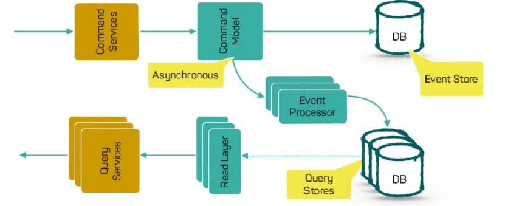

[toc]


# 三高问题

在互联网公司，经常面临一个“三高”问题：

- 高并发
- 高性能
- 高可用


# 缓存

缓存本质来说是使用**空间换时间**的思想，它在计算机世界中无处不在， 比如 CPU 就自带 L1、L2、L3 Cache，这个一般应用开发可能关注较少。但是在一些实时系统、大规模计算模拟、图像处理等追求极致性能的领域，就特别注重编写**缓存友好**的代码。


缓存之所以能够大幅提高系统的性能，关键在于数据的访问具有**局部性**，也就是二八定律：「百分之八十的数据访问是集中在 20% 的数据上」。这部分数据也被叫做**热点数据。**

缓存一般使用内存作为存储，内存读写速度快于磁盘，但容量有限，十分宝贵，不可能将所有数据都缓存起来。

如果应用访问数据没有热点，不遵循二八定律，即大部分数据访问并没有集中在小部分数据上，那么缓存就没有意义，因为大部分数据还没有被再次访问就已经被挤出缓存了。每次访问都会回源到数据库查询，那么反而会降低数据访问效率。


## 本地缓存

使用进程内成员变量或者静态变量，适合简单的场景，不需要考虑缓存一致性、过期时间、清空策略等问题。

可以直接使用语言标准库内的容器来做存储。


## 分布式缓存

当缓存的数据量增大以后，单机不足以承载缓存服务时，就要考虑对缓存服务做**水平扩展**，引入缓存集群。

将数据分片后分散存储在不同机器中，如何决定每个数据分片存放在哪台机器呢？一般是采用**一致性 Hash 算法**，它能够保证在缓存集群动态调整，不断增加或者减少机器后，客户端访问时依然能够根据 key 访问到数据。


常用的组件有 **Memcache**、 **Redis Cluster** 等，第二个是在高性能内存存储 Redis 的基础上，提供分布式存储的解决方案。


## 使用场景

适合缓存的场景： 读多写少。 计算耗时大，且实时性不高


不适合缓存的场景： 

写多读少，频繁更新。

对数据一致性要求严格：因为缓存会有更新策略，所以很难做到和数据库实时同步

数据访问完全随机：因为这样会导致缓存的命中率极低


## 更新策略

主要分为两类 **Cache-Aside** 和 **Cache-As-SoR。** SoR 即「System Of Record，记录系统」，表示数据源，一般就是指数据库。


### Cache Aside  （常用）

获取数据时先从缓存读，如果 **cache hit** 则直接返回，没命中就从数据源获取，然后更新缓存。

写数据的时候则先更新数据源，然后设置缓存失效，下一次获取数据的时候必然 **cache miss**，然后触发**回源**。

这种方式对于缓存的使用者是**不透明**的，需要使用者手动维护缓存。


这是标准的设计模式，包括 Facebook 的论文《[Scaling Memcache at Facebook](https://www.usenix.org/system/files/conference/nsdi13/nsdi13-final170_update.pdf)》中也使用了这个策略。为什么不是写完数据库后更新缓存？你可以看一下 Quora 上的这个问答《[Why does Facebook use delete to remove the key-value pair in Memcached instead of updating the Memcached during write request to the backend?](https://www.quora.com/Why-does-Facebook-use-delete-to-remove-the-key-value-pair-in-Memcached-instead-of-updating-the-Memcached-during-write-request-to-the-backend)》，主要是怕两个并发的写操作导致脏数据。

那么，是不是这个 Cache Aside 就不会有并发问题了？不是的。比如，一个是读操作，但是没有命中缓存，就会到数据库中取数据。而此时来了一个写操作，写完数据库后，让缓存失效，然后之前的那个读操作再把老的数据放进去，所以会造成脏数据。

这个案例理论上会出现，但实际上出现的概率可能非常低，因为这个条件需要发生在读缓存时缓存失效，而且有一个并发的写操作。实际上数据库的写操作会比读操作慢得多，而且还要锁表，而读操作必需在写操作前进入数据库操作，又要晚于写操作更新缓存，所有这些条件都具备的概率并不大。

**所以，这也就是 Quora 上的那个答案里说的，要么通过 2PC 或是 Paxos 协议保证一致性，要么就是拼命地降低并发时脏数据的概率。而 Facebook 使用了这个降低概率的玩法，因为 2PC 太慢，而 Paxos 太复杂。当然，最好还是为缓存设置好过期时间。**


### Cache As SoR

从字面上来看，就是把 Cache 当作 SoR，也就是数据源，所以一切读写操作都是针对 Cache 的，由 **Cache 内部自己维护和数据源的一致性。**

这样对于使用者来说就和直接操作 SoR 没有区别了，完全感知不到 Cache 的存在。


缓存友好是指我们通过学习了解缓存内部实现、更新策略之后，通过调整数据访问顺序提高缓存的命中率。

Cache-As-SoR 又分为以下三种方式:


#### Read Through （常用）

这种方式和 Cache-Aside 非常相似，都是在查询时发生 cache miss 去更新缓存，但是区别在于 Cache-Aside 需要调用方手动更新缓存，而 Cache-As-SoR 则是由缓存内部实现自己负责，对应用层透明。


#### Write Through

直写式，就是在将数据写入缓存的同时，缓存也去更新后面的数据源，并且必须等到数据源被更新成功后才可返回。这样保证了缓存和数据库里的**数据一致性**。


#### Write Back / Write  Behind Caching

Write Behind 又叫 Write Back。一些了解 Linux 操作系统内核的同学对 write back 应该非常熟悉，这不就是 Linux 文件系统的 page cache 算法吗？是的，你看基础知识全都是相通的。

回写式，数据写入缓存即可返回，缓存内部会异步的去更新数据源，这样好处是**写操作特别快**，因为只需要更新缓存。并且缓存内部可以合并对相同数据项的多次更新，但其带来的问题是，数据不是强一致性的，而且可能会丢失（我们知道 Unix/Linux 非正常关机会导致数据丢失，就是因为这个事）。在软件设计上，我们基本上不可能做出一个没有缺陷的设计，就像算法设计中的时间换空间、空间换时间一个道理。有时候，强一致性和高性能，高可用和高性能是有冲突的。软件设计从来都是 trade-off（取舍）。

另外，Write Back 实现逻辑比较复杂，因为它需要 track 有哪些数据是被更新了的，需要刷到持久层上。操作系统的 Write Back 会在仅当这个 cache 需要失效的时候，才会把它真正持久起来。比如，内存不够了，或是进程退出了等情况，这又叫 lazy write。


## 预先延后处理方式

**预先延后**，这其实是一个事物的两面，不管是预先还是延后核心思想都是将本来该在实时链路上处理的事情剥离，要么提前要么延后处理。**降低实时链路的路径长度，** 这样能有效提高系统性能。


### 预处理

**通过预先处理减少了实时链路上的 RPC 调用，既减少了系统的外部依赖，也极大的提高了系统的吞吐量。**

预处理在 CPU 和操作系统中也广泛使用，比如 CPU 基于历史访存信息，将内存中的指令和数据预取到 Cache 中，这样可以大大提高Cache 命中率

还比如在 Linux 文件系统中，预读算法会预测即将访问的 page，然后批量加载比当前读请求更多的数据缓存在 page cache 中，这样当下次读请求到来时可以直接从 cache 中返回，大大减少了访问磁盘的时间。


### 延后处理

延后处理还有一个非常著名的例子，**COW（Copy On Write，写时复制）。** Linux 创建进程的系统调用 fork，fork 产生的子进程只会创建虚拟地址空间，而不会分配真正的物理内存，子进程共享父进程的物理空间，只有当某个进程需要写入的时候，才会真正分配物理页，拷贝该物理页，通过 COW 减少了很多不必要的数据拷贝。


# 池化

内存、连接、线程这些都是资源，创建线程、分配内存、数据库连接这些操作都有一个特征， 那就是**创建和销毁过程都会涉及到很多系统调用或者网络 IO。** 每次都在请求中去申请创建这些资源，就会增加请求处理耗时，但是如果我们用一个 **容器（池）** 把它们保存起来，下次需要的时候，直接拿出来使用，避免重复创建和销毁浪费的时间。


## 内存池

在 C/C++ 中，经常使用 malloc、new 等 API 动态申请内存。由于申请的内存块大小不一，如果频繁的申请、释放会导致大量的**内存碎片**，并且这些  API 底层依赖系统调用，会有额外的开销。

**内存池就是在使用内存前，先向系统申请一块空间留做备用，使用者需要内池时向内存池申请，用完后还回来。**

内存池的思想非常简单，实现却不简单，难点在于以下几点:

- **如何快速分配内存**
- **降低内存碎片率**
- **维护内存池所需的额外空间尽量少**


如果不考虑效率，我们完全可以将内存分为不同大小的块，然后用链表连接起来，分配的时候找到大小最合适的返回，释放的时候直接添加进链表。


当然这只是玩具级别的实现，业界有性能非常好的实现了，我们可以直接拿来学习和使用。

比如 Google 的 「tcmalloc」 和 Facebook 的 「jemalloc」。


## 线程池

线程就是我们**程序执行的实体**。在服务器开发领域，我们经常会为每个请求分配一个线程去处理，但是线程的创建销毁、调度都会带来额外的开销，线程太多也会导致系统整体性能下降。在这种场景下，我们通常会提前创建若干个线程，通过线程池来进行管理。当请求到来时，只需从线程池选一个线程去执行处理任务即可。

线程池常常和**队列**一起使用来实现**任务调度**，主线程收到请求后将创建对应的任务，然后放到队列里，线程池中的工作线程等待队列里的任务。


线程池实现上一般有四个核心组成部分:

- **管理器（Manager）:** 用于创建并管理线程池。
- **工作线程（Worker）:** 执行任务的线程。
- **任务接口（Task）:** 每个具体的任务必须实现任务接口，工作线程将调用该接口来完成具体的任务。
- **任务队列（TaskQueue）:** 存放还未执行的任务。


线程池在 C、C++ 中没有具体的实现，需要应用开发者手动实现上诉几个部分。

在 Java 中 **「ThreadPoolExecutor」** 类就是线程池的实现。


## 连接池

连接池是创建和管理连接的。

对于数据库连接池，如果不用数据库连接池，一次 SQL 查询请求会经过如下步骤

```
1. 和 MySQL server 建立 TCP 连接: 三次握手
2. MySQL 权限认证：
Server 向 Client 发送 密钥
Client 使用密钥加密用户名、密码等信息，将加密后的报文发送给 Server
Server 根据 Client 请求包，验证是否是合法用户，然后给 Client 发送认证结果

3. Client 发送 SQL 语句
4. Server 返回语句执行结果
5. MySQL 关闭
6. TCP 连接断开: 四次挥手
```


可以看出不使用连接池的话，为了执行一条 SQL，会花很多时间在安全认证、网络IO上。

如果使用连接池，执行一条 SQL 就省去了建立连接和断开连接所需的额外开销。

**池化实际上是预处理和延后处理的一种应用场景，通过池子将各类资源的创建提前和销毁延后**


## 同步变异步

对于处理耗时的任务，如果采用同步的方式，那么会增加任务耗时，降低系统并发度。

可以通过将同步任务变为异步进行优化。


在很多编程语言中有异步编程的库，比如 C++ std::future、Python asyncio 等，但是异步编程往往需要**回调函数（Callback function）**，如果回调函数的层级太深，这就是**回调地狱（Callback hell）**。回调地狱如何优化又是一个庞大的话题


# 消息队列

上游生产者将消息通过队列发送给下游消费者


## 服务解耦

有些服务被其它很多服务依赖，比如一个论坛网站，当用户成功发布一条帖子有一系列的流程要做，有积分服务计算积分，推送服务向发布者的粉丝推送一条消息..... 对于这类需求，常见的实现方式是直接调用

这样如果需要新增一个数据分析的服务，那么又得改动发布服务，这违背了**依赖倒置原则**，**即上层服务不应该依赖下层服务**

引入消息队列作为中间层，当帖子发布完成后，发送一个事件到消息队列里，而关心**帖子发布成功**这件事的下游服务就可以订阅这个事件，这样即使后续继续增加新的下游服务，只需要订阅该事件即可，完全不用改动发布服务，完成系统解耦。


## 异步处理

有些业务涉及到的处理流程非常多，但是很多步骤并不要求实时性。那么我们就可以通过消息队列异步处理

比如淘宝下单，一般包括了**风控、锁库存、生成订单、短信/邮件通知**等步骤。但是**核心的就风控和锁库存，** 只要风控和扣减库存成功，那么就可以返回结果通知用户成功下单了。**后续的生成订单，短信通知都可以通过消息队列发送给下游服务异步处理。大大提高了系统响应速度。**


软件开发没有银弹，所有的方案选择都是一种 **trade-off。** 同样，异步处理也不全是好处，也会导致一些问题：

- 降低了数据一致性，从强一致性变为最终一致性
- 有消息丢失的风险，比如宕机，需要有容灾机制


## 流量削峰


一般像秒杀、抽奖、抢卷这种活动都伴随着**短时间海量的请求，** 一般超过后端的处理能力，那么我们就可以在接入层将请求放到消息队列里，后端根据自己的处理能力不断从队列里取出请求进行业务处理。


# 批量处理

在涉及到网络连接、IO等情况时，将操作批量进行处理能够有效提高系统的传输速率和吞吐量。

在前后端通信中，**通过合并一些频繁请求的小资源可以获得更快的加载速度。**

比如我们后台 RPC 框架，经常有更新数据的需求，而有的数据更新的接口往往只接受一项，这个时候我们往往会优化下更新接口，

使其能够接受批量更新的请求，这样可以将批量的数据一次性发送，大大缩短网络 RPC 调用耗时。


# 数据库

很多时候系统的瓶颈也往往处在数据库这里，慢的原因也有很多，比如可能是没用索引、没用对索引、读写锁冲突等等。


## 索引

**索引一般而言是一个排序列表，排序意味着可以基于二分思想进行查找，将查询时间复杂度做到 O(log(N))，快速的支持等值查询和范围查询。**

**二叉搜索树查询效率无疑是最高的，因为平均来说每次比较都能缩小一半的搜索范围，但是一般在数据库索引的实现上却会选择 B 树或 B+ 树而不用二叉搜索树，为什么呢？**

这就涉及到数据库的存储介质了，数据库的数据和索引都是存放在磁盘，并且是 InnoDB 引擎是以页为基本单位管理磁盘的，一页一般为 16 KB。AVL 或红黑树搜索效率虽然非常高，**但是同样数据项，它也会比 B、B+ 树更高，高就意味着平均来说会访问更多的节点，即磁盘IO次数！**

> 根据 Google 工程师 Jeff Dean 的统计，访问内存数据耗时大概在 100 ns，访问磁盘则是 10,000,000 ns。

所以表面上来看我们使用 B、B+ 树没有 二叉查找树效率高，但是实际上由于 B、B+ 树降低了树高，减少了磁盘 IO 次数，反而大大提升了速度。

**这也告诉我们，没有绝对的快和慢，系统分析要抓主要矛盾，先分析出决定系统瓶颈的到底是什么，然后才是针对瓶颈的优化。**


索引必知必会的知识列出来，大家可以查漏补缺:

- **主键索引和普通索引，以及它们之间的区别**
- **最左前缀匹配原则**
- **索引下推**
- **覆盖索引、联合索引**


## 读写分离

由于存在读写锁冲突，并且很多大型互联网业务往往**读多写少**，读操作会首先成为数据库瓶颈，我们希望消除读写锁冲突从而提升数据库整体的读写能力。

那么就需要采用读写分离的数据库集群方式，一主多从，主库会同步数据到从库。写操作都到主库，读操作都去从库。


读写分离到之后就避免了读写锁争用，这里解释一下，什么叫读写锁争用：

MySQL 中有两种锁:

- **排它锁( X 锁)：** 事务 T 对数据 A 加上 X 锁时，**只允许事务 T 读取和修改数据 A。**
- **共享锁( S 锁)：** 事务 T 对数据 A 加上 S 锁时，**其他事务只能再对数据 A 加 S 锁，而不能加 X 锁，直到 T 释放 A 上的 S 锁。**

读写分离解决问题的同时也会带来新问题，比如主库和从库数据不一致

MySQL 的主从同步依赖于 binlog，binlog(二进制日志)是 MySQL Server 层维护的一种二进制日志，是独立于具体的存储引擎。它主要存储对数据库更新(insert、delete、update)的 SQL 语句，由于记录了完整的 SQL 更新信息，所以 binlog 是可以用来数据恢复和主从同步复制的。

从库从主库拉取 binlog 然后依次执行其中的 SQL 即可达到复制主库的目的，由于从库拉取 binlog 存在网络延迟等，所以主从数据存在延迟问题。

那么这里就要看业务是否允许短时间内的数据不一致，如果不能容忍，那么可以通过如果读从库没获取到数据就去主库读一次来解决。


## 分库分表

常见的拆分类型有**垂直拆分和水平拆分**

分库分表同时会带来一些问题，比如平时单库单表使用的主键自增特性将作废，因为某个分区库表生成的主键无法保证全局唯一，这就需要引入全局 UUID 服务了


### 垂直分库

对数据库进行垂直分库，**根据业务关联性强弱，将它们分到不同的数据库，** 比如订单库，商家库、支付库、用户库。

对一些大表进行垂直分表，**将一个表按照字段分成多表，每个表存储其中一部分字段。** 比如商品详情表可能最初包含了几十个字段，但是往往最多访问的是商品名称、价格、产地、图片、介绍等信息，所以我们将不常访问的字段单独拆成一个表。


### 水平分库

若垂直分库已经按照业务关联切分到了最小粒度，数据量任然非常大，采用水平分库的方式，**比如可以把订单库分为订单1库、订单2库、订单3库......** 那么如何决定某个订单放在哪个订单库呢？可以考虑对主键通过哈希算法计算放在哪个库。

分完库，单表数据量任然很大，查询起来非常慢，**可以按日或者按月将订单分表，叫做日表、月表。**


### 分片策略

**关于分库的策略**。我们把数据库按某种规则分成了三个库。比如，或是按地理位置，或是按日期，或是按某个范围分，或是按一种哈希散列算法。总之，我们把数据分到了三个库中。

**关于数据访问层**。为了不让我们前面的服务感知到数据库的变化，我们需要引入一个叫 " 数据访问层 " 的中间件，用来做数据路由。但是，老实说，这个数据访问层的中间件很不好写，其中要有解析 SQL 语句的能力，还要根据解析好的 SQL 语句来做路由。但即便是这样，也有很多麻烦事。

比如，我要做一个分页功能，需要读一组顺序的数据，或是需要做 Max/Min/Count 这样的操作。于是，你要到三个库中分别求值，然后在数据访问层这里再合计处理返回。但即使是这样，你也会遇到各种令人烦恼的事，比如一个跨库的事务，你需要走 XA 这样的两阶段提交的操作，这样会把数据库的性能降到最低的。

为了避免数据访问层的麻烦，分片策略一般如下。

- 按多租户的方式。用租户 ID 来分，这样可以把租户隔离开来。比如：一个电商平台的商家中心可以按商家的 ID 来分。
- 按数据的种类来分。比如，一个电商平台的商品库可以按类目来分，或是商家按地域来分。
- 通过范围来分。这样分片，可以保证在同一分片中的数据是连续的，于是我们数据库操作，比如分页查询会更高效一些。一般来说，大多数情况是用时间来分片的，比如，一个电商平台的订单中心是按月份来分表的，这样可以快速检索和统计一段连续的数据。
- 通过哈希散列算法来分（比如：主键 id % 3 之类的算法。）此策略的目的是降低形成热点的可能性（接收不成比例的负载的分片）。但是，这会带来两个问题，一个就是前面所说的跨库跨表的查询和事务问题，另一个就是如果要扩容需要重新哈希部分或全部数据。

上面是最常见的分片模式，但是你还应考虑应用程序的业务要求及其数据使用模式。这里请注意几个非常关键的事宜。

1. 数据库分片必须考虑业务，从业务的角度入手，而不是从技术的角度入手，如果你不清楚业务，那么无法做出好的分片策略。
2. 请只考虑业务分片。请不要走哈希散列的分片方式，除非有个人拿着把刀把你逼到墙角，你马上就有生命危险，你才能走哈希散列的分片方式。


#### 垂直分片

垂直分片是把一张表中的一些字段放到一张表中，另一些字段放到另一张表中。垂直分片主要是把一些经常修改的数据和不经常修改的数据给分离开来，这样在修改某个字段的数据时，不会导致其它字段的数据被锁而影响性能。比如，对于电商系统来说，商品的描述信息不常改，但是商品的库存和价格经常改，所以，可以把描述信息和库存价格分成两张表，这样可以让商品的描述信息的查询更快。


#### 水平分片

水平分片需要有以下一些注意事项。

- 随着数据库中数据的变化，我们有可能需要定期重新平衡分片，以保证均匀分布并降低形成热点的可能性。 但是，重新平衡是一项昂贵的操作。 若要减少重新平衡的频率，我们需要通过确保每个分片包含足够的可用空间来处理未来一段时间的变化。 另外，我们还需要开发用于快速重新平衡分片的工具和脚本。
- 分片是静态的，而数据的访问则是不可预期的，可能会需要经常性地调整我们的分片，这样一来成本太高。所以，我们最好使用一个索引表的方式来进行分片。也就是说，把我们数据的索引动态地记录在一个索引表中。这样一来，我们就可以非常灵活地调度我们的数据了。当数据调度到另一台结点上时，我们只需要去索引表里改一下这个数据的位置就好了。
- 如果程序必须要从多个分片检索数据的查询，则可以使用并行任务从各个分片上提取此数据，然后聚合到单个结果中。 但是，此方法不可避免地会在一定程度上增加解决方案数据访问逻辑的复杂性。
- 数据分片后，我们很难在分片之间保持引用完整性和一致性，也就是所谓的跨分片的事务，因此应尽量减少会影响多个分片中的数据的操作。如果应用程序必须跨分片修改数据，那么我们需要评估一致性以及评估是否采用两阶段提交的方式。
- 配置和管理大量分片可能是一个挑战。在做相应的变更时，一定要先从生产线上拉出数据，然后根据数据计划好新的分片方式，并做好相当的测试工作。否则，这个事出了问题会是一个灾难性的问题。


## 零拷贝

高性能的服务器应当避免不必要数据复制，特别是在**用户空间和内核空间之间的数据复制。** 比如 HTTP 静态服务器发送静态文件的时候，一般我们会这样写

```
char buffer[BUF_SIZE];
int count;
int fd = open(filename)
while ( (count = read(fd, buffer, BUF_SIZE)) > 0 ) {
		send(sock, buffer, count);
}
close(socket);
```


如果了解 Linux IO 的话就知道这个过程包含了内核空间和用户空间之间的多次拷贝

内核空间和用户空间之间数据拷贝需要 CPU 亲自完成，但是对于这类**数据不需要在用户空间进行处理**的程序来说，这样的两次拷贝显然是浪费。什么叫 **「不需要在用户空间进行处理」？**

比如 FTP 或者 HTTP 静态服务器，它们的作用只是将文件从磁盘发送到网络，不需要在中途对数据进行编解码之类的计算操作。

如果能够直接将数据在内核缓存之间移动，那么除了减少拷贝次数以外，还能避免内核态和用户态之间的上下文切换。

而这正是零拷贝（Zero copy）干的事，主要就是利用各种零拷贝技术，减少不必要的数据拷贝，将 CPU 从数据拷贝这样简单的任务解脱出来，让 CPU 专注于别的任务。


常用的零拷贝技术， mmap， sendfile


### mmap

mmap通过内存映射，将文件映射到内核缓冲区，同时，用户空间可以共享内核空间的数据。这样，在进行网络传输时，就可以减少内核空间到用户空间的拷贝次数


### sendfile

sendfile是 Linux2.1 版本提供的，数据不经过用户态，直接从页缓存拷贝到 socket 缓存，同时由于和用户态完全无关，就减少了一次上下文切换。

在 Linux 2.4 版本，对 sendfile 进行了优化，直接通过 DMA 将磁盘文件数据读取到 socket 缓存，真正实现了 ”0” 拷贝。前面 mmap 和 2.1 版本的 sendfile 实际上只是消除了用户空间和内核空间之间拷贝，而页缓存和 socket 缓存之间的拷贝依然存在。


## 无锁化

在多线程环境下，为了避免 **竞态条件（race condition），** 我们通常会采用加锁来进行并发控制，锁的代价也是比较高的，锁会导致上线文切换，甚至被挂起直到锁被释放。


### CAS 硬件提供的原子操作

基于硬件提供的原子操作 **CAS(Compare And Swap)** 实现一些高性能无锁的数据结构，比如无锁队列，可以在保证并发安全的情况下，提供更高的性能。

首先需要理解什么是 CAS，CAS 有三个操作数，内存里当前值M，预期值 E，修改的新值 N，CAS 的语义就是：

**如果当前值等于预期值，则将内存修改为新值，否则不做任何操作**。

用 C 语言来表达就是

```
int CAS(int* memory, int expected_value, int new_value) {
		int old_value = *memory;
		if (*memory == expected_value) {
				*memory = new_value;
		}
		return old_value;
}
```


**注意，上面 CAS 函数实际上是一条原子指令，那么是如何用的呢？**

假设我需要实现这样一个功能：

对一个全局变量 global 在两个不同线程分别对它加 100 次，这里多线程访问一个全局变量存在 race condition，所以我们需要采用线程同步操作，下面我分别用锁和CAS的方法来实现这个功能。

```
int global = 0;
// CAS实现
void cas_add() {
		//计数
		int cnt = 0;
		while (cnt < 100) {
				int old = global;
				int new = old + 1;
				// 返回值等于old，则说明预期值和global本身的值是一致的
				// 我们这次CAS操作是成功的
				// 计数+1
				if (CAS(&global, old, new) == old) {
						cnt++;
				}
		}
}

// 互斥锁实现
// 需要一个全局锁，并初始化
phtread_mutex_t lock = PHTREAD_MUTEX_INITIALIZER;
void mutex_add() {
		// 计数
		int cnt = 0;
		while (cnt < 100) {
				// 先申请说，如果锁被占用，可能被阻塞挂起
				pthread_mutex_lock(&lock);
				// 再做修改
				++global;
				// 释放锁
				pthread_mutex_unlock(&lock);
				// 锁保护的区域应该最小化，cnt++不涉及竞争状态
				cnt++;
		}
}
```


通过使用原子操作大大降低了锁冲突的可能性，提高了程序的性能。

除了 CAS，还有一些硬件原子指令：

- Fetch-And-Add，对变量原子性 + 1
- Test-And-Set，这是各种锁算法的核心，在  AT&T/GNU 汇编语法下，叫 xchg 指令


## CQRS

CQRS 全称 Command and Query Responsibility Segregation，也就是命令与查询职责分离。其原理是，用户对于一个应用的操作可以分成两种，一种是 Command 也就是我们的写操作（增，删，改），另一种是 Query 操作（查），也就是读操作。Query 操作基本上是在做数据整合显现，而 Command 操作这边会有更重的业务逻辑。分离开这两种操作可以在语义上做好区分。

- 命令 Command 不会返回结果数据，只会返回执行状态，但会改变数据。
- 查询 Query 会返回结果数据，但是不会改变数据，对系统没有副作用。

这样一来，可以带来一些好处。

- 分工明确，可以负责不同的部分。
- 将业务上的命令和查询的职责分离，能够提高系统的性能、可扩展性和安全性。并且在系统的演化中能够保持高度的灵活性，能够防止出现 CRUD 模式中，对查询或者修改中的某一方进行改动，导致另一方出现问题的情况。
- 逻辑清晰，能够看到系统中的哪些行为或者操作导致了系统的状态变化。
- 可以从数据驱动（Data-Driven）转到任务驱动（Task-Driven）以及事件驱动。

如果把 Command 操作变成 Event Sourcing，那么只需要记录不可修改的事件，并通过回溯事件得到数据的状态。于是，我们可以把写操作给完全简化掉，也变成无状态的，这样可以大幅度降低整个系统的副作用，并可以得到更大的并发和性能。

文本中有 Event Sourcing 和 CQRS 的架构示意图。



图片来源 - [CQRS and Event Sourcing Application with Cassandra](https://www.slideshare.net/planetcassandra/codecentric-ag-cqrs-and-event-sourcing-applications-with-cassandra)

# 序列化与反序列化

所有的编程一定是围绕数据展开的，而数据呈现形式往往是结构化的，比如**结构体（Struct）、类（Class）。** 但是当我们 **通过网络、磁盘等传输、存储数据的时候却要求是二进制流。** 比如 TCP 连接，它提供给上层应用的是面向连接的可靠字节流服务。那么如何将这些结构体和类转化为可存储和可传输的字节流呢？这就是序列化要干的事情，反之，从字节流如何恢复为结构化的数据就是反序列化。

**序列化解决了对象持久化和跨网络数据交换的问题。**


序列化一般按照序列化后的结果是否可读，可分为以下两类：

- 文本类型:

    如 JSON、XML，这些类型可读性非常好，是自解释的。也常常用在前后端数据交互上，因为接口调试，可读性高非常方便。但是缺点就是信息密度低，序列化后占用空间大。

- 二进制类型

    如 Protocol Buffer、Thrift等，这些类型采用二进制编码，数据组织得更加紧凑，信息密度高，占用空间小，但是带来的问题就是基本不可读。

还有 Java 、Go 这类语言内置了序列化方式，比如在 Java 里实现了 Serializable 接口即表示该对象可序列化。


# 服务生命周期

有了这些服务的状态和运行情况之后，你就需要对这些服务的生命周期进行管理了。服务的生命周期通常会有以下几个状态：

Provision，代表在供应一个新的服务；
Ready，表示启动成功了；
Run，表示通过了服务健康检查；
Update，表示在升级中；
Rollback，表示在回滚中。
Scale，表示正在伸缩中（可以有 Scale-in 和 Scale-out 两种）。
Destroy，表示在销毁中。
Failed，表示失败状态。

这几个状态需要管理好，不然的话，你将不知道这些服务在什么样的状态下。不知道在什么样的状态下，你对整个分布式架构也就无法控制了

