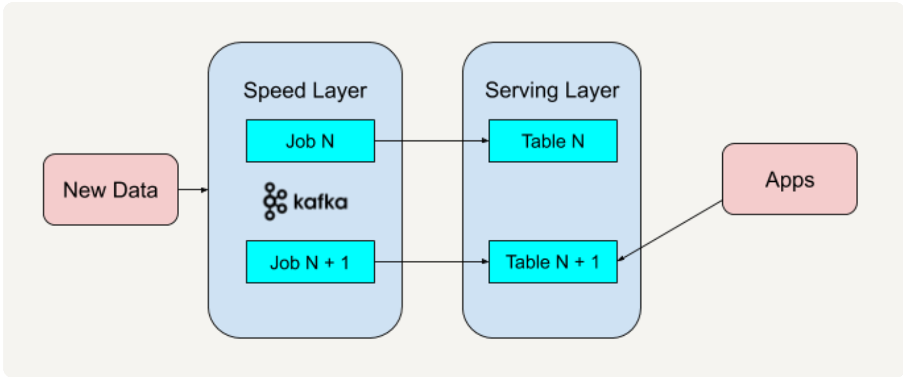

[toc]

# kappa 架构

Apache Kafka 这样的流处理平台是具有永久保存数据日志的功能的。通过平台的这一特性，我们可以重新处理部署于速度层架构中的历史数据

以 Apache Kafka 为例来讲述整个全新架构的过程

第一步，部署 Apache Kafka，并设置数据日志的保留期（Retention Period）。这里的保留期指的是你希望能够重新处理的历史数据的时间区间。

例如，如果你希望重新处理最多一年的历史数据，那就可以把 Apache Kafka 中的保留期设置为 365 天。如果你希望能够处理所有的历史数据，那就可以把 Apache Kafka 中的保留期设置为“永久（Forever）”。

第二步，如果我们需要改进现有的逻辑算法，那就表示我们需要对历史数据进行重新处理。

我们需要做的就是重新启动一个 Apache Kafka 作业实例（Instance）。这个作业实例将重头开始，重新计算保留好的历史数据，并将结果输出到一个新的数据视图中。我们知道 Apache Kafka 的底层是使用 Log Offset 来判断现在已经处理到哪个数据块了，所以只需要将 Log Offset 设置为 0，新的作业实例就会重头开始处理历史数据。

第三步，当这个新的数据视图处理过的数据进度赶上了旧的数据视图时，我们的应用便可以切换到从新的数据视图中读取。

第四步，停止旧版本的作业实例，并删除旧的数据视图。（若不执行此步骤，也就是不删除旧的数据视图。这样的好处是当你发现代码逻辑出错时可以及时回滚（Roll Back）到上一个版本的数据视图中去。又或者是你想在服务层提供 A/B 测试，保留多个数据视图版本将有助于你进行 A/B 测试。）

与 Lambda 架构不同的是，Kappa 架构去掉了批处理层这一体系结构，而只保留了速度层。你只需要在业务逻辑改变又或者是代码更改的时候进行数据的重新处理。

## 特点

kappa架构使用更少的技术栈，实时和历史部分都是同一套技术栈。

lambda架构为了解决历史部分和实时部分可能会使用不同的技术栈。

kappa架构使用了统一的处理逻辑。而lambda架构分别为历史和实时部分使用了两套逻辑。一旦需求变更，两套逻辑都要同时变更。

kappa架构具有流式处理的特点和优点。比如可以具有多个订阅者，比如具有更高的吞吐量。

## 缺点

因为 Kappa 架构只保留了速度层而缺少批处理层，在速度层上处理大规模数据可能会有数据更新出错的情况发生，这就需要我们花费更多的时间在处理这些错误异常上面。

Kappa 架构的批处理和流处理都放在了速度层上，这导致了这种架构是使用同一套代码来处理算法逻辑的。所以 Kappa 架构并不适用于批处理和流处理代码逻辑不一致的场景。

# example 

Kappa 架构在系统调度这个层面上统一了开发接口

任何需要传送到应用端的数据都必须按照这个接口输入给 Kappa 架构系统。而所有的应用端客户都只需要按照 Kappa 架构系统定义好的输出格式接收传输过来的数据。

