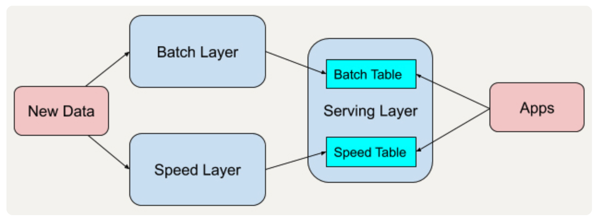
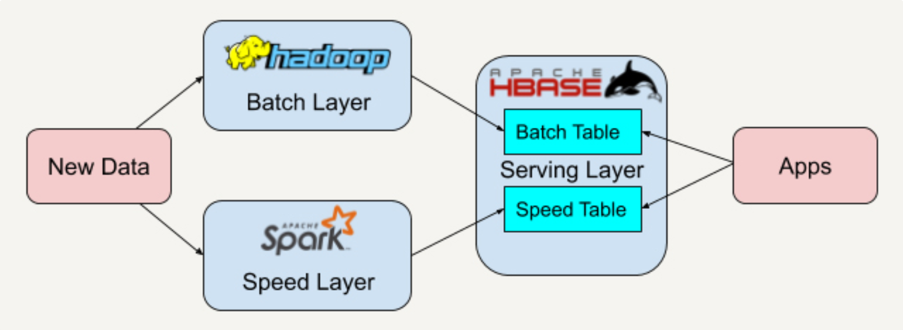

[toc]

 # Lambda Architecture

Lambda 架构使开发人员能够构建大规模分布式数据处理系统。它具有很好的灵活性和可扩展性，也对硬件故障和人为失误有很好的容错性

若现有的开源平台套用入这个架构中

可以将 Apache Spark 替换成 Apache Storm。而因为我们有批处理层这一概念，又有了很好的容错性。

## 缺点

lambda架构可能会导致相似的处理逻辑在batch层和speed层都要开发一遍

开发者必须要把同样的逻辑在两个地方维护，特别是当技术栈不一样的时候会很头疼。对于催生的Apache Flink、Apache Beam这种在做流批统一的，感觉会是未来的主流

简单又实用的lambda架构，如果实时和批量不能同时满足那就分开吧，用的时候综合下，让我想到现在开源的数据湖，delta data lake，如果批量和实时矛盾就分开吧，读写分，采用不同行式或列式存储，实时和历史分开，实时数据再定期变成历史，这个架构最大难点是如何合并speed和batch

## 批处理层（Batch Layer）

批处理层存储管理主数据集（不可变的数据集）和预先批处理计算好的视图。

批处理层使用可处理大量数据的分布式处理系统预先计算结果。它通过处理所有的已有历史数据来实现数据的准确性。这意味着它是基于完整的数据集来重新计算的，能够修复任何错误，然后更新现有的数据视图。输出通常存储在只读数据库中，更新则完全取代现有的预先计算好的视图。

## 速度处理层（Speed Layer）

速度处理层会实时处理新来的大数据。

速度层通过提供最新数据的实时视图来最小化延迟。速度层所生成的数据视图可能不如批处理层最终生成的视图那样准确或完整，但它们几乎在收到数据后立即可用。而当同样的数据在批处理层处理完成后，在速度层的数据就可以被替代掉了。

本质上，速度层弥补了批处理层所导致的数据视图滞后。

## 响应查询的服务层（Serving Layer）

所有在批处理层和速度层处理完的结果都输出存储在服务层中，服务层通过返回预先计算的数据视图或从速度层处理构建好数据视图来响应查询。

# example

实时数仓 就满足Lambda 架构。

1.批处理部分。定时拉取业务库的数据，并在hive做批处理计算。
2.速度部分。通过订阅mysql数据库的binlog，实时获取数据库的增删改等的操作，通过kafka和flink，生成相关结果。

通过Kafka将行为数据收集到hdfs，然后spark批处理t+1计算长期数据，生成固定格式的特征同步到kv上线，同时实时收集服务也从Kafka中消费最新的行为，两层输出特征格式统一，供画像服务使用