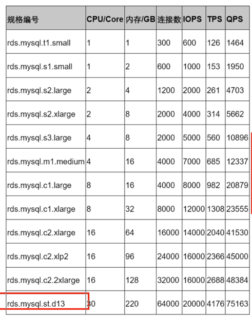

[toc]

# SLA

SLA（Service-Level Agreement），也就是服务等级协议，指的是系统服务提供者（Provider）对客户（Customer）的一个服务承诺。这是衡量一个大型分布式系统是否“健康”的常见方法

## Availabilty

系统服务能正常运行所占的时间百分比

对于许多系统而言，四个 9 的可用性（99.99％ Availability，或每年约 50 分钟的系统中断时间）即可以被认为是高可用性（High availability）

99.9% 意味着有 0.1% 的可能性系统服务会被中断，而一天中有 24 小时 × 60 分钟 × 60 秒，也就是有 (24 × 60 × 60 × 0.001) = 86.4 秒的可能系统服务被中断了。而上面所说的四个 9 的高可用性服务就是承诺可以将一天当中的服务中断时间缩短到只有 (24 × 60 × 60 × 0.0001) = 8.64 秒

## Accuracy

在一分钟内发送 100 个有效请求到系统中，其中有 5 个请求导致系统返回内部错误，那我们可以说这一分钟系统的错误率是 5 / 100 = 5%

Google Cloud Platform 的 SLA 中，有着这样的准确性定义：每个月系统的错误率超过 5% 的时间要少于 0.1%，以每分钟为单位来计算。而亚马逊 AWS 云计算平台有着稍微不一样的准确性定义：以每 5 分钟为单位，错误率不会超过 0.1%。

### Performance Test

像 Apache JMeter 又或是 LoadRunner 这类型的工具对系统进行性能测试。这类工具可以测试出系统在峰值状态下可以应对的 QPS 是多少

避免使用同一类型的请求参数，导致后台服务器在多数情况下命中缓存（Cache Hit）。这个时候得到的 QPS 可能并不是真实的 QPS

### Log

以分析系统日志的方法计算出来的 QPS 并不一定是服务器能够承载的最大 QPS。想要得到系统能承受的最大 QPS，更多的是性能测试和日志分析相结合的手段

## Capacity

### Mysql capacity

### QPS

Queries Per Second

Twitter 系统可以响应 30 万的 QPS 来读取 Twitter Timelines。这里 Twitter 系统给出的就是他们对于系统容量（Capacity）的 SLA

### RPS

Requests Per Second

## Latency

系统在收到用户的请求到响应这个请求之间的时间间隔

系统的 SLA 会有 p95 或者是 p99 这样的延迟声明。这里的 p 指的是 percentile，也就是百分位的意思。如果说一个系统的 p95 延迟是 1 秒的话，那就表示在 100 个请求里面有 95 个请求的响应时间会少于 1 秒，而剩下的 5 个请求响应时间会大于 1 秒。

### Cache Hit Ratio

为了降低系统的延迟，我们会将数据库中内容放进缓存（Cache）中，以此来减少数据库的读取时间。在系统运行了一段时间后，我们得到了一些缓存命中率（Cache Hit Ratio）的信息。有 90% 的请求命中了缓存，而剩下的 10% 的请求则需要重新从数据库中读取内容。

可以通过改进缓存策略从而提高缓存命中率，也可以通过优化数据库的 Schema 或者索引（Index）来降低 p95 或 p99 延迟。