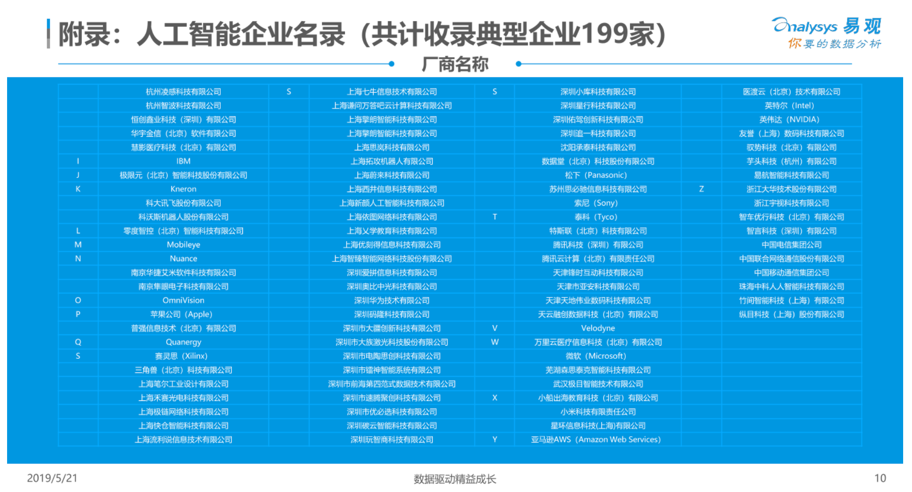

[toc]

# 数学符号（Mathematical notations）

## 代数

| 符号  | 名称     | 描述          | 例子             |
| :---- | :------- | :------------ | :--------------- |
| (f∘g) | 复合函数 | 嵌套函数      | (f∘g)(x)=f(g(x)) |
| ∆     | 德耳塔   | 变化/区别     | ∆x=x_1-x_0       |
| e     | 欧拉数   | e=2.718281828 | s=11+e−z         |
| ∑     | 求和     | 求和          | ∑x_i=x_1+x_2+x_3 |
| ∏     | 大写派   | 所有数的乘积  | ∏x_i=x_1∙x_2∙x_3 |
| ϵ     | 艾普西隆 | 0附近的小数   | lr=1e-4          |

## 微积分

| 符号 | 名称     | 描述             | 例子       |
| :--- | :------- | :--------------- | :--------- |
| x′   | 一阶导数 | 一阶导数         | (x^2)′ =2x |
| x″   | 二阶导数 | 二阶导数         | (x^2)″ =2  |
| lim  | 极限     | x接近0时的函数值 |            |
| ∇    | nabla    | 梯度             | ∇f(a,b,c)  |

## 线性代数

| 符号 | 名称     | 描述          | 例子                |
| :--- | :------- | :------------ | :------------------ |
| [ ]  | 方括号   | 矩阵或向量    | M=[135]             |
| ⋅    | 点       | 点积          | Z=X⋅W               |
| ⊙    | 哈达马   | 哈达马乘积    | A=B⊙C               |
| XT   | 转置     | 矩阵转置      | WT⋅X                |
| x→   | 向量     | 向量          | v=[123]             |
| X    | 矩阵     | 大写字母如    | X,C,A,I,Y,O,N,G,J,I |
| x^   | 单位向量 | 大小为1的向量 | x^                  |

## 概率论

| 符号 | 名称 | 描述            | 例子         |
| :--- | :--- | :-------------- | :----------- |
| P(A) | 概率 | 事件A发生的概率 | P(x=1) = 0.5 |

## 集合论

| 符号 | 名称 | 描述           | 例子             |
| :--- | :--- | :------------- | :--------------- |
| S    | 集合 | 不同元素的列表 | S = {1, 5, 7, 9} |

## 统计学

| 符号 | 名称       | 描述             | 例子 |
| :--- | :--------- | :--------------- | :--- |
| μ    | 总体均值   | 总体平均值       |      |
| x¯   | 样本平均值 | 总体子集的平均值 |      |
| σσ2  | 总体方差   | 总体方差         |      |
| s2   | 样本方差   | 总体子集的方差   |      |
| σX   | 标准偏差   | 总体标准差       |      |
| s    | 样本标准差 | 样本标准差       |      |
| ρX   | 相关性     | 变量X和Y的相关性 |      |
| x~   | 中位数     | 变量x的中值      |      |

## 希腊字母

| 大写 | 小写 | 英文注音 | 国际音标注音 | 中文注音 |
| :--- | :--- | :------- | :----------- | :------- |
| Α    | α    | alpha    | alfa         | 阿耳法   |
| Β    | β    | beta     | beta         | 贝塔     |
| Γ    | γ    | gamma    | gamma        | 伽马     |
| Δ    | δ    | deta     | delta        | 德耳塔   |
| Ε    | ε    | epsilon  | epsilon      | 艾普西隆 |
| Ζ    | ζ    | zeta     | zeta         | 截塔     |
| Η    | η    | eta      | eta          | 艾塔     |
| Θ    | θ    | theta    | θita         | 西塔     |
| Ι    | ι    | iota     | iota         | 约塔     |
| Κ    | κ    | kappa    | kappa        | 卡帕     |
| ∧    | λ    | lambda   | lambda       | 兰姆达   |
| Μ    | μ    | mu       | miu          | 缪       |
| Ν    | ν    | nu       | niu          | 纽       |
| Ξ    | ξ    | xi       | ksi          | 可塞     |
| Ο    | ο    | omicron  | omikron      | 奥密可戎 |
| ∏    | π    | pi       | pai          | 派       |
| Ρ    | ρ    | rho      | rou          | 柔       |
| ∑    | σ    | sigma    | sigma        | 西格马   |
| Τ    | τ    | tau      | tau          | 套       |
| Υ    | υ    | upsilon  | jupsilon     | 衣普西隆 |
| Φ    | φ    | phi      | fai          | 斐       |
| Χ    | χ    | chi      | khai         | 喜       |
| Ψ    | ψ    | psi      | psai         | 普西     |
| Ω    | ω    | omega    | omiga        | 欧米     |

# 产业分析

## 企业

# 职业分析

## 教育产业

# Appendix

https://mp.weixin.qq.com/s/BLxyqK3CGV9yd92yGEs4XQ

