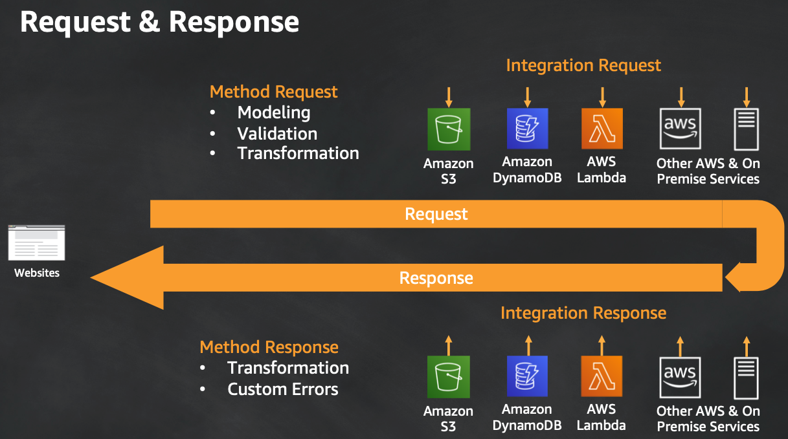
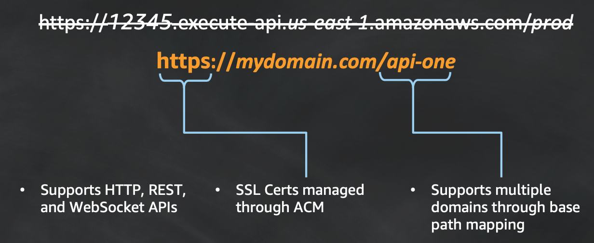

[TOC]


# API Gateway

API Gateway is a fully managed service that makes it easy for developers to create, publish, maintain, monitor, and secure APIs at any scale. It frees you from the operational burden of implementation, offers reliable network protection, and centralizes authorization decisions within policies so bugs and code concerns are minimized.


- Host multiple versions and stages of your APIs

- Create and distribute API Keys to developers

- Throttle and monitor requests to protect your backend

- Leverage signature version 4 to authorize access to APIs

- Perform Request / Response data transformation and API mocking

- Reduce latency and DDoS protection through CloudFront

- Store API responses through managed caches

- Generate SDKs for Java, JavaScript, Java for Android, Objective-C or

    Swift for iOS, and Ruby


**API Gateway REST API**

A collection of HTTP resources and methods that are integrated with backend HTTP endpoints, Lambda functions, or other AWS services. You can deploy this collection in one or more stages. Typically, API resources are organized in a resource tree according to the application logic. Each API resource can expose one or more API methods that have unique HTTP verbs supported by API Gateway.


**API Gateway HTTP API**

A collection of routes and methods that are integrated with backend HTTP endpoints or Lambda functions. You can deploy this collection in one or more stages. Each route can expose one or more API methods that have unique HTTP verbs supported by API Gateway.


**API Gateway WebSocket API**

A collection of WebSocket routes and route keys that are integrated with backend HTTP endpoints, Lambda functions, or other AWS services. You can deploy this collection in one or more stages. API methods are invoked through frontend WebSocket connections that you can associate with a registered custom domain name.


## Additional Features

Multiple versions and release stages

Automatic SDK generation

Monitoring and logging


## api endpoint

A hostname for an API in API Gateway that is deployed to a specific Region. The hostname is of the form `{api-id}.execute-api.{region}.amazonaws.com`.


## Request & Response




## Customized Domains

**Custom Domains in API Gateway**

API Gateway enables you to create custom domains for your APIs. 

It also enables you to point to custom domains from multiple API types.

Run your APIs within your own DNS zone

Recommended for supporting multiple versions

api.xurick.com/v1 -> restapi1

api.xurick.com/v2 -> restapi2

Support for cross-region redundancy with regional API endpoints





# HTTP APIs vs REST APIs

https://docs.aws.amazon.com/apigateway/latest/developerguide/http-api-vs-rest.html

# limits


## length of method

the maximum length of the method's ARN (for example, `arn:aws:execute-api:{region-id}:{account-id}:{api-id}/{stage-id}/{method}/{resource}/{path}`) is 1600 bytes.


## account-level quotas

| Resource or operation                                        | Default quota                                                | Can be increased |
| :----------------------------------------------------------- | :----------------------------------------------------------- | :--------------- |
| Throttle quota per Region across HTTP APIs, REST APIs, WebSocket APIs, and WebSocket callback APIs | 10,000 requests per second (RPS) with an additional burst capacity provided by the [token bucket algorithm](https://en.wikipedia.org/wiki/Token_bucket), using a maximum bucket capacity of 5,000 requests.**Note**The burst quota is determined by the API Gateway service team based on the overall RPS quota for the account. It is not a quota that a customer can control or request changes to. | Yes              |
| Regional APIs                                                | 600                                                          | No               |
| Edge-optimized APIs                                          | 120                                                          | No               |


## HTTP API quotas

For data transform, not support private VPC


| Resource or operation                                 | Default quota | Can be increased |
| :---------------------------------------------------- | :------------ | :--------------- |
| Routes per API                                        | 300           | Yes              |
| Integrations per API                                  | 300           | No               |
| Maximum integration timeout                           | 30 seconds    | No               |
| Stages per API                                        | 10            | Yes              |
| Tags per stage                                        | 50            | No               |
| Total combined size of request line and header values | 10240 bytes   | No               |
| Payload size                                          | 10 MB         | No               |
| Custom domains per account per Region                 | 120           | Yes              |
| Access log template size                              | 3 KB          | No               |
| Amazon CloudWatch Logs log entry                      | 1 MB          | No               |
| Authorizers per API                                   | 10            | Yes              |
| Audiences per authorizer                              | 50            | No               |
| Scopes per route                                      | 10            | No               |
| Timeout for JSON Web Key Set endpoint                 | 1500 ms       | No               |
| Timeout for OpenID Connect discovery endpoint         | 1500 ms       | No               |
| VPC links per account per Region                      | 10            | Yes              |
| Subnets per VPC link                                  | 10            | Yes              |
| Stage variables per stage                             | 100           | No               |


## REST API quotas

| Resource or operation                                        | Default quota                                                | Can be increased                   |
| :----------------------------------------------------------- | :----------------------------------------------------------- | :--------------------------------- |
| Custom domain names per account per Region                   | 120                                                          | Yes                                |
| Length, in characters, of the URL for an edge-optimized API  | 8192                                                         | No                                 |
| Length, in characters, of the URL for a regional API         | 10240                                                        | No                                 |
| Private APIs per account per Region                          | 600                                                          | No                                 |
| Length, in characters, of API Gateway resource policy        | 8192                                                         | Yes                                |
| API keys per account per Region                              | 500                                                          | Yes                                |
| Client certificates per account per Region                   | 60                                                           | Yes                                |
| Authorizers per API (AWS Lambda and Amazon Cognito)          | 10                                                           | Yes                                |
| Documentation parts per API                                  | 2000                                                         | Yes                                |
| Resources per API                                            | 300                                                          | Yes                                |
| Stages per API                                               | 10                                                           | Yes                                |
| Stage variables per stage                                    | 100                                                          | No                                 |
| Length, in characters, of the key in a stage variable        | 64                                                           | No                                 |
| Length, in characters, of the value in a stage variable      | 512                                                          | No                                 |
| Usage plans per account per Region                           | 300                                                          | Yes                                |
| Usage plans per API key                                      | 10                                                           | Yes                                |
| VPC links per account per Region                             | 20                                                           | Yes                                |
| API caching TTL                                              | 300 seconds by default and configurable between 0 and 3600 by an API owner. | Not for the upper bound (3600)     |
| Cached response size                                         | 1048576 Bytes. Cache data encryption may increase the size of the item that is being cached. | No                                 |
| Integration timeout                                          | 50 milliseconds - 29 seconds for all integration types, including Lambda, Lambda proxy, HTTP, HTTP proxy, and AWS integrations. | Not for the lower or upper bounds. |
| Total combined size of all header values                     | 10240 Bytes                                                  | No                                 |
| Payload size                                                 | 10 MB                                                        | No                                 |
| Tags per stage                                               | 50                                                           | No                                 |
| Number of iterations in a `#foreach ... #end` loop in mapping templates | 1000                                                         | No                                 |
| ARN length of a method with authorization                    | 1600 bytes                                                   | No                                 |


### calculate payload size （JavaScript）

Value unit is byte


```
function calculate_payload_size( channel, message ) {
    return encodeURIComponent(
        channel + JSON.stringify(message)
    ).length + 100;
}
```


Below is an example of calling the above function with a sample message that is obviously well under the limit.

```
var channel = "chats.room1";
var msg = {"msg":"mrqbthxukm"};
var size = calculate_payload_size(channel, msg);
console.log("Payload Size Bytes: ", size);

if (size < 32768) {
  pubnub.publish(
    {channel: channel, message: msg},
    function(status, response) {console.log(status, response);}
  );
}
```


## WebSocket API

Because of the WebSocket frame-size quota of 32 KB, a message larger than 32 KB must be split into multiple frames, each 32 KB or smaller. If a larger message (or larger frame size) is received, the connection is closed with code 1009.

| Resource or operation                                        | Default quota | Can be increased |
| :----------------------------------------------------------- | :------------ | :--------------- |
| New connections per second per account (across all WebSocket APIs) per Region | 500           | Yes              |
| AWS Lambda authorizers per API                               | 10            | Yes              |
| AWS Lambda authorizer result size                            | 8 KB          | No               |
| Routes per API                                               | 300           | Yes              |
| Integrations per API                                         | 300           | Yes              |
| Stages per API                                               | 10            | Yes              |
| WebSocket frame size                                         | 32 KB         | No               |
| Message payload size                                         | 128 KB *      | No               |
| Connection duration for WebSocket API                        | 2 hours       | No               |
| Idle Connection Timeout                                      | 10 minutes    | No               |


## API Gateway quotas for creating, deploying and managing an API


| Action                                                       | Default quota                                                | Can be increased |
| :----------------------------------------------------------- | :----------------------------------------------------------- | :--------------- |
| [CreateApiKey](https://docs.aws.amazon.com/apigateway/api-reference/link-relation/apikey-create/) | 5 requests per second per account                            | No               |
| [CreateDeployment](https://docs.aws.amazon.com/apigateway/api-reference/link-relation/deployment-create/) | 1 request every 5 seconds per account                        | No               |
| [CreateDocumentationVersion](https://docs.aws.amazon.com/apigateway/api-reference/link-relation/documentationversion-create/) | 1 request every 20 seconds per account                       | No               |
| [CreateDomainName](https://docs.aws.amazon.com/apigateway/api-reference/link-relation/domainname-create/) | 1 request every 30 seconds per account                       | No               |
| [CreateResource](https://docs.aws.amazon.com/apigateway/api-reference/link-relation/resource-create/) | 5 requests per second per account                            | No               |
| [CreateRestApi](https://docs.aws.amazon.com/apigateway/api-reference/link-relation/restapi-create/) | **Regional or private API**1 request every 3 seconds per account***\*Edge-optimized API\****1 request every 30 seconds per account | No               |
| [CreateVpcLink](https://docs.aws.amazon.com/apigatewayv2/latest/api-reference/vpclinks.html#CreateVpcLink) (V2) | 1 request every 15 seconds per account                       | No               |
| [DeleteApiKey](https://docs.aws.amazon.com/apigateway/api-reference/link-relation/apikey-delete/) | 5 requests per second per account                            | No               |
| [DeleteDomainName](https://docs.aws.amazon.com/apigateway/api-reference/link-relation/domainname-delete/) | 1 request every 30 seconds per account                       | No               |
| [DeleteResource](https://docs.aws.amazon.com/apigateway/api-reference/link-relation/resource-delete/) | 5 requests per second per account                            | No               |
| [DeleteRestApi](https://docs.aws.amazon.com/apigateway/api-reference/link-relation/restapi-delete/) | 1 request every 30 seconds per account                       | No               |
| [GetResources](https://docs.aws.amazon.com/apigateway/api-reference/link-relation/restapi-resources/) | 5 requests every 2 seconds per account                       | No               |
| [DeleteVpcLink](https://docs.aws.amazon.com/apigatewayv2/latest/api-reference/vpclinks.html#DeleteVpcLink) (V2) | 1 request every 30 seconds per account                       | No               |
| [ImportDocumentationParts](https://docs.aws.amazon.com/apigateway/api-reference/link-relation/documentationpart-import/) | 1 request every 30 seconds per account                       | No               |
| [ImportRestApi](https://docs.aws.amazon.com/apigateway/api-reference/link-relation/restapi-import/) | **Regional or private API**1 request every 3 seconds per account***\*Edge-optimized API\****1 request every 30 seconds per account | No   |
| [PutRestApi](https://docs.aws.amazon.com/apigateway/api-reference/link-relation/restapi-put/) | 1 request per second per account                             | No   |
| [UpdateAccount](https://docs.aws.amazon.com/apigateway/api-reference/link-relation/account-update/) | 1 request every 20 seconds per account                       | No   |
| [UpdateDomainName](https://docs.aws.amazon.com/apigateway/api-reference/link-relation/domainname-update/) | 1 request every 30 seconds per account                       | No   |
| [UpdateUsagePlan](https://docs.aws.amazon.com/apigateway/api-reference/link-relation/usageplan-update/) | 1 request every 20 seconds per account                       | No   |
| Other operations                                             | No quota up to the total account quota.                      | No   |
| Total operations                                             | 10 requests per second with a burst quota of 40 requests per second. | No   |


# example

## signature version 4 for http post request


```
import sys, os, base64, datetime, hashlib, hmac 
import requests 


method = 'POST'
service = 'execute-api'
host='<API ID>.execute-api.<region>.amazonaws.com'
region = 'us-east-1'
endpoint = 'https://<API ID>.execute-api.<region>.amazonaws.com/<stage>/<resource>'
content_type='application/x-amz-json-1.0'

request_parameters='{"msg":"hello world"}' #Request body

def sign(key, msg):
    return hmac.new(key, msg.encode("utf-8"), hashlib.sha256).digest()

def getSignatureKey(key, date_stamp, regionName, serviceName):
    kDate = sign(('AWS4' + key).encode('utf-8'), date_stamp)
    kRegion = sign(kDate, regionName)
    kService = sign(kRegion, serviceName)
    kSigning = sign(kService, 'aws4_request')
    return kSigning

access_key = os.environ.get('AWS_ACCESS_KEY_ID')
secret_key = os.environ.get('AWS_SECRET_ACCESS_KEY')
if access_key is None or secret_key is None:
    print('No access key is available.')
    sys.exit()


t = datetime.datetime.utcnow()
amz_date = t.strftime('%Y%m%dT%H%M%SZ')
date_stamp = t.strftime('%Y%m%d') 

canonical_uri = '/<stage>/<resource>'


canonical_querystring = ''


canonical_headers = 'host:' + host + '\n' + 'x-amz-date:' + amz_date + '\n'

signed_headers = 'host;x-amz-date'

payload_hash = hashlib.sha256(request_parameters.encode('utf-8')).hexdigest()


canonical_request = method + '\n' + canonical_uri + '\n' + canonical_querystring + '\n' + canonical_headers + '\n' + signed_headers + '\n' + payload_hash


algorithm = 'AWS4-HMAC-SHA256'
credential_scope = date_stamp + '/' + region + '/' + service + '/' + 'aws4_request'
string_to_sign = algorithm + '\n' +  amz_date + '\n' +  credential_scope + '\n' +  hashlib.sha256(canonical_request.encode('utf-8')).hexdigest()


signing_key = getSignatureKey(secret_key, date_stamp, region, service)

signature = hmac.new(signing_key, (string_to_sign).encode('utf-8'), hashlib.sha256).hexdigest()


authorization_header = algorithm + ' ' + 'Credential=' + access_key + '/' + credential_scope + ', ' +  'SignedHeaders=' + signed_headers + ', ' + 'Signature=' + signature


headers={
    'X-Amz-Date':amz_date,
    'Authorization':authorization_header,
    'Content-Type':content_type,
    'host':host
}

print(headers)
print('=============================================')
response=requests.request(method,url=endpoint,headers=headers,data=request_parameters)
print(response.text)
```

