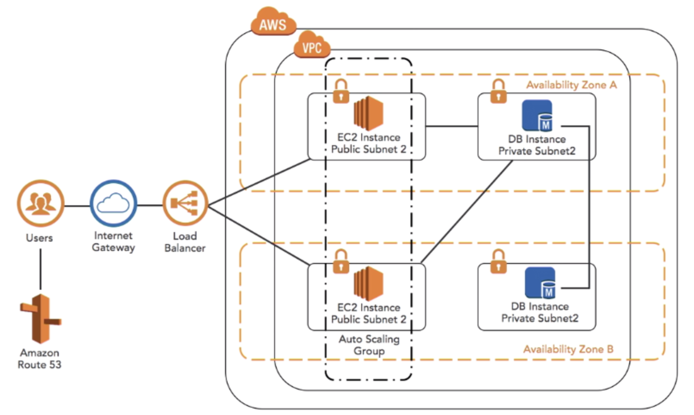

[toc]


# AWS CLI


## Linux aws v1

```
curl "https://s3.amazonaws.com/aws-cli/awscli-bundle.zip" -o "awscli-bundle.zip"

unzip awscli-bundle.zip

sudo ./awscli-bundle/install -i /usr/local/aws -b /usr/local/bin/aws
```

Add your Access Key ID and Secret Access Key to ~/`.aws/config` using this format:

```
[default]
aws_access_key_id = <access key id>
aws_secret_access_key = <secret access key>
region = us-east-1
```

Protect the config file:

```
chmod 600 ~/.aws/config
```

Optionally, you can set an environment variable pointing to the config file. This is especially important if you want to keep it in a non-standard location. For future convenience, also add this line to your ~/.bashrc file:

```
export AWS_CONFIG_FILE=$HOME/.aws/config
```


## Linux aws v2

```
curl "https://awscli.amazonaws.com/awscli-exe-linux-x86_64.zip" -o "awscliv2.zip"
unzip awscliv2.zip
sudo ./aws/install
```


## Mac OSX

```
curl "https://s3.amazonaws.com/aws-cli/awscli-bundle.zip" -o "awscli-bundle.zip"

unzip awscli-bundle.zip

sudo ./awscli-bundle/install -i /usr/local/aws -b /usr/local/bin/aws
```


Example




# AWS CLI Profile 

```
$ cat ~/.aws/credentials
[dp]
aws_access_key_id = xx
aws_secret_access_key = xx
[dp-stg]
aws_access_key_id = xx
aws_secret_access_key = xx
[custom_dp_da_sts]
aws_access_key_id = xx
aws_secret_access_key = xx
```


```
$ aws configure --profile custom_bd_da_sts
AWS Access Key ID [None]: xx
AWS Secret Access Key [None]: xx
Default region name [None]: us-east-1
Default output format [None]: json
```


```
$ aws sts get-caller-identity --profile custom_bd_da_sts
```


## Assume Role

```
aws sts assume-role --role-arn "arn:aws:iam::680404271483:role/ASSUME_ROLE" --role-session-name AWSCLI-Session
```

Replace with above output

```
export AWS_ACCESS_KEY_ID=RoleAccessKeyID
export AWS_SECRET_ACCESS_KEY=RoleSecretKey
export AWS_SESSION_TOKEN=RoleSessionToken

aws sts get-caller-identity
aws s3 ls s3://ASSUMED_BUCKET
```


To return to the IAM user, remove the environment variables

```
unset AWS_ACCESS_KEY_ID AWS_SECRET_ACCESS_KEY AWS_SESSION_TOKEN
aws sts get-caller-identity
```


Reference to https://aws.amazon.com/premiumsupport/knowledge-center/iam-assume-role-cli/?nc1=h_ls


# SSM

```
aws ssm get-parameters --names /pkg
{
    "InvalidParameters": [],
    "Parameters": [
        {
            "Name": "/pkg",
            "LastModifiedDate": 1589791491.805,
            "Value": "AQICAHgYmgnE3vwOeI1S3IjIOa/Cvquf37wyDwoB8iTVd21m7QE932F/LOroFD+Mj6yJ8yD+AAAKpTCCCqEGCSqGSIb3DQEHBqCCCpIwggqOAgEAMIIKhwYJKoZIhvcNAQcBMB4GCWCGSAFlAwQBLjARBAwZgKCMeqtmj9REa+8CARCAggpYE8Nm6hIypUbiZ3R5ADCS5wXcvfIzBdzKO9wAZetol/NAdnTO7nK9r1fWog4zxRWY7e12qtoDm28XqO4cI7dP3QX612Cg29/JAh9dXpbtZDn1ox/L+P3M9xKR+nQsw9J7TOBpF/l4c0pnQaVk6cSA2/Owz+zZA2m/sjO1KyorC6HPA8aPAVYUJVq1RuWaMA5d1vgmGna0JcY7VxxHbTSsTImKTN6mC9BicMgwsJw7sRqNkY+I39/63Aih8JZjCbAMrGnPeOGnGyRAhOfcZHrFeWoDX4GWaB0rKzVx9tvb3WNUL4oWm7wCfwavli2xJB5/uJdShvGIRlB+ZUBbihs5SlHvikziqmDVpd16+OKg7EhI53r+D+ZoJrB6/N2bYtE67aqPZ3zrz5DBTk+Wpavpi6b43F8FWxdF6TL4jzbL9ElEljD1BGBylPRIffH+xP+nIsVjPXmvCHEqPtPXwjo7CdFuaKdH3LnWK952RxvE40qssSe4VNuEgUxHj3w03ayuaIiT1QCHEjtg5AYhiWZCPBNJRJxJs42HiUJfHalEFuPuFLG8YPmvnJLRzz0GWkiPxgRITKhxnBBKnIskwmtQsN7xjzWki0GKYBf+I96hEK7gp8Oc+1z1fCLJWJJgGsGBcc3Zvp7l0VEBxvVW6e9qVhLMXiKEHHGIpOO1UEHAGDAvHzh7+c8",
            "Version": 1,
            "Type": "SecureString",
            "ARN": "arn:aws:ssm:us-east-1:982645107754:parameter/pkg"
        }
    ]
}
```

