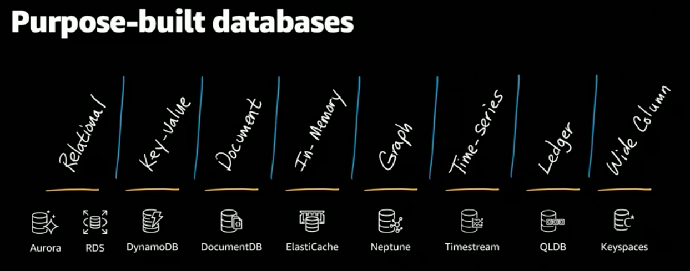

[TOC]

# AWS


## Bootstrapping

The process to get an application up and running on an EC2 instance or other AWS services


### Running custom scripts


## Instance Metadata

Data about your instance

Can be used to configure or manage a running instance


### Retrieving 

```
curl http://169.254.169.254/latest/meta-data
```

returned as text (Content-type: text/plain)


## Instance User data

Can be passed to the instance at launch

Can be used to perform common automated configuration tasks

Runs scripts after the instance starts


## Roles

Allow programs to control your AWS account

Packaged permissions

Apply to instances and containers


## Security Groups

Controlled by roles

Allow network traffic between instances


## Region 

Independent Geographic Area


# Database



# Terminology

## Scaling Out

水平扩展 Horizontal scaling


## Scaling In

水平收缩 A form of horizontal scaling


## Scaling Up

垂直扩展 Vertical scaling


## Scaling Down

垂直收缩 A form of vertical scaling


# Object Storage(S3) vs File Storage(EFS) vs Block Storage(EBS/EC2)

File Storage 也称为文件级存储或基于文件的存储，数据会以单条信息的形式存储在文件夹中。需要访问该数据时，您的计算机需要知道相应的查找路径
Accessed by path
Data stored as files in folder hierarchies
Easily searchable


Block Storage会将数据拆分成块，并单独存储各个块。每个数据块都有一个唯一标识符，所以存储系统能将较小的数据存放在最方便的位置。块存储通常会被配置为将数据与用户环境分离，并会将数据分布到可以更好地为其提供服务的多个环境中。然后，当用户请求数据时，底层存储软件会重新组装来自这些环境的数据块，并将它们呈现给用户。


Object Storage，也称为基于对象的存储，是一种扁平结构，其中的文件被拆分成多个部分并散布在多个硬件间。在对象存储中，数据会被分解为称为“对象”的离散单元，并保存在单个存储库中，而不是作为文件夹中的文件或服务器上的块来保存。
Which can store any blob of data or files, videos, images, PDFs, text, documents


# Knowldege Center

https://aws.amazon.com/premiumsupport/knowledge-center


# AWS resources limits


## small

| Name                                                         | Type              | number     | Description                                                  |
| ------------------------------------------------------------ | ----------------- | ---------- | ------------------------------------------------------------ |
| **VPCs**                                                     | Networking        | 12         | The total number of VPCs for this Region.                    |
| **VPCs**                                                     | Networking        | 12         | The total number of VPCs for this Region.                    |
| **VPC security groups per Region**                           | Networking        | 2500       | The number of VPC security groups per Region cannot exceed 10,000. |
| **VPC security groups per Region**                           | Networking        | 2500       | The number of VPC security groups per Region cannot exceed 10,000. |
| **VPC security groups per elastic network interface**        | Networking        | 5          | The number of security groups per network interface. The number of security groups multiplied by the number of rules per group cannot exceed 1,000. |
| **VPC security groups per elastic network interface**        | Networking        | 5          | The number of security groups per network interface. The number of security groups multiplied by the number of rules per group cannot exceed 1,000. |
| **Target groups**                                            | Load balancing    | 3000       | The maximum number of target groups per Region.              |
| **Target groups**                                            | Load balancing    | 3000       | The maximum number of target groups per Region.              |
| **Subnets per VPC**                                          | Networking        | 200        | The number of subnets per VPC, including your default subnet. |
| **Subnets per VPC**                                          | Networking        | 200        | The number of subnets per VPC, including your default subnet. |
| **Security groups per instance**                             | Running instances | 8          | The number of security groups per instance                   |
| **Security groups per instance**                             | Running instances | 8          | The number of security groups per instance                   |
| **Security groups**                                          | Running instances | –          | The total number of security groups for this Region.         |
| **Security groups**                                          | Running instances | –          | The total number of security groups for this Region.         |
| **Running Z1D Dedicated Hosts**                              | Dedicated Hosts   | 2          | –                                                            |
| **Running Z1D Dedicated Hosts**                              | Dedicated Hosts   | 2          | –                                                            |
| **Running X1E Dedicated Hosts**                              | Dedicated Hosts   | 1          | –                                                            |
| **Running X1E Dedicated Hosts**                              | Dedicated Hosts   | 1          | –                                                            |
| **Running X1 Dedicated Hosts**                               | Dedicated Hosts   | 1          | –                                                            |
| **Running X1 Dedicated Hosts**                               | Dedicated Hosts   | 1          | –                                                            |
| **Running R6GD Dedicated Hosts**                             | Dedicated Hosts   | 2          | –                                                            |
| **Running R6GD Dedicated Hosts**                             | Dedicated Hosts   | 2          | –                                                            |
| **Running R6G Dedicated Hosts**                              | Dedicated Hosts   | 2          | –                                                            |
| **Running R6G Dedicated Hosts**                              | Dedicated Hosts   | 2          | –                                                            |
| **Running R5N Dedicated Hosts**                              | Dedicated Hosts   | 2          | –                                                            |
| **Running R5N Dedicated Hosts**                              | Dedicated Hosts   | 2          | –                                                            |
| **Running R5DN Dedicated Hosts**                             | Dedicated Hosts   | 2          | –                                                            |
| **Running R5DN Dedicated Hosts**                             | Dedicated Hosts   | 2          | –                                                            |
| **Running R5D Dedicated Hosts**                              | Dedicated Hosts   | 2          | –                                                            |
| **Running R5D Dedicated Hosts**                              | Dedicated Hosts   | 2          | –                                                            |
| **Running R5B Dedicated Hosts**                              | Dedicated Hosts   | 1          | –                                                            |
| **Running R5B Dedicated Hosts**                              | Dedicated Hosts   | 1          | –                                                            |
| **Running R5AD Dedicated Hosts**                             | Dedicated Hosts   | 2          | –                                                            |
| **Running R5AD Dedicated Hosts**                             | Dedicated Hosts   | 2          | –                                                            |
| **Running R5A Dedicated Hosts**                              | Dedicated Hosts   | 2          | –                                                            |
| **Running R5A Dedicated Hosts**                              | Dedicated Hosts   | 2          | –                                                            |
| **Running R5 Dedicated Hosts**                               | Dedicated Hosts   | 2          | –                                                            |
| **Running R5 Dedicated Hosts**                               | Dedicated Hosts   | 2          | –                                                            |
| **Running R4 Dedicated Hosts**                               | Dedicated Hosts   | 2          | –                                                            |
| **Running R4 Dedicated Hosts**                               | Dedicated Hosts   | 2          | –                                                            |
| **Running R3 Dedicated Hosts**                               | Dedicated Hosts   | 2          | –                                                            |
| **Running R3 Dedicated Hosts**                               | Dedicated Hosts   | 2          | –                                                            |
| **Running P4D Dedicated Hosts**                              | Dedicated Hosts   | 2          | –                                                            |
| **Running P4D Dedicated Hosts**                              | Dedicated Hosts   | 2          | –                                                            |
| **Running P3DN Dedicated Hosts**                             | Dedicated Hosts   | 2          | –                                                            |
| **Running P3DN Dedicated Hosts**                             | Dedicated Hosts   | 2          | –                                                            |
| **Running P3 Dedicated Hosts**                               | Dedicated Hosts   | 1          | –                                                            |
| **Running P3 Dedicated Hosts**                               | Dedicated Hosts   | 1          | –                                                            |
| **Running P2 Dedicated Hosts**                               | Dedicated Hosts   | 2          | –                                                            |
| **Running P2 Dedicated Hosts**                               | Dedicated Hosts   | 2          | –                                                            |
| **Running On-Demand All X instances**                        | Running instances | 560 vCPUs  | Running On-Demand X instances                                |
| **Running On-Demand All X instances**                        | Running instances | 560 vCPUs  | Running On-Demand X instances                                |
| **Running On-Demand All Standard (A, C, D, H, I, M, R, T, Z) instances** | Running instances | 3072 vCPUs | Running On-Demand Standard (A, C, D, H, I, M, R, T, Z) instances |
| **Running On-Demand All Standard (A, C, D, H, I, M, R, T, Z) instances** | Running instances | 3072 vCPUs | Running On-Demand Standard (A, C, D, H, I, M, R, T, Z) instances |
| **Running On-Demand All P instances**                        | Running instances | 692 vCPUs  | Running On-Demand P instances                                |
| **Running On-Demand All P instances**                        | Running instances | 692 vCPUs  | Running On-Demand P instances                                |
| **Running On-Demand All Inf instances**                      | Running instances | 128 vCPUs  | Running On-Demand Inf instances                              |
| **Running On-Demand All Inf instances**                      | Running instances | 128 vCPUs  | Running On-Demand Inf instances                              |
| **Running On-Demand All G instances**                        | Running instances | 880 vCPUs  | Running On-Demand G instances                                |
| **Running On-Demand All G instances**                        | Running instances | 880 vCPUs  | Running On-Demand G instances                                |
| **Running On-Demand All F instances**                        | Running instances | 176 vCPUs  | Running On-Demand F instances                                |
| **Running On-Demand All F instances**                        | Running instances | 176 vCPUs  | Running On-Demand F instances                                |
| **Running MAC1 Dedicated Hosts**                             | Dedicated Hosts   | 3          | –                                                            |
| **Running MAC1 Dedicated Hosts**                             | Dedicated Hosts   | 3          | –                                                            |
| **Running M6GD Dedicated Hosts**                             | Dedicated Hosts   | 2          | –                                                            |
| **Running M6GD Dedicated Hosts**                             | Dedicated Hosts   | 2          | –                                                            |
| **Running M6G Dedicated Hosts**                              | Dedicated Hosts   | 2          | –                                                            |
| **Running M6G Dedicated Hosts**                              | Dedicated Hosts   | 2          | –                                                            |
| **Running M5ZN Dedicated Hosts**                             | Dedicated Hosts   | 2          | –                                                            |
| **Running M5ZN Dedicated Hosts**                             | Dedicated Hosts   | 2          | –                                                            |
| **Running M5N Dedicated Hosts**                              | Dedicated Hosts   | 2          | –                                                            |
| **Running M5N Dedicated Hosts**                              | Dedicated Hosts   | 2          | –                                                            |
| **Running M5DN Dedicated Hosts**                             | Dedicated Hosts   | 2          | –                                                            |
| **Running M5DN Dedicated Hosts**                             | Dedicated Hosts   | 2          | –                                                            |
| **Running M5D Dedicated Hosts**                              | Dedicated Hosts   | 2          | –                                                            |
| **Running M5D Dedicated Hosts**                              | Dedicated Hosts   | 2          | –                                                            |
| **Running M5AD Dedicated Hosts**                             | Dedicated Hosts   | 2          | –                                                            |
| **Running M5AD Dedicated Hosts**                             | Dedicated Hosts   | 2          | –                                                            |
| **Running M5A Dedicated Hosts**                              | Dedicated Hosts   | 2          | –                                                            |
| **Running M5A Dedicated Hosts**                              | Dedicated Hosts   | 2          | –                                                            |
| **Running M5 Dedicated Hosts**                               | Dedicated Hosts   | 2          | –                                                            |
| **Running M5 Dedicated Hosts**                               | Dedicated Hosts   | 2          | –                                                            |
| **Running M4 Dedicated Hosts**                               | Dedicated Hosts   | 2          | –                                                            |
| **Running M4 Dedicated Hosts**                               | Dedicated Hosts   | 2          | –                                                            |
| **Running M3 Dedicated Hosts**                               | Dedicated Hosts   | 2          | –                                                            |
| **Running M3 Dedicated Hosts**                               | Dedicated Hosts   | 2          | –                                                            |
| **Running INF1 Dedicated Hosts**                             | Dedicated Hosts   | 2          | –                                                            |
| **Running I3EN Dedicated Hosts**                             | Dedicated Hosts   | 2          | –                                                            |
| **Running I3 Dedicated Hosts**                               | Dedicated Hosts   | 2          | –                                                            |
| **Running I2 Dedicated Hosts**                               | Dedicated Hosts   | 2          | –                                                            |
| **Running H1 Dedicated Hosts**                               | Dedicated Hosts   | 2          | –                                                            |
| **Running G4DN Dedicated Hosts**                             | Dedicated Hosts   | 2          | –                                                            |
| **Running G4AD Dedicated Hosts**                             | Dedicated Hosts   | 2          | –                                                            |


## large

| Name                                                         | Type                | number       | Description                                                  |
| ------------------------------------------------------------ | ------------------- | ------------ | ------------------------------------------------------------ |
| **Active VPC peering connections**                           | Networking          | 50           | The number of active VPC peering connections per VPC.        |
| **All F Spot Instance Requests**                             | Requested instances | 12600 vCPUs  | –                                                            |
| **All G Spot Instance Requests**                             | Requested instances | 12600 vCPUs  | –                                                            |
| **All Inf Spot Instance Requests**                           | Requested instances | 80000 vCPUs  | –                                                            |
| **All P Spot Instance Requests**                             | Requested instances | 18900 vCPUs  | –                                                            |
| **All Standard (A, C, D, H, I, M, R, T, Z) Spot Instance Requests** | Requested instances | 90000 vCPUs  | –                                                            |
| **All X Spot Instance Requests**                             | Requested instances | 25100 vCPUs  | –                                                            |
| **Application Load Balancers**                               | Load balancing      | 50           | The maximum number of Application Load Balancers per Region. |
| **Auto Scaling groups**                                      | Auto Scaling        | 200          | The maximum number of Auto Scaling groups for your account.  |
| **Classic Load Balancers**                                   | Load balancing      | 50           | The maximum number of Classic Load Balancers per Region.     |
| **EC2-Classic Elastic IPs**                                  | Networking          | 5            | The number of Elastic IP addresses for use with EC2-Classic. This is a separate limit from the VPC Elastic IP address limit. |
| **EC2-VPC Elastic IPs**                                      | Networking          | 700          | The number of Elastic IP addresses for use with a VPC. This is a separate limit from the EC2-Classic Elastic IP address limit. |
| **Entries per route table**                                  | Networking          | 50           | The number of non-propagated routes per route table. Increasing this limit may impact network performance. |
| **Expiry time for an unaccepted VPC peering connection**     | Networking          | 168          | The expiry time, in hours, for an unaccepted VPC peering connection. |
| **General Purpose (SSD) volume storage (TiB)**               | EBS                 | 800          | The maximum aggregate amount of General Purpose (SSD) storage that can be provisioned in this Region. |
| **Launch configurations**                                    | Auto Scaling        | 200          | The maximum number of launch configurations for your account. |
| **Magnetic volume storage (TiB)**                            | EBS                 | 500          | The maximum aggregate amount of Magnetic storage that can be provisioned in this Region. |
| **Max Cold HDD (SC1) Storage in TiB**                        | EBS                 | 500          | The maximum aggregate amount of Cold HDD (SC1) storage that can be provisioned in this Region. |
| **Max Throughput Optimized HDD (ST1) Storage in TiB**        | EBS                 | 500          | The maximum aggregate amount of Throughput Optimized HDD (ST1) storage that can be provisioned in this Region. |
| **Network ACLs per VPC**                                     | Networking          | 200          | The number of network ACLs per VPC. You can associate one network ACL to one or more subnets in your VPC. |
| **Network interfaces**                                       | Networking          | 10000        | The total number of network interfaces for this Region.      |
| **Network Load Balancers**                                   | Load balancing      | 50           | The maximum number of Network Load Balancers per Region.     |
| **Outstanding VPC peering connection requests**              | Networking          | 25           | The number of outstanding VPC peering connection requests for this Region. |
| **Provisioned IOPS**                                         | EBS                 | 300000       | The maximum aggregate number of provisioned IOPS that can be provisioned in this Region. |
| **Provisioned IOPS (SSD) volume storage (TiB)**              | EBS                 | 300          | The maximum aggregate amount of PIOPS volume storage that can be provisioned in this Region. |
| **Reserved Instances**                                       | Running instances   | 500          | The total number of instances corresponding to new reservations purchased per Availability Zone, per month. |
| **Route tables per VPC**                                     | Networking          | 200          | The total number of route tables per VPC, including the main route table. |
| **Rules per network ACL**                                    | Networking          | 20           | The total number of inbound and outbound rules per network ACL. The maximum is 40. |
| **Rules per VPC security group**                             | Networking          | 60           | The number of inbound and outbound rules per VPC security group. The number of rules multiplied by the number of security groups per network interface cannot exceed 1,000. |
| **Running A1 Dedicated Hosts**                               | Dedicated Hosts     | 2            | –                                                            |
| **Running C3 Dedicated Hosts**                               | Dedicated Hosts     | 2            | –                                                            |
| **Running C4 Dedicated Hosts**                               | Dedicated Hosts     | 2            | –                                                            |
| **Running C5 Dedicated Hosts**                               | Dedicated Hosts     | 2            | –                                                            |
| **Running C5D Dedicated Hosts**                              | Dedicated Hosts     | 2            | –                                                            |
| **Running C5N Dedicated Hosts**                              | Dedicated Hosts     | 1            | –                                                            |
| **Running C6G Dedicated Hosts**                              | Dedicated Hosts     | 2            | –                                                            |
| **Running C6GD Dedicated Hosts**                             | Dedicated Hosts     | 2            | –                                                            |
| **Running C6GN Dedicated Hosts**                             | Dedicated Hosts     | 2            | –                                                            |
| **Running D2 Dedicated Hosts**                               | Dedicated Hosts     | 2            | –                                                            |
| **Running F1 Dedicated Hosts**                               | Dedicated Hosts     | 2            | –                                                            |
| **Running G2 Dedicated Hosts**                               | Dedicated Hosts     | 2            | –                                                            |
| **Running G3 Dedicated Hosts**                               | Dedicated Hosts     | 2            | –                                                            |
| **Running G3S Dedicated Hosts**                              | Dedicated Hosts     | 2            | –                                                            |
| **Running G4AD Dedicated Hosts**                             | Dedicated Hosts     | 2            | –                                                            |
| **Running G4DN Dedicated Hosts**                             | Dedicated Hosts     | 2            | –                                                            |
| **Running H1 Dedicated Hosts**                               | Dedicated Hosts     | 2            | –                                                            |
| **Running I2 Dedicated Hosts**                               | Dedicated Hosts     | 2            | –                                                            |
| **Running I3 Dedicated Hosts**                               | Dedicated Hosts     | 2            | –                                                            |
| **Running I3EN Dedicated Hosts**                             | Dedicated Hosts     | 2            | –                                                            |
| **Running INF1 Dedicated Hosts**                             | Dedicated Hosts     | 2            | –                                                            |
| **Running M3 Dedicated Hosts**                               | Dedicated Hosts     | 2            | –                                                            |
| **Running M4 Dedicated Hosts**                               | Dedicated Hosts     | 2            | –                                                            |
| **Running M5 Dedicated Hosts**                               | Dedicated Hosts     | 2            | –                                                            |
| **Running M5A Dedicated Hosts**                              | Dedicated Hosts     | 2            | –                                                            |
| **Running M5AD Dedicated Hosts**                             | Dedicated Hosts     | 2            | –                                                            |
| **Running M5D Dedicated Hosts**                              | Dedicated Hosts     | 2            | –                                                            |
| **Running M5DN Dedicated Hosts**                             | Dedicated Hosts     | 2            | –                                                            |
| **Running M5N Dedicated Hosts**                              | Dedicated Hosts     | 2            | –                                                            |
| **Running M5ZN Dedicated Hosts**                             | Dedicated Hosts     | 2            | –                                                            |
| **Running M6G Dedicated Hosts**                              | Dedicated Hosts     | 2            | –                                                            |
| **Running M6GD Dedicated Hosts**                             | Dedicated Hosts     | 2            | –                                                            |
| **Running MAC1 Dedicated Hosts**                             | Dedicated Hosts     | 3            | –                                                            |
| **Running On-Demand All F instances**                        | Running instances   | 176 vCPUs    | Running On-Demand F instances                                |
| **Running On-Demand All G instances**                        | Running instances   | 920 vCPUs    | Running On-Demand G instances                                |
| **Running On-Demand All Inf instances**                      | Running instances   | 128 vCPUs    | Running On-Demand Inf instances                              |
| **Running On-Demand All P instances**                        | Running instances   | 692 vCPUs    | Running On-Demand P instances                                |
| **Running On-Demand All Standard (A, C, D, H, I, M, R, T, Z) instances** | Running instances   | 116992 vCPUs | Running On-Demand Standard (A, C, D, H, I, M, R, T, Z) instances |
| **Running On-Demand All X instances**                        | Running instances   | 560 vCPUs    | Running On-Demand X instances                                |
| **Running P2 Dedicated Hosts**                               | Dedicated Hosts     | 2            | –                                                            |
| **Running P3 Dedicated Hosts**                               | Dedicated Hosts     | 1            | –                                                            |
| **Running P3DN Dedicated Hosts**                             | Dedicated Hosts     | 2            | –                                                            |
| **Running P4D Dedicated Hosts**                              | Dedicated Hosts     | 2            | –                                                            |
| **Running R3 Dedicated Hosts**                               | Dedicated Hosts     | 2            | –                                                            |
| **Running R4 Dedicated Hosts**                               | Dedicated Hosts     | 2            | –                                                            |
| **Running R5 Dedicated Hosts**                               | Dedicated Hosts     | 2            | –                                                            |
| **Running R5A Dedicated Hosts**                              | Dedicated Hosts     | 2            | –                                                            |
| **Running R5AD Dedicated Hosts**                             | Dedicated Hosts     | 2            | –                                                            |
| **Running R5B Dedicated Hosts**                              | Dedicated Hosts     | 1            | –                                                            |
| **Running R5D Dedicated Hosts**                              | Dedicated Hosts     | 2            | –                                                            |
| **Running R5DN Dedicated Hosts**                             | Dedicated Hosts     | 2            | –                                                            |
| **Running R5N Dedicated Hosts**                              | Dedicated Hosts     | 2            | –                                                            |
| **Running R6G Dedicated Hosts**                              | Dedicated Hosts     | 2            | –                                                            |
| **Running R6GD Dedicated Hosts**                             | Dedicated Hosts     | 2            | –                                                            |
| **Running X1 Dedicated Hosts**                               | Dedicated Hosts     | 1            | –                                                            |
| **Running X1E Dedicated Hosts**                              | Dedicated Hosts     | 1            | –                                                            |
| **Running Z1D Dedicated Hosts**                              | Dedicated Hosts     | 2            | –                                                            |
| **Security groups**                                          | Running instances   | –            | The total number of security groups for this Region.         |
| **Security groups per instance**                             | Running instances   | 8            | The number of security groups per instance                   |
| **Subnets per VPC**                                          | Networking          | 256          | The number of subnets per VPC, including your default subnet. |
| **Target groups**                                            | Load balancing      | 3000         | The maximum number of target groups per Region.              |
| **VPC security groups per elastic network interface**        | Networking          | 5            | The number of security groups per network interface. The number of security groups multiplied by the number of rules per group cannot exceed 1,000. |
| **VPC security groups per Region**                           | Networking          | 2500         | The number of VPC security groups per Region cannot exceed 10,000. |
| **VPCs**                                                     | Networking          | 20           | The total number of VPCs for this Region.                    |

# Tools


## Amazon Web Services Simple Monthly Calculator

https://calculator.s3.amazonaws.com/index.html


## Amazon EC2 Instance Types - Amazon Web Services

https://aws.amazon.com/ec2/instance-types/


## Amazon EC2 Pricing - Amazon Web Services

https://aws.amazon.com/ec2/pricing/


## Spot Fleet

https://docs.aws.amazon.com/zh_cn/AWSEC2/latest/UserGuide/using-spot-limits.html#spot-fleet-limitations


## AWS EMR

https://docs.aws.amazon.com/emr/latest/ReleaseGuide/emr-release-5x.html


## AWS S3 Policy generator

http://awspolicygen.s3.amazonaws.com/policygen.html


## Amazon Linux Security Center

https://alas.aws.amazon.com/