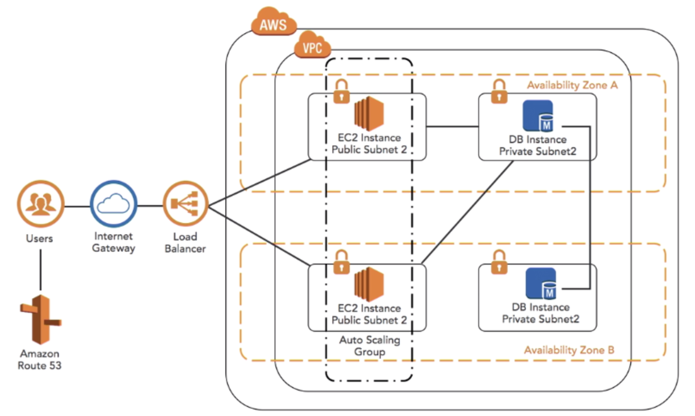

[TOC]

# AWS


## Bootstrapping

The process to get an application up and running on an EC2 instance or other AWS services


### Running custom scripts


## Instance Metadata

Data about your instance

Can be used to configure or manage a running instance


### Retrieving 

```
curl http://169.254.169.254/latest/meta-data
```

returned as text (Content-type: text/plain)


## Instance User data

Can be passed to the instance at launch

Can be used to perform common automated configuration tasks

Runs scripts after the instance starts


## Roles

Allow programs to control your AWS account

Packaged permissions

Apply to instances and containers


## Security Groups

Controlled by roles

Allow network traffic between instances


# Terminology

## Scaling Out

水平扩展 Horizontal scaling


## Scaling In

水平收缩 A form of horizontal scaling


## Scaling Up

垂直扩展 Vertical scaling


## Scaling Down

垂直收缩 A form of vertical scaling


# Object Storage(S3) vs File Storage(EFS) vs Block Storage(EBS/EC2)

File Storage 也称为文件级存储或基于文件的存储，数据会以单条信息的形式存储在文件夹中。需要访问该数据时，您的计算机需要知道相应的查找路径
Accessed by path
Data stored as files in folder hierarchies
Easily searchable


Block Storage会将数据拆分成块，并单独存储各个块。每个数据块都有一个唯一标识符，所以存储系统能将较小的数据存放在最方便的位置。块存储通常会被配置为将数据与用户环境分离，并会将数据分布到可以更好地为其提供服务的多个环境中。然后，当用户请求数据时，底层存储软件会重新组装来自这些环境的数据块，并将它们呈现给用户。


Object Storage，也称为基于对象的存储，是一种扁平结构，其中的文件被拆分成多个部分并散布在多个硬件间。在对象存储中，数据会被分解为称为“对象”的离散单元，并保存在单个存储库中，而不是作为文件夹中的文件或服务器上的块来保存。
Which can store any blob of data or files, videos, images, PDFs, text, documents


# AWS CLI


## Linux

```
$ curl "https://s3.amazonaws.com/aws-cli/awscli-bundle.zip" -o "awscli-bundle.zip"
$ unzip awscli-bundle.zip
$ sudo ./awscli-bundle/install -i /usr/local/aws -b /usr/local/bin/aws
```

Add your Access Key ID and Secret Access Key to ~/`.aws/config` using this format:

```
[default]
aws_access_key_id = <access key id>
aws_secret_access_key = <secret access key>
region = us-east-1
```

Protect the config file:

```
chmod 600 ~/.aws/config
```

Optionally, you can set an environment variable pointing to the config file. This is especially important if you want to keep it in a non-standard location. For future convenience, also add this line to your ~/.bashrc file:

```
export AWS_CONFIG_FILE=$HOME/.aws/config
```


## Mac OSX

```
curl "https://s3.amazonaws.com/aws-cli/awscli-bundle.zip" -o "awscli-bundle.zip"

unzip awscli-bundle.zip

sudo ./awscli-bundle/install -i /usr/local/aws -b /usr/local/bin/aws
```


Example




## Profile 

```
$ cat ~/.aws/credentials
[dp]
aws_access_key_id = xx
aws_secret_access_key = xx
[dp-stg]
aws_access_key_id = xx
aws_secret_access_key = xx
[custom_dp_da_sts]
aws_access_key_id = xx
aws_secret_access_key = xx
```


```
$ aws configure --profile custom_bdp_da_sts
AWS Access Key ID [None]: xx
AWS Secret Access Key [None]: xx
Default region name [None]: us-east-1
Default output format [None]: json
```


```
$ aws sts get-caller-identity --profile custom_bdp_da_sts
```


# Tools


## Amazon Web Services Simple Monthly Calculator

https://calculator.s3.amazonaws.com/index.html


## Amazon EC2 Instance Types - Amazon Web Services

https://aws.amazon.com/ec2/instance-types/


## Amazon EC2 Pricing - Amazon Web Services

https://aws.amazon.com/ec2/pricing/


## Spot Fleet

https://docs.aws.amazon.com/zh_cn/AWSEC2/latest/UserGuide/using-spot-limits.html#spot-fleet-limitations


## AWS EMR

https://docs.aws.amazon.com/emr/latest/ReleaseGuide/emr-release-5x.html


## AWS S3 Policy generator

http://awspolicygen.s3.amazonaws.com/policygen.html