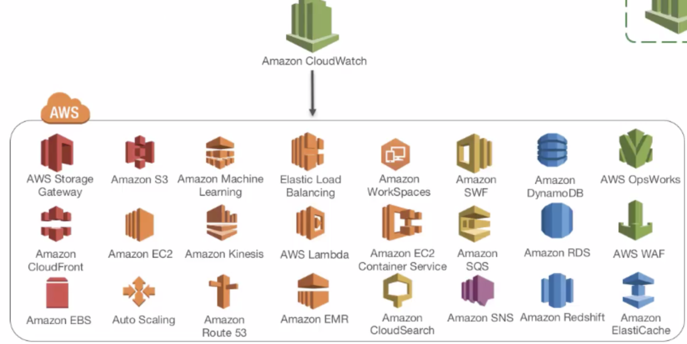

[TOC]


# CloudWatch


## Supported Services




# CloudWatch Insight

If `@message` is

```
I, [2018-12-11T13:20:27] INFO -- : {"method":"GET"}
```

Then you extract the fields like so:

```
fields @timestamp, @message
| parse "I, [*T*] INFO -- : {"method":"*"}" as @date, @time, @method
| filter method=GET
| sort @timestamp desc
| limit 20
```


## message content 

```
{
    "message":"Exception on / [POST]",
    "exc_info":"Traceback (most recent call last):
 File "/opt/bdp/venv/lib/python3.7/site-packages/flask/app.py", line 1813, in full_dispatch_request
 rv = self.dispatch_request()
 File "/opt/bdp/venv/lib/python3.7/site-packages/flask/app.py", line 1799, in dispatch_request
 return self.view_functions[rule.endpoint](**req.view_args)
 File "/opt/bdp/venv/lib/python3.7/site-packages/flask_restful/__init__.py", line 458, in wrapper
 resp = resource(*args, **kwargs)
 File "/opt/bdp/venv/lib/python3.7/site-packages/flask/views.py", line 88, in view
 return self.dispatch_request(*args, **kwargs)
 File "/opt/bdp/venv/lib/python3.7/site-packages/flask_restful/__init__.py",  has no attribute 'get'"
}
```


```
fields @timestamp, @message
| parse @message '{"message": *' as @content
| filter @content like 'Traceback'
| sort @timestamp desc
| limit 10
```


## like or

```
fields @timestamp, @message
| filter (@message like 'error' or @message like 'Error' or @message like 'Exception' or @message like 'exception')
| sort @timestamp desc
```


## not like

```
fields @timestamp, @message
| filter (@message not like 'error')
| sort @timestamp desc
```


# Alarm

## Datapoints to alarm

When you configure **Evaluation Periods** and **Datapoints to Alarm** as different values, you're setting an "M out of N" alarm. **Datapoints to Alarm** is ("M") and **Evaluation Periods** is ("N"). The evaluation interval is the number of data points multiplied by the period. 

For example, if you configure 4 out of 5 data points with a period of 1 minute, the evaluation interval is 5 minutes. If you configure 3 out of 3 data points with a period of 10 minutes, the evaluation interval is 30 minutes


