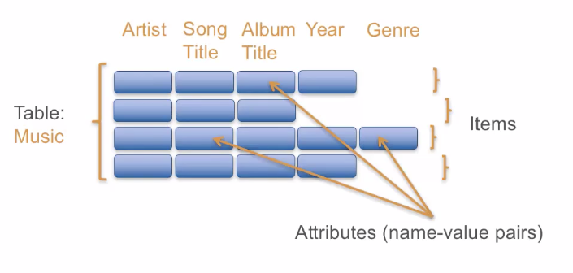
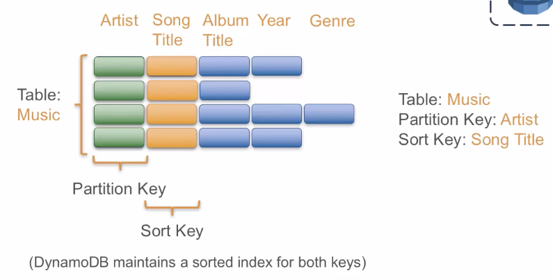
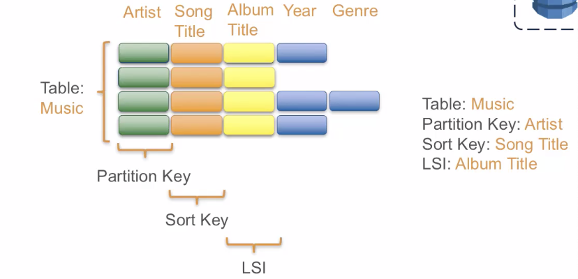
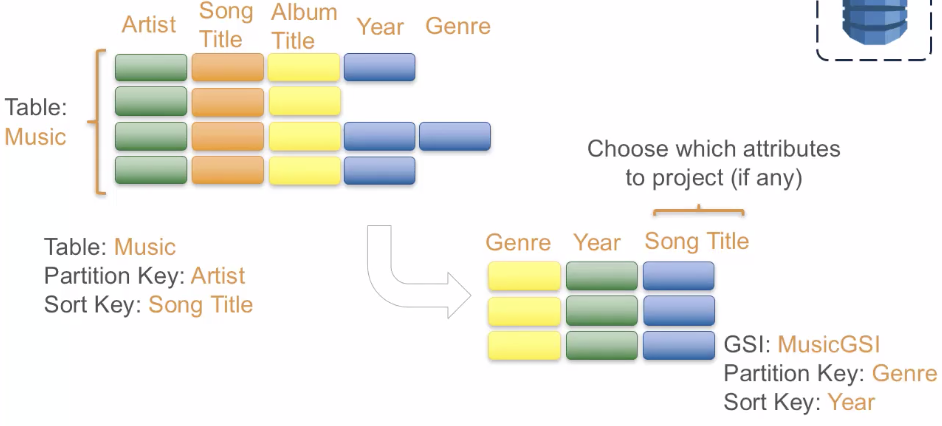
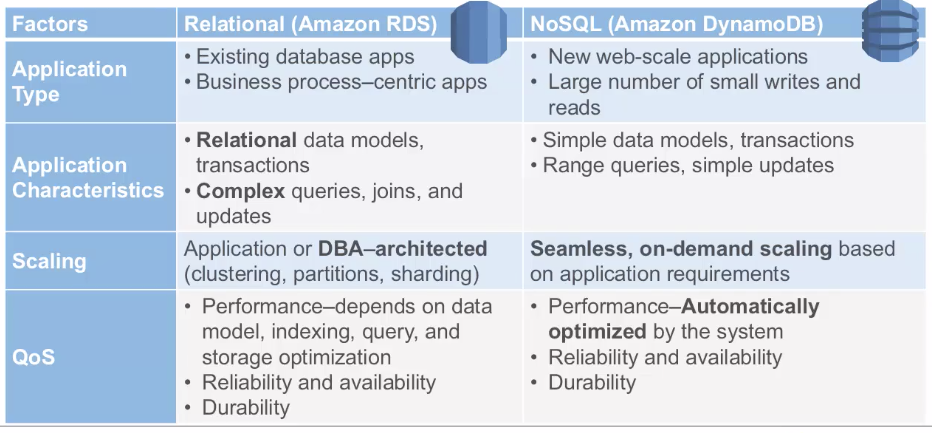

[TOC]

# DynamoDB

Data stored on SSD

Automatically replicate across multiple AZs


文档和键值对nosql，适合广告，游戏，IOT


限制在单独的AWS region

3个独立的location 复制数据（同一个表到多个region）


## Characteristic

Store any amount of data with no limits

Fast, predictable performance using SSDs

Easily provision and change the request capacity needed for each table

Fully managed, NoSQL database service


## Data Model




Table is collection of items

items is collection of attributes

Each attribute is name-value pairs, which contains single values, json or set values.


### Primary keys

Primary keys is unique identity of each items in the table




### Local Secondary Index




### Global Secondary Index




## RDS vs DynamoDB




# AWS cli


## `--scan-filter`

## Use *FilterExpression* Instead

Suppose you wanted to scan the *Music* table and apply a condition to the matching items. You could use a `Scan` request with a `ScanFilter` parameter, as in this AWS CLI example:

```
aws dynamodb scan \
    --table-name Music \
    --scan-filter '{
        "Genre":{
            "AttributeValueList":[ {"S":"Rock"} ],
            "ComparisonOperator": "EQ"
        }
    }'
```

```
aws --region us-east-1 dynamodb scan --table-name Rick_workflow --scan-filter '{"registered_at": {"AttributeValueList":[{"S": "2020-"}], "ComparisonOperator": "BEGINS_WITH"}}'
```


But you could use a `FilterExpression` instead:

```
aws dynamodb scan \
    --table-name Music \
    --filter-expression 'Genre = :g' \
    --expression-attribute-values '{
        ":g": {"S":"Rock"} 
    }'
```


