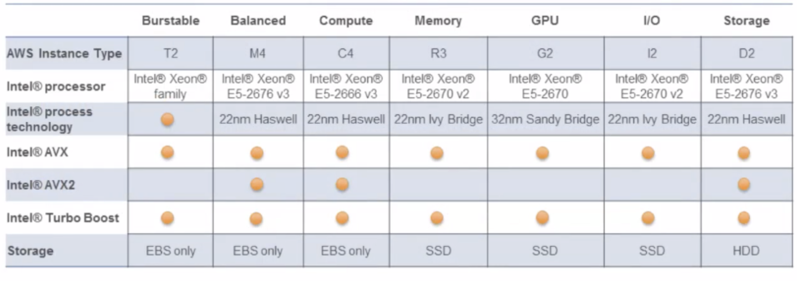
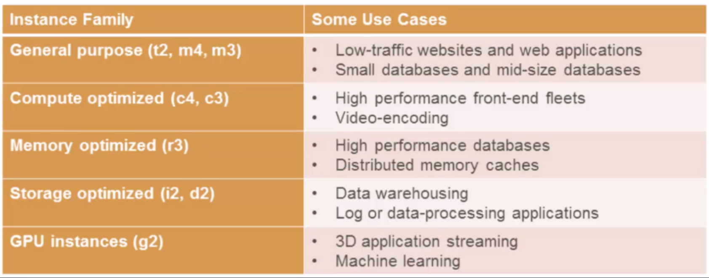
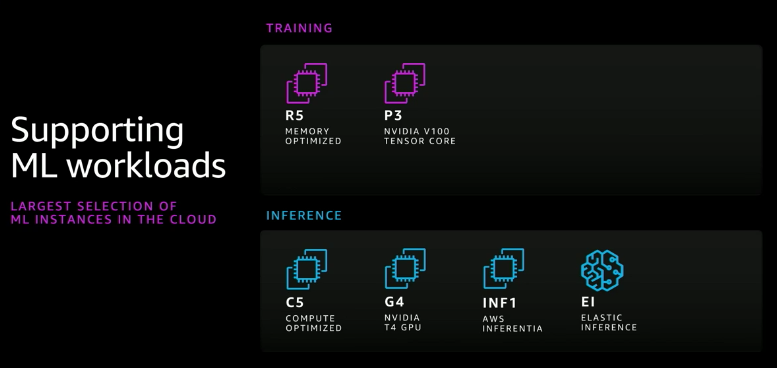
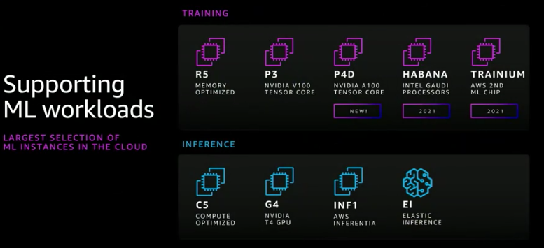
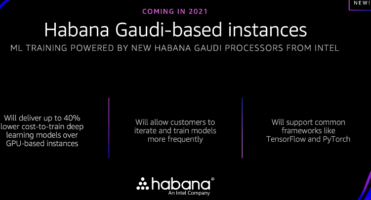
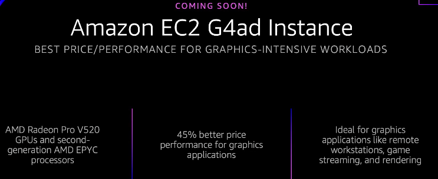
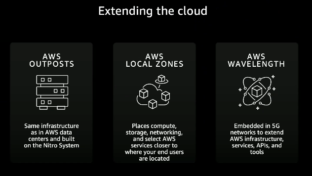
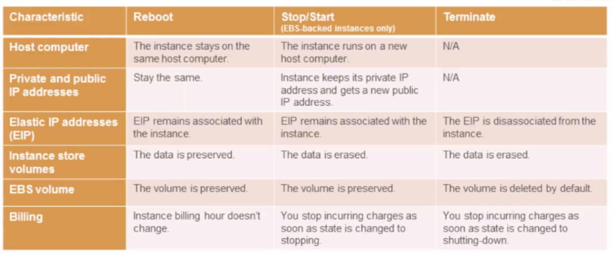
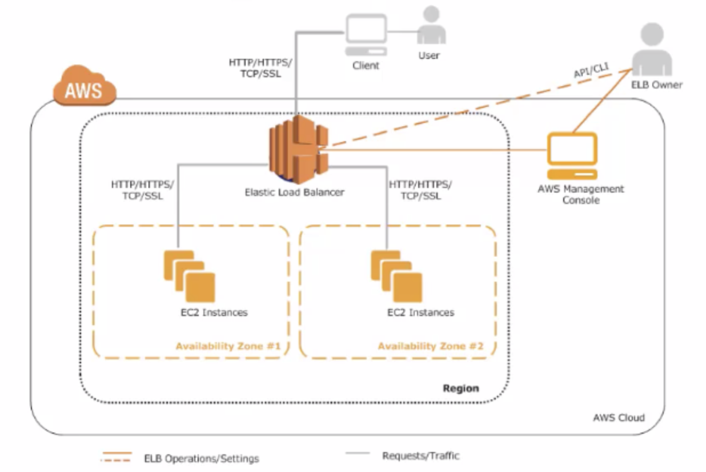
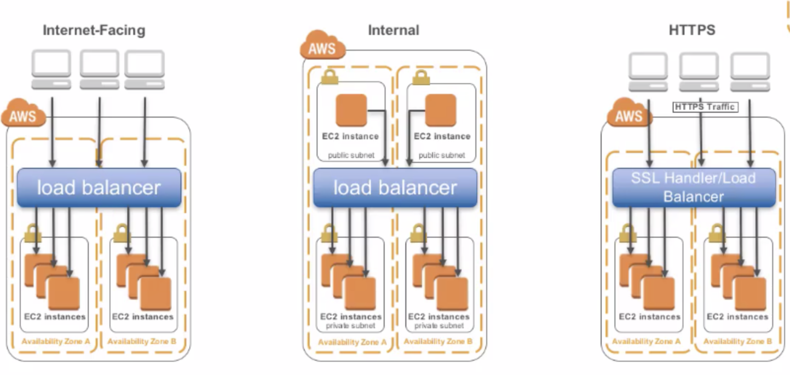

[TOC]


# Elastic Compute Cloud

Deploy across AWS Regions and Availablity Zones for reliability


## Characteristic

All data is automatically deleted when an EC2 instance stops, fails or is terminated

## Launch 

Can be launch from a pre-configured Amazon Machine Image (AMI)


### User data

In Advanced Details, here we could input below data for bootstrap

```
#!/bin/bash
yum -y install httpd
systemctl start httpd 
if [ ! -f /var/www/html/lab2-app.tar.gz ]; then 
cd /var/www/html
wget https://us-west-2-aws-training.s3.amazonaws.com/awsu-ilt/AWS-100-ESS/v4.1/lab-2-configure-website-datastore/scripts/lab2-app.tar.gz

tar xvfz lab2-app.tar.gz
chown apache:root /var/www/html/rds.config.php
fi
```


query user-data info

```
curl http://169.254.169.254/latest/user-data
```


### Metadata Service

e.g.

```
http://169.254.169.254/latest/meta-data/iam/security-credentials/rolename
```


## Instance Technologies




## Current Generation Instances










### Habana instances




## AMD instance 




## Extending the cloud



## Reboot vs Stop vs Terminate 




# Auto-scaling


## Launch configurations

Specify below info when launch a instance

```
AMI ID
Instance type
Key pair
Security groups
Block deivce mapping
User data
```





## Load Balancer Types




# EC2 Spot Instance

EC2 Spot 是 AWS服务中的可用空闲计算容量。与按需实例的价格相比，这类实例可提供超低折扣

可在预算相同的情况下将应用程序的吞吐量提高到10倍。您只需在启动 EC2 实例时选择“Spot”，即可节省按需实例价格的 90%；


The Spot price of each instance type in each Availability Zone is set by Amazon EC2, and adjusted gradually based on the long-term supply of and demand for Spot Instances. 

按需实例和 Spot 实例的唯一区别在于，当 EC2 需要更多容量时，它会发出两分钟的通知继而中断 Spot 实例

EC2 Spot 还可与其他 AWS 产品紧密集成，包括 EMR、Auto Scaling、Elastic Container Service (ECS)、CloudFormation等，让您可以灵活选择如何启动和维护 Spot 实例上运行的应用程序


## 购买

Spot实例的现货价格根据供需情况定期变化

价格将根据供需关系确定（不超过按需实例价格）；用户也可以设置一个最高价，当设置的最高价高于当前现货价格的期间内运行此类实例。

现货价格 – Spot 实例当前的每小时市场价格，该价格由 Amazon EC2 根据执行的最后出价设置


## Spot 实例池 Spot Instance Pool

一组未使用的 EC2 实例，具有相同的实例类型、操作系统、可用区,和网络平台


## Spot队列  Spot Fleet

一组基于指定条件启动的 Spot 实例。 

Spot 队列会选择满足您的需要的 Spot 实例池，并启动 Spot 实例以满足队列的目标容量。

默认情况下，在队列中的 Spot 实例终止之后，系统会启动替代实例以维持 Spot 队列的目标容量。您可以将 Spot 队列作为一次性请求来提交，这种请求在实例终止后不会被保留。


## Spot blocks

Spot Instances with a specified duration, which are designed not to be interrupted and will run continuously for the duration you select

 In rare situations, Spot blocks may be interrupted due to Amazon EC2 capacity needs. 


## 中断

用户可以通过EC2的元数据中instance-action条目获取到该实例的状态，可以按如下方式检索它：

```
curl http://169.254.169.254/latest/meta-data/spot/instance-action
```

instance-action 项目指定操作 (停止或终止) 和操作发生的大致时间 (用 UTC 表示)。以下示例指示将停止此实例的时间：

```
{"action": "stop", "time": "2017-09-18T08:22:00"}
```

以下示例指示将终止此实例的时间：

```
{"action": "terminate", "time": "2017-09-18T08:22:00"}
```


# Pricing plans


## On-demand

We already covered this in the beginning. When you use on-demand pricing, you **pay by the hour** or **by the second** without pre-paying for anything. If you’re just testing AWS and don’t want to commit, this is the way to go.

**Advantages**

- The most flexible pricing option.
- No upfront payments.
- Great for unpredictable workloads.

**Disadvantages**

- The most expensive pricing option.
- Bills can get out of control quickly.


## Spot Instances

A company of AWS’s scale will always have space computing capacity available. That’s where Spot Instances come in. They’re up to **90% cheaper** because you’re occupying this spare capacity that’s otherwise just losing money.

Think of Spot Instances as an airline offering huge discounts for their last remaining seats. Only with Spot Instances, you can get bounced out of the airplane (your instance can be terminated) with a **2-minute** notice if someone else comes along and pays more than you.

There’s an incredible amount of value in using Spot Instances if you know what you’re doing.

However, if you’re just starting out, I recommend sticking to the most narrow and risk-free use case – **workloads that won’t affect your business directly when terminated**.

**Advantages**

- Offer the largest possible costs-savings.
- Perfect for getting spare compute capacity and scaling quickly.
- AWS offers a Hybernate option that saves your instance in the same state and relaunches it when spare capacity becomes available again.
- You get a 2-minute warning before the instance is terminated.

**Disadvantages**

- Your instance can get terminated at any time.
- Really difficult to use the right way.


## Reserved Instances

Reserved Instances (RIs) are a good way to save money by committing to use AWS for the next 1-3 years.

As the name suggests, you reserve instances and you pay for them **regardless of your usage**. Because you’ve committed to using AWS you get a discount.

There are also different ways you can pay for your reserved instances, which I already went over – No Upfront, Partial Upfront and All Upfront. **The more you pay upfront, the larger the discount.**

Besides Standard RIs, you can also purchase **Convertible RIs**. These come with the option to change the instance you’ve reserved to another type.

With Covertible RIs, you’re only committing to a specific region for a given period. You still have to choose an instance family, but you can change it whenever you need to. This, of course, makes them more expensive than standard RIs.

**Advantages**

- Less difficult to set up and maintain than Spot Instances
- Great cost-savings.

**Disadvantages**

- Once you rack up a lot of instances, RIs become a pain to manage.
- Choosing the perfect instance family can get confusing. Just check out the [Instance Type Page](https://aws.amazon.com/ec2/instance-types/).
- You pay for the reserved capacity regardless of your usage.
- Savings Plans are a better option for most and will probably spell the end for RIs.

There are lots of companies that built their business models on purchasing and managing RIs for their clients. That should tell you RIs are not easy to maintain, especially at scale.

If you’re starting today and you haven’t reserved any instances, Savings Plan are the way to go.


## Savings Plans (suggestion)

Savings Plans were announced in 2019 as a new, simpler way to operate on AWS.

With Savings Plans, you commit to a level of **compute usage measured in $ per hour** for a 1 or 3-year term. The savings discount is applied to all usage up to that level. Everything above that level is on-demand.

The key here is that you aren’t going over a thousand different instance types and wondering which one to choose.

**Savings Plans effectively remove most of the effort that goes into managing RIs**.

There are 2 types of Savings Plans – **EC2** and **Compute**. They’re quite similar but have 3 main differences you need to know:

1. Compute Savings Plans aren’t tied to a region or an instance family while EC2 Savings Plans are.
2. Compute Savings Plans support Fargate, meaning you can transition between EC2 and [Fargate](https://aws.amazon.com/fargate/) with your Savings Plan being applied continuously.
3. Compute Savings Plans offer a smaller discount because they’re more flexible.

**Advantages**

- The best possible combination of flexibility, simplicity and price.

**Disadvantages**

- Still relatively new and you can only use them in a limited number of ways.
- You pay a fixed amount regardless of your usage.


## Dedicated Hosts

Finally, Dedicated Hosts are physical servers that you rent. You get an **entire device just for you** and AWS takes care of administrative tasks like cleaning and maintaining the hardware.

The other models also give you your own piece of the cloud but on a software level. A Dedicated Host does that on a hardware level.

**Advantages**

- The most secure and reliable way to run on AWS since no one else can use the hardware you’re using.

**Disadvantages**

- Super expensive.


# pricing example


We choose a Linux c5d instance with **2 vCPUs, 4 GiB of memory and Instance Storage of** **1 x 50 NVMe SSD (in GiB)**. We decide to use 3 of these instances in the us-east-1 region.

| **Instance name** | **On-Demand hourly rate** | **vCPU** | **Memory** | **Storage**     | **Network performance** |
| :---------------- | :------------------------ | :------- | :--------- | :-------------- | :---------------------- |
| c5d.large         | $0.096                    | 2        | 4 GiB      | 1 x 50 NVMe SSD | Up to 10 Gigabit        |


|                Volume Type                 |                            Price                             |
| :----------------------------------------: | :----------------------------------------------------------: |
|  **General Purpose SSD (gp3) - Storage**   |                        $0.08/GB-month                        |
|    **General Purpose SSD (gp3) - IOPS**    | 3,000 IOPS free and $0.005/provisioned IOPS-month over 3,000 |
| **General Purpose SSD (gp3) - Throughput** |   125 MB/s free and $0.04/provisioned MB/s-month over 125    |
|   **General Purpose SSD (gp2) Volumes**    |          $0.10 per GB-month of provisioned storage           |
|  **Provisioned IOPS SSD (io2) - Storage**  |                       $0.125/GB-month                        |
|   **Provisioned IOPS SSD (io2) - IOPS**    |       $0.065/provisioned IOPS-month up to 32,000 IOPS        |
|                                            |   $0.046/provisioned IOPS-month from 32,001 to 64,000 IOPS   |
|                                            | $0.032/provisioned IOPS-month for greater than 64,000 IOPS†  |
|   **Provisioned IOPS SSD (io1) Volumes**   | $0.125 per GB-month of provisioned storage AND $0.065 per provisioned IOPS-month |
| **Throughput Optimized HDD (st1) Volumes** |          $0.045 per GB-month of provisioned storage          |
|         **Cold HDD (sc1) Volumes**         |          $0.015 per GB-month of provisioned storage          |


Effective February 1, 2010, pricing for data transferred out of [Amazon EC2](http://aws.amazon.com/ec2), [Amazon S3](http://aws.amazon.com/s3), [Amazon SimpleDB](http://aws.amazon.com/sdb), [Amazon SQS](http://aws.amazon.com/sqs), [Amazon RDS](http://aws.amazon.com/rds), and [Amazon VPC](http://aws.amazon.com/vpc) will change as follows:

| **Level**             | **Old Price** | **New Price** |
| --------------------- | ------------- | ------------- |
| First 10 TB per month | $0.17/GB      | $0.15/GB      |
| Next 40 TB per month  | $0.13         | $0.11         |
| Next 100 TB per month | $0.11         | $0.09         |
| Over 150 TB per month | $0.10         | $0.08         |


```
In [13]: 3*(((30*24)*0.096) + (0.08*50))
Out[13]: 219.36
```


The total monthly costs for each pricing model (with a 1-year commitment for RIs and Savings Plans and no upfront payments) would look like this

| Pricing Model         | Monthly Cost (Including EBS Storage) |
| :-------------------- | :----------------------------------- |
| On-demand             | 220.14 $                             |
| Standard RIs          | 143.49 $                             |
| Convertible RIs       | 163.20 $                             |
| EC2 Savings Plans     | 174.15 $                             |
| Compute Savings Plans | 188.34 $                             |


As you can see, On-demand is the most expensive option. Standard RIs are the cheapest option because they provide less flexibility. Savings Plans are a bit more costly than RIs because they’re easier to use and more flexible.


# Appendix

https://rnd-solutions.net/2020/01/17/aws-pricing-in-2020-overview-principles-and-examples/


