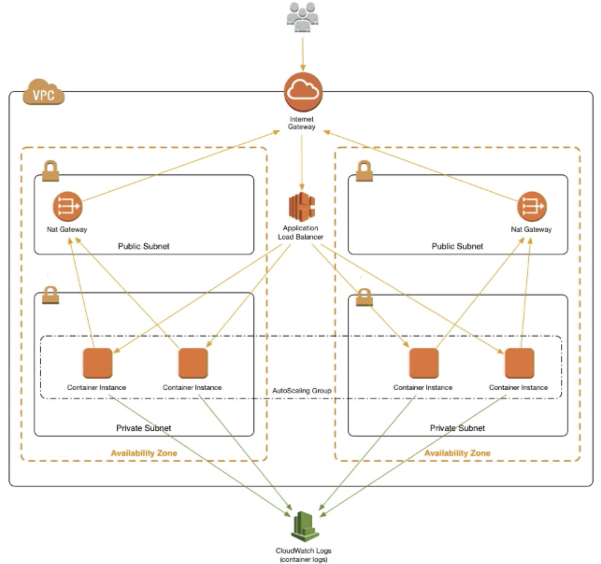
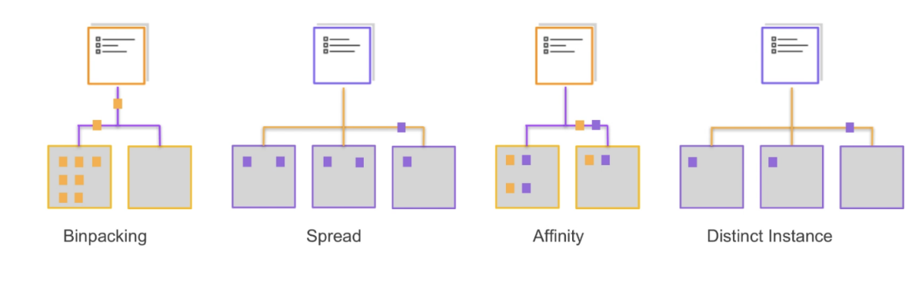

[TOC]


# Elastic Container Service




## Task

Defines work to be done

Defines everything about the environment where it runs

Placed wherever resources are available

Tasks are immutable, which cannot be changed

Only copy operation can change a task


### Life Cycle

```
Pending -> Running -> Stopped
```


### Scheduled Tasks

Like a super cron

Scheduled through CloudWatch

Scheduled through other services

Started by lambda tasks


### Create a task through cli

```
{
  "containerDefinitions": [
    {
        "name": "hello-server",
        "image": "nginx",
        "cpu": 384,
        "memory": 384,
        "essential": true,
        "portMappings": [
            {
                "containerPort": 80,
                "hostPort": 0,
                "protocol": "tcp"
            }
        ]
    }
  ],
  "family": "hello-server"
}
```


```
$ aws ecs register-task-definition --cli-input-json file://basic-task.json  --region us-east-1
{
    "taskDefinition": {
        "status": "ACTIVE",
        "family": "hello-server",
        "placementConstraints": [],
        "compatibilities": [
            "EC2"
        ],
        "volumes": [],
        "taskDefinitionArn": "arn:aws:ecs:us-east-1:193160586263:task-definition/hello-server:1",
        "containerDefinitions": [
            {
                "environment": [],
                "name": "hello-server",
                "mountPoints": [],
                "image": "nginx",
                "cpu": 384,
                "portMappings": [
                    {
                        "protocol": "tcp",
                        "containerPort": 80,
                        "hostPort": 0
                    }
                ],
                "memory": 384,
                "essential": true,
                "volumesFrom": []
            }
        ],
        "revision": 1
    }
}


$ aws ecs list-task-definitions --region us-east-1
{
    "taskDefinitionArns": [
        "arn:aws:ecs:us-east-1:193160586263:task-definition/hello-server:1",
        "arn:aws:ecs:us-east-1:193160586263:task-definition/my-data-server:1",
        "arn:aws:ecs:us-east-1:193160586263:task-definition/my-data-server:2",
        "arn:aws:ecs:us-east-1:193160586263:task-definition/my-data-server:3",
        "arn:aws:ecs:us-east-1:193160586263:task-definition/web-test:1"
    ]
}
```


## Services (管理Tasks)

Supervisors of tasks

Keep a group of tasks running

One task per service

Publish statistics and keep history


### Launch Type

Fargate Launch Type

The Fargate launch type allows you to run your containerized applications without the need to provision and manage the backend infrastructure. Just register your task definition and Fargate launches the container for you.


EC2 Launch Type

The EC2 launch type allows you to run your containerized applications on a cluster of Amazon EC2 instances that you manage.


## Auto Scaling Groups

A service that starts instances for you

Start identical copies from a template

Tries to maintain the proper number of healthy instances

There are usually controlled by another service called ASG


## Local Balancers 

ELBs

Data dispatchers for internet-facing relays

Use CloudWatch to monitor the load

Send grow and shrink signals to ASGs


## Cluster

Logical group of EC2 instances that you can place containers onto


# Task Placement Engine

支持多种容器任务调度策略




Binpacking：最少资源利用（根据 CPU 或者内存）的实例会优先被放置， 这种策略会先将任务放到可用资源最少的实例上，减少了启动过多的实例， 提高了资源利用率。 


Spread：根据某个特定值进行平衡放置，这个特定值可以是一个键值对， 也可以是 instanceId 或者 host。一般可使用这种策略实现跨 AZ 的任务放 置。 


Affinity：组合条件的放置策略，比如两个符合条件的 task 不能同时放到某 个实例中，或者两个符合条件的 task 必须同时放到某个实例中。 


Distinct Instance：将每项任务放置在不同的容器实例中。


# ecs-agent

The Amazon ECS Container Agent is a component of Amazon Elastic Container Service ([Amazon ECS](http://aws.amazon.com/ecs/)) and is responsible for managing containers on behalf of Amazon ECS.

[https://github.com/aws/amazon-ecs-agent](https://github.com/aws/amazon-ecs-agent)


Manages the state of containers on a single Ec2 instance

How ECS communicates with the docker daemon on the EC2 instance

Must be on every EC2 instance in your ECS Cluster

Included with the ECS-OPTIMIZED AMI


## Installation

```
yum -y install ecs-init
service docker start
start ecs
```


watch agent logs

```
tail -f /var/log/ecs/ecs-agent.log.2019-06-26-02
```


```
# docker ps
CONTAINER ID        IMAGE                                                COMMAND                  CREATED             STATUS              PORTS                   NAMES
e227b57f9ade        amazon/amazon-ecs-agent:latest                       "/agent"                 4 minutes ago       Up 4 minutes                                ecs-agent
e05b4c8e247c        193160586263.dkr.ecr.us-east-1.amazonaws.com/nginx   "nginx -g 'daemon of…"   About an hour ago   Up About an hour    0.0.0.0:32768->80/tcp   ecs-web-test-1-web-test-8c8ac4ec95d4d6af2400
```


# ecs-refarch-cloudformation

A reference architecture for deploying containerized microservices with Amazon ECS and AWS CloudFormation (YAML)

[https://github.com/aws-samples/ecs-refarch-cloudformation](https://github.com/aws-samples/ecs-refarch-cloudformation)


