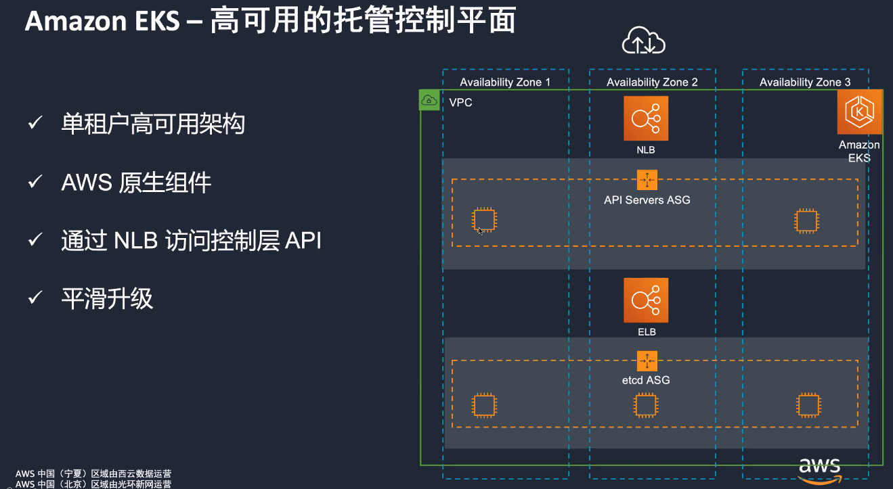
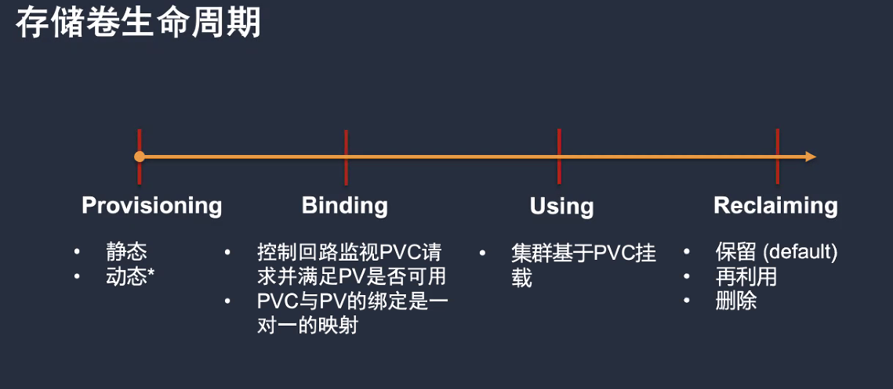

[toc]


# 容器服务


# EKS


## 架构组件





## Compute nodes comparison


## Maintenance


## Service Level Agreement

```
master == 99.95%
```


# Network


## Amazon VPC CNI


## Pod security group (推荐)


## Network policy

EKS 兼容 Network policy

Network policy是allow list


## Ingress 暴露服务


> Mode instance node port 有限制，3200-33000
>
> Mode IP 没有node port 限制， 推荐使用


### NLB

适用自定义的协议和端口

只能做单纯的转发


### ALB

支持ALB可以做的很多事情


### Ingress Group （复用ALB）


### TLS加密

ALB无法通过一本证书通过https连到后面的pod，如果需要只能通过NLB实现


# Cluster

## worker node scale in/out


## Cluster Autoscaler


## CA + HPA


### handle spot node

```
https://github.com/aws/aws-node-termination-handler
```


# Pod

## Horizontal Pod Autoscaler (HPA)


## Vertical Pod Autoscaler (VPA)

VPA监控所有的pod，去收集数据，升级container配置的推荐值，防止OOM

目前，VPA不能在运行的pod，应用pod的变更


# Storage


## Container Storage Interface (CSI)


## PV/PVC/StorageClass


## 生命周期




# Workload Scaling


# ECR


# Tools

## Eks best practices

https://aws.github.io/aws-eks-best-practices/


## EKS workshop

https://www.eksworkshop.com/010_introduction/


