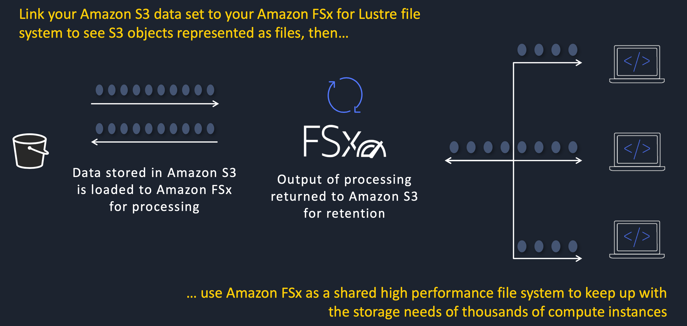
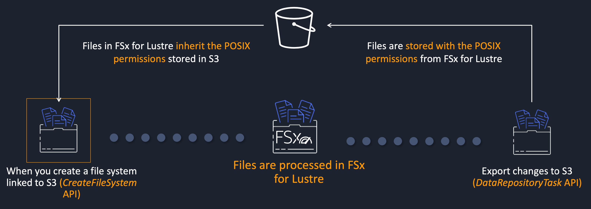
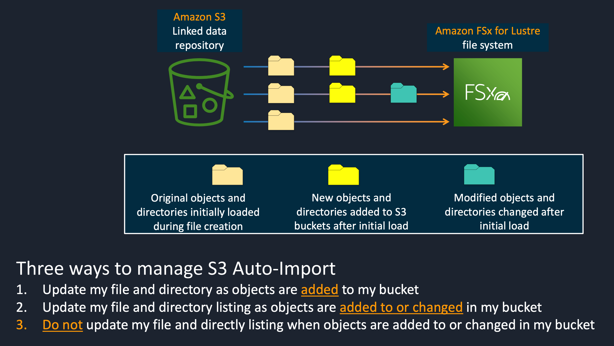

[toc]

# Amazon FSx for Lustre

## advantages

Massively scalable performance

Native file system interface

Seamless access to your data repositories (s3)

Cost-optimized for compute-intensive workloads

Simple and fully managed

Secure and compliant

## S3 object

FSx for Lustre provides a high-performance file interface for S3 objects

Preserve POSIX metadata across Amazon FSx and S3

### Auto-Import with S3 and FSx for Lustre

