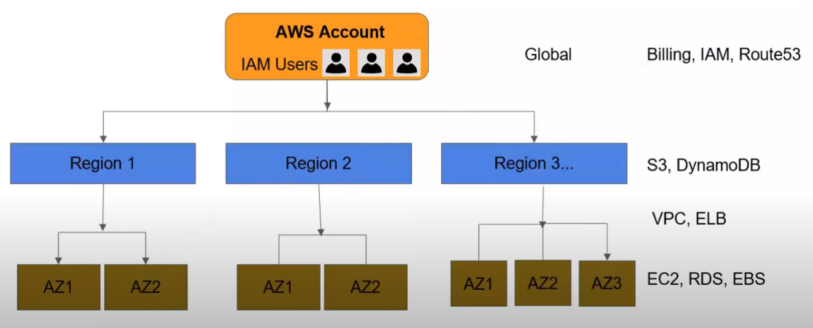
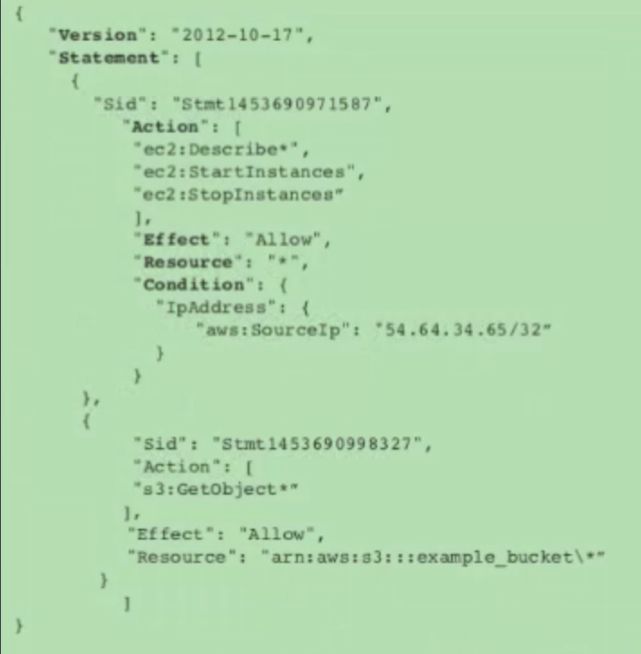

[TOC]


# Identity Access Management

Control of the access and permissions

Top control for AWS 




## Policy Elements




## Temporary Security Credentials

Known as AWS STS

15 mins to 36 hours


## Roles

Similar to a user

Assumed by resources requiring the role 

No login credentials

No direct static access keys associated

Allow temporary security credentials

An alternative to credential sharing

No need to define permissions and manage on each entity

Use case: Third-party vendor account access

AWS resource can be launched into roles


# policy generator

https://awspolicygen.s3.amazonaws.com/policygen.html


# Service Authorization Reference

https://docs.aws.amazon.com/iam/index.html


# example

## Non-office ip

```
{
    "Version": "2012-10-17",
    "Statement": {
        "Effect": "Deny",
        "Action": "*",
        "Resource": "*",
        "Condition": {
            "NotIpAddress": {
                "aws:SourceIp": [
                    "192.0.2.0/24",
                    "203.0.113.0/24"
                ]
            },
            "Bool": {"aws:ViaAWSService": "false"}
        }
    }
}
```

