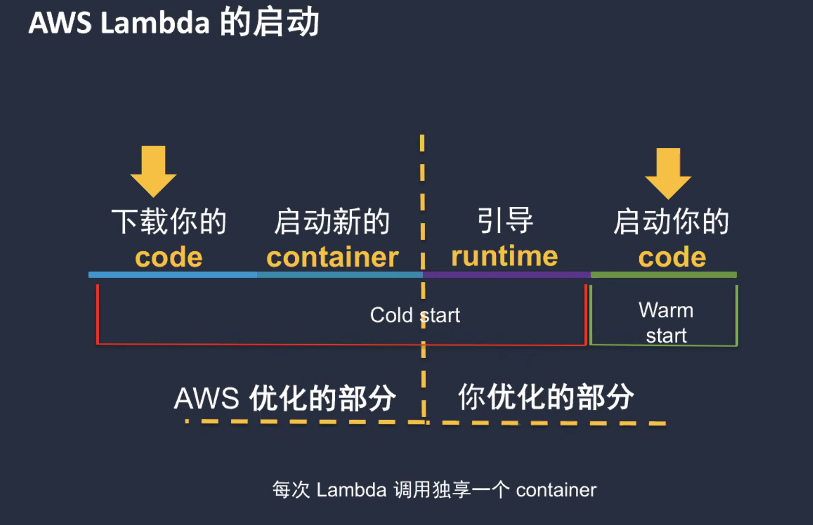

[TOC]


# Lambda

Just specific coded functions are running only when are needed and without any knowledge of the servers or OS or the language runtime configuration

AWS Lambda enables developers to write code functions that only contain what their logic requires and have their code be deployed, invoked, made highly reliable, and scaled without having to manage infrastructure whatsoever. 


## Components

### The Function

Event handler

IAM role

Compute amount

Execution timeout


### Event source

S3

DynamoDB

SNS

Kinesis

Gateway API


## Lambda限制


## 处理指标


## 环境变量引用


## 开发工具

### SAM


### AWS CDK


# 原理


## 启动




## 优化


# 调用


## 同步


### HTTP API

只是简单的http 调用


### HTTP API vs REST API


## 异步


### API GW


## 流式


### 增强


# SQS 触发Lambda


# 解藕


# lambda 并发


## 原理


## 并发上升


## 并发扩展


## 提高并发限制


## 预配置并发


## auto scaling


# Lambda 层


## layer打包

基于ec2

https://docs.aws.amazon.com/lambda/latest/dg/lambda-runtimes.html


基于docker

```
docker run -v "$PWD":/var/task "lambci/lambda:build-python3.7" /bin/sh -c "pip install psycopg2-binary -t python/lib/python3.7/site-packages/; exit"
```


```
zip -r9 mypythonlibs.zip python > /dev/null
```


```
aws lambda publish-layer-version --layer-name mypythonlibs --description "My python libs" --zip-file fileb://mypythonlibs.zip --compatible-runtimes "python2.7" "python3.6" "python3.7"

aws lambda update-function-configuration --layers arn:aws:lambda:us-east-2:123456789012:layer:mypythonlibs:1 --function-name my-function
```


You can also use the lambci/lambda Docker images directly for your Lambda package, without creating a layer. Run the following command to get the required versions of your dependencies:

**Note:** Replace **3.6** with **3.7** or **3.8** depending on the compatible libraries that you want to install.

```plainText
docker run -v "$PWD":/var/task "lambci/lambda:build-python3.6" /bin/sh -c "pip install -r requirements.txt -t libs; exit"
```


# example


## lambda to rds

https://aws.amazon.com/blogs/database/query-your-aws-database-from-your-serverless-application/


