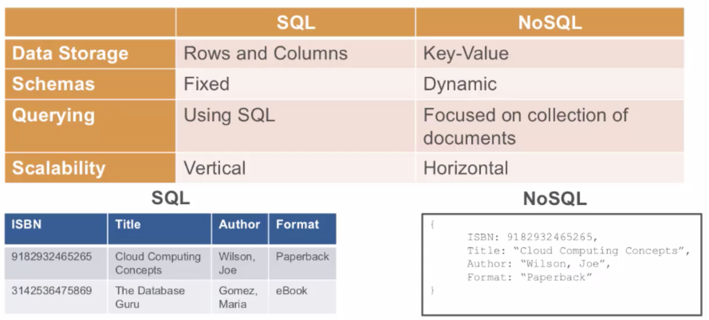
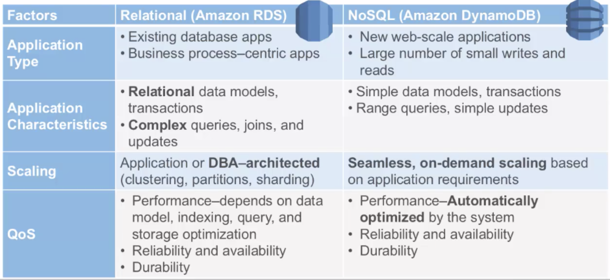
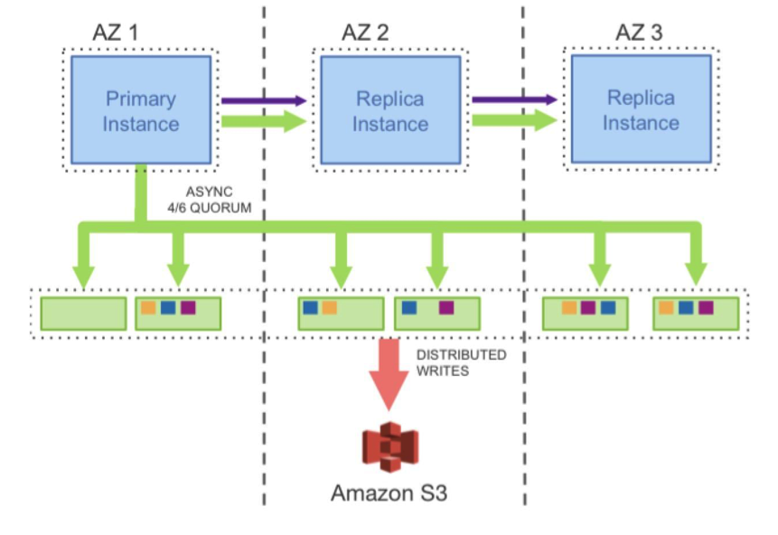
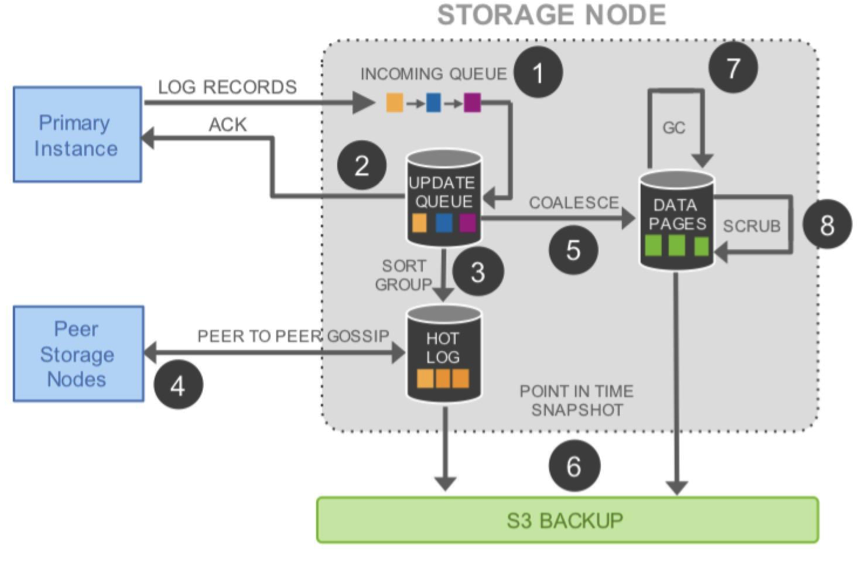
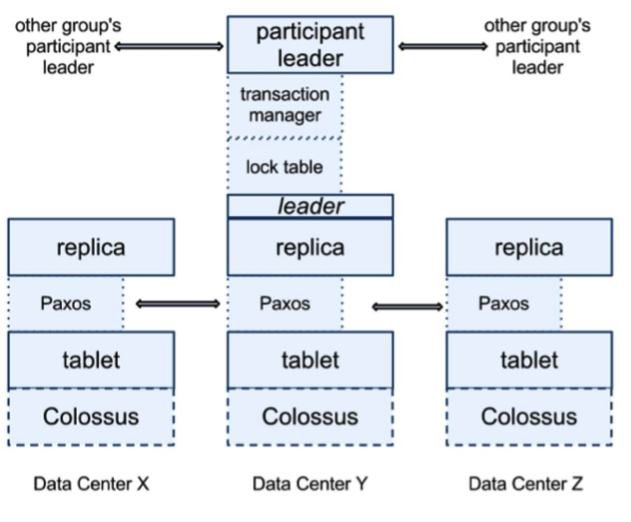
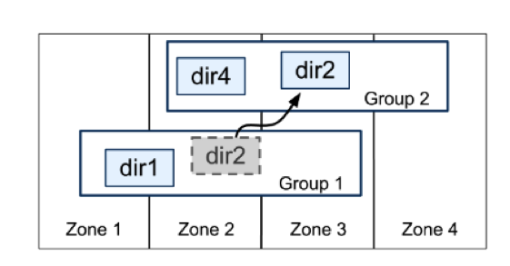

[TOC]

# Relational Database Service

关系型数据库，mysql/postgres为主，可管理，性能可预测（花钱买），无缝集成ec2（低延迟连接）

5 Read Replicas for MySQL and Postgres SQL

异步复制数据

## SQL vs NoSQL

## DB Instances

Isolated database env

Can contain mulple user created databases

Backups works are enabled by default

Restore your database to a point in time

## RDS Security

Run DB instance in a VPC

Use IAM policies for accessing 

Use Security groups

Use SSL connection

# Aurora

一篇是 AWS Aurora 的论文 [Amazon Aurora: Design Considerations for High Throughput Cloud –Native Relation Databases](http://www.allthingsdistributed.com/files/p1041-verbitski.pdf)。

Aurora 是 AWS 将 MySQL 的计算和存储分离后，计算节点 scale up，存储节点 scale out。并把其 redo log 独立设计成一个存储服务，把分布式的数据方面的东西全部甩给了底层存储系统。从而提高了整体的吞吐量和水平的扩展能力。

Aurora 要写 6 份拷贝，但是其只需要把一个 Quorum 中的日志写成功就可以了。如下所示。可以看到，将存储服务做成一个跨数据中心的服务，提高数据库容灾，降低性能影响。

对于存储服务的设计，核心的原理就是 latency 一定要低，毕竟写 6 个 copy 是一件开销很大的事。所以，基本上来说，Aurora 用的是异步模型，然后拼命地做并行处理，其中用到的也是 Gossip 协议。如下所示。

在上面这个图中，我们可以看到，完成前两步，就可以 ACK 回调用方。也就是说，只要数据在本地落地了，就可以返回成功了。然后，对于六个副本，这个 log 会同时发送到 6 个存储结点，只需要有大于 4 个成功 ACK，就算写成功了。第 4 步我们可以看到用的是 Gossip 协议。然后，第 5 步产生 cache 页，便于查询。第 6 步在 S3 做 Snapshot，类似于 Checkpoint。

第二篇比较有代表的论文是 Google 的 [Spanner: Google’s Globally-Distributed Database](http://static.googleusercontent.com/media/research.google.com/zh-CN//archive/spanner-osdi2012.pdf)。
Spanner 是 Google 的全球分布式数据库 Globally-Distributed Database) 。Spanner 的扩展性达到了令人咋舌的全球级，可以扩展到数百万台机器，数以百计的数据中心，上万亿的行。更给力的是，除了夸张的扩展性之外，它还能同时通过同步复制和多版本来满足外部一致性，可用性也是很好的。

下面是 Spanserver 的一个架构。

我们可以看到，每个数据中心都会有一套 Colossus，这是第二代的 GFS。每个机器有 100-1000 个 tablet，也就是相当数据库表中的行集，物理存储就是数据文件。比如，一张表有 2000 行，然后有 20 个 tablet，那么每个 tablet 分别有 100 行数据。

在 tablet 上层通过 Paxos 协议进行分布式跨数据中心的一致性数据同步。Paxos 会选出一个 replica 做 Leader，这个 Leader 的寿命默认是 10s，10s 后重选。Leader 就相当于复制数据的 master，其他 replica 的数据都是从它那里复制的。读请求可以走任意的 replica，但是写请求只有去 Leader。这些 replica 统称为一个 Paxos Group。

Group 之间也有数据交互传输，Google 定义了最小传输复制单元 directory，是一些有共同前缀的 key 记录，这些 key 也有相同的 replica 配置属性。

目前，基于 Spanner 论文的开源实现有两个，一个是 Google 公司自己的人出来做的[CockroachDB](https://github.com/cockroachdb/cockroach)，另一个是国人做的[TiDB](https://github.com/pingcap/tidb)。

[Spanner: Becoming a SQL System](https://static.googleusercontent.com/media/research.google.com/zh-CN//pubs/archive/46103.pdf)

可以预见到，过去的分库分表并通过一个数据访问的代理服务的玩法，应该在不久就会过时就会成为历史。真正的现代化的分布式数据存储就是 Aurora 和 Spanner 这样的方式。

## Multi-master

# Appendix

https://docs.aws.amazon.com/AmazonRDS/latest/AuroraUserGuide/Aurora.AuroraMySQL.Monitoring.Metrics.html#Aurora.AuroraMySQL.Monitoring.Metrics.clusters

6
