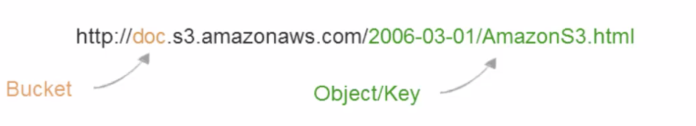
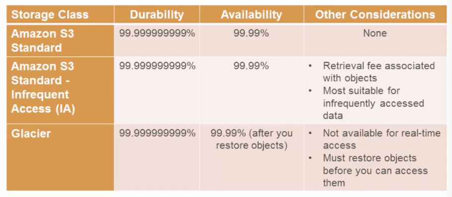
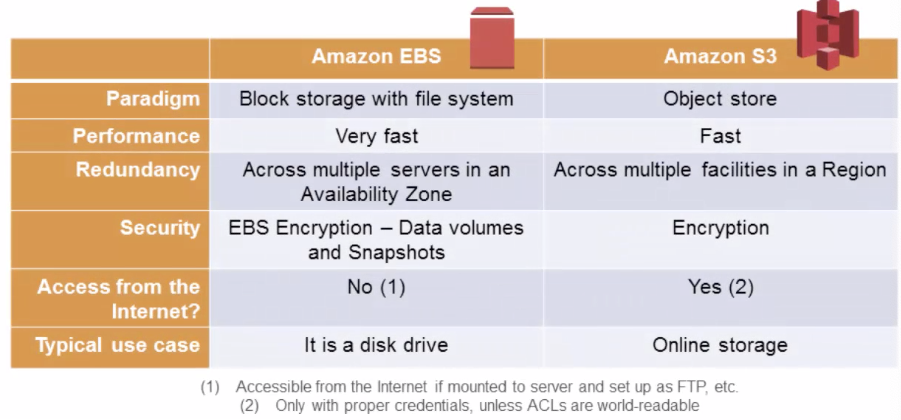
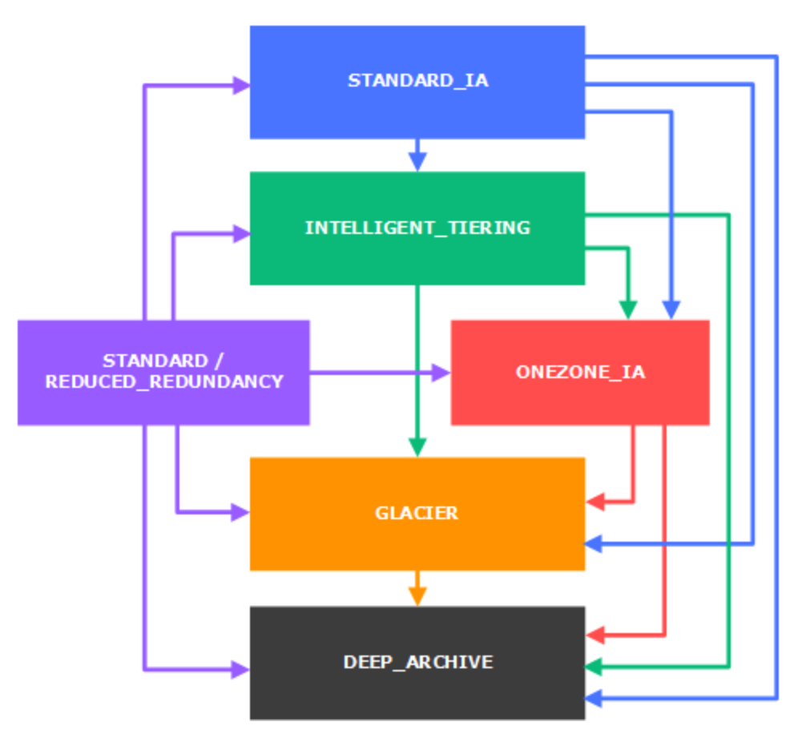
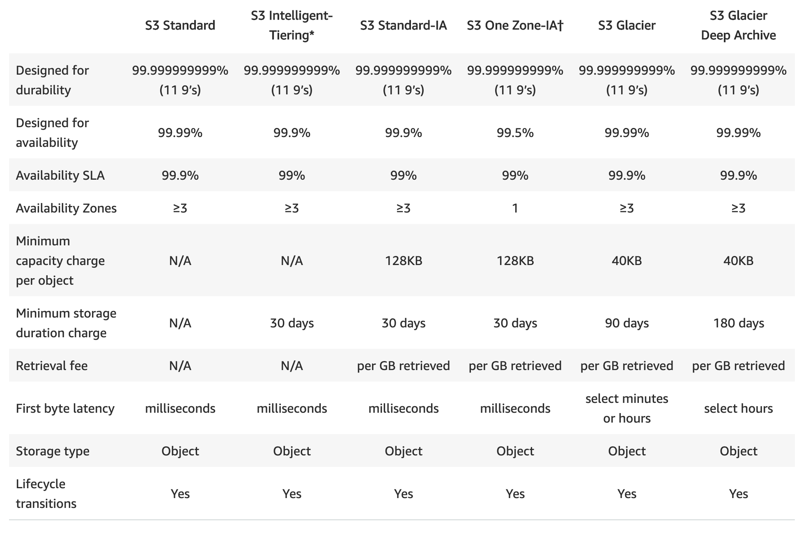

[TOC]


# Simple Storage Service

AWS rates their S3 standard storage class at 99.999999999% durability. Translated into English, this means that if you store, say 10,000 objects with them, one might get lost every 10 million years or so


## Characteristic

Store and retrieve any amount of data, any time from anywhere on the web

Objects up to 5TB no bucket size limit

Estimate monthly bill using the AWS Simple Monthly Calculator


## buckets

Buckets are globally unique containers for everything that you store in S3

The bucket name should be DNS compliance 


## Common Use Scenarios

Storage and Backup 

Application File Hosting

Media Hosting

Software Delivery

Store AMIs and Snapshots


## Object Keys




## Security

Control buckets and objects with Access Control Lists (ACLs), Bucket policies and Identity  and Access Management(IAM) policies

Upload/Download data to S3 with SSL encrypted endpoints


## Storage Classes




## EBS vs S3




# S3 Glacier 

For archiving data

For very infrequently accessed data

Data retrieval time of several hours

Just as durable as S3

Much less cost than S3


# S3 Lifecycle

- The S3 Standard storage class to any other storage class.
- Any storage class to the S3 Glacier or S3 Glacier Deep Archive storage classes.
- The S3 Standard-IA storage class to the S3 Intelligent-Tiering or S3 One Zone-IA storage classes.
- The S3 Intelligent-Tiering storage class to the S3 One Zone-IA storage class.
- The S3 Glacier storage class to the S3 Glacier Deep Archive storage class.




## S3 Standard

S3 Standard offers high durability, availability, and performance object storage for frequently accessed data. Because it delivers low latency and high throughput, S3 Standard is appropriate for a wide variety of use cases, including cloud applications, dynamic websites, content distribution, mobile and gaming applications, and big data analytics.


**Key Features:**

- Low latency and high throughput performance
- Designed for durability of 99.999999999% of objects across multiple Availability Zones
- Resilient against events that impact an entire Availability Zone
- Designed for 99.99% availability over a given year
- Backed with the [Amazon S3 Service Level Agreement](https://aws.amazon.com/s3/sla/) for availability
- Supports SSL for data in transit and encryption of data at rest
- S3 Lifecycle management for automatic migration of objects to other S3 Storage Classes  


## S3 Standard-IA

S3 Standard-IA is for data that is accessed less frequently, but requires rapid access when needed. S3 Standard-IA offers the high durability, high throughput, and low latency of S3 Standard, with a low per GB storage price and per GB retrieval fee. This combination of low cost and high performance make S3 Standard-IA ideal for long-term storage, backups, and as a data store for disaster recovery files. 


**Key Features:**

- Same low latency and high throughput performance of S3 Standard
- Designed for durability of 99.999999999% of objects across multiple Availability Zones
- Resilient against events that impact an entire Availability Zone
- **Data is resilient in the event of one entire Availability Zone destruction**
- Designed for 99.9% availability over a given year
- Backed with the [Amazon S3 Service Level Agreement](https://aws.amazon.com/s3/sla/) for availability
- Supports SSL for data in transit and encryption of data at rest
- S3 Lifecycle management for automatic migration of objects to other S3 Storage Classes


## S3 Glacier

S3 Glacier is a secure, durable, and low-cost storage class for data archiving. You can reliably store any amount of data at costs that are competitive with or cheaper than on-premises solutions. To keep costs low yet suitable for varying needs, S3 Glacier provides three retrieval options that range from a few minutes to hours. 


**Key Features:**

- Designed for durability of 99.999999999% of objects across multiple Availability Zones
- Data is resilient in the event of one entire Availability Zone destruction
- Supports SSL for data in transit and encryption of data at rest
- Low-cost design is ideal for long-term archive
- Configurable retrieval times, from minutes to hours
- S3 PUT API for direct uploads to S3 Glacier, and S3 Lifecycle management for automatic migration of objects


## Performance across the S3 Storage Classes




## Cost considerations

If you are planning to archive infrequently accessed data for a period of months or years, the S3 Glacier and S3 Glacier Deep Archive storage classes can reduce your storage costs. 


# aws s3 cli


## ls 

```
aws s3 ls s3://mybucket --recursive --human-readable --summarize
```


## cp

Using `aws s3 cp` from the [AWS Command-Line Interface (CLI)](http://aws.amazon.com/cli/) will require the `--recursive`parameter to copy multiple files.

```
aws s3 cp s3://myBucket/dir localdir --recursive
```

## 

## sync

The `aws s3 sync` command will, by default, copy a whole directory. It will only copy new/modified files.

```
aws s3 sync s3://mybucket/dir localdir
```


# S3 operation


## etags

Due to the fact that the ETag for a multipart uploaded object is a MD5 hash of the list of MD5 hashes of each part, the value of ETag changes after you perform the COPY operation. 

https://docs.aws.amazon.com/AmazonS3/latest/API/RESTCommonResponseHeaders.html


The entity tag (ETag) is a hash of the object that might not be an MD5 digest of the object data. Whether the ETag is an MD5 digest depends on how the object was created and encrypted. Because the ETag isn't always an MD5 digest, it can't always be used for verifying the integrity of uploaded files.


### verify 

1. Get the base64-encoded MD5 checksum value of the object.

2. Verify the object's integrity during the upload. 


This resolution verifies the integrity of objects using the **Content-MD5** header. If your upload is signed with [AWS Signature Version 4](https://docs.aws.amazon.com/AmazonS3/latest/API/sig-v4-authenticating-requests.html), you need to use the **x-amz-content-sha256** header instead. For more information, see [Does the AWS CLI validate checksums?](https://docs.aws.amazon.com/cli/latest/topic/s3-faq.html)


you're using a **Linux operating system**, run this Open SSL command:

```plainText
openssl md5 -binary PATH/TO/FILE | base64
```

The response contains the base64-encoded MD5 checksum value, similar to the following: 

```plainText
user@example:/home$ openssl md5 -binary /bin/bash | base64
                examplemd5value1234567==
```

**Verify the object's integrity during the upload**

To verify the MD5 checksum value of the object during its upload to Amazon S3, use the AWS Command Line Interface (AWS CLI) command [aws s3api put-object](https://docs.aws.amazon.com/cli/latest/reference/s3api/put-object.html) and include the **--content-md5** option. For the value of **--content-md5**, enter the base64-encoded MD5 checksum value that you calculated, similar to the following:

```plainText
aws s3api put-object --bucket awsexamplebucket --key awsexampleobject.txt --body awsexampleobjectpath --content-md5 examplemd5value1234567==
```

Optionally, if you want to store the MD5 checksum value as metadata (custom HTTP header), you can also add the **--metadata** option in the command, similar to the following:

```plainText
aws s3api put-object --bucket awsexamplebucket --key awsexampleobject.txt --body awsexampleobjectpath --content-md5 examplemd5value1234567== --metadata md5checksum=examplemd5value1234567==
```

If the checksum that Amazon S3 calculates during the upload doesn't match the value that you entered for **--content-md5**, Amazon S3 won't store the object. Instead, you receive an error message in response. For more information, see [Does the AWS CLI validate checksums?](https://docs.aws.amazon.com/cli/latest/topic/s3-faq.html)


