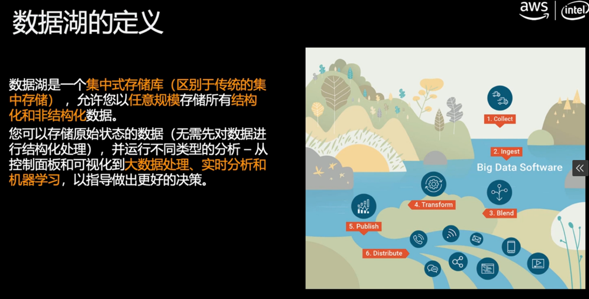
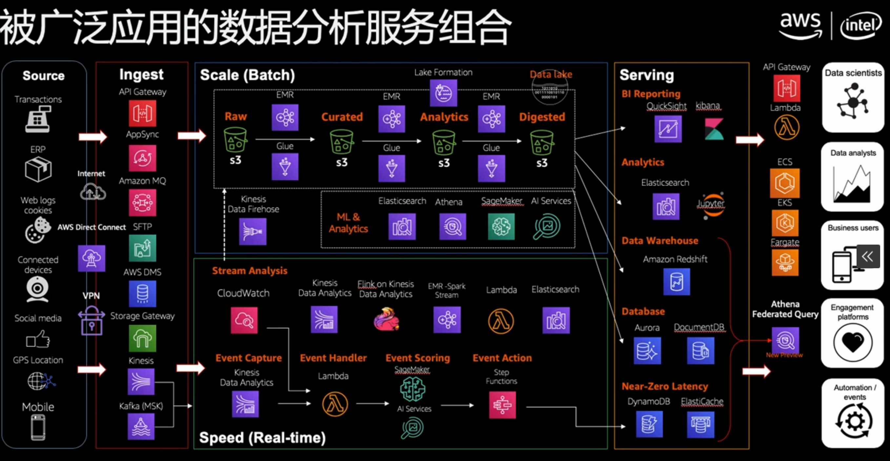
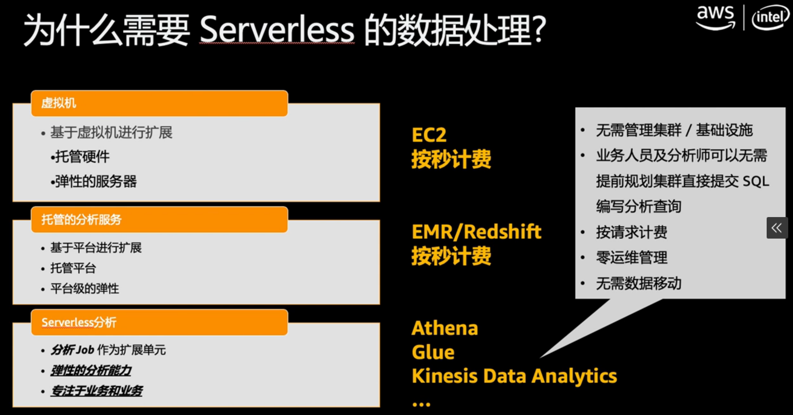
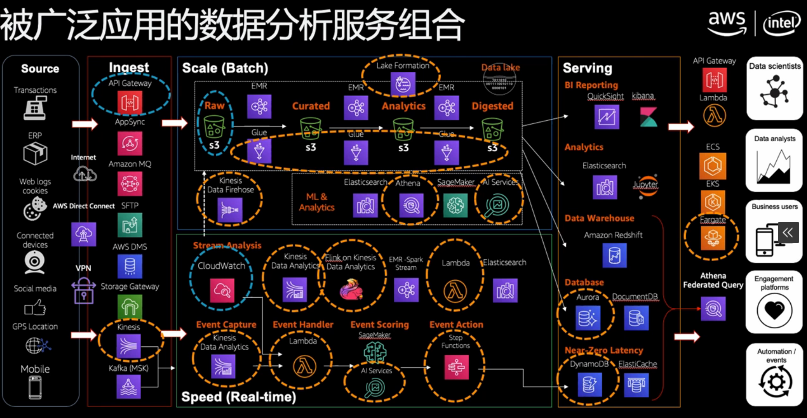
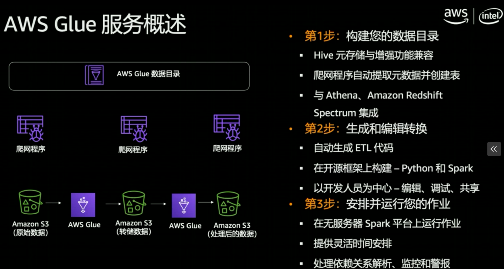

[TOC]


# Simple Storage Service

AWS rates their S3 standard storage class at 99.999999999% durability. Translated into English, this means that if you store, say 10,000 objects with them, one might get lost every 10 million years or so


## Characteristic

Store and retrieve any amount of data, any time from anywhere on the web

Objects up to 5TB no bucket size limit

Estimate monthly bill using the AWS Simple Monthly Calculator


## buckets

Buckets are globally unique containers for everything that you store in S3

The bucket name should be DNS compliance 


## Common Use Scenarios

Storage and Backup 

Application File Hosting

Media Hosting

Software Delivery

Store AMIs and Snapshots


## Object Keys


## Security

Control buckets and objects with Access Control Lists (ACLs), Bucket policies and Identity  and Access Management(IAM) policies

Upload/Download data to S3 with SSL encrypted endpoints


## Storage Classes


## EBS vs S3


# S3 Glacier 

For archiving data

For very infrequently accessed data

Data retrieval time of several hours

Just as durable as S3

Much less cost than S3


# S3 Lifecycle

- The S3 Standard storage class to any other storage class.
- Any storage class to the S3 Glacier or S3 Glacier Deep Archive storage classes.
- The S3 Standard-IA storage class to the S3 Intelligent-Tiering or S3 One Zone-IA storage classes.
- The S3 Intelligent-Tiering storage class to the S3 One Zone-IA storage class.
- The S3 Glacier storage class to the S3 Glacier Deep Archive storage class.


## S3 Standard

S3 Standard offers high durability, availability, and performance object storage for frequently accessed data. Because it delivers low latency and high throughput, S3 Standard is appropriate for a wide variety of use cases, including cloud applications, dynamic websites, content distribution, mobile and gaming applications, and big data analytics.


**Key Features:**

- Low latency and high throughput performance
- Designed for durability of 99.999999999% of objects across multiple Availability Zones
- Resilient against events that impact an entire Availability Zone
- Designed for 99.99% availability over a given year
- Backed with the [Amazon S3 Service Level Agreement](https://aws.amazon.com/s3/sla/) for availability
- Supports SSL for data in transit and encryption of data at rest
- S3 Lifecycle management for automatic migration of objects to other S3 Storage Classes  


## S3 Standard-IA

S3 Standard-IA is for data that is accessed less frequently, but requires rapid access when needed. S3 Standard-IA offers the high durability, high throughput, and low latency of S3 Standard, with a low per GB storage price and per GB retrieval fee. This combination of low cost and high performance make S3 Standard-IA ideal for long-term storage, backups, and as a data store for disaster recovery files. 


**Key Features:**

- Same low latency and high throughput performance of S3 Standard
- Designed for durability of 99.999999999% of objects across multiple Availability Zones
- Resilient against events that impact an entire Availability Zone
- **Data is resilient in the event of one entire Availability Zone destruction**
- Designed for 99.9% availability over a given year
- Backed with the [Amazon S3 Service Level Agreement](https://aws.amazon.com/s3/sla/) for availability
- Supports SSL for data in transit and encryption of data at rest
- S3 Lifecycle management for automatic migration of objects to other S3 Storage Classes


## S3 Glacier

S3 Glacier is a secure, durable, and low-cost storage class for data archiving. You can reliably store any amount of data at costs that are competitive with or cheaper than on-premises solutions. To keep costs low yet suitable for varying needs, S3 Glacier provides three retrieval options that range from a few minutes to hours. 


**Key Features:**

- Designed for durability of 99.999999999% of objects across multiple Availability Zones
- Data is resilient in the event of one entire Availability Zone destruction
- Supports SSL for data in transit and encryption of data at rest
- Low-cost design is ideal for long-term archive
- Configurable retrieval times, from minutes to hours
- S3 PUT API for direct uploads to S3 Glacier, and S3 Lifecycle management for automatic migration of objects


## Performance across the S3 Storage Classes


## Cost considerations

If you are planning to archive infrequently accessed data for a period of months or years, the S3 Glacier and S3 Glacier Deep Archive storage classes can reduce your storage costs. 


# aws cli


## ls 

```
aws s3 ls s3://mybucket --recursive --human-readable --summarize
```


# Data Lake













