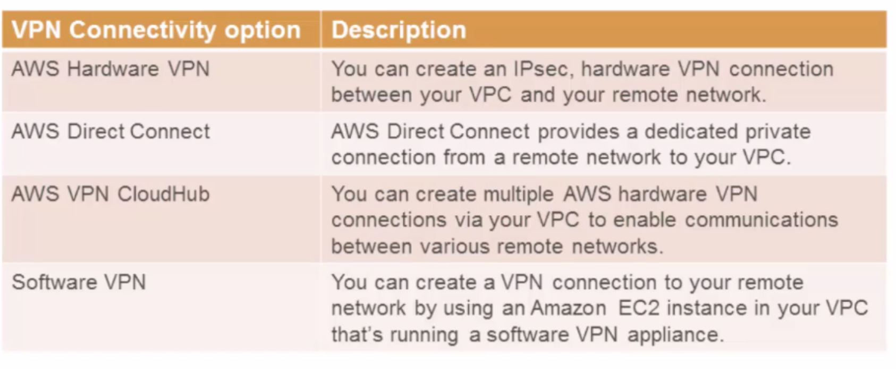

[TOC]


# Virtual Private Cloud

Provision a private, isolated virtual network on AWS cloud to only one AWS account

Private and public interface control

Use CIDR notation

Inbound and Outbound traffic can be controlled

Multiple IP addresses can be assigned

Encrypted VPN connection


## VPN Connections




# IP Addresses


## reserved IPs

The first four IP addresses and the last IP address in each subnet CIDR block are not available for you to use, and cannot be assigned to an instance. For example, in a subnet with CIDR block `10.0.0.0/24`, the following five IP addresses are reserved:

- `10.0.0.0`: Network address.
- `10.0.0.1`: Reserved by AWS for the VPC router.
- `10.0.0.2`: Reserved by AWS. The IP address of the DNS server is the base of the VPC network range plus two. For VPCs with multiple CIDR blocks, the IP address of the DNS server is located in the primary CIDR. We also reserve the base of each subnet range plus two for all CIDR blocks in the VPC. For more information, see [Amazon DNS server](https://docs.aws.amazon.com/vpc/latest/userguide/VPC_DHCP_Options.html#AmazonDNS).
- `10.0.0.3`: Reserved by AWS for future use.
- `10.0.0.255`: Network broadcast address. We do not support broadcast in a VPC, therefore we reserve this address.

If you create a VPC or subnet using a command line tool or the Amazon EC2 API, the CIDR block is automatically modified to its canonical form. For example, if you specify `100.68.0.18/18` for the CIDR block, we create a CIDR block of `100.68.0.0/18`.


# CIDR limitation

You must specify an IPv4 address range for your VPC. Specify the IPv4 address range as a Classless Inter-Domain Routing (CIDR) block; for example, 10.0.0.0/16. A CIDR block size must be between a /16 netmask and /28 netmask.


# VPC Endpoint


# Internet Gateway

An Internet Gateway (IGW) is a *logical connection between an Amazon VPC and the Internet.* It is *not* a physical device. Only one can be associated with each VPC. It does *not* limit the bandwidth of Internet connectivity. (The only limitation on bandwidth is the size of the Amazon EC2 instance, and it applies to all traffic — internal to the VPC and out to the Internet.)


If a VPC *does not* have an Internet Gateway, then the resources in the VPC *cannot be accessed from the Internet* (unless the traffic flows via a corporate network and VPN/Direct Connect).


An Internet Gateway allows resources within your VPC to access the internet, and vice versa. In order for this to happen, there needs to be a routing table entry allowing a subnet to access the IGW.

That is to say — an IGW allows resources within your public subnet to access the internet, and the internet to access said resources.


# NAT Gateway

It allows resources in a private subnet to access the internet (think yum updates, external database connections, wget calls, OS patch, etc)

It only works one way. The internet at large cannot get through your NAT to your private resources unless you explicitly allow it.


AWS introduced a *NAT Gateway Service* that can take the place of a NAT Instance. The benefits of using a NAT Gateway service are:

- It is a fully-managed service — just create it and it works automatically, including fail-over
- A NAT gateway supports 5 Gbps of bandwidth and automatically scales up to 45 Gbps. (a NAT Instance is limited to the bandwidth associated with the EC2 instance type)


Security Groups *cannot* be associated with a NAT Gateway

You’ll need one in each AZ since they only operate in a single AZ


# FAQ


## Delete VPC and dependency

```
#!/bin/bash
vpc="vpc-aa473fc2" 
/usr/local/bin/aws ec2 describe-internet-gateways --filters 'Name=attachment.vpc-id,Values='$vpc | grep InternetGatewayId
/usr/local/bin/aws ec2 describe-subnets --filters 'Name=vpc-id,Values='$vpc | grep SubnetId
/usr/local/bin/aws ec2 describe-route-tables --filters 'Name=vpc-id,Values='$vpc | grep RouteTableId
/usr/local/bin/aws ec2 describe-network-acls --filters 'Name=vpc-id,Values='$vpc | grep NetworkAclId
/usr/local/bin/aws ec2 describe-vpc-peering-connections --filters 'Name=requester-vpc-info.vpc-id,Values='$vpc | grep VpcPeeringConnectionId
/usr/local/bin/aws ec2 describe-vpc-endpoints --filters 'Name=vpc-id,Values='$vpc | grep VpcEndpointId
/usr/local/bin/aws ec2 describe-nat-gateways --filter 'Name=vpc-id,Values='$vpc | grep NatGatewayId
/usr/local/bin/aws ec2 describe-security-groups --filters 'Name=vpc-id,Values='$vpc | grep GroupId
/usr/local/bin/aws ec2 describe-instances --filters 'Name=vpc-id,Values='$vpc | grep InstanceId
/usr/local/bin/aws ec2 describe-vpn-connections --filters 'Name=vpc-id,Values='$vpc | grep VpnConnectionId
/usr/local/bin/aws ec2 describe-vpn-gateways --filters 'Name=attachment.vpc-id,Values='$vpc | grep VpnGatewayId
/usr/local/bin/aws ec2 describe-network-interfaces --filters 'Name=vpc-id,Values='$vpc | grep NetworkInterfaceId
```


# Appendix

https://docs.aws.amazon.com/vpc/latest/userguide/VPC_Subnets.html

