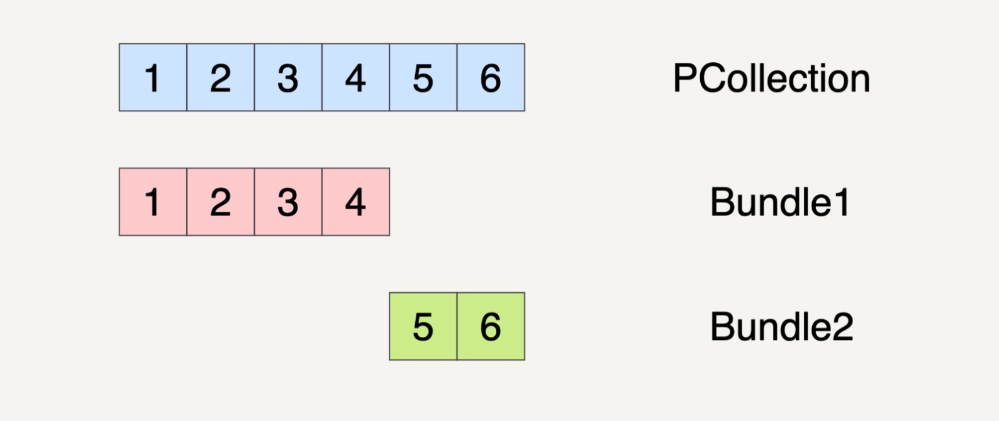
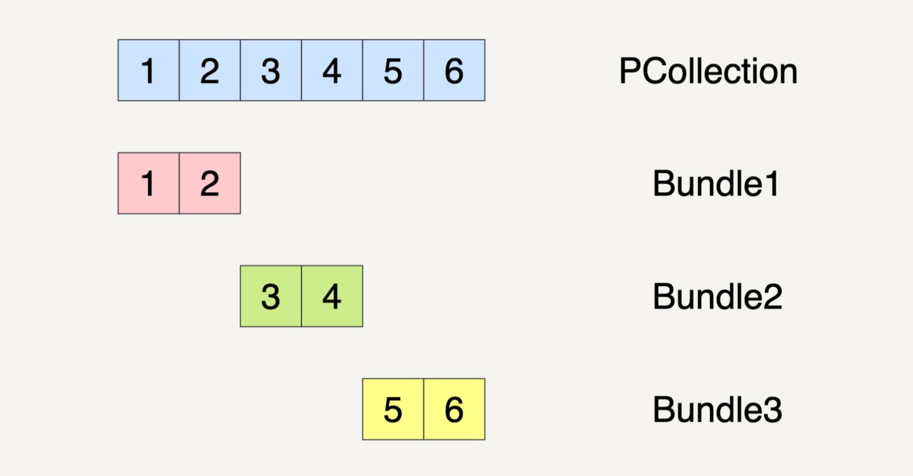

[toc]


# Apache Beam

[Apache Beam](http://beam.apache.org/) is a unified model for defining both batch and streaming data-parallel processing pipelines, as well as a set of language-specific SDKs for constructing pipelines and Runners for executing them on distributed processing backends, including [Apache Flink](http://flink.apache.org/), [Apache Spark](http://spark.apache.org/), [Google Cloud Dataflow](http://cloud.google.com/dataflow/) and [Hazelcast Jet](https://jet.hazelcast.org/).


Google 在 2016 年的时候联合了 Talend、Data Artisans、Cloudera 这些大数据公司，基于 Dataflow Model 的思想开发出了一套 SDK，并贡献给了 Apache Software Foundation。

而Beam = **B**atch + Str**eam**ing 的组合


在现实世界中，很多时候我们不可避免地需要对数据同时进行批处理和流处理。Beam 提供了一套统一的 API 来处理这两种数据处理模式，让我们只需要将注意力专注于在数据处理的算法上，而不用再花时间去对两种数据处理模式上的差异进行维护。


用 Beam API 写好的数据处理逻辑无需改变，可以根据自身的需求，将逻辑放在 Google Cloud Dataflow 上跑，也可以放在 Apache Flink 上跑。在 Beam 上，这些底层运行的系统被称为 Runner。现阶段 Apache Beam 支持的 Runner 有近十种，包括了我们很熟悉的 Apache Spark 和 Apache Flink


## Beam 生态圈


第一层，是现在已有的各种大数据处理平台（例如 Apache Spark 或者 Apache Flink），在 Beam 中它们也被称为 Runner。

第二层，是可移植的统一模型层，各个 Runners 将会依据中间抽象出来的这个模型思想，提供一套符合这个模型的 APIs 出来，以供上层转换。

第三层，是 SDK 层。SDK 层将会给工程师提供不同语言版本的 API 来编写数据处理逻辑，这些逻辑就会被转化成 Runner 中相应的 API 来运行。

第四层，是可扩展库层。工程师可以根据已有的 Beam SDK，贡献分享出更多的新开发者 SDK、IO 连接器、转换操作库等等。

第五层，我们可以看作是应用层，各种应用将会通过下层的 Beam SDK 或工程师贡献的开发者 SDK 来实现。

第六层，也就是社区一层。在这里，全世界的工程师可以提出问题，解决问题，实现解决问题的思路。


## Beam编程模型

这个世界中的数据可以分成有边界数据和无边界数据，而有边界数据又是无边界数据的一种特例。所以，我们都可以将所有的数据抽象看作是无边界数据。

同时，每一个数据都是有两种时域的，分别是事件时间和处理时间。我们在处理无边界数据的时候，因为在现实世界中，数据会有延时、丢失等等的状况发生，我们无法保证现在到底是否接收完了所有发生在某一时刻之前的数据。所以现实中，流处理必须在数据的完整性和数据处理的延时性上作出取舍。Beam 编程模型就是在这样的基础上提出的。

Beam 编程模型会涉及到的 4 个概念，窗口、水印、触发器和累加模式

Beam 的编程模型将所有的数据处理逻辑都分割成了这四个纬度，统一成了 Beam SDK。我们在基于 Beam SDK 构建数据处理业务逻辑时，只需要根据业务需求，按照这四个维度调用具体的 API，即可生成符合自己要求的数据处理逻辑。Beam 会自动转化数据处理逻辑，并提交到具体的 Runner 上去执行。


### 窗口（Window）

窗口将无边界数据根据事件时间分成了一个个有限的数据集。我们可以看看批处理这个特例。

在批处理中，我们其实是把一个无穷小到无穷大的时间窗口赋予了数据集。


例如，我们有三个不同的数据，它们的事件时间分别是 12:01、12:59 和 14:00。如果我们的时间窗口设定为[12:00 , 13:00)，那我们所需要处理的数据就是前两个数据了。


### 水印（Watermark）

水印是用来表示与数据事件时间相关联的输入完整性的概念。

对于事件时间为 X 的水印是指：数据处理逻辑已经得到了所有事件时间小于 X 的无边界数据。在数据处理中，水印是用来测量数据进度的。


### 触发器（Triggers）

触发器指的是表示在具体什么时候，数据处理逻辑会真正地触发窗口中的数据被计算。

触发器能让我们可以在有需要时对数据进行多次运算，例如某时间窗口内的数据有更新，这一窗口内的数据结果需要重算。

在 Beam 中，我们可以有多种多样的触发器信号，例如根据处理时间的信号来触发，也就是说每隔了一段时间 Beam 就会重新计算一遍窗口中的数据；也可以根据元素的计数来触发，意思就是在一个窗口中的数据只要达到一定的数据，这个窗口的数据就会被拿来计算结果。


例如，我们现在定义好的固定窗口（Fixed Window）时间范围为 1 个小时，从每天的凌晨 00:00 开始计算，元素计数定为 2。我们需要处理的无边界数据是商品交易数据，我们需要计算在一个时间窗口中的交易总量。

假设只接收到了 4 个数据点，它们按照以下顺序进入我们的处理逻辑。

于 6 月 11 号 23:59 产生的 10 元交易；

于 6 月 12 号 00:01 产生的 15 元交易；

于 6 月 11 号 23:57 产生的 20 元交易；

于 6 月 11 号 23:57 产生的 30 元交易。

接收到第三个数据的时候，6 月 11 号这个 24 小时窗口的数据已经达到了两个，所以触发了这个窗口内的数据计算，也就是 6 月 11 号的窗口内交易总量现在为 10+20=30 元。

当第四个数据（6 月 11 号 23:57 产生的 30 元交易）进入处理逻辑时，6 月 11 号这个 24 小时窗口的数据又超过了两个元素，这个窗口的计算再次被触发，交易总量被更新为 30+30=60 元。你可以看到，由于 6 月 12 号这个窗口的数据一直没有达到我们预先设定好的 2，所以就一直没有被触发计算。


### 累加模式（Accumulation）

累加模式指的是如果我们在同一窗口中得到多个运算结果，我们应该如何处理这些运算结果。这些结果之间可能完全不相关，例如与时间先后无关的结果，直接覆盖以前的运算结果即可。这些结果也可能会重叠在一起。

常见的累加模式有：丢弃（结果之间是独立且不同的）、累积（后来的结果建立在先前的结果上）等等。


## PCollection

PCollection 是Beam的一个全新的抽象数据结构

Parallel Collection，意思是可并行计算的数据集。如果你之前学习了 Spark 的章节，就会发现 PCollection 和 RDD 十分相似。

在一个分布式计算系统中，我们作为架构设计者需要为用户隐藏的实现细节有很多，其中就包括了数据是怎样表达和存储的。

这个数据可能是来自于内存的数据（内部可能只是由一个 C++ array 存储）；也有可能是来自外部文件（由几个文件存储）；或者是来自于 MySQL 数据库（由数据库的行来表达）。

PCollection 的创建完全取决于你的需求。比如，在测试中 PCollection 往往来自于代码生成的伪造数据，或者从文件中读取。

```
# Python
lines = (p | beam.Create(['To be, or not to be: that is the question. ']))

lines = p | 'ReadMyFile' >> beam.io.ReadFromText('gs://some/inputData.txt')
```


### PCollection 特点


#### 无序

PCollection 的无序特性其实也和它的分布式本质有关。一旦一个 PCollection 被分配到不同的机器上执行，那么为了保证最大的处理输出，不同机器都是独立运行的。所以，它的执行顺序就无从得知了。可能是第一个元素先被运行，也可能是第二个元素先被运行。所以，肯定不会有 PCollection[2]这样的运算符。


#### 无固定大小

Beam 想要统一批处理和流处理，所以它要统一表达有界数据和无界数据。正因为如此，PCollection 并没有限制它的容量。如前面所说，它可能表达内存上的一个数组，也可能表达整个数据库的所有数据。

一个 PCollection 可以是有界的，也可以是无界的。一个有界的 PCollection 表达了一个已知大小的固定的数据集。一个无界的 PCollection 表达了一个无限大小的数据集。事实上一个 PCollection 是否有界，往往取决于它是如何产生的。

从批处理的数据源中读取，比如一个文件或者是一个数据库，就会产生有界的 PColleciton。如果从流式的或者是持续更新的数据库中读取，比如 pub/sub 或者 kafka，会产生一个无界的 PCollection。


#### 不可变性

PCollection 不提供任何修改它所承载数据的方式。修改一个 PCollection 的唯一方式就是去转化 (Transform) 它


#### 延迟执行

Beam 的 PCollection 都是延迟执行（deferred execution）的模式。


### coder

与普通编程相比，PCollection 的另一个不同之处是，你需要为 PCollection 的元素编写 Coder。例如，你有一个自己的类 MyClass，那么 PCollection一定需要实现 Coder。

Coder 的作用和 Beam 的本质紧密相关。因为你的计算流程最终会运行在一个分布式系统。所以，所有的数据都有可能在网络上的计算机之间相互传递。而 Coder 就是在告诉 Beam，怎样把你的数据类型序列化和逆序列化，以方便在网络上传输。

Coder 需要注册进全局的 CoderRegistry 中，简单来说，是为你自己的数据类型建立与 Coder 的对应关系。不然每次你都需要手动指定 Coder。

```
apache_beam.coders.registry.register_coder(int, BigEndianIntegerCoder)
```


## Transform

数据处理的最基本单元


Beam 把数据转换抽象成了有向图。PCollection 是有向图中的边，而 Transform 是有向图里的节点

每个 Transform 都可能有大于一个的输入 PCollection，它也可能输出大于一个的输出 PCollection。所以，我们只能把 Transform 放在节点的位置。因为一个节点可以连接多条边，而同一条边却只能有头和尾两端。


### 基本操作

Beam 中的 PCollection 有一个抽象的成员函数 Apply。使用任何一个 Transform 时候，你都需要调用这个 apply 方法。

```
pcollection1 = pcollection2 | Transform
```


也可以把 Transform 级连起来

```
final_collection = input_collection.apply(Transform1)
.apply(Transform2)
.apply(Transform3)
```


### ParDo

Beam 也提供了常见的 Transform 接口，比如 ParDo、GroupByKey。最常使用的 Transform 就是 ParDo 了

ParDo 就是 Parallel Do 的意思，顾名思义，表达的是很通用的并行处理数据操作。

也可以用 ParDo 来实现 GroupByKey，一种简单的实现方法就是放一个全局的哈希表，然后在 ParDo 里把一个一个元素插进这个哈希表里。但这样的实现方法并不能用，因为你的数据量可能完全无法放进一个内存哈希表。而且，你还要考虑到 PCollection 会把计算分发到不同机器上的情况。

当你在编写 ParDo 时，你的输入是一个 PCollection 中的单个元素，输出可以是 0 个、1 个，或者是多个元素。你只要考虑好怎样处理一个元素。剩下的事情，Beam 会在框架层面帮你做优化和并行。

使用 ParDo 时，你需要继承它提供的 DoFn 类，你可以把 DoFn 看作是 ParDo 的一部分。因为 ParDo 和 DoFn 单独拿出来都没有意义。

```
static class UpperCaseFn extends DoFn<String, String> {
  @ProcessElement
  public void processElement(@Element String word, OutputReceiver<String> out) {
    out.output(word.toUpperCase());
  }
}

PCollection<String> upperCaseWords = words.apply(
    ParDo
    .of(new UpperCaseFn())); 
```

> 每个 DoFn 的 @ProcessElement 标注的函数 processElement，就是这个 DoFn 真正的功能模块
>
> 把输入的一个词转化成了它的大写形式。之后在调用 apply(ParDo.of(new UpperCaseFn())) 的时候，Beam 就会把输入的 PCollection 中的每个元素都使用刚才的 processElement 处理一遍。


#### example

**过滤一个数据集**

当我们只想要挑出符合我们需求的元素的时候，我们需要做的，就是在 processElement 中实现。一般来说会有一个过滤函数，如果满足我们的过滤条件，我们就把这个输入元素输出。

```
@ProcessElement
public void processElement(@Element T input, OutputReceiver<T> out) {
    if (IsNeeded(input)) {
      out.output(input);
    }
  }
```


**格式转化一个数据集**

给数据集转化格式的场景非常常见。比如，我们想把一个来自 csv 文件的数据，转化成 TensorFlow 的输入数据 tf.Example 的时候，就可以用到 ParDo。

```
@ProcessElement
  public void processElement(@Element String csvLine, OutputReceiver<tf.Example> out) {
    out.output(ConvertToTfExample(csvLine));
  }
```


**提取一个数据集的特定值**

ParDo 还可以提取一个数据集中的特定值。比如，当我们想要从一个商品的数据集中提取它们的价格的时候，也可以使用 ParDo。

```
@ProcessElement
  public void processElement(@Element Item item, OutputReceiver<Integer> out) {
    out.output(item.price());
  }
```


### GroupByKey

GroupByKey 的意思是把一个 Key/Value 的数据集按 Key 归并

不过它远没有 ParDo 那么常见

```
cat, 1
dog, 5
and, 1
jump, 3
tree, 2
cat, 5
dog, 2
and, 2
cat, 9
and, 6


>>>
cat, [1,5,9]
dog, [5,2]
and, [1,2,6]
jump, [3]
tree, [2]
```


## Transform 优化

Beam 中的数据操作都是 lazy execution 的。这使得 Transform 和普通的函数运算很不一样。当你写下面这样一个代码的时候，真正的计算完全没有被执行

```
Pcollection1 = pcollection2.apply(Transform)
```

> 这样的代码仅仅是让 Beam 知道了“你想对数据进行哪些操作”，需要让它来构建你的数据处理有向图。之后 Beam 的处理优化器会对你的处理操作进行优化。所以，千万不要觉得你写了 10 个 Transform 就会有 10 个 Transform 马上被执行了。

理解 Transform 的 lazy execution 非常重要。很多人会过度地优化自己的 DoFn 代码，想要在一个 DoFn 中把所有运算全都做了。其实完全没这个必要。


可以用分步的 DoFn 把自己想要的操作表达出来，然后交给 Beam 的优化器去合并你的操作。比如，在 FlumeJava 论文中提到的 MSCR Fusion，它会把几个相关的 GroupByKey 的 Transform 合并。


# Beam Pipeline

在 Beam 的世界里，所有的数据处理逻辑都会被抽象成数据流水线（Pipeline）来运行。

Beam 的数据流水线是对于数据处理逻辑的一个封装，它包括了从读取数据集，将数据集转换成想要的结果和输出结果数据集这样的一整套流程。

所以，如果我们想要跑自己的数据处理逻辑，就必须在程序中创建一个 Beam 数据流水线出来，比较常见的做法是在 main() 函数中直接创建。

```
PipelineOptions options = PipelineOptionsFactory.create();
Pipeline p = Pipeline.create(options);
```

> 在创建 Beam 数据流水线的同时，我们必须给这个流水线定义一个选项（Options）。这个选项会告诉 Beam，用户的 Pipeline 应该如何运行。例如，是在本地的内存上运行，还是在 Apache Flink 上运行


> 整个数据流水线包括了从读取数据，到经过了 N 个 Transform 之后输出数据的整个过程。

PCollection 的不可变性。也就是说，一个 PCollection 一经生成，我们就不能够再增加或者删除它里面的元素了。所以，在 Beam 的数据流水线中，每次 PCollection 经过一个 Transform 之后，流水线都会新创建一个 PCollection 出来。而这个新的 PCollection 又将成为下一个 Transform 的新输入。

也可以使三个不同的 Transform 应用在它之上，从而再产生出三个不同的 PCollection2、PCollection3 和 PCollection4 出来。


## Bundle

Beam 数据流水线的底层思想其实还是动用了 MapReduce 的原理，在分布式环境下，整个数据流水线会启动 N 个 Workers 来同时处理 PCollection。而在具体处理某一个特定 Transform 的时候，数据流水线会将这个 Transform 的输入数据集 PCollection 里面的元素分割成不同的 Bundle，将这些 Bundle 分发给不同的 Worker 来处理。

Beam 数据流水线具体会分配多少个 Worker，以及将一个 PCollection 分割成多少个 Bundle 都是随机的。但 Beam 数据流水线会尽可能地让整个处理流程达到完美并行（Embarrassingly Parallel）

至于完美并行的背后机制，Beam会在真正处理数据前先计算优化出执行的一个有向无环图，希望保持并行处理数据的同时，能够减少每个worker之间的联系。

bundle随机分配是会产生数据倾斜的问题


假设在数据流水线的一个 Transform 里面，它的输入数据集 PCollection 是 1、2、3、4、5、6 这个 6 个元素。数据流水线可能会将这个 PCollection 按下图的方式将它分割成两个 Bundles。

当然，PCollection 也有可能会被分割成三个 Bundles。







那数据流水线会启用多少个 Worker 来处理这些 Bundle 呢？这也是任意的。还是以刚刚的 PCollection 输入数据集作为例子，如果 PCollection 被分割成了两个 Bundles，数据流水线有可能会分配两个 Worker 来处理这两个 Bundles。

也有可能只分配一个 Worker 来处理这两个 Bundles


我们现在需要做两个 Transforms。第一个 Transform 会将元素的数值减一；第二个 Transform 会对元素的数值求平方。整个过程被分配到了两个 Workers 上完成。


> 总共产生了 6 个不可变的 Bundle 出来，从 Bundle1 到 Bundle3 的整个过程都必须放在 Worker1 上完成，因为它们都具有关联性。同样的，从 Bundle4 到 Bundle6 的整个过程也都必须放在 Worker2 上完成。


## 单个 Transform 上的错误处理

在一个 Transform 里面，如果某一个 Bundle 里面的元素因为任意原因导致处理失败了，则这整个 Bundle 里的元素都必须重新处理。

重新处理的 Bundle 也不一定要在原来的 Worker 里面被处理，有可能会被转移到另外的 Worker 里面处理。


## 多步骤 Transform 上的错误处理

在多步骤的 Transform 上，如果处理的一个 Bundle 元素发生错误了，则这个元素所在的整个 Bundle 以及与这个 Bundle 有关联的所有 Bundle 都必须重新处理。


# Appendix

## Essay 涉及的论文

MapReduce: https://research.google.com/archive/map reduce-osdi04.pdf 

Flumejava: https://research.google.com/pubs/archive/35650.pdf

MillWheel: https://research.google.com/pubs/archive/41378.pdf

Data flow Model: https://www.vldb.org/pvldb/vol8/p1792-Akidau.pdf

