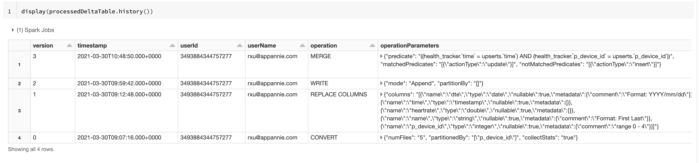

[toc]


# Databricks


# Lakehouse

One Unified Platform 


Lakehouse with Databricks


# DataLake


## Opinionated approach

Adds reliability, quality performance to Data Lakes

Brings the best of data warehousing and data lakes

Based on open source and open format(Parquet), data lake is also open source


## Challenges with data lakes


**ACID Transaction**

Can make every operation transactional and review past transactions

> all transactions are recorded and you can go back in time to review previous versions of the data

```
**hard to append data**

adding newly arrived data leads to incorrect reads


**modification of exising data is difficult**

GDPR/CCPA requires making fine grained changes to existing data lake


**Jobs failed mid way**

Half of the data appears in the data lake, the rest is missing


**real-time operations**

Mixing streaming and batch leads to inconsistency


**Costly to keep historical versions of the data**

Regulated environments require reproducibility, auditing, governance.


```


**Using Spark under the hood**

All delta lake metadata stored in open parquet format

Portions of it cached and optimized for fast access

```
**Difficult to handle large metadata**

For large data lakes the metadata itself becomes difficult to manage
```


**Indexing and automatically optimize a layout that enables fast access**

Partitioning: layout for typical queries

Data skipping: prune files based on statistics on numericals

Z-ordering: layout to optimize multiple columns

```
Too many files problems**

Data lake  are file based, which are not grat at handling millions of small files


**Hard to get great performance**

Partitioning the data for performance is error-prone and difficult to change
```


**Support Schema validation and evolution**

All data in Delta tables have to adhere to a strict schema

Includes schema evolution in merge operations

> ```
> MERGE INTO events USING changes ON events.id = changes.id
> WHEN MATCHED THEN 
> UPDATE SET *
> WHEN NOT MATCHED THEN
> INSERT *
> ```
>
> 

```
Data quality issues**

It's a constant headache to ensure that all the data is correct and high quality
```


# Delta Lake Architecture


## Delta Storage Layer


# Databricks Official Example

```
wget https://hadoop-and-big-data.s3-us-west-2.amazonaws.com/fitness-tracker/health_tracker_data_2020_1.json


$ head health_tracker_data_2020_1.json && tail health_tracker_data_2020_1.json
{"time":1577836800.0,"name":"Deborah Powell","device_id":0,"heartrate":52.8139067501}
{"time":1577840400.0,"name":"Deborah Powell","device_id":0,"heartrate":53.9078900098}
{"time":1577844000.0,"name":"Deborah Powell","device_id":0,"heartrate":52.7129593616}
{"time":1577847600.0,"name":"Deborah Powell","device_id":0,"heartrate":52.2880422685}
{"time":1577851200.0,"name":"Deborah Powell","device_id":0,"heartrate":52.5156095386}
{"time":1577854800.0,"name":"Deborah Powell","device_id":0,"heartrate":53.6280743846}
{"time":1577858400.0,"name":"Deborah Powell","device_id":0,"heartrate":52.1760037066}
{"time":1577862000.0,"name":"Deborah Powell","device_id":0,"heartrate":90.0456721836}
{"time":1577865600.0,"name":"Deborah Powell","device_id":0,"heartrate":89.4695644522}
{"time":1577869200.0,"name":"Deborah Powell","device_id":0,"heartrate":88.1490304138}
{"time":1580479200.0,"name":"James Hou","device_id":4,"heartrate":101.2310828282}
{"time":1580482800.0,"name":"James Hou","device_id":4,"heartrate":98.8177306896}
{"time":1580486400.0,"name":"James Hou","device_id":4,"heartrate":99.1530432935}
{"time":1580490000.0,"name":"James Hou","device_id":4,"heartrate":101.9077302315}
{"time":1580493600.0,"name":"James Hou","device_id":4,"heartrate":99.6327598989}
{"time":1580497200.0,"name":"James Hou","device_id":4,"heartrate":99.1926406258}
{"time":1580500800.0,"name":"James Hou","device_id":4,"heartrate":100.4140296197}
{"time":1580504400.0,"name":"James Hou","device_id":4,"heartrate":60.4589919915}
{"time":1580508000.0,"name":"James Hou","device_id":4,"heartrate":59.9985046572}
{"time":1580511600.0,"name":"James Hou","device_id":4,"heartrate":60.8260801166}
```


## display json files

```
file_path = health_tracker + "raw/health_tracker_data_2020_1.json"

health_tracker_data_2020_1_df = (
  spark.read
.format("json")
.load(file_path)
)
```


## create parquet tables

```
# TODO
from pyspark.sql.functions import col, from_unixtime

def process_health_tracker_data(dataframe):
  return (
    dataframe
    .select(
        from_unixtime("time").cast("date").alias("dte"),
        from_unixtime("time").cast("timestamp").alias("time"),
        "heartrate",
        "name",
        col("device_id").cast("integer").alias("p_device_id")
    )
  )

processedDF = process_health_tracker_data(health_tracker_data_2020_1_df)
```


```
# TODO
(processedDF.write
 .mode("overwrite")
 .format("parquet")
 .partitionBy("p_device_id")
 .save(health_tracker + "processed"))
```


**Register these tables in metastore**

```
spark.sql(
    f"""
DROP TABLE IF EXISTS health_tracker_processed
"""
)

spark.sql(
    f"""
CREATE TABLE health_tracker_processed
USING PARQUET
LOCATION "{health_tracker}/processed"
"""
)
```


**Verify Parquet-based Data Lake table**

```
health_tracker_processed = spark.read.table("health_tracker_processed")
health_tracker_processed.count()
```

> ```
> (1) Spark Jobs
> health_tracker_processed:pyspark.sql.dataframe.DataFrame
> dte:date
> time:timestamp
> heartrate:double
> name:string
> p_device_id:integer
> Out[11]: 0
> ```
>
> 


**Register the Partitions**

Per best practice, we have created a partitioned table. However, if you create a partitioned table from existing data, Spark SQL does not automatically discover the partitions and register them in the Metastore.

`MSCK REPAIR TABLE` will register the partitions in the Hive Metastore. Learn more about this command in [the docs](https://docs.databricks.com/spark/latest/spark-sql/language-manual/sql-ref-syntax-ddl-repair-table.html)

```
spark.sql("MSCK REPAIR TABLE health_tracker_processed")
```


With the table repaired and the partitions registered, we now have results. We expect there to be 3720 records: five device measurements, 24 hours a day for 31 days.

```
health_tracker_processed.count()
```

> ```
> (2) Spark Jobs
> Out[13]: 3720
> ```
>
> 


## create delta table

**Describe the `health_tracker_processed` Table**

Spark SQL `DESCRIBE` command, with the optional parameter `EXTENDED`, to display the attributes of the table. Note that the table has the "provider" listed as `PARQUET`.

```
%sql

DESCRIBE EXTENDED health_tracker_processed
```

> ```
> col_name	data_type	comment
> time	timestamp	null
> p_device_id	int	null
> p_device_id	int	null
> name	string	null
> heartrate	double	null
> dte	date	null
> Type	EXTERNAL	
> Table	health_tracker_processed	
> Serde Library	org.apache.hadoop.hive.serde2.lazy.LazySimpleSerDe	
> Provider	PARQUET	
> Partition Provider	Catalog	
> Owner	root	
> OutputFormat	org.apache.hadoop.hive.ql.io.HiveSequenceFileOutputFormat	
> Location	dbfs:/dbacademy/rxu/lakehouse-with-delta-lake-dd/health-tracker/processed	
> Last Access	UNKNOWN	
> InputFormat	org.apache.hadoop.mapred.SequenceFileInputFormat	
> Database	dbacademy_rxu	
> Created Time	Tue Mar 30 07:51:07 UTC 2021	
> Created By	Spark 3.0.1	
> # col_name	data_type	comment
> # Partition Information		
> # Detailed Table Information		
> 		
> ```
>
> 


**Convert the Files to Delta Files**

```
from delta.tables import DeltaTable

parquet_table = f"parquet.`{health_tracker}processed`"
partitioning_scheme = "p_device_id int"

DeltaTable.convertToDelta(spark, parquet_table, partitioning_scheme)

```

> ```
> (11) Spark Jobs
> Out[9]: JavaObject id=o391
> ```
>
> 


**Register the Delta Table  in the Metastore**

```
spark.sql(f"""
DROP TABLE IF EXISTS health_tracker_processed
""")

spark.sql(f"""
CREATE TABLE health_tracker_processed
USING DELTA
LOCATION "{health_tracker}/processed" 
""")
```


 **add new column comments to the exiting Delta table**

```
%sql
ALTER TABLE
  health_tracker_processed
REPLACE COLUMNS
  (dte DATE COMMENT "Format: YYYY/mm/dd", 
  time TIMESTAMP, 
  heartrate DOUBLE,
  name STRING COMMENT "Format: First Last",
  p_device_id INT COMMENT "range 0 - 4")
  
```


```
%sql
DESCRIBE EXTENDED health_tracker_processed
```


**Create a New Delta Table**

creating an aggregate table from the data in the health_track_processed Delta table we just created. Within the context of our EDSS, this is a downstream aggregate table or data mart.

```
dbutils.fs.rm(health_tracker + "gold/health_tracker_user_analytics",
              recurse=True)
```


```
from pyspark.sql.functions import col, avg, max, stddev

health_tracker_gold_user_analytics = (
  health_tracker_processed
  .groupby("p_device_id")
  .agg(avg(col("heartrate")).alias("avg_heartrate"),
       max(col("heartrate")).alias("max_heartrate"),
       stddev(col("heartrate")).alias("stddev_heartrate"))
)
```


```
(health_tracker_gold_user_analytics.write
 .format("delta")
 .mode("overwrite")
 .save(health_tracker + "gold/health_tracker_user_analytics"))
```


**Register the Delta table in the Metastore**

```
spark.sql(f"""
DROP TABLE IF EXISTS health_tracker_gold_user_analytics
""")

spark.sql(f"""
CREATE TABLE health_tracker_gold_user_analytics
USING DELTA
LOCATION "{health_tracker}/gold/health_tracker_user_analytics"
""")
```


```
display(health_tracker_gold_user_analytics)
```


## Batch Write to Delta Tables


**Import Utility Functions**

operations

```
from pyspark.sql import DataFrame
from pyspark.sql.session import SparkSession
from pyspark.sql.functions import col, from_unixtime

def process_health_tracker_data(spark: SparkSession, df: DataFrame) -> DataFrame:
  return (
    df
    .withColumn("time", from_unixtime("time"))
    .withColumnRenamed("device_id", "p_device_id")
    .withColumn("time", col("time").cast("timestamp"))
    .withColumn("dte", col("time").cast("date"))
    .withColumn("p_device_id", col("p_device_id").cast("integer"))
    .select("dte", "time", "heartrate", "name", "p_device_id")
    )

```


```
%run ./includes/main/python/operations
```


**Load New Data**

loading the data from the file `health_tracker_data_2020_2.json`, using the `.format("json")` option as before

```
file_path = health_tracker + "raw/health_tracker_data_2020_2.json"

health_tracker_data_2020_2_df = (
  spark.read
  .format("json")
  .load(file_path)
)
```


**Transform the Data**

```
processedDF = process_health_tracker_data(spark, health_tracker_data_2020_2_df)
```


**Append the Data to the `health_tracker_processed` Delta table**

```
(processedDF.write
 .mode("append")
 .format("delta")
 .save(health_tracker + "processed"))
```


**View the table as of Version 0**

```
(spark.read
 .option("versionAsOf", 0)
 .format("delta")
 .load(health_tracker + "processed")
 .count())
```

> ```
> (4) Spark Jobs
> Out[9]: 3720
> ```
>
> 


```
(spark.read
 .format("delta")
 .load(health_tracker + "processed")
 .count())
```

> ```
> (3) Spark Jobs
> Out[10]: 7128
> ```
>
> 


```
wget https://hadoop-and-big-data.s3-us-west-2.amazonaws.com/fitness-tracker/health_tracker_data_2020_2.json

$ head health_tracker_data_2020_2.json && tail health_tracker_data_2020_2.json 
{"time":1580515200.0,"name":"Deborah Powell","device_id":0,"heartrate":62.2867126811}
{"time":1580518800.0,"name":"Deborah Powell","device_id":0,"heartrate":63.9665968885}
{"time":1580522400.0,"name":"Deborah Powell","device_id":0,"heartrate":63.2519915361}
{"time":1580526000.0,"name":"Deborah Powell","device_id":0,"heartrate":63.3466351105}
{"time":1580529600.0,"name":"Deborah Powell","device_id":0,"heartrate":63.1314275489}
{"time":1580533200.0,"name":"Deborah Powell","device_id":0,"heartrate":61.8974468776}
{"time":1580536800.0,"name":"Deborah Powell","device_id":0,"heartrate":64.4935795659}
{"time":1580540400.0,"name":"Deborah Powell","device_id":0,"heartrate":61.8257249518}
{"time":1580544000.0,"name":"Deborah Powell","device_id":0,"heartrate":105.322579252}
{"time":1580547600.0,"name":"Deborah Powell","device_id":0,"heartrate":103.5784363662}
{"time":1582984800.0,"name":"Minh Nguyen","device_id":3,"heartrate":96.1929068562}
{"time":1582988400.0,"name":"Minh Nguyen","device_id":3,"heartrate":97.9650249122}
{"time":1582992000.0,"name":"Minh Nguyen","device_id":3,"heartrate":97.8260021974}
{"time":1582995600.0,"name":"Minh Nguyen","device_id":3,"heartrate":96.2607300788}
{"time":1582999200.0,"name":"Minh Nguyen","device_id":3,"heartrate":96.9954030368}
{"time":1583002800.0,"name":"Minh Nguyen","device_id":3,"heartrate":95.2046985299}
{"time":1583006400.0,"name":"Minh Nguyen","device_id":3,"heartrate":97.4203895869}
{"time":1583010000.0,"name":"Minh Nguyen","device_id":3,"heartrate":96.7366234645}
{"time":1583013600.0,"name":"Minh Nguyen","device_id":3,"heartrate":58.9085542134}
{"time":1583017200.0,"name":"Minh Nguyen","device_id":3,"heartrate":58.3997303127}

$ cat health_tracker_data_2020_2.json | wc -l
    3408
```

When we query the table without specifying a version, it shows the latest version of the table and includes the new records added. When we look at the current version, we expect to see two months of data: January 2020 and February 2020.

The data should include the following records:

```
5 devices * 60 days * 24 hours = 7200 records
```

Note that the range of data includes the month of February during a leap year. 29 days in Feb plus 31 in January gives us 60 days total.

And we do not have a correct count. We are missing 72 records.


## Exploring the Single Source of Truth

**Count the Number of Records Per Device**

Let’s run a query to count the number of records per device. Recall that we will need to tell Spark that our format is a Delta table, which we can do with our `.format()` method. 

Additionally, instead of passing in the path as we did in previous notebooks, we need to pass in the health tracker variable. Finally, we'll do a `groupby` and aggregation on our `p_device_id` column.

```
# TODO
from pyspark.sql.functions import count

display(
  spark.read
  .format('delta')
  .load(health_tracker + "processed")
  .groupby("p_device_id")
  .agg(count("*"))
)
```

> p_device_id	count(1)
> 1	1440
> 3	1440
> 4	1368
> 2	1440
> 0	1440


**Plot the Missing Records**

use a Databricks visualization to display the number of records per day. It appears that we have no records for device 4 for the last few days of the month.

```
from pyspark.sql.functions import col

display(
  spark.read
  .format("delta")
  .load(health_tracker + "processed")
  .where(col("p_device_id").isin([3,4]))
)
```


**Create Temporary View for Broken Readings**

First, we create a temporary view for the broken readings in the `health_tracker_processed` table. Here, we want to find the columns where `heartrate` is less than 0.

```
# TODO
broken_readings = (
  spark.read
  .format("delta")
  .load(health_tracker + "processed")
  .select(col("heartrate"), col("dte"))
  .where(col("heartrate") < 0)
  .groupby("dte")
  .agg(count("heartrate"))
  .orderBy("dte")
)
broken_readings.createOrReplaceTempView("broken_readings")
```


Display the records in the `broken_readings` view, again using a Databricks visualization. Note that most days have at least one broken reading and that some have more than one.

```
%sql
SELECT * FROM broken_readings
```

> dte	count(heartrate)
> 2020-01-01	1
> 2020-01-02	1
> 2020-01-04	1
> 2020-01-06	1
> 2020-01-07	1
> 2020-01-09	2
> 2020-01-12	3
> 2020-01-13	2
> 2020-01-14	1
> 2020-01-16	2
> 2020-01-19	2
> 2020-01-20	1
> 2020-01-21	2
> 2020-01-22	2
> 2020-01-23	2
> 2020-01-24	1
> 2020-01-25	1
> 2020-01-26	1
> 2020-01-27	3
> 2020-01-28	1
> 2020-01-29	1
> 2020-01-30	1
> 2020-01-31	1
> 2020-02-01	1
> 2020-02-05	2
> 2020-02-07	2
> 2020-02-09	1
> 2020-02-12	2
> 2020-02-13	1
> 2020-02-14	2
> 2020-02-16	2
> 2020-02-17	1
> 2020-02-18	1
> 2020-02-19	1
> 2020-02-23	1
> 2020-02-24	2
> 2020-02-25	2
> 2020-02-26	2
> 2020-02-27	1
> 2020-02-29	2

```
%sql
SELECT SUM(`count(heartrate)`) FROM broken_readings
```

> sum(count(heartrate))
> 60


## Upsert Into a Delta Table

**Prepare Updates DataFrame**

To repair the broken sensor readings (less than zero), we'll interpolate using the value recorded before and after for each device. The Spark SQL functions LAG and LEAD will make this a trivial calculation. We'll write these values to a temporary view called updates. This view will be used later to upsert values into our health_tracker_processed Delta table.

lead的函数是把某一列数据的后面第n行数据拼接到当前行

lag是把指定列的前面第n行数据拼接到当前行。

```java
lag(column,n,default)
lead(column,n,default)
```

> 参数column是选择要拼接的列，参数n表示要移动几行，一般就移动1行，default是默认值，如果lag前面没有行，lead后面没有行就使用默认值。


**Create a DataFrame Interpolating Broken Values**

```
# TODO
from pyspark.sql.window import Window
from pyspark.sql.functions import col, lag, lead

dteWindow = Window.partitionBy("p_device_id").orderBy("dte")

interpolatedDF = (
   spark.read
   .table("health_tracker_processed")
   .select(col("dte"),
           col("time"),
           col("heartrate"),
           lag(col("heartrate")).over(dteWindow).alias("prev_amt"),
           lead(col("heartrate")).over(dteWindow).alias("next_amt"),
           col("name"),
           col("p_device_id"))
 )
```


**Create a DataFrame of Updates**

```
updatesDF = (
  interpolatedDF
  .where(col("heartrate") < 0)
  .select(col("dte"),
          col("time"),
          ((col("prev_amt") + col("next_amt"))/2).alias("heartrate"),
          col("name"),
          col("p_device_id"))
)
```


**View the schemas of the `updatesDF` and `health_tracker_processed` table**

We use the `.printSchema()` function to view the schema of the `health_tracker_processed` table.

```
# TODO
(
  spark.read
  .format("delta")
  .load(health_tracker + "processed")
  .printSchema()
)
updatesDF.printSchema()
```

> ```
> root
>  |-- dte: date (nullable = true)
>  |-- time: timestamp (nullable = true)
>  |-- heartrate: double (nullable = true)
>  |-- name: string (nullable = true)
>  |-- p_device_id: integer (nullable = true)
> 
> root
>  |-- dte: date (nullable = true)
>  |-- time: timestamp (nullable = true)
>  |-- heartrate: double (nullable = true)
>  |-- name: string (nullable = true)
>  |-- p_device_id: integer (nullable = true)
> ```
>
> 


**Verify `updatesDF`**

Perform a `.count()` on the `updatesDF` view. It should have the same number of records as the `SUM` performed on the broken_readings view.

```
updatesDF.count()
```

> ```
> (2) Spark Jobs
> Out[10]: 60
> ```
>
> 


**Prepare Inserts DataFrame**

It turns out that our expectation of receiving the missing records late was correct. These records have subsequently been made available to us as the file `health_tracker_data_2020_02_01.json`.


**Load the Late-Arriving Data**

```
file_path = health_tracker + "raw/late/health_tracker_data_2020_2_late.json"

health_tracker_data_2020_2_late_df = (
  spark.read
  .format("json")
  .load(file_path)
)
```


```
# TODO
# Count the number of records
health_tracker_data_2020_2_late_df.count()
```

> ```
> Out[12]: 72
> ```
>
> 


**Transform the Data**

In addition to updating the broken records, we wish to add this late-arriving data. We begin by preparing another temporary view with the appropriate transformations

```
insertsDF = process_health_tracker_data(spark, health_tracker_data_2020_2_late_df)
```


**View the Schema of the Inserts DataFrame**

```
insertsDF.printSchema()
```

> ```
> root
>  |-- dte: date (nullable = true)
>  |-- time: timestamp (nullable = true)
>  |-- heartrate: double (nullable = true)
>  |-- name: string (nullable = true)
>  |-- p_device_id: integer (nullable = true)
> ```
>
> 


**Create the Union DataFrame**

Finally, we prepare the `upsertsDF` that consists of all the records in both the `updatesDF` and the `insertsDF`. We use the DataFrame `.union()` command to create the view

```
upsertsDF = updatesDF.union(insertsDF)
```


**View the Schema**

```
upsertsDF.printSchema()
```

> ```
> root
>  |-- dte: date (nullable = true)
>  |-- time: timestamp (nullable = true)
>  |-- heartrate: double (nullable = true)
>  |-- name: string (nullable = true)
>  |-- p_device_id: integer (nullable = true)
> ```
>
> 


**Perform Upsert Into the `health_tracker_processed` Table**

You can upsert data into a Delta table using the merge operation. This operation is similar to the SQL `MERGE` command but has added support for deletes and other conditions in updates, inserts, and deletes. 

In other words, using the DeltaTable command `.merge()` provides full support for an upsert operation.

```
from delta.tables import DeltaTable
processedDeltaTable = DeltaTable.forPath(spark, health_tracker + "processed")

update_match = """health_tracker.time = upserts.time
                  AND
                  health_tracker.p_device_id = upserts.p_device_id"""

update = {"heartrate" : "upserts.heartrate"}

insert = {
    "p_device_id" : "upserts.p_device_id",
    "heartrate" : "upserts.heartrate",
    "name" : "upserts.name",
    "time" : "upserts.time",
    "dte" : "upserts.dte"
}

(processedDeltaTable.alias("health_tracker")
 .merge(upsertsDF.alias("upserts"), update_match)
 .whenMatchedUpdate(set=update)
 .whenNotMatchedInsert(values=insert)
 .execute())
```


**Describe the History of the `health_tracker_processed` Table**

```
display(processedDeltaTable.history())
```




**Perform a Second Upsert**

In the previous lesson, we performed an upsert to the `health_tracker_processed` table, which updated records containing broken readings. When we inserted the late arriving data, we inadvertently added more broken readings!


**Sum the Broken Readings**

```
# TODO
from pyspark.sql.functions import col, count

broken_readings = (
  spark.read
  .format("delta")
  .load(health_tracker + "processed")
  .select(col("heartrate"), col("dte"))
  .where(col("heartrate") < 0)
  .groupBy("dte")
  .agg(count("heartrate"))
  .orderBy("dte")
)
broken_readings.createOrReplaceTempView("broken_readings")
```


**Verify That These are New Broken Readings**

Let’s query the broken_readings with a `WHERE` clause to verify that these are indeed new broken readings introduced by inserting the late-arriving data. Note that there are no broken readings before ‘2020-02-25’.

```
%sql
SELECT SUM(`count(heartrate)`) FROM broken_readings WHERE dte < '2020-02-25'
```

> ```
> sum(count(heartrate))
> null
> ```
>
> 

Perform a `.count()` on the `updatesDF` view.

**Note:** It is not necessary to redefine the DataFrame. Recall that a Spark DataFrame is lazily defined, pulling the correct number of updates when an action is triggered. It should have the same number of records as the SUM performed on the `broken_readings` view.

```
# TODO
updatesDF.count()
```

> ```
> Out[23]: 1
> ```
>
> 


**Perform Upsert Into the `health_tracker_processed` Table**

Once more, we upsert into the `health_tracker_processed` table using the DeltaTable command `.merge()`.

```
upsertsDF = updatesDF

(processedDeltaTable.alias("health_tracker")
 .merge(upsertsDF.alias("upserts"), update_match)
 .whenMatchedUpdate(set=update)
 .whenNotMatchedInsert(values=insert)
 .execute())
```


Let’s sum the records in the `broken_readings` view one last time

```
%sql
SELECT SUM(`count(heartrate)`) FROM broken_readings
```

> ```
> sum(count(heartrate))
> null
> ```
>
> 


## Schema Enforcement & Evolution


**Load the Next Month of Data**

We begin by loading the data from the file `health_tracker_data_2020_3.json`, using the `.format("json")` option as before.

```
file_path = health_tracker + "raw/health_tracker_data_2020_3.json"


health_tracker_data_2020_3_df = (
  spark.read
  .format("json")
  .load(file_path)
)
```


**Transform the Data**

```
from pyspark.sql.functions import col, from_unixtime
def process_health_tracker_data(dataframe):
    return (
     dataframe
     .select(
         from_unixtime("time").cast("date").alias("dte"),
         from_unixtime("time").cast("timestamp").alias("time"),
         "heartrate",
         "name",
         col("device_id").cast("integer").alias("p_device_id"),
         "device_type"
       )
     )
processedDF = process_health_tracker_data(health_tracker_data_2020_3_df)
```


**Append the Data to the `health_tracker_processed` Delta table**

We do this using `.mode("append")`

```
from pyspark.sql.utils import AnalysisException
from pyspark.sql.functions import lit

try:
  (
    processedDF.write
    .mode("append")
    .format("delta")
    .save(health_tracker + "processed")
  )
except AnalysisException as error:
  print("Analysis Exception:")
  print(error)
```

> ```
> Analysis Exception:
> A schema mismatch detected when writing to the Delta table (Table ID: 809fa732-0712-48a2-b851-d30a50853454).
> To enable schema migration using DataFrameWriter or DataStreamWriter, please set:
> '.option("mergeSchema", "true")'.
> For other operations, set the session configuration
> spark.databricks.delta.schema.autoMerge.enabled to "true". See the documentation
> specific to the operation for details.
> 
> Table schema:
> root
> -- dte: date (nullable = true)
> -- time: timestamp (nullable = true)
> -- heartrate: double (nullable = true)
> -- name: string (nullable = true)
> -- p_device_id: integer (nullable = true)
> 
> 
> Data schema:
> root
> -- dte: date (nullable = true)
> -- time: timestamp (nullable = true)
> -- heartrate: double (nullable = true)
> -- name: string (nullable = true)
> -- p_device_id: integer (nullable = true)
> -- device_type: string (nullable = true)
> 
>          ;
> ```
>
> 


To enable schema migration using DataFrameWriter or DataStreamWriter, set: `.option("mergeSchema", "true")`.

For other operations, set the session configuration `spark.databricks.delta.schema.autoMerge.enabled` to `"true"`. See [the documentation](https://databricks.com/blog/2019/09/24/diving-into-delta-lake-schema-enforcement-evolution.html) specific to the operation for details.


**What Is Schema Enforcement?**

Schema enforcement, also known as schema validation, is a safeguard in Delta Lake that ensures data quality by rejecting writes to a table that do not match the table’s schema.


**What Is Schema Evolution?**

Schema evolution is a feature that allows users to easily change a table’s current schema to accommodate data that is changing over time. Most commonly, it’s used when performing an append or overwrite operation, to automatically adapt the schema to include one or more new columns.


**Append the Data with Schema Evolution to the `health_tracker_processed` Delta table**

```
# TODO
(processedDF.write
 .mode("append")
 .option("mergeSchema", True)
 .format("delta")
 .save(health_tracker + "processed"))
```


```
spark.read.table("health_tracker_processed").count()
```

> ```
> Out[9]: 10920
> ```
>
> 


## Delete user records

Under the European Union General Data Protection Regulation (GDPR) and the California Consumer Privacy Act (CCPA),
a user of the health tracker device has the right to request that their data be expunged from the system.
We might simply do this by deleting all records associated with that user's device id.


**Delete all records for the device 4**

We use the `DELETE` Spark SQL command to remove all records from the `health_tracker_processed` table that match the given predicate.

```
from delta.tables import DeltaTable

processedDeltaTable = DeltaTable.forPath(spark, health_tracker + "processed")
processedDeltaTable.delete("p_device_id = 4")
```


**Recover the Lost Data**

we deleted all records from the `health_tracker_processed` table for the health tracker device with id, 4.

Suppose that the user did not wish to remove all of their data, but merely to have their name scrubbed from the system.

In this lesson, we use the Time Travel capability of Delta Lake to recover everything but the user’s name.


**Prepare New upserts View**

We prepare a view for upserting using Time Travel to recover the missing records. Note that we have replaced the entire name column with the value `NULL`. Complete the `.where()` to grab just `p_device_id` records that are equal to 4.

```
display(processedDeltaTable.history())
```


**Rollback previous version**

```
# TODO
from pyspark.sql.functions import lit

upsertsDF = (
  spark.read
  .option("versionAsOf", 5)
  .format("delta")
  .load(health_tracker + "processed")
  .where("p_device_id=4")
  .select("dte", "time",
          "heartrate", lit(None).alias("name"), "p_device_id")
)
```


**Perform Upsert Into the `health_tracker_processed` Table**

Once more, we upsert into the `health_tracker_processed` Table using the DeltaTable command `.merge()`. Note that it is necessary to define:

1. The reference to the Delta table
2. The insert logic because the schema has changed.

Our keys will be our original column names and our values will be `"upserts+columnName"`

```
# TODO
processedDeltaTable = DeltaTable.forPath(spark, health_tracker + "processed")

update_match = """health_tracker.time = upserts.time
                  AND
                  health_tracker.p_device_id = upserts.p_device_id"""
update = {"heartrate" : "upserts.heartrate"}

insert = {
      "p_device_id" : "upserts.p_device_id",
      "heartrate" : "upserts.heartrate",
      "name" : "upserts.name",
      "time" : "upserts.time",
      "dte" : "upserts.dte"
}

(processedDeltaTable.alias("health_tracker")
 .merge(upsertsDF.alias("upserts"), update_match)
 .whenMatchedUpdate(set=update)
 .whenNotMatchedInsert(values=insert)
 .execute())

```


When we look at the current version, we expect to see:

5 devices \times 24 hours \times (31 + 29 + 31) days5devices×24hours×(31+29+31)days

That should give us 10920 records.

Note that the range of data includes the month of February during a leap year. That is why there are 29 days in the month.

```
(
  spark.read
  .format("delta")
  .load(health_tracker + "processed")
  .count()
)
```

> ```
> Out[10]: 10920
> ```
>
> 


**Query Device 4 to Demonstrate Compliance**

We query the `health_tracker_processed` table to demonstrate that the name associated with device 4 has indeed been removed.

```
display(
  spark.read
  .format("delta")
  .load(health_tracker + "processed")
  .where("p_device_id = 4")
)
```


**Query an Earlier Table Version**

if we need, We can query the `health_tracker_processed` table against an earlier version to demonstrate that it is still possible to retrieve the name associated with device 4.

```
display(
  spark.read
  .option("versionAsOf", 2)
  .format("delta")
  .load(health_tracker + "processed")
  .where("p_device_id = 4")
)
```


**Vacuum Table to Remove Old Files**

The `VACUUM` Spark SQL command can be used to solve this problem. The `VACUUM` command recursively vacuums directories associated with the Delta table and removes files that are no longer in the latest state of the transaction log for that table and that are older than a retention threshold. The default threshold is 7 days.

```
from pyspark.sql.utils import IllegalArgumentException

try:
  processedDeltaTable.vacuum(0)
except IllegalArgumentException as error:
  print(error)
```

> ```
> requirement failed: Are you sure you would like to vacuum files with such a low retention period? If you have
> writers that are currently writing to this table, there is a risk that you may corrupt the
> state of your Delta table.
> 
> If you are certain that there are no operations being performed on this table, such as
> insert/upsert/delete/optimize, then you may turn off this check by setting:
> spark.databricks.delta.retentionDurationCheck.enabled = false
> 
> If you are not sure, please use a value not less than "168 hours".
> ```
>
> 


**Set Delta to Allow the Operation**

To demonstrate the `VACUUM` command, we set our retention period to 0 hours to be able to remove the questionable files now. This is typically not a best practice and in fact, there are safeguards in place to prevent this operation from being performed. For demonstration purposes, we will set Delta to allow this operation.

```
spark.conf.set("spark.databricks.delta.retentionDurationCheck.enabled", False)
```


**Vacuum Table to Remove Old Files**

```
processedDeltaTable.vacuum(0)
```


**Attempt to Query an Earlier Version**

Now when we attempt to query an earlier version, an error is thrown. This error indicates that we are not able to query data from this earlier version because the files have been expunged from the system.

```
display(
  spark.read
  .option("versionAsOf", 4)
  .format("delta")
  .load(health_tracker + "processed")
  .where("p_device_id = 4")
)
```


# FAQ

##  ModuleNotFoundError: No module named in Notebook section

this is example of mlflow module

```
dbutils.library.installPyPI("mlflow")
dbutils.library.restartPython()
```


# Appendix

https://databricks.com/p/thank-you/webinar-databricks-on-aws-3-part-training-series-140125


 [Lakehouse-with-Databricks.dbc](databricks.assets/Lakehouse-with-Databricks.dbc) 

 [MLflow-with-LH.dbc](databricks.assets/MLflow-with-LH.dbc) 