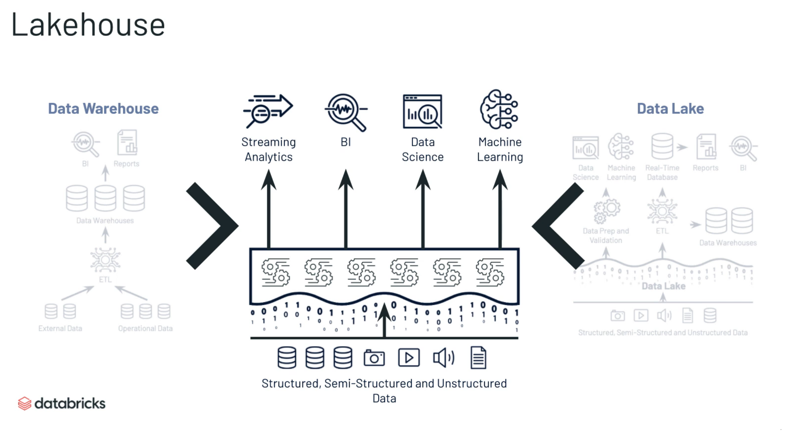

[toc]


# Databricks


# Lakehouse

One Unified Platform 




Lakehouse with Databricks


# DataLake


## Opinionated approach

Adds reliability, quality performance to Data Lakes

Brings the best of data warehousing and data lakes

Based on open source and open format(Parquet), data lake is also open source


## Challenges with data lakes


**ACID Transaction**

Can make every operation transactional and review past transactions

> all transactions are recorded and you can go back in time to review previous versions of the data

```
**hard to append data**

adding newly arrived data leads to incorrect reads


**modification of exising data is difficult**

GDPR/CCPA requires making fine grained changes to existing data lake


**Jobs failed mid way**

Half of the data appears in the data lake, the rest is missing


**real-time operations**

Mixing streaming and batch leads to inconsistency


**Costly to keep historical versions of the data**

Regulated environments require reproducibility, auditing, governance.


```


**Using Spark under the hood**

All delta lake metadata stored in open parquet format

Portions of it cached and optimized for fast access

```
**Difficult to handle large metadata**

For large data lakes the metadata itself becomes difficult to manage
```


**Indexing and automatically optimize a layout that enables fast access**

Partitioning: layout for typical queries

Data skipping: prune files based on statistics on numericals

Z-ordering: layout to optimize multiple columns

```
Too many files problems**

Data lake  are file based, which are not grat at handling millions of small files


**Hard to get great performance**

Partitioning the data for performance is error-prone and difficult to change
```


**Support Schema validation and evolution**

All data in Delta tables have to adhere to a strict schema

Includes schema evolution in merge operations

> ```
> MERGE INTO events USING changes ON events.id = changes.id
> WHEN MATCHED THEN 
> UPDATE SET *
> WHEN NOT MATCHED THEN
> INSERT *
> ```
>
> 

```
Data quality issues**

It's a constant headache to ensure that all the data is correct and high quality
```


# Delta Lake Architecture


## Delta Storage Layer


# Appendix

https://databricks.com/p/thank-you/webinar-databricks-on-aws-3-part-training-series-140125


 [Lakehouse-with-Databricks.dbc](databricks.assets/Lakehouse-with-Databricks.dbc) 

 [MLflow-with-LH.dbc](databricks.assets/MLflow-with-LH.dbc) 