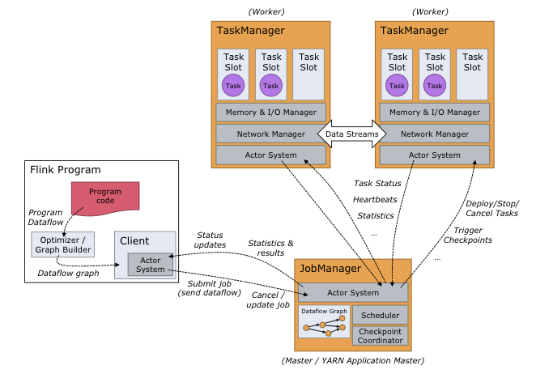

[TOC]


# Flink

前面说Spark Streaming是将实时数据流按时间分段后，当作小的批处理数据去计算。那么Flink则相反，一开始就是按照流处理计算去设计的。当把从文件系统（HDFS）中读入的数据也当做数据流看待，他就变成批处理系统了。

为什么Flink既可以流处理又可以批处理呢？

如果要进行流计算，Flink会初始化一个流执行环境StreamExecutionEnvironment，然后利用这个执行环境构建数据流DataStream。

```
StreamExecutionEnvironment see = StreamExecutionEnvironment.getExecutionEnvironment();

DataStream<WikipediaEditEvent> edits = see.addSource(new WikipediaEditsSource());
```

如果要进行批处理计算，Flink会初始化一个批处理执行环境ExecutionEnvironment，然后利用这个环境构建数据集DataSet。

```
ExecutionEnvironment env = ExecutionEnvironment.getExecutionEnvironment();

DataSet<String> text = env.readTextFile("/path/to/file");
```

然后在DataStream或者DataSet上执行各种数据转换操作（transformation），这点很像Spark。不管是流处理还是批处理，Flink运行时的执行引擎是相同的，只是数据源不同而已。

Flink处理实时数据流的方式跟Spark Streaming也很相似，也是将流数据分段后，一小批一小批地处理。流处理算是Flink里的“一等公民”，Flink对流处理的支持也更加完善，它可以对数据流执行window操作，将数据流切分到一个一个的window里，进而进行计算。

在数据流上执行

```
.timeWindow(Time.seconds(10))
```

可以将数据切分到一个10秒的时间窗口，进一步对这个窗口里的一批数据进行统计汇总。

Flink的架构和Hadoop 1或者Yarn看起来也很像，JobManager是Flink集群的管理者，Flink程序提交给JobManager后，JobManager检查集群中所有TaskManager的资源利用状况，如果有空闲TaskSlot（任务槽），就将计算任务分配给它执行。





