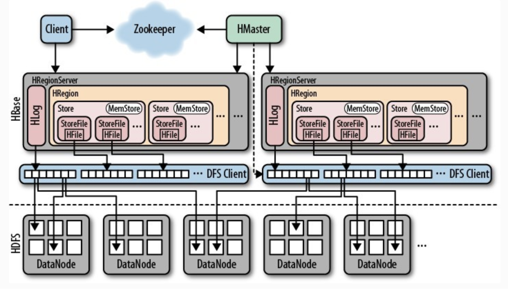
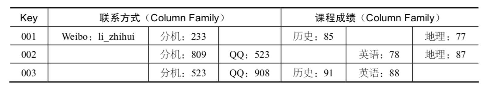
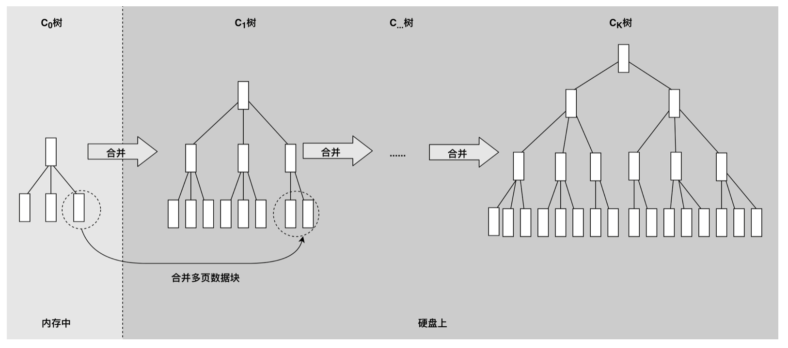

[TOC]

# NoSQL

NoSQL，主要指非关系的、分布式的、支持海量数据存储的数据库设计模式。也有许多专家将 NoSQL解读为Not Only SQL，表示NoSQL只是关系数据库的补充，而不是替代方案。其中，HBase是这一类NoSQL系统的杰出代表。

# HBase

HBase的原型是Google的BigTable论文，受到了该论文思想的启发，目前作为Hadoop的子项目来开发维护，用于支持结构化的数据存储。

HBase是一个高可靠性、高性能、面向列、可伸缩的分布式存储系统，利用HBASE技术可在廉价PC Server上搭建起大规模结构化存储集群。

HBase之所以能够具有海量数据处理能力，其根本在于和传统关系型数据库设计的不同思路。
传统关系型数据库对存储在其上的数据有很多约束，学习关系数据库都要学习数据库设计范式，事实上，是在数据存储中包含了一部分业务逻辑。

而NoSQL数据库则简单暴力地认为，数据库就是存储数据的，业务逻辑应该由应用程序去处理

## 特点

* 海量存储
    Hbase适合存储PB级别的海量数据，在PB级别的数据以及采用廉价PC存储的情况下，能在几十到百毫秒内返回数据。这与Hbase的极易扩展性息息相关。正式因为Hbase良好的扩展性，才为海量数据的存储提供了便利。

* 列式存储
    这里的列式存储其实说的是列族（ColumnFamily）存储，Hbase是根据列族来存储数据的。列族下面可以有非常多的列，列族在创建表的时候就必须指定。

* 极易扩展
    Hbase的扩展性主要体现在两个方面，一个是基于上层处理能力（RegionServer）的扩展，一个是基于存储的扩展（HDFS）。
通过横向添加RegionSever的机器，进行水平扩展，提升Hbase上层的处理能力，提升Hbsae服务更多Region的能力。
    备注：RegionServer的作用是管理region、承接业务的访问，这个后面会详细的介绍通过横向添加Datanode的机器，进行存储层扩容，提升Hbase的数据存储能力和提升后端存储的读写能力。

* 高并发（多核）
    由于目前大部分使用Hbase的架构，都是采用的廉价PC，因此单个IO的延迟其实并不小，一般在几十到上百ms之间。这里说的高并发，主要是在并发的情况下，Hbase的单个IO延迟下降并不多。能获得高并发、低延迟的服务。

* 稀疏
    稀疏主要是针对Hbase列的灵活性，在列族中，你可以指定任意多的列，在列数据为空的情况下，是不会占用存储空间的。

# 架构

HBase的伸缩性主要依赖其可分裂的HRegion及可伸缩的分布式文件系统HDFS实现。

## Client 应用程序

Client包含了访问Hbase的接口，另外Client还维护了对应的cache来加速Hbase的访问，比如cache的.META.元数据的信息。

## Zookeeper

HBase通过Zookeeper来做master的高可用、RegionServer的监控、元数据的入口以及集群配置的维护等工作。具体工作如下：
通过Zoopkeeper来保证集群中只有1个master在运行，如果master异常，会通过竞争机制产生新的master提供服务
通过Zoopkeeper来监控RegionServer的状态，当RegionSevrer有异常的时候，通过回调的形式通知Master RegionServer上下线的信息
通过Zoopkeeper存储元数据的统一入口地址

## Hmaster（NameNode）


为RegionServer分配Region
维护整个集群的负载均衡
维护集群的元数据信息
（所有HRegion的信息，包括存储的Key值区间、所在HRegionServer地址、访问端口号等）

若发现失效的Region，将失效的Region分配到正常的RegionServer上

若发现失效的RegionSever，协调对应Hlog的拆分

为了保证HMaster的高可用，HBase会启动多个HMaster，并通过ZooKeeper选举出一个主服务器。

## HRegionServer(DataNode)

HRegionServer直接对接用户的读写请求，是真正的“干活”的节点。它的功能概括如下：
管理master为其分配的Region
处理来自客户端的读写请求
负责和底层HDFS的交互，存储数据到HDFS
负责Region变大以后的拆分
负责Storefile的合并工作

每个HRegionServer上可以启动多个HRegion实例。当一个 HRegion中写入的数据太多，达到配置的阈值时，一个HRegion会分裂成两个HRegion，并将HRegion在整个集群中进行迁移，以使HRegionServer的负载均衡。

## HRegion

HRegion是HBase负责数据存储的主要进程，应用程序对数据的读写操作都是通过和HRegion通信完成。

数据以HRegion为单位进行管理，也就是说应用程序如果想要访问一个数据，必须先找到HRegion，然后将数据读写操作提交给HRegion，由HRegion完成存储层面的数据操作。

当一个HRegion中数据量太多时，这个HRegion连同HFile会分裂成两个HRegion，并根据集群中服务器负载进行迁移。如果集群中有新加入的服务器，也就是说有了新的HRegionServer，由于其负载较低，也会把HRegion迁移过去并记录到HMaster，从而实现HBase的线性伸缩。

## HDFS

HDFS为Hbase提供最终的底层数据存储服务，同时为HBase提供高可用（Hlog存储在HDFS）的支持，具体功能概括如下：
提供元数据和表数据的底层分布式存储服务
数据多副本，保证的高可靠和高可用性

# HBase可扩展数据模型

能够做到可扩展的数据结构设计, 并不用修改表结构就可以新增字段。许多NoSQL数据库使用的列族（ColumnFamily）设计就是其中一个解决方案。

## ColumnFamily 

表中不同学生的联系方式各不相同，选修的课程也不同， 而且将来还会有更多联系方式和课程加入到这张表里，如果按照传统的关系数据库设计，无论提前预设多少冗余字段都会捉襟见肘、疲于应付。

使用支持列族结构的NoSQL数据库，在创建表的时候，只需要指定列族的名字，无需指定字段（Column）。那什么时候指定字段呢？可以在数据写入时再指定。通过这种方式，数据表可以包含数百万的字段，这样就可以随意扩展应用程序的数据结构了。并且这种数据库在查询时也很方便，可以通过指定任意字段名称和值进行查询。

HBase这种列族的数据结构设计，实际上是把字段的名称和字段的值，以Key-Value的方式一起存储在HBase中。实际写入的时候，可以随意指定字段名称，即使有几百万个字段也能轻松应对。

### 缺点

1.列族不好查询，没有传统sql那样按照不同字段方便，只能根据rowkey查询，范围查询scan性能低

2.查询也没有mysql一样的走索引优化，因为列不固定， 在需要读取整条记录的时候，需要访问多个列族组合数据，效率会降低，可以通过字段冗余来解决一些问题 

3.列族因为不固定，所以很难做一些业务约束，比如uk等等

4.做不了事务控制 

5.只能提供Key值和全表扫描两种访问方式，很多情况下需要自己建耳机索引。

6.数据是非结构化，或者说是半结构化的，应用在处理数据时要费点心，不像关系数据库那么省心。

在数据完全结构化，很少变动，需要事务的场景使用Mysql等关系数据库比较合适。 

# HBase的高性能存储

为了提高数据写入速度，HBase使用了一种叫作**LSM树**的数据结构进行数据存储。LSM树的全名是Log Structed Merge Tree，翻译过来就是Log结构合并树。数据写入的时候以Log方式连续写入，然后异步对磁盘上的多个LSM树进行合并。

LSM树可以看作是一个N阶合并树。数据写操作（包括插入、修改、删除）都在内存中进行，并且都会创建一个新记录（修改会记录新的数据值，而删除会记录一个删除标志）。这些数据在内存中仍然还是一棵排序树，当数据量超过设定的内存阈值后，会将这棵排序树和磁盘上最新的排序树合并。当这棵排序树的数据量也超过设定阈值后，会和磁盘上下一级的排序树合并。合并过程中，会用最新更新的数据覆盖旧的数据（或者记录为不同版本）。

在需要进行读操作时，总是从内存中的排序树开始搜索，如果没有找到，就从磁盘 上的排序树顺序查找。

在LSM树上进行一次数据更新不需要磁盘访问，在内存即可完成。当数据访问以写操作为主，而读操作则集中在最近写入的数据上时，使用LSM树可以极大程度地减少磁盘的访问次数，加快访问速度。

# Appendix

https://towardsdatascience.com/hbase-working-principle-a-part-of-hadoop-architecture-fbe0453a031b

