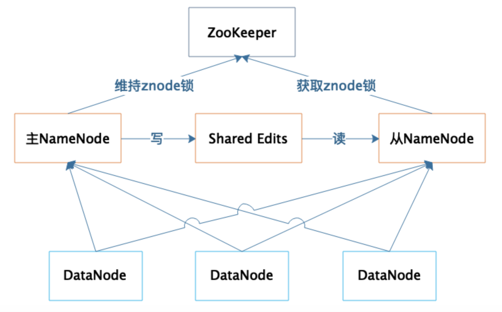
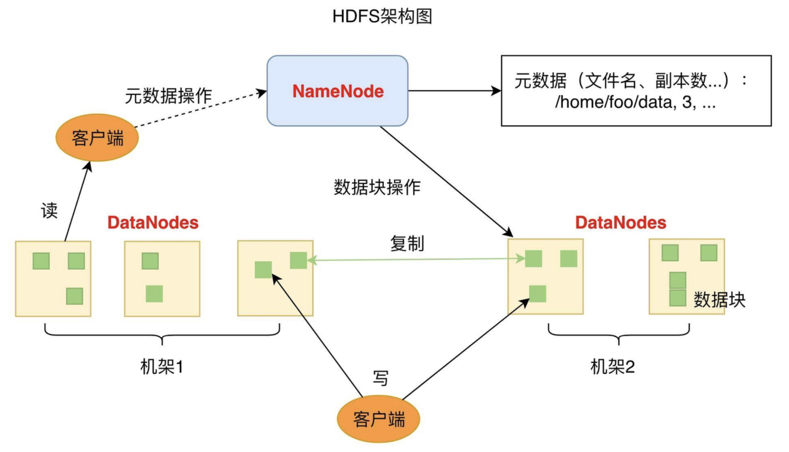
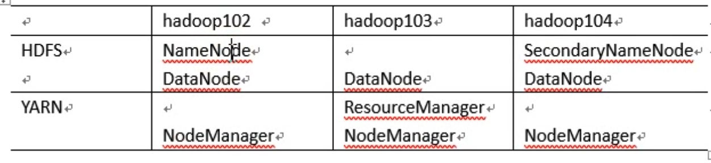

[TOC]


# HDFS

Hadoop Distributed File System 分布式文件管理系统的一种

这些年来，各种计算框架、各种算法、各种应用场景不断推陈出新，但是大数据存储的王者依然是HDFS


## 特点

HDFS作为最早的大数据存储系统，存储着宝贵的数据资产，各种新的算法、框架要想得到人们的广泛使用，必须支持HDFS才能获取已经存储在里面的数据。

适合一次写入，多次读出的场景，且不支持文件的修改

不适合低延迟数据访问，比如毫秒级别的存储

无法高效的对大量小文件进行存储

不支持并发写入，文件随机修改，仅仅支持数据的append操作，并且一个文件只能有一个写


## 高可用设计

### 数据存储故障容错

磁盘介质在存储过程中受环境或者老化影响，其存储的数据可能会出现错乱。HDFS的应对措施是，对于存储在DataNode上的数据块，计算并存储校验和（CheckSum）。在读取数据的时候，重新计算读取出来的数据的校验和，如果校验不正确就抛出异常，应用程序捕获异常后就到其他DataNode上读取备份数据。


### 磁盘故障容错

如果DataNode监测到本机的某块磁盘损坏，就将该块磁盘上存储的所有BlockID报告给NameNode，NameNode检查这些数据块还在哪些DataNode上有备份，通知相应的DataNode服务器将对应的数据块复制到其他服务器上，以保证数据块的备份数满足要求。


### DataNode故障容错

DataNode会通过心跳和NameNode保持通信，如果DataNode超时未发送心跳，NameNode就会认为这个DataNode已经宕机失效，立即查找这个DataNode上存储的数据块有哪些，以及这些数据块还存储在哪些服务器上，随后通知这些服务器再复制一份数据块到其他服务器上，保证HDFS存储的数据块备份数符合用户设置的数目，即使再出现服务器宕机，也不会丢失数据。


### NameNode故障容错

NameNode是整个HDFS的核心，记录着HDFS文件分配表信息，所有的文件路径和数据块存储信息都保存在NameNode，如果NameNode故障，整个HDFS系统集群都无法使用；如果NameNode上记录的数据丢失，整个集群所有DataNode存储的数据也就没用了。


#### NameNode 高可用

NameNode高可用容错能力非常重要。NameNode采用主从热备的方式提供高可用服务




集群部署两台NameNode服务器，一台作为主服务器提供服务，一台作为从服务器进行热备，两台服务器通过ZooKeeper选举，主要是通过争夺znode锁资源，决定谁是主服务器。而DataNode则会向两个NameNode同时发送心跳数据，但是只有主NameNode才能向DataNode返回控制信息。

正常运行期间，主从NameNode之间通过一个共享存储系统shared edits来同步文件系统的元数据信息。当主NameNode服务器宕机，从NameNode会通过ZooKeeper升级成为主服务器，并保证HDFS集群的元数据信息，也就是文件分配表信息完整一致。


# 原理

和RAID在多个磁盘上进行文件存储及并行读写的思路一样，HDFS是在一个大规模分布式服务器集群上，对数据分片后进行并行读写及冗余存储。因为HDFS可以部署在一个比较大的服务器集群上，集群中所有服务器的磁盘都可供HDFS使用，所以整个HDFS的存储空间可以达到PB级容量。




## NameNode

NameNode负责整个分布式文件系统的元数据（MetaData）管理，也就是文件名，文件路径名，文件属性(生成时间，副本数，文件权限) 数据块的ID以及存储位置等信息

HDFS为了保证数据的高可用，会将一个数据块复制为多份（缺省情况为3份），并将多份相同的数据块存储在不同的服务器上，甚至不同的机架上。这样当有磁盘损坏，或者某个DataNode服务器宕机，甚至某个交换机宕机，导致其存储的数据块不能访问的时候，客户端会查找其备份的数据块进行访问。


### Secondary NameNode (非热备)

并非NameNode热备，在其挂掉的时候接管并提供服务

主要是分担NameNode工作，如定期合并Fsimage和Edits，并推送给NameNode


## DataNode

DataNode负责文件数据的存储和读写操作，HDFS将文件数据分割成若干数据块（Block），每个DataNode存储一部分数据块，这样文件就分布存储在整个HDFS服务器集群中

应用程序客户端（Client）可以并行对这些数据块进行访问，从而使得HDFS可以在服务器集群规模上实现数据并行访问，极大地提高了访问速度。


在实践中，HDFS集群的DataNode服务器会有很多台，一般在几百台到几千台这样的规模，每台服务器配有数块磁盘，整个集群的存储容量大概在几PB到数百PB。


### block

默认block大小是128M (Hadoop 2.x)，这个数值是因为目前磁盘普遍的传输速率是100MB/s

块太小，寻址时间过长，

块太大，从磁盘传输数据的时间会明显大于定位这个块开始位置所需的时间，导致程序在处理数据块会非常慢

所以HDFS的块大小设置取决于磁盘的传输速率

# Installation 分布式




```
mkdir /opt/module /opt/software

cd /opt/software
wget https://archive.apache.org/dist/hadoop/common/hadoop-2.7.2/hadoop-2.7.2.tar.gz
wget http://178.254.55.57/res/ext/java/jse/jdk-8u144-linux-x64.tar.gz

[root@hadoop101 software]# tar -zxf jdk-8u144-linux-x64.tar.gz -C /opt/module/
[root@hadoop101 software]# tar -zxf hadoop-2.7.2.tar.gz -C /opt/module/
```


```
vim /etc/profile

export JAVA_HOME=/opt/module/jdk1.8.0_144
export PATH=$PATH:$JAVA_HOME/bin
export HADOOP_HOME=/opt/module/hadoop-2.7.2
export PATH=$PATH:$HADOOP_HOME/bin:$HADOOP_HOME/sbin


source /etc/profile

# java -version
java version "1.8.0_144"
Java(TM) SE Runtime Environment (build 1.8.0_144-b01)
Java HotSpot(TM) 64-Bit Server VM (build 25.144-b01, mixed mode)

# hadoop version
Hadoop 2.7.2
Subversion https://git-wip-us.apache.org/repos/asf/hadoop.git -r b165c4fe8a74265c792ce23f546c64604acf0e41
Compiled by jenkins on 2016-01-26T00:08Z
Compiled with protoc 2.5.0
From source with checksum d0fda26633fa762bff87ec759ebe689c
This command was run using /opt/module/hadoop-2.7.2/share/hadoop/common/hadoop-common-2.7.2.jar
```


```
[root@hadoop101 hadoop]# ll
total 28
drwxr-xr-x. 6 10011 10011 4096 Jan 26  2016 common
drwxr-xr-x. 7 10011 10011 4096 Jan 26  2016 hdfs
drwxr-xr-x. 3 10011 10011 4096 Jan 26  2016 httpfs
drwxr-xr-x. 3 10011 10011 4096 Jan 26  2016 kms
drwxr-xr-x. 5 10011 10011 4096 Jan 26  2016 mapreduce
drwxr-xr-x. 5 10011 10011 4096 Jan 26  2016 tools
drwxr-xr-x. 5 10011 10011 4096 Jan 26  2016 yarn
[root@hadoop101 hadoop]# pwd
/opt/module/hadoop-2.7.2/share/hadoop
```

> hadoop jar 包位置在hdfs下面


# Installation 伪分布式

single-node in a pseudo-distributed mode

https://archive.cloudera.com/cdh5/cdh/5/hadoop-2.6.0-cdh5.7.0/hadoop-project-dist/hadoop-common/SingleCluster.html

```
yum -y install vim
```


## jdk

```
http://mirror.cnop.net/jdk/linux/jdk-7u79-linux-x64.tar.gz
```


```
vim /etc/hostname
vim /etc/hosts
hadoop000

mkdir -p ~/app/tmp
tar -xf jdk-7u79-linux-x64.tar.gz -C ~/app/

cp ~/.ssh/id_rsa.pub ~/.ssh/authorized_keys

vim ~/.bash_profile
export JAVA_HOME=/home/hadoop/app/jdk1.7.0_79
export PATH=$JAVA_HOME/bin:$PATH

source ~/.bash_profile
java -version
```


## hadoop

```
https://archive.cloudera.com/cdh5/cdh/5/hadoop-2.6.0-cdh5.7.0.tar.gz
```


```
tar -xf hadoop-2.6.0-cdh5.7.0.tar.gz  -C ~/app/

vim  etc/hadoop/hadoop-env.sh
export JAVA_HOME=/home/hadoop/app/jdk1.7.0_79
```


```
vim etc/hadoop/core-site.xml
<configuration>
    <property>
        <name>fs.defaultFS</name>
        <value>hdfs://hadoop000:8020</value>
    </property>
<property>
        <name>hadoop.tmp.dir</name>
        <value>/home/hadoop/app/tmp</value>
</property>
</configuration>


vim etc/hadoop/hdfs-site.xml
<configuration>
    <property>
        <name>dfs.replication</name>
        <value>1</value>
    </property>
</configuration>
```


### 启动hdfs

仅仅第一次执行即可，不需要重复执行

```
bin/hdfs namenode -format
```


启动

```
sbin/start-dfs.sh
```


检查状态

```
$ jps
11150 SecondaryNameNode
10996 DataNode
10881 NameNode
11253 Jps
```

或访问

```
http://localhost:50070
```


停止

```
sbin/stop-dfs.sh
```


```
vim ~/.bash_profile
export HADOOP_HOME=/home/hadoop/app/hadoop-2.6.0-cdh5.7.0
export PATH=$HADOOP_HOME/bin:$PATH
```


## mysql

mysql-connector-java-5.1.27-bin.jar

```
http://repo1.maven.org/maven2/mysql/mysql-connector-java/5.1.27/mysql-connector-java-5.1.27.jar
```


# HDFS 操作


## fs操作

```
bin/hadoop fs  
or
bin/hdfs dfs 
```

> dfs 是fs的实现类

本质上都是调用

```
CLASS=org.apache.hadoop.fs.FsShell
```


### local -> HDFS 

put

copyFromLocal

moveFromLocal

appendToFile


### HDFS -> HDFS

cp

mv

chown

chgrp

chmod

mkdir

du

df

cat 


### HDFS -> local

get

getmerge

copyToLocal