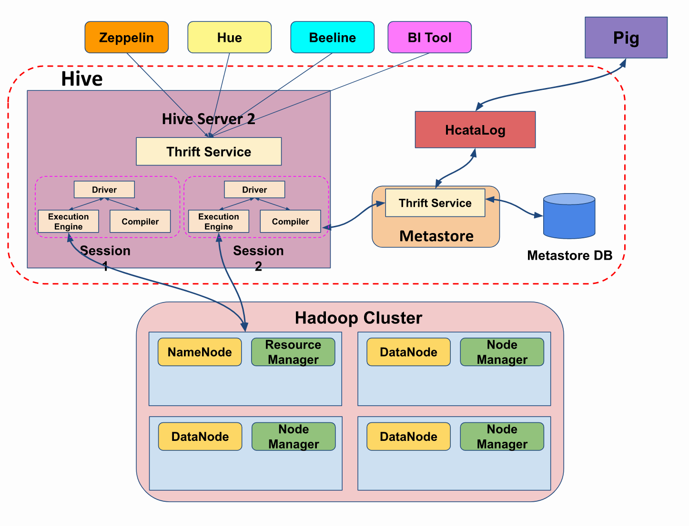
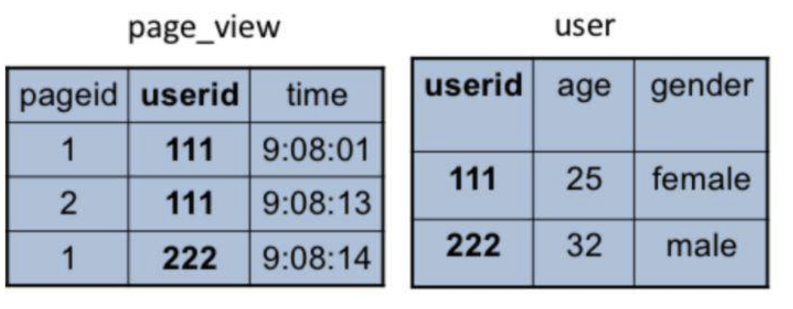
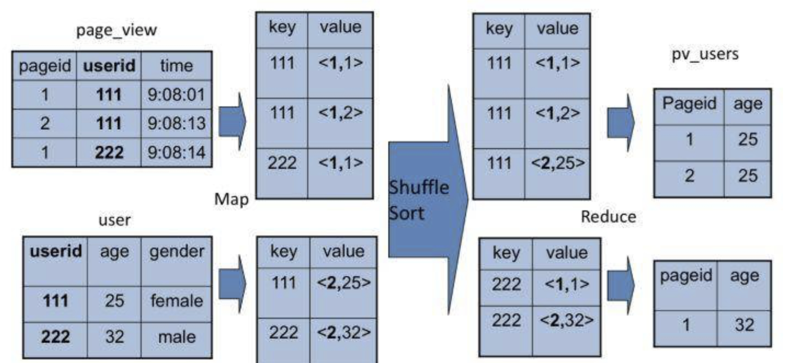

[TOC]


# Hive

由Facebook开源用于解决海量结构化日志的数据统计

基于Hadoop的一个数据仓库工具，可以将结构化的数据文件映射为一张表，并提供类SQL查询功能。


Hive处理的数据存储在HDFS

Hive分析数据底层的实现是MapReduce

执行程序运行在Yarn上


Hive内部预置了很多函数，Hive的执行计划就是根据SQL语句生成这些函数的DAG（有向无环图），然后封装进MapReduce的map和reduce函数中


## 优点

1. 操作接口采用类SQL语法，提供快速开发的能力（简单、容易上手）。
2. 避免了去写MapReduce，减少开发人员的学习成本。
3. Hive的执行延迟比较高，因此Hive常用于数据分析，对实时性要求不高的场合。
4. Hive优势在于处理大数据，对于处理小数据没有优势，因为Hive的执行延迟比较高。
5. Hive支持用户自定义函数，用户可以根据自己的需求来实现自己的函数。


## 缺点

1．Hive的HQL表达能力有限

（1）迭代式算法无法表达

（2）数据挖掘方面不擅长，由于MapReduce数据处理流程的限制，效率更高的算法却无法实现。

2．Hive的效率比较低

（1）Hive自动生成的MapReduce作业，通常情况下不够智能化

（2）Hive调优比较困难，粒度较粗


# 架构

Hive能够直接处理我们输入的SQL语句（Hive的SQL语法和数据库标准SQL略有不同），调用MapReduce计算框架完成数据分析操作。




## client

通过Hive的Client（Hive的命令行工具，JDBC等）向Hive提交SQL命令


## metastore

这个组件通常用一个关系数据库实现, 记录包括：表名、表所属的数据库（默认是default）、表的拥有者、列/分区字段、表的类型（是否是外部表）、表的数据所在目录等；


如果我们提交的是查询分析数据的DQL（数据查询语句），Driver就会将该语句提交给自己的编译器Compiler进行语法分析、语法解析、语法优化等一系列操作，最后生成一个MapReduce执行计划。然后根据执行计划生成一个MapReduce的作业，提交给Hadoop MapReduce计算框架处理。


## Hive join操作



两张表都有一个相同的字段userid，根据这个字段可以将两张表连接起来，生成前面例子的pv_users表，SQL命令是

```mysql
SELECT pv.pageid, u.age FROM page_view pv JOIN user u ON (pv.userid = u.userid);
```





join涉及两张表，来自两个文件（夹），所以需要在map输出的时候进行标记，比如来自第一张表的输出Value就记录为<1, X>，这里的1表示数据来自第一张表。这样经过shuffle以后，相同的Key被输入到同一个reduce函数，就可以根据表的标记对Value数据求笛卡尔积，用第一张表的每条记录和第二张表的每条记录连接，输出就是join的结果。


# Hive QL

标准SQL和Hive QL的差别主要有两个方面，一个是语法表达方式，Hive QL语法和标准SQL语法略有不同；另一个是Hive QL支持的语法元素比标准SQL要少很多，比如，数据仓库领域主要的测试集[TPC-H](http://www.tpc.org/tpch/)所有的SQL语句Hive都不支持。尤其是是Hive不支持复杂的嵌套子查询，而对于数据仓库分析而言，嵌套子查询几乎是无处不在的。比如下面这样的SQL，在where查询条件existes里面包含了另一条SQL语句。

```
select o_orderpriority, count(*) as order_count 
from orders 
where o_orderdate >= date '[DATE]' 
and o_orderdate < date '[DATE]' + interval '3' month 
and exists 
( select * from lineitem 
where l_orderkey = o_orderkey and l_commitdate < l_receiptdate ) 
group by o_orderpriority order by o_orderpriority;
```


SQL的理论基础是关系代数，而关系代数的主要操作只有5种，分别是并、差、积、选择、投影。所有的SQL语句最后都能用这5种操作组合完成。而一个嵌套子查询可以等价转换成一个连接（join）操作。

比如这条SQL

```
select s_grade from staff where s_city not in (select p_city from proj where s_empname=p_pname)
```

这是一个在where条件里嵌套了not in子查询的SQL语句，它可以用left outer join和left semi join进行等价转换，示例如下，这是Panthera自动转换完成得到的等价SQL。这条SQL语句不再包含嵌套子查询，

```
select panthera_10.panthera_1 as s_grade from (select panthera_1, panthera_4, panthera_6, s_empname, s_city from (select s_grade as panthera_1, s_city as panthera_4, s_empname as panthera_6, s_empname as s_empname, s_city as s_city from staff) panthera_14 left outer join (select panthera_16.panthera_7 as panthera_7, panthera_16.panthera_8 as panthera_8, panthera_16.panthera_9 as panthera_9, panthera_16.panthera_12 as panthera_12, panthera_16.panthera_13 as panthera_13 from (select panthera_0.panthera_1 as panthera_7, panthera_0.panthera_4 as panthera_8, panthera_0.panthera_6 as panthera_9, panthera_0.s_empname as panthera_12, panthera_0.s_city as panthera_13 from (select s_grade as panthera_1, s_city as panthera_4, s_empname as panthera_6, s_empname, s_city from staff) panthera_0 left semi join (select p_city as panthera_3, p_pname as panthera_5 from proj) panthera_2 on (panthera_0.panthera_4 = panthera_2.panthera_3) and (panthera_0.panthera_6 = panthera_2.panthera_5) where true) panthera_16 group by panthera_16.panthera_7, panthera_16.panthera_8, panthera_16.panthera_9, panthera_16.panthera_12, panthera_16.panthera_13) panthera_15 on ((((panthera_14.panthera_1 <=> panthera_15.panthera_7) and (panthera_14.panthera_4 <=> panthera_15.panthera_8)) and (panthera_14.panthera_6 <=> panthera_15.panthera_9)) and (panthera_14.s_empname <=> panthera_15.panthera_12)) and (panthera_14.s_city <=> panthera_15.panthera_13) where ((((panthera_15.panthera_7 is null) and (panthera_15.panthera_8 is null)) and (panthera_15.panthera_9 is null)) and (panthera_15.panthera_12 is null)) and (panthera_15.panthera_13 is null)) panthera_10 ;
```


