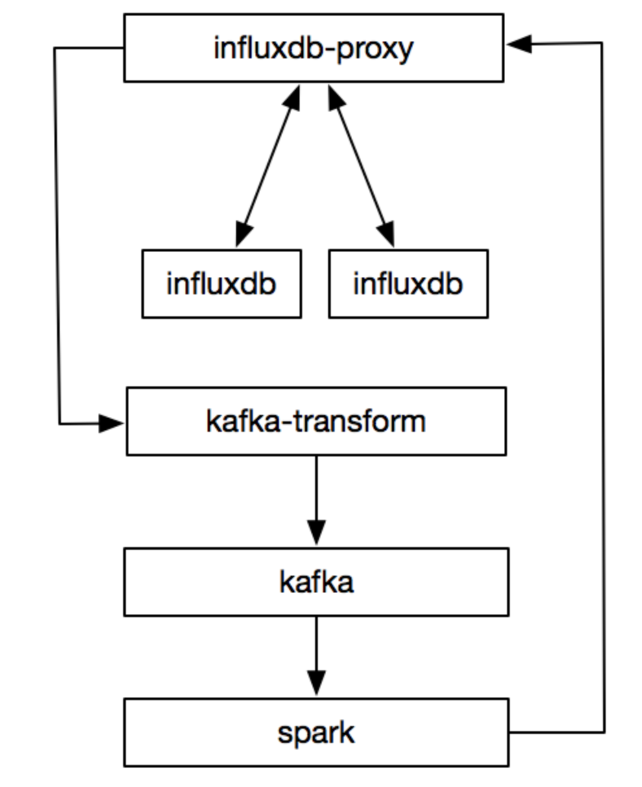

[toc]


# 时序数据

按照时间顺序记录系统、设备状态变化的数据被称为时序数据（Time Series Data）

时序数据以时间作为主要的查询纬度，通常会将连续的多个时序数据绘制成线，制作基于时间的多纬度报表，用于揭示数据背后的趋势、规律、异常，进行实时在线预测和预警


传统数据库通常记录数据的当前值，时序型数据库则记录所有的历史数据，在处理当前时序数据时又要不断接收新的时序数据，同时时序数据的查询也总是以时间为基础查询条件，并专注于解决以下海量数据场景的问题

- **时序数据的写入：**如何支持千万级/秒数据的写入。
- **时序数据的读取：**如何支持千万级/秒数据的聚合和查询。
- **成本敏感：**海量数据存储带来的是成本问题，如何更低成本地存储这些数据，是时序型数据库需要解决的关键问题。


## 特点

抵达的数据几乎总是作为新条目被记录，无更新操作。

数据通常按照时间顺序抵达。

时间是一个主坐标轴。

# influxDB

InfluxDB是一个开源的、高性能的时序型数据库，在时序型数据库DB-Engines Ranking上排名第一

讲到InfluxDB，就不能不提InfluxData的**开源高性能时序中台TICK**（Telegraf + InfluxDB + Chronograf + Kapacitor），InfluxDB是作为TICK的存储系统进行设计和开发的。

ICK专注于DevOps监控、IoT监控、实时分析等应用场景，是一个集成了采集、存储、分析、可视化等能力的开源时序中台，由Telegraf、 InfluxDB、Chronograf、Kapacitor 4个组件以一种灵活松散但紧密配合、互为补充的方式构成，各个模块相互配合、互为补充，整体系统架构


## TICK

Telegraf可以通过配置文件的配置，采集当前运行主机的指定指标，如CPU负载、内存使用等，也可以从第三方消费者服务（如StatsD、Kafka等）拉取数据，上报到已支持的多种存储系统、服务或消息队列，如InfluxDB、Graphite、OpenTSDB、Datadog、Librato、Kafka、MQTT、NSQ等。

InfluxDB是专注于时序数据场景（如DevOps监控、IoT监控、实时分析等）的高性能时序型数据库，支持灵活的自定义保留策略和类SQL的操作接口

Chronograf是可视化的、BS架构的管理系统，可用于配置和管理接收到的监控数据、告警，并支持通过灵活强大的模块和库，快速配置数据可视化仪表盘、告警规则、可视化规则。

Kapacitor是从零构建的原生数据处理引擎，支持流式处理和批量处理，支持灵活强大的自定义功能，如定义新的告警阈值、告警指标特征、告警统计异常特征等，以及后续的告警处理行为。

除了灵活，Kapacitor也很开放，能灵活地集成对接第三系统，如HipChat、OpsGenie、Alerta、Sensu、PagerDuty、Slack等。


# Hello World

**一条CPU利率的时序数据**

```
> insert cpu_usage,host=server01,location=cn-sz user=23.0,system=57.0
> select * from cpu_usage
name: cpu_usage
time host location system user
---- ---- -------- ------ ----
1557834774258860710 server01 cn-sz 55 25
>
```

> **时间（Time）：**如代码清单1-3中的“1557834774258860710”，表示数据生成时的时间戳，与MySQL不同的是，在InfluxDB中，时间几乎可以看作主键的代名词。
>
> **表（Measurement）：**如代码清单1-3中的“cpu_usage”，表示一组有关联的时序数据，类似于MySQL中表（Table）的概念。
>
> **标签（Tag）：**如代码清单1-3中的“host=server01”和“location=cn-sz”，用于创建索引，提升查询性能，一般存放的是标示数据点来源的属性信息，在代码清单1-3中，host和location分别是表中的两个标签键，对应的标签值分别为server01和cn-sz。
>
> **指标（Field）：**如代码清单1-3中的“user=23.0”和“system=57.0”，一般存放的是具体的时序数据，即随着时间戳的变化而变化的数据，与标签不同的是，未对指标数据创建索引，在代码清单1-3中，user和system分别是表中的两个指标键，对应的指标值分别为23.0和57.0。
>
> **时序数据记录（Point）：**如代码清单1-3中的“1557834774258860710 server01 cn-sz 55 25”，表示一条具体的时序数据记录，由时序（Series）和时间戳（Timestamp）唯一标识，类似于MySQL中的一行记录。
>
> **保留策略（Retention Policy）：**定义InfluxDB的数据保留时长和数据存储的副本数，通过设置合理的保存时间（Duration） 和副本数（Replication），在提升数据存储可用性的同时，避免数据爆炸。
>
> **时间序列线（Series）：**表示表名、保留策略、标签集都相同的一组数据。


# 基本概念

## Database

数据库是个逻辑容器，包含了measurement、retention policies、continuous queries、time series data，类似于mysql的database。


## Measurement

描述了相关数据的存储结构，类似于mysql的table，但是不需要创建，写入数据的时候自动创建。


## Line Protocol

Line Protocol定义了influxdb的数据写入格式


## Tag

上面的location和server就是tag key，us和host1是tag value，tag是可选的。不过写入数据时最好加上tag，因为它可以被索引。tag的类型只能是字符串。

在InfluxDB中，表中Tags组合会被作为记录的主键，因此主键并不唯一，所有时序查询最终都会基于主键查询之后再经过时间戳过滤完成。

内存中有索引。

用于快速查找group等操作。

Tags 在内存中索引，提供快速的查询和分组功能。缺点是如果有太多不同的tag, 需要的内存资源会不断攀升。


## Field

上面的temperature是field key，82是field value。field value会用于展示，value支持的类型有floats，integers，strings，booleans。

没有索引


## Timestamp

格式是：RFC3339 UTC。默认精确到纳秒，可选。


## Series

measurement, tag set, retention policy相同的数据集合算做一个 series。理解这个概念至关重要，因为这些数据存储在内存中，如果series太多，会导致OOM。

在存储数据到InfluxDB之前，我们需要设计哪个字段作为tag, 那个字段作为field。 每一个series在内存中存储了一个反向索引(也叫倒排索引，给定关键词，找出包含关键词的文档)， 这就表明series的规模决定了计算机的配置。


## Retention Policy

保留策略包括设置数据保存的时间以及在集群中的副本个数。默认配置是：RP是autogen，保留时间是永久，副本为1。这些配置在创建数据库时可以修改。


## Continuous Query

CQ是预先配置好的一些查询命令，定期自动执行这些命令并将查询结果写入指定的measurement中，这个功能主要用于数据聚合。具体参考：CQ。


## Shard

存储一定时间间隔的数据，每个目录对应一个shard，目录的名字就是shard id。每一个shard都有自己的cache、wal、tsm file以及compactor，目的就是通过时间来快速定位到要查询数据的相关资源，加速查询的过程，并且也让之后的批量删除数据的操作变得非常简单且高效。


## 存储引擎

TSM Tree是在LSM Tree的基础上稍作修改优化而来。它主要包含四个部分：cache、wal、tsm file、compactor。

- Cache：插入数据时，先往cache中写入再写入wal中，可以认为cache是wal文件中的数据在内存中的缓存。
- WAL：预写日志，对比mysql的binlog。其作用就是为了持久化数据，当系统崩溃后可以通过wal文件恢复cache。influxdb启动时会加载wal的数据到内存。
- TSM File：每个tsm文件的大小上限是2GB。当达到cache-snapshot-memory-size,cache-max-memory-size的限制时会触发将cache写入tsm文件。
- Compactor：主要进行两种操作，一种是cache数据达到阀值后，进行快照，生成一个新的tsm文件。另外一种就是合并当前的tsm文件，将多个小的tsm文件合并成一个，减少文件的数量，并且进行一些数据删除操作。 这些操作都在后台自动完成。


# 设计模式

- 名字不要包含特殊字符，比如\，$，=，,，”等等。
- 名字避免关键字，不能是time，名字统一小写。
- 各个部门/模块的measurement name有个统一的前缀，方便维护。
- 不要在一个tag里存储多个信息。
- field的类型一旦写入最好不要修改，默认是float，如果是字符串，需要加双引号。
- measurement的名字和tag set的总长度不要超过65536。


## tag

一般来说，你的查询可以指引你哪些数据放在tag中，哪些放在field中。

- 把你经常查询的字段作为tag
- 如果你要对其使用GROUP BY()，也要放在tag中
- 如果你要对其使用InfluxQL函数，则将其放到field中
- 如果你需要存储的值不是字符串，则需要放到field中，因为tag value只能是字符串
- tag的名字和值不要太长，名字和值的长度越长，占用的内存越多。


## series tag

不要有太多的series tags包含高度可变的信息，如UUID，哈希值和随机字符串，这将导致数据库中的大量series, series cardinality高是许多数据库高内存使用的主要原因。因为这些数据都是存储在内存里，会导致OOM (理解series概念)。


## 确定tag / field

下面5点确定是tag还是field：

- 数值的规模很大，那就是field
- 如果要作为where的条件，那应该作为tag。 field可以作为条件，但是效率很差。
- 如果要作为group by的条件，那需要作为tag, field不能进行group by。
- 如果需要做数学运算(如mean, percentile, stddev), 那必须是field。 tag的值不能进行数学运算。
- 如果需要存储数据的类型(int, float, string, boolean), 必须是filed. tag只能是字符串。

# 目录结构

InfluxDB的数据存储有三个目录，分别是meta、wal、data。

meta用于存储数据库的一些元数据，meta目录下有一个meta.db文件。

wal目录存放预写日志文件，以.wal结尾。

data目录存放实际存储的数据文件，以.tsm结尾。


## 存储及备份

wal和data文件夹需要在存储设备上分开，并且只给influxdb使用。当系统处于大量写入负载下时，此优化可显着减少磁盘争用。 如果写入负载高度变化，这是一个重要的考虑因素。

将data, wal独立磁盘后，查询10000条记录的时间从270ms左右减少到170ms左右。

参考文档: https://docs.influxdata.com/influxdb/v1.7/guides/hardware_sizing/

# 实践

gateway用于检测和压缩influxdb的数据，用于跨机房传输，采用udp接受数据。

influxdb-relay是官方提供的高可用方案，但是它只提供简单的写入功能。

influxdb-proxy是用于替代influxdb-relay的高可用方案。


## influxdb-proxy

influxdb-proxy是为了解决上面的使用问题而开发出来的。具有以下功能：

- 同时支持写和查询功能，统一接入点，类似cluster。
- 支持重写功能，写入失败时写入文件，后端恢复时再写入。
- 限制部分查询命令和全部删除操作。
- 以measurement为粒度区分数据，支持按需订阅。
- measurement优先精确匹配，然后前缀匹配。
- 提供数据统计，比如qps，耗时等等。


## 数据聚合

influxdb提供数据聚合的功能，就是上面基本概念里提到的Continuous Query。预先定义好cq，就可以定期根据不同的tag进行聚合数据。目前它有个设计问题：cq是顺序执行的，cq越多，数据延迟越高，一般延迟在几分钟内。如果需要更实时的聚合，cq不能满足，需要引入其他工具，比如Spark。


## Spark

经过内部调研，发现spark+kafka是个更好的聚合方案。spark支持流式处理且支持sql功能，我们只需要将cq改成sql就行。目前这个处于尝试阶段，已经上线部分功能。目前的处理流程如下





## influxDB-HA


实践总结：对于超过10万样本数据的查询操作而言，我们通过索引（即influxdb中的tag）查询将能够节省机器性能，大大降低查询时间。查询操作往往耗死机器的根本原因是：OOM（Out Of Memory）

那么在配置CQ时，应该：

- 尽可能使用tag；
- 应该拿写好的CQ充分模拟线上环境的测试，证明性能没问题后再上线。


retention policy：

配置数据的留存策略好处是数据持久化，但数据量较大时劣势也非常明显，会占用很大的CPU，造成读写数据异常。所以配置RP时我们必须注意：

- 尽量在读写并发量较小的时刻去操作；
- 可以在influxdb slave库中反复设置RP实践出最佳方式再上线


# Influxdb vs Prometheus

- influxdb集成已有的概念，比如查询语法类似sql，引擎从LSM优化而来，学习成本相对低。
- influxdb支持的类型有float，integers，strings，booleans，prometheus目前只支持float。
- influxdb的时间精度是纳秒，prometheus的则是毫秒。
- influxdb仅仅是个数据库，而prometheus提供的是整套监控解决方案，当然influxdb也提供了整套监控解决方案。
- influxdb支持的math function比较少，prometheus相对来说更多，influxdb就目前使用上已经满足功能。
- 2015年prometheus还在开发阶段，相对来说influxdb更加稳定。
- influxdb支持event log，prometheus不支持。
- 更详细的对比请参考：对比（https://db-engines.com/en/system/Graphite%3BInfluxDB%3BPrometheus）


# example

## docker compose 

```

mkdir -p /vol01/Docker/monitoring/
cd /vol01/Docker/monitoring/

docker network create monitor_network

docker volume create influxdb-volume
docker volume create grafana-volume
```


docker-compose.yml

```
version: "2"
services:
  grafana:
    image: grafana/grafana
    container_name: grafana_container
    restart: always
    ports:
      - 3000:3000
    networks:
      - monitoring_network
    volumes:
      - grafana-volume:/var/lib/grafana
  influxdb:
    image: influxdb
    container_name: influxdb_container
    restart: always
    ports:
      - 8086:8086
    networks:
      - monitoring_network
    volumes:
      - influxdb-volume:/var/lib/influxdb
networks:
  monitoring_network:
volumes:
  grafana-volume:
    external: true
  influxdb-volume:
    external: true
```


another one(need verify)

```
root@vault:/vol01/Docker/monitoring# cat docker-compose.yml
version: "2"
services:
  grafana:
    image: grafana/grafana
    container_name: grafana
    restart: always
    ports:
      - 3000:3000
    networks:
      - monitoring
    volumes:
      - grafana-volume:/vol01/Docker/monitoring
  influxdb:
    image: influxdb
    container_name: influxdb
    restart: always
    ports:
      - 8086:8086
    networks:
      - monitoring
    volumes:
      - influxdb-volume:/vol01/Docker/monitoring
    environment:
      - INFLUXDB_DB=telegraf
      - INFLUXDB_USER=telegraf
      - INFLUXDB_ADMIN_ENABLED=true

      - INFLUXDB_ADMIN_USER=admin
      - INFLUXDB_ADMIN_PASSWORD=Welcome1 
  telegraf:
    image: telegraf
    container_name: telegraf
    restart: always
    extra_hosts:
     - "influxdb:192.168.0.110"
    environment:
      HOST_PROC: /rootfs/proc
      HOST_SYS: /rootfs/sys
      HOST_ETC: /rootfs/etc
    volumes:
     - ./telegraf.conf:/etc/telegraf/telegraf.conf:ro
     - /var/run/docker.sock:/var/run/docker.sock:ro
     - /sys:/rootfs/sys:ro
     - /proc:/rootfs/proc:ro
     - /etc:/rootfs/etc:ro
networks:
  monitoring:
volumes:
  grafana-volume:
    external: true
  influxdb-volume:
    external: true
```


## setup

Enter the host IP and port 3000 and you are ready to start
To enter Grafana, the default user and password is "admin"


### Add Sample Data to InfluxDB

```
docker exec -it influxdb_container sh
 
influx
 
create database telegraf
```


configuration -> Data Sources


## telegraf

使用以下命令会将telegraf采集的数据默认输出到终端，依次来检验配置的监控项是否是自己所期望的指标。

```
telegraf -config /etc/telegraf/telegraf.conf -input-filter docker -test   
```


