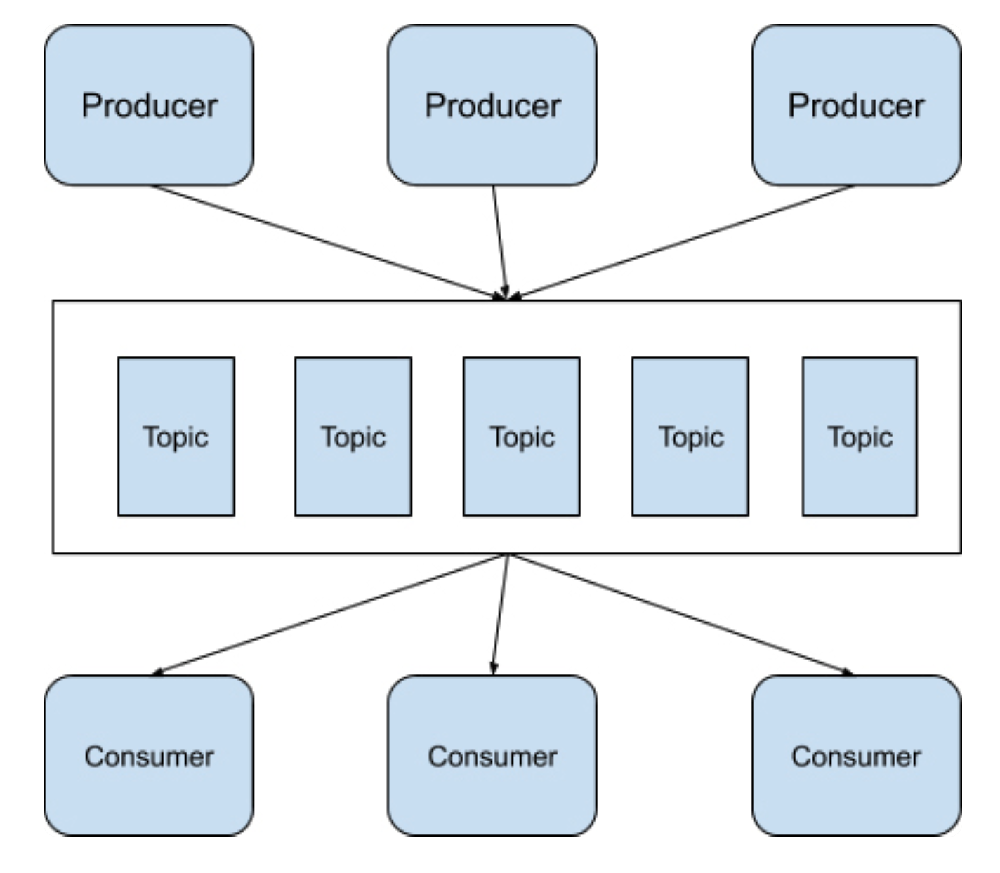

[toc]

# Kafka

在 Apache Kafka 中，消息的发送方被称为 Producer，消息的接收方被称为 Consumer，而消息队列被称为 Topic。

## log offset

Apache Kafka 在判断消息是否被接收方接收是利用了 Log offset 机制。

假设发送方连续发送了 5 条数据到消息队列 Topics 中，这 5 条消息被编号为 10000、10001、10002、10003 和 10004。

如果接收方读取数据之后回应消息队列它接收的 Log offset 是 10000、10001 和 10003，那么消息队列就会认为接收方最多只接收了消息 10000 和 10001，剩下的消息 10002、10003 和 10004 则会继续发送给接收方，直到接收方回应接收了消息 10002、10003 和 10004。

