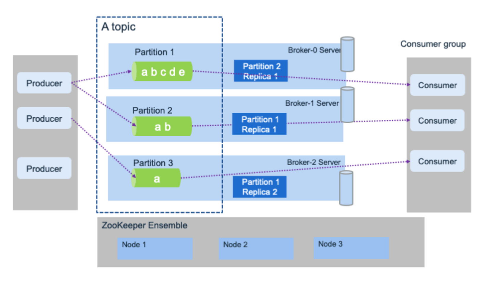

[toc]

# Kafka

在 Apache Kafka 中，消息的发送方被称为 Producer，消息的接收方被称为 Consumer，而消息队列被称为 Topic。

# 架构

## Producer 
消息生产者，就是向kafka broker发消息的客户端

## Consumer 
消息消费者，向kafka broker取消息的客户端

## Consumer Group 
消费者组，由多个consumer组成。消费者组内每个消费者负责消费不同分区的数据，一个分区只能由一个消费者消费；

消费者组之间互不影响。所有的消费者都属于某个消费者组，即消费者组是逻辑上的一个订阅者。

## Broker 
一台kafka服务器就是一个broker。一个集群由多个broker组成。一个broker可以容纳多个topic。

## Topic (队列)
可以理解为一个队列，生产者和消费者面向的都是一个topic

## Partition
为了实现扩展性，一个非常大的topic可以分布到多个broker（即服务器）上，一个topic可以分为多个partition，每个partition是一个有序的队列；

## Replica
副本，为保证集群中的某个节点发生故障时，该节点上的partition数据不丢失，且kafka仍然能够继续工作，kafka提供了副本机制，一个topic的每个分区都有若干个副本，一个leader和若干个follower。

## leader

每个分区多个副本的“主”，生产者发送数据的对象，以及消费者消费数据的对象都是leader。

## follower

每个分区多个副本中的“从”，实时从leader中同步数据，保持和leader数据的同步。leader发生故障时，某个follower会成为新的follower。

## log offset

Apache Kafka 在判断消息是否被接收方接收是利用了 Log offset 机制。

假设发送方连续发送了 5 条数据到消息队列 Topics 中，这 5 条消息被编号为 10000、10001、10002、10003 和 10004。

如果接收方读取数据之后回应消息队列它接收的 Log offset 是 10000、10001 和 10003，那么消息队列就会认为接收方最多只接收了消息 10000 和 10001，剩下的消息 10002、10003 和 10004 则会继续发送给接收方，直到接收方回应接收了消息 10002、10003 和 10004。

