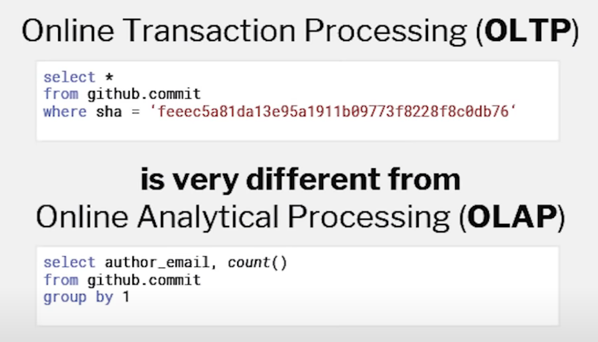
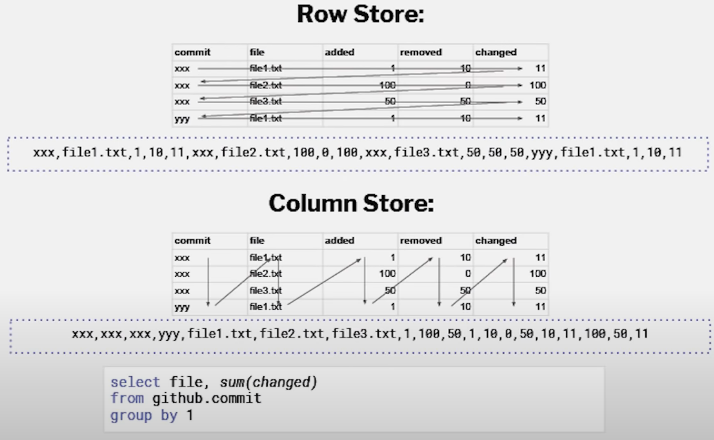

[TOC]

# OLAP

OLAP (on-line analytical processing) 联机分析处理，这一概念是由关系型数据库之父E.F.Codd于1993年提出的。20世纪60年代末Codd提出关系型数据模型以后，关系型数据库与OLTP（on-line transaction processing）得到了快速的发展。

## OLAP 特性

OLAP技术是面向分析人员、管理人员的，提供分析人员、管理人员快速直观访问数据的一种途径。使分析人员、管理人员能直观的从海量数据中获得有用信息以提供决策依据。

OLAP技术对数据访问通常是只读的，并且一次访问大量数据，OLAP技术主要是针对海量数据的查询，通常不对数据做修改。这种数据访问有别于OLTP中不断的对数据进行增删改操作。同时这种查询不是简单的记录属性的检索，而是为了从海量数据中获取有用信息的针对大量数据的查询，通常一次需要查询会涉及到上百万条以上数据。

OLAP技术是面向主题的多维数据分析技术。

主题涉及业务流程的方方面面，是分析人员、管理人员进行进行决策分析所关心的角度。分析人员、管理人员使用OLAP技术，正是为了从多个角度观察数据，从不同的主题分析数据，最终直观的得到有效的信息。

## OLAP 常用操作

### 普通钻取 	roll up、drill down

包括上卷（roll up）与下钻（drill down）。这两种操作不改变观察的角度（维度），而是改变观察数据的颗粒大小。

上卷是从维的细节层向颗粒较大高层钻取，以便宏观把握数据的汇总情况；

下钻是从维的高层向颗粒较小的细节层钻取，以便观察数据明细情况。

举例来说：某电信运营商在分析2003年总体话务量时发现全年话务量为100亿分钟，这除了说明全年的总体话务量情况，不能说明任何问题。现在分析人员想进一步了解2003年各个月份的话务量情况，就必须针对时间维度进行下钻操作，以看到颗粒较细的月份数据。反之就必须进行上卷钻取。

### 穿透钻取 	drillthrough

穿透钻取是指从一个模型钻透到另一个模型。举例来说：某电信运营商发现本月通话时长下降5%，经过下钻发现是IP的本月通话时长下降了20%带动了整个通话时长下降3%，为了找到IP的通话时长下降的具体原因就需要钻取到面向IP业务的分析主题，详尽分析通话时长下降原因。这种跨越模型的钻取就称为穿透钻取。

### 切片和切块 	slice and dice

切片与切块是指选择某一些维度的具体类别，分析该类别的数据关于其他维的情况。

举例来说：某烟草公司分析发现2002年全年烟草销售为10亿元，现在想了解2002年中华（软）这种规格的卷烟在第一季度的销售情况，就必须针对时间维度选择第一季度，针对卷烟规格维度选择中华（软），通过这样的切块的方式可以观察相关维度的具体类别（如本例中的中华（软）在第一季度）的数据状况，分析这些数据得出有效的信息，以针对这些具体类别进行针对性的决策。当仅针对一个维度进行切块时称为切片。

### 旋转 	pivot

旋转是指分析人员为了根直观的观察数据集在不同维之间的关系，改变其显示的维方向，以对多维数据集中不同维进行交换显示。

## OLAP 存储方式

分析离不开数据，如何有效的组织数据对分析的效率与灵活性至关重要，而效率与灵活性正是OLAP技术要提高的两个最主要指标。

主流的数据组织方式有3种：基于关系型数据库的；基于多维数据库的；基于关系型数据库与多维数据库的混合方式

### ROLAP	基于关系型数据库的

RelationalOLAP 表示基于的数据存储在传统的关系型数据库中。每一个ROLAP分析模型基于关系型数据库中一些相关的表。这些相关的表中有反映观察角度的维度表，有含有指标值的事实表，这些表在关系型数据库中通过外健相互关联

典型的组织模型有星型模型与雪花型模型。星型模型的组织形式是一张包含指标项与维度编码的事实表与一些维度表，事实表在中间通过维度编码与周围的维度表关联；雪花型模型较星型模型更规范，将维度表中非主属性健码分离出来形成一张新的维度信息表关联到维码信息表（精减后的维度表），在通过维码信息表关联中间事实表。雪花型模型是星型模型的扩展。

### MOLAP	基于多维数据库的

MultidimensionalOLAP 表示基于的数据存储在多维数据库中。多维数据库有时也称数据立方体。多维数据库可以用一个多维数组表示。举例来说：包含时间维度、地区维度、品牌维度、销售指标的数据模型通过多维数据集合可表示成（时间维度、地区维度、品牌维度、销售指标）。通过这种方式表示数据可以极大提高查询的性能。

### HOLAP	基于关系型数据库与多维数据库的

Hybrid OLAP 

ROLAP查询性能较MOLAP慢，存储却较MOLAP节省。这两种方式的OLAP技术各有利弊，为了同时兼有MOLAP与ROLAP的优点，提出一种HOLAP将数据存储混合，粒度较大的高层数据存储在多维数据库中，粒度较小的细节层数据存储在关系型数据库中。这种HOLAP具有更好的灵活性。

# ClickHouse

ClickHouse 是由号称“俄罗斯 Google”的 Yandex 开发而来，在 2016 年开源，在计算引擎里算是一个后起之秀，在内存数据库领域号称是最快的。

ClickHouse 是一个列导向数据库，是原生的向量化执行引擎。它在大数据领域没有走 Hadoop 生态，而是采用 Local attached storage 作为存储，这样整个 IO 可能就没有 Hadoop 那一套的局限。

# OLAP vs OLTP

OLTP: go and get one row or a few rows from all columns

OLAP: scan through all kind of data sets every time and look at particular columns

 

## Row store vs Column store

Row Store: MySQL, Postgresql , transaction Database use this 

Column Store: OLAP character like Redshift, Snowflake, BigQuery

# Data Warehouse

## Data Warehouse Query Challenges

**Maximising Query Performance**: Which means minimising the time taken for SQL queries to complete.

**Maximising Throughput**: Batch ETL or ELT tasks must complete as quickly as possible which means running multiple processes in parallel to make best use of machine resources.

**Maximising Machine Usage**: To make efficient use of machine resources, the warehouse should ideally be run at 100% CPU capacity. Clearly this often conflicts with the two priorities above, but running at any less is a waste of multi-million-dollar CPU resources. Unlike a car, a computer system won’t last any longer if it’s sitting idle most of the time.

**Micro-Batch ETL and ELT Processes:** Which typically run on a repeating cycle. The machine tends to be overloaded during this time, either at or above 100% capacity in an attempt to process and deliver new data as quickly as possible.

**Business Intelligence Reporting:** Which tends to be erratic, with load varying between zero and maximum capacity throughout the day.

**Dashboard Queries:** Which need very fast (sub-second) performance. Machine load in these cases is extremely unpredictable, but when the capacity is needed, results must be available immediately.

## Potential Performance Tuning Options

**Limit Resource Usage**: Use increasingly aggressive workload management to control the number of concurrent online queries and batch tasks.

**Database and Application Tuning**: Often the most effective way to improve SQL throughput, this requires deep understanding of database design principles. Even with highly skilled engineers, it can take months to deliver meaningful results. In my case it took a team of three experts almost a year to completely resolve the performance issues.

**Scale Up Hardware**: Which involves additional memory, CPUs or faster disk storage or even migrating the entire application to a new, larger machine. And this can take months to complete. A typical data warehouse system can have a huge number of incoming and outgoing data feeds, many undocumented, and the preparation, testing and migration process can take considerable time. Clearly, this is not a sustainable long term strategy.

**Scale Out Hardware**: Which is an option for Massively Parallel Processing (MPP) architectures, which involves adding nodes to the existing system.

## The Ideal Cloud Data Warehouse Platform

**Fast to Deploy**: As the solution is provided as a cloud based service, a data warehouse can be deployed within minutes without installing new hardware or even a long term financial commitment.

**Complete Flexibility**: Additional nodes can be scaled up or down as needed. You can even suspend the service when it isn’t used, with compute resources charged on a per-second basis. You can automatically start up additional clusters immediately without any data reorganisation. The entire operation can run without DBA involvement.

**Pay Separately for Storage**: As storage is charged separately from compute resources, it is possible to scale up to petabyte sizes, but pay only for the storage and processing power on an as-needed basis. This differs greatly from MPP solutions like Teradata or Vertica where adding nodes adds to both compute and storage at the same time.

**Zero Contention**: With the ability to allocate multiple clusters of varying sized virtual warehouses to different tasks, there is no contention for compute resources. This would allow ETL/ELT processes to run completely separately from end user queries while also being shielded from the massively unpredictable analytic query demands of data scientists.

**Absolute Simplicity**: Unlike the legacy database solutions, there is no indexing, partitioning or data sharding go manage. There are also no query plan statistics to capture, and almost no options to tune the system. It just works.

