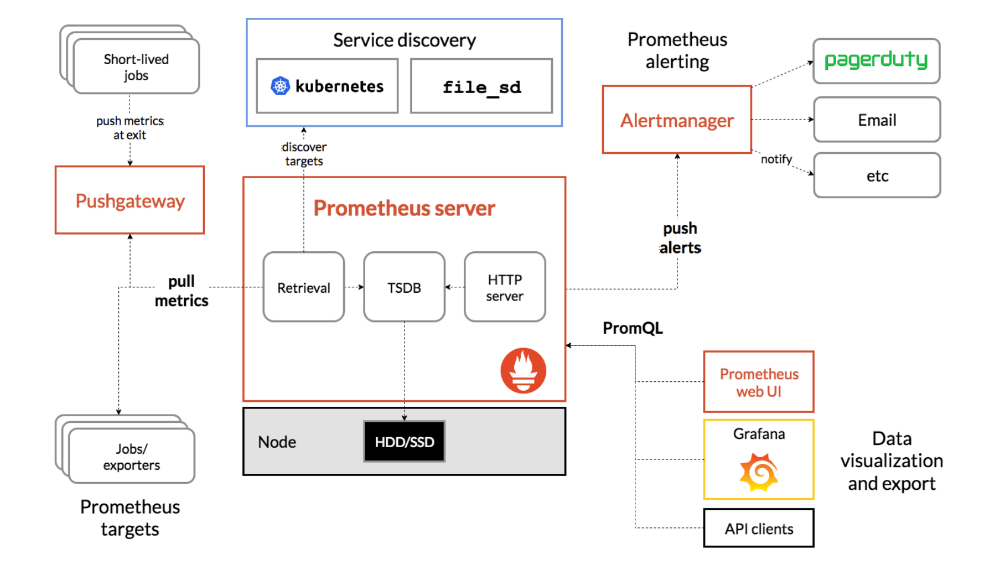
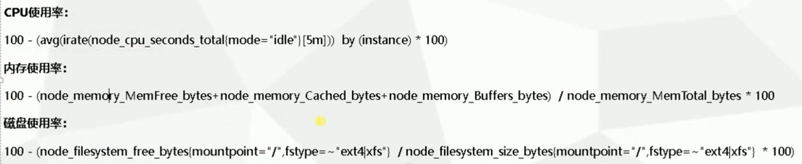

[toc]


# Prometheus 


##  监控内容


## 架构




## 数据模型

所有的数据存储为时间序列，具有相同度量名称以及标签属于同一个指标

每一个时间序列都由度量标准名称和一组键值（标签）对作为唯一标识

```
<metric name>{<label name>=<label value>, ...}
```

```
api_http_requests.total{method="POST", handler="/messages"}
```


## 指标类型


# installation

## linux

```
wget https://github.com/prometheus/prometheus/releases/download/v2.20.0/prometheus-2.20.0.linux-amd64.tar.gz
tar -xf prometheus-2.20.0.linux-amd64.tar.gz
ln -s prometheus-2.20.0.linux-amd64 prometheus
```


Save the following basic Prometheus configuration as a file named `prometheus.yml`, by default it already contained this file

```
global:
  scrape_interval:     15s # By default, scrape targets every 15 seconds.

  # Attach these labels to any time series or alerts when communicating with
  # external systems (federation, remote storage, Alertmanager).
  external_labels:
    monitor: 'codelab-monitor'

# A scrape configuration containing exactly one endpoint to scrape:
# Here it's Prometheus itself.
scrape_configs:
  # The job name is added as a label `job=<job_name>` to any timeseries scraped from this config.
  - job_name: 'prometheus'

    # Override the global default and scrape targets from this job every 5 seconds.
    scrape_interval: 5s

    static_configs:
      - targets: ['localhost:9090']
```


```
# Start Prometheus.
# By default, Prometheus stores its database in ./data (flag --storage.tsdb.path).
./prometheus --config.file=prometheus.yml
```

or

```
cat > /lib/systemd/system/prometheus.service <<EOF
[Unit]
Description=Prometheus Server
Documentation=https://prometheus.io/docs/introduction/overview/
After=network-online.target

[Service]
Restart=on-failure

#Change this line if you download the 
#Prometheus on different path user
ExecStart=/usr/local/prometheus/prometheus \
  --config.file /usr/local/prometheus/prometheus.yml 

[Install]
WantedBy=multi-user.target
EOF
```


# exporter


## node_exporter

linux 系统监控, 监听9100 端口

```
wget https://github.com/prometheus/node_exporter/releases/download/v1.0.1/node_exporter-1.0.1.linux-amd64.tar.gz
mv node_exporter /usr/local/
```


```
scrape_configs:
  # The job name is added as a label `job=<job_name>` to any timeseries scraped from this config.
  - job_name: 'prometheus'

    # metrics_path defaults to '/metrics'
    # scheme defaults to 'http'.
    file_sd_configs:
      - files: ['/usr/local/prometheus/sd_config/test.yml']
        refresh_interval: 5s

#    static_configs:
#    - targets: ['localhost:9090']
  - job_name: 'node'
    file_sd_configs:
      - files: ['/usr/local/prometheus/sd_config/node.yml']
        refresh_interval: 5s
```

```
# cat sd_config/node.yml 
- targets:
  - target_ip:9100
```


```
cat > /lib/systemd/system/node_exporter.service <<EOF
[Unit]
Description=node_exporter
After=network.target 

[Service]
ExecStart=/usr/local/node_exporter/node_exporter \
          --web.listen-address=:9100\
          --collector.systemd\
          --collector.systemd.unit-whitelist=(sshd|nginx).service\
          --collector.processes\
          --collector.tcpstat\
          --collector.supervisord
[Install]
WantedBy=multi-user.target
EOF
```


### 通过query获取指标




### --collector.systemd监控服务状态

```
node_exporter --collector.systemd --collector.systemd.unit-whitelist=(docker|sshd|nginx).service
```


# servicde discovery

## file_sd_configs


prometheus.yml

```
# A scrape configuration containing exactly one endpoint to scrape:
# Here it's Prometheus itself.
scrape_configs:
  # The job name is added as a label `job=<job_name>` to any timeseries scraped from this config.
  - job_name: 'prometheus'

    # metrics_path defaults to '/metrics'
    # scheme defaults to 'http'.
    file_sd_configs:
      - files: ['/usr/local/prometheus/sd_config/*.yml']
        refresh_interval: 5s

#    static_configs:
#    - targets: ['localhost:9090']
```


sd_config/test.yml

```
- targets: [localhost:9090]
  labels:
    idc: us
```


# integrate with Grafana


# promtool

## Check config

```
./promtool check config ./prometheus.yml
```

