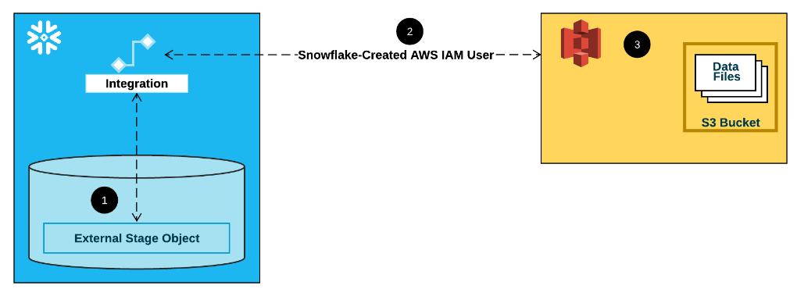

[toc]


# Snowflake

Snowflake is an analytic data warehouse provided as software-as-a-service (SaaS). Snowflake provides a data warehouse that is faster, easier to use and far more flexible than traditional data warehouse offerings.


## Preparing data load


### General File Sizing Recommendations

we recommend aiming to produce data files roughly 10 MB to 100 MB in size **compressed**. Aggregate smaller files to minimize the processing overhead for each file. Split larger files into a greater number of smaller files to distribute the load among the servers in an active warehouse. 


## load data

### Unencrypted files

128-bit or 256-bit keys

When staging unencrypted files in a Snowflake internal location, the files are automatically encrypted using 128-bit keys. 256-bit keys can be enabled (for stronger encryption); however, additional configuration is required.


### Already-encrypted files

User-supplied key

Files that are already encrypted can be loaded into Snowflake from external cloud storage; the key used to encrypt the files must be provided to Snowflake.


### Bulk Loading from Amazon S3

Use the [COPY INTO ](https://docs.snowflake.com/en/sql-reference/sql/copy-into-table.html) command to load the contents of the staged file(s) into a Snowflake database table.


Snowflake uses Amazon S3 Gateway Endpoints in each of its Amazon Virtual Private Clouds.

If the S3 bucket referenced by your external stage is in the same region as your Snowflake account, your network traffic does not traverse the public Internet. The Amazon S3 Gateway Endpoints ensure that regional traffic stays within the AWS network.


#### whitelist s3 bucket

1. Contact [Snowflake Support](https://community.snowflake.com/s/article/How-To-Submit-a-Support-Case-in-Snowflake-Lodge) to obtain the Snowflake VPC ID for the AWS region in which your account is deployed.
2. Whitelist the Snowflake VPC ID by creating an [Amazon S3 policy for a specific VPC](https://docs.aws.amazon.com/AmazonS3/latest/dev/example-bucket-policies-vpc-endpoint.html?shortFooter=true#example-bucket-policies-restrict-access-vpc).
3. Provide an AWS IAM role to Snowflake to access the whitelisted Amazon S3 bucket instead of the AWS key and secret.


### local files internally


> @csvfiles comes from `>CREATE STAGE csvfiles;`
>
> COPY those staged files into WAREHOURSE table contacts 


# Privileges


## other roles

Enabling Account Usage for Other Roles
By default, the SNOWFLAKE database is available only to the ACCOUNTADMIN role.
To enable other roles to access the database and schemas, and query the views, a user with the ACCOUNTADMIN role must grant the following data sharing privilege to the desired roles:

IMPORTED PRIVILEGES

```
use role accountadmin;

grant imported privileges on database snowflake to role sysadmin;
grant imported privileges on database snowflake to role customrole1;

use role customrole1;

select * from snowflake.account_usage.databases;
```


# terminology


## Stage

staging files into internal location called Stage

each table has stage 


### external cloud 

let named stage point to external location


#### aws s3

When you create a named stage, you can specify any part of a path. For example, create an external stage using one of the above example paths:

```
create stage my_stage url='s3://mybucket/United_States/California/Los_Angeles/' credentials=(aws_key_id='1a2b3c' aws_secret_key='4x5y6z');
```


## Storage Integration

Integrations are named, first-class Snowflake objects that avoid the need for passing explicit cloud provider credentials such as secret keys or access tokens. Integration objects store an AWS identity and access management (IAM) user ID.



1. An external (i.e. S3) stage references a storage integration object in its definition.
2. Snowflake automatically associates the storage integration with a S3 IAM user created for your account. Snowflake creates a single IAM user that is referenced by all S3 storage integrations in your Snowflake account.
3. An AWS administrator in your organization grants permissions to the IAM user to access the bucket referenced in the stage definition. Note that many external stage objects can reference different buckets and paths and use the same storage integration for authentication.


## Role management

All Snowflake users are automatically assigned the predefined PUBLIC role, which enables login to Snowflake and basic object access.

Roles can be assigned at user creation or afterwards.

The account administrator (ACCOUNTADMIN) role is the most powerful role in the system.
Assign this role to at least two users. We follow strict security procedures for resetting a forgotten or lost password for users with the ACCOUNTADMIN role.


The security administrator (SECURITYADMIN) role includes the privileges to create and manage users and roles.

The system administrator (SYSADMIN) role includes the privileges to create warehouses, databases, and all database objects (schemas, tables, etc.).


# Snowflake Architecture 


services communicate through RESTful interfaces and fall into three architectural layers: 

## Data Storage

When data is loaded into Snowflake, Snowflake reorganizes that data into its internal optimized, compressed, columnar format. Snowflake stores this optimized data using Amazon Web Service’s S3 (Simple Storage Service) cloud storage or Azure Blob Storage.

The data objects stored by Snowflake are not directly visible or accessible by customers; they are accessible only through SQL query operations run using Snowflake.


## Query processing

Query execution is performed in the processing layer. Snowflake processes queries using “virtual warehouses.” Each virtual warehouse is an MPP compute cluster composed of multiple compute nodes allocated by Snowflake from Amazon EC2 or Azure Virtual Machines.

Each virtual warehouse is an independent compute cluster that does not share compute resources with other virtual warehouses. As a result, each virtual warehouse has no impact on the performance of other virtual warehouses.


## Cloud Services 

The cloud services layer is a collection of services that coordinate activities across Snowflake. These services tie together all of the different components of Snowflake in order to process user requests, from login to query dispatch. The cloud services layer also runs on compute instances provisioned by Snowflake. 

Among the services in this layer: 

* Authentication  
* Infrastructure management 
* Metadata management 
* Query parsing and optimization 
* Access control


## Shared-nothing architectures

Shared-nothing architectures have become the dominant system architecture in high-performance data warehousing, for two main reasons: scalability and commodity hardware. In a shared-nothing architecture, every query processor node has its own local disks. Tables are horizontally partitioned across nodes and each node is only responsible for the rows on its local disks. This design scales well for star-schema queries, because very little bandwidth is required to join a small (broadcast) dimension table with a large (partitioned) fact table. And because there is little contention for shared data structures or hardware resources, there is no need for expensive, custom hardware.


In a pure shared-nothing architecture, every node has the same responsibilities and runs on the same hardware.

A pure sharednothing architecture has an important drawback though: it tightly couples compute resources and storage resources, which leads to problems in certain scenarios.


## STORAGE VERSUS COMPUTE

Snowflake separates storage and compute.

though in principle any type of blob store would suffice (Azure Blob Storage [18, 36], Google Cloud Storage [20]). To reduce network traffic between compute nodes and storage nodes, each compute node caches some table data on local disk.

local disk is used exclusively for temporary data and caches, both of which are hot (suggesting the use of high-performance storage devices such as SSDs). So, once the caches are warm, performance approaches or even exceeds that of a pure shared-nothing system. We call this novel architecture the multi-cluster, shared-data architecture


## Data Storage

using S3 or developing our own storage service based on HDFS or similar

its performance could vary, its usability, high availability, and strong durability guarantees were hard to beat.

Compared to local storage, S3 naturally has a much higher access latency and there is a higher CPU overhead associated with every single I/O request, especially if HTTPS connections are used. But more importantly, S3 is a blob store with a relatively simple HTTP(S)-based PUT/GET/DELETE interface.


These properties had a strong influence on Snowflake’s table file format and concurrency control scheme

Tables are horizontally partitioned into large, immutable files which are equivalent to blocks or pages in a traditional database system. 


It also uses S3 to store temp data generated by query operators (e.g. massive joins) once local disk space is exhausted, as well as for large query results. Spilling temp data to S3 allows the system to compute arbitrarily large queries without out-ofmemory or out-of-disk errors.


## Virtual Warehouses

The Virtual Warehouses layer consists of clusters of EC2 instances. Each such cluster is presented to its single user through an abstraction called a virtual warehouse (VW).


When a new query is submitted, each worker node in the respective VW (or a subset of the nodes if the optimizer detects a small query) spawns a new worker process. Each worker process lives only for the duration of its query

A worker process by itself—even if part of an update statement—never causes externally visible effects, because table files are immutable

each VW in turn may be running multiple concurrent queries. Every VW has access to the same shared tables, without the need to physically copy data.

It is common for Snowflake users to have several VWs for queries from different organizational units, often running continuously, and periodically launch on-demand VWs, for instance for bulk loading.


### Local Caching and File Stealing

Each worker node maintains a cache of table data on local disk. The cache is a collection of table files i.e. S3 objects that have been accessed in the past by the node. To be precise, the cache holds file headers and individual columns of files, since queries download only the columns they need.

It just sees a stream of file and column requests, and follows a simple least-recently-used (LRU) replacement policy, oblivious of individual queries. This simple scheme works surprisingly well, but we may refine it in the future to better match different workloads.

query optimizer assigns input file sets to worker nodes using consistent hashing over table file names. Subsequent or concurrent queries accessing the same table file will therefore do this on the same worker node

Snowflake relies on the LRU replacement policy to eventually replace the cache contents.

If a peer finds that it has many files left in its input file set when such a request arrives, it answers the request by transferring ownership of one remaining file for the duration and scope of the current query. The requestor then downloads the file directly from S3, not from its peer.


###  Execution Engine 

give users the best price/performance of any database-as-a-service offering on the market, so we decided to implement our own stateof-the-art SQL execution engine. The engine we have built is columnar, vectorized, and push-based.

**Columnar** storage and execution is generally considered superior to row-wise storage and execution for analytic workloads, due to more effective use of CPU caches and SIMD instructions, and more opportunities for (lightweight) compression

**Vectorized** execution means that, in contrast to MapReduce for example, Snowflake avoids materialization of intermediate results. Instead, data is processed in pipelined fashion, in batches of a few thousand rows in columnar format. This approach, pioneered by VectorWise (originally MonetDB/X100 [15]), saves I/O and greatly improves cache efficiency.

**Push-based** execution refers to the fact that relational operators push their results to their downstream operators, rather than waiting for these operators to pull data (classic Volcano-style model [27]). Push-based execution improves cache efficiency, because it removes control flow logic from tight loops [41]. It also enables Snowflake to efficiently process DAG-shaped plans, as opposed to just trees, creating additional opportunities for sharing and pipelining of intermediate results.


allow all major operators (join, group by, sort) to spill to disk and recurse when main memory is exhausted. We found that a pure main-memory engine, while leaner and perhaps faster, is too restrictive to handle all interesting workloads. Analytic workloads can feature extremely large joins or aggregations.

