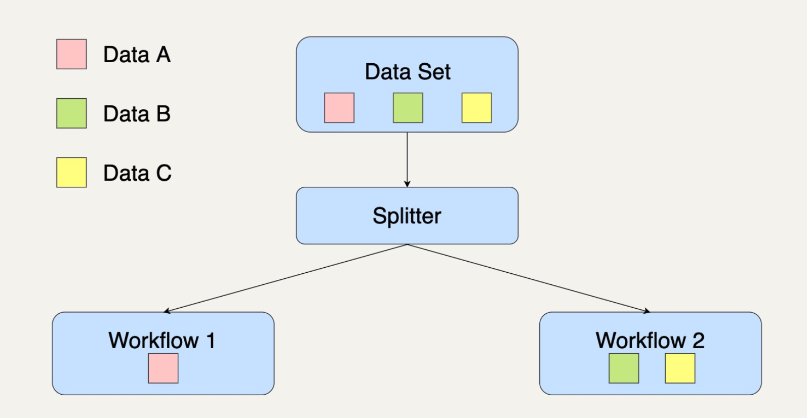

[toc]

# workflow

由多个不同的处理模块连接在一起，最后得出一个自己需要结果的有向无环图（Directed Acyclic Graph/DAG），称为一个工作流系统（Workflow System）。

## 复制模式（Copier Pattern）

复制模式通常是将单个数据处理模块中的数据，完整地复制到两个或更多的数据处理模块中，然后再由不同的数据处理模块进行处理

需要对同一个数据集采取多种不同的数据处理转换，我们就可以优先考虑采用复制模式

## 过滤模式（Filter Pattern）

过滤模式的作用是过滤掉不符合特定条件的数据。

需要针对一个数据集中某些特定的数据采取数据处理时，我们就可以优先考虑采用过滤模式。

## 分离模式（Splitter Pattern）

如果你在处理数据集时并不想丢弃里面的任何数据，而是想把数据分类为不同的类别来进行处理时，你就需要用到分离模式来处理数据

需要注意的是，分离模式并不会过滤任何数据，只是将原来的数据集分组了。

## 合并模式（Joiner Pattern）

合并模式会将多个不同的数据集转换集中到一起，成为一个总数据集，然后将这个总的数据集放在一个工作流中进行处理。

