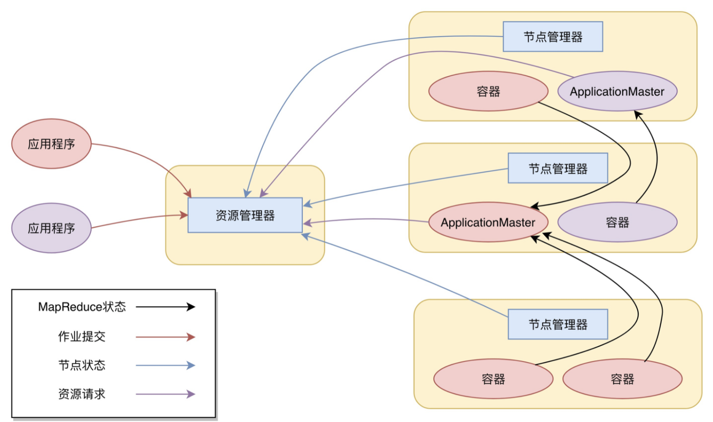
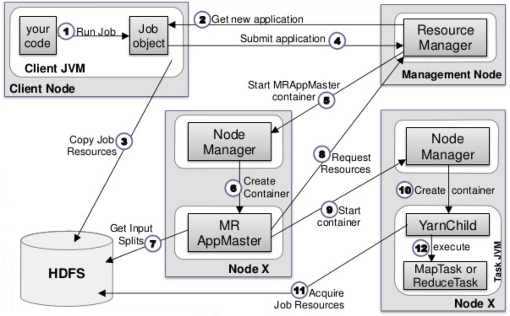

[TOC]

# Yet Another Resource Negotiator

另一种资源调度器

在分布式集群中计算大规模数据；实现了Yarn的接口规范，比如Hadoop 2的MapReduce，就可以被Yarn调度管理，统一安排服务器资源

Yarn作为一个大数据资源调度框架，调度的是大数据计算引擎本身。它不像MapReduce或Spark编程，每个大数据应用开发者都需要根据需求开发自己的MapReduce程序或者Spark程序。

不同的计算框架可以共享同一个HDFS集群上的数据，对整体资源进行调度

## Hadoop2

随着大数据技术的发展，各种新的计算框架不断出现，我们不可能为每一种计算框架部署一个服务器集群，而且就算能部署新集群，数据还是在原来集群的HDFS上。所以我们需要把MapReduce的资源管理和计算框架分开，这也是Hadoop 2最主要的变化，就是将Yarn从MapReduce中分离出来，成为一个独立的资源调度框架。

# Yarn架构

一个是资源管理器（Resource Manager），一个是节点管理器（Node Manager）。这也是Yarn的两种主要进程

## 注意点

Namenode 和ResourceManager如果不在同一台机器上，不能在NameNode启动Yarn， 应该在ResourceManager，即不能用start-all.sh 启动

## Resource Manager 常驻

ResourceManager进程负责整个集群的资源调度管理，通常部署在独立的服务器上

监听NodeManager的状态

整个集群在同一时间只有一个提供服务

启动或者监控application master

### 调度器

其实就是一个资源分配算法，根据应用程序（Client）提交的资源申请和当前服务器集群的资源状况进行资源分配。Yarn内置了几种资源调度算法，包括Fair Scheduler、Capacity Scheduler等，你也可以开发自己的资源调度算法供Yarn调用。

### 应用程序管理器

Yarn进行资源分配的单位是容器（Container），每个容器包含了一定量的内存、CPU等计算资源，默认配置下，每个容器包含一个CPU核心。容器由NodeManager进程启动和管理，NodeManger进程会监控本节点上容器的运行状况并向ResourceManger进程汇报。

应用程序管理器负责应用程序的提交、监控应用程序运行状态等。应用程序启动后需要在集群中运行一个ApplicationMaster，ApplicationMaster也需要运行在容器里面。每个应用程序启动后都会先启动自己的ApplicationMaster，由ApplicationMaster根据应用程序的资源需求进一步向ResourceManager进程申请容器资源，得到容器以后就会分发自己的应用程序代码到容器上启动，进而开始分布式计算。

 

## Node Manager 常驻

NodeManager进程负责具体服务器上的资源和任务管理，在集群的每一台计算服务器上都会启动，基本上跟HDFS的DataNode进程一起出现。

管理节点上的资源

处理ResourceManager，ApplicationMaster的命令

## Application Master 非常驻，有任务才出现

每个应用程序对应一个， 如MapReduce，Spark

任务的监控和容错，数据的切分，为应用程序申请资源

负责应用程序的管理，为应用程序向Resource Manager申请资源，分配给内部的Task

需要与Node Manager通信，启动/停止container中的task， Application Mater也是运行在container中

## Container 非常驻，有任务才出现

yarn中资源的抽象，封装了CPU，Memory等资源的容器

## Client

提交作业

查询作业的运行进度

# Yarn 执行过程

