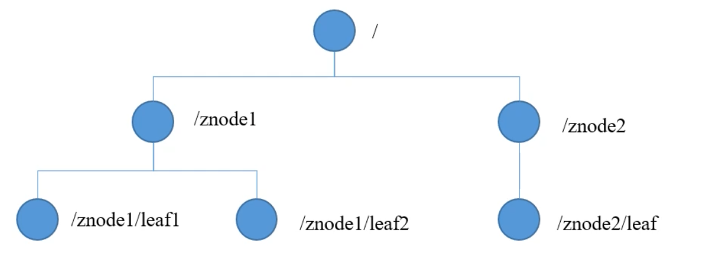
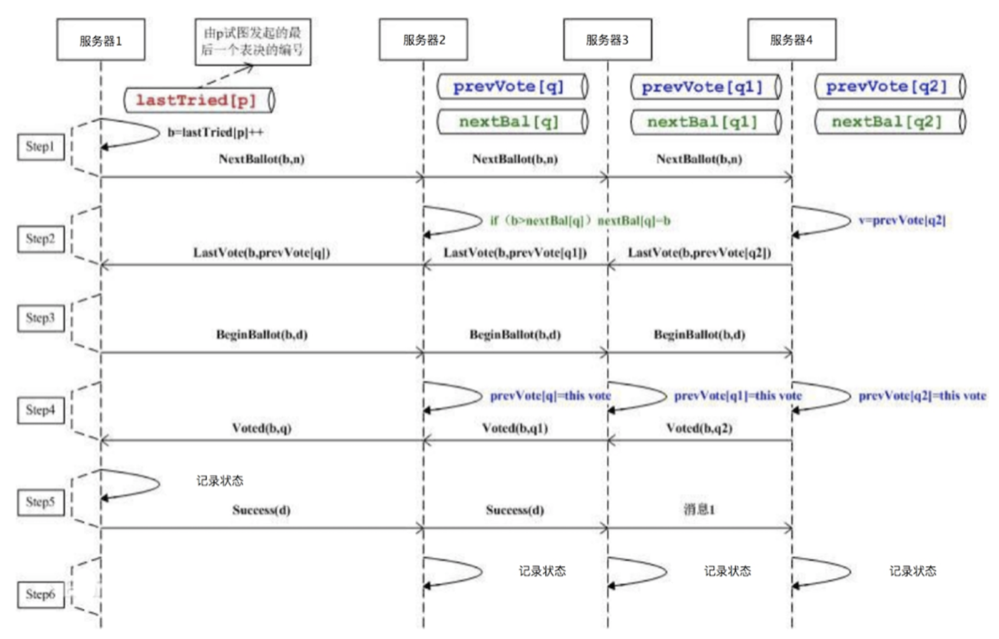
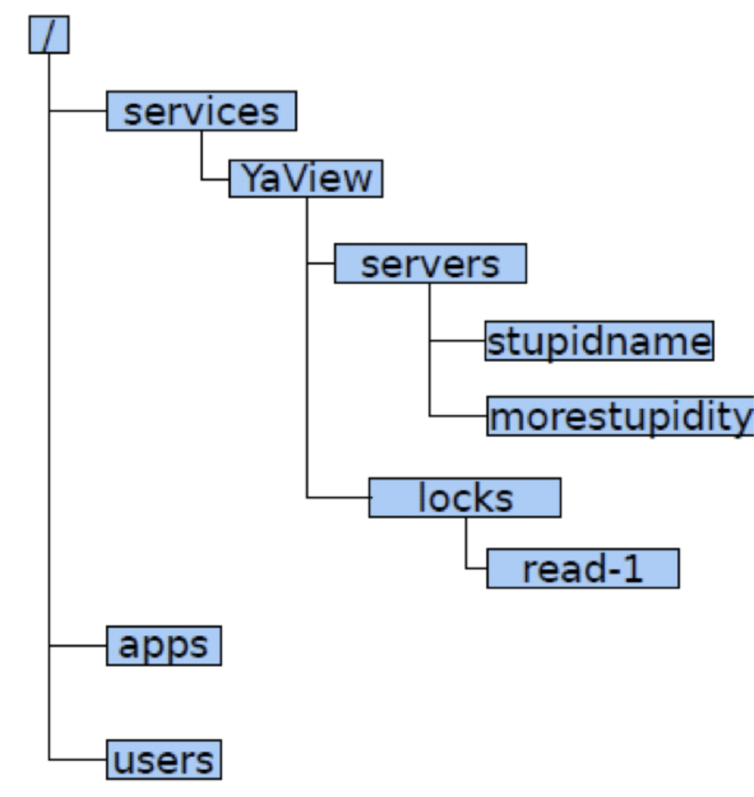

[TOC]

# ZooKeeper

常用的多台服务器状态一致性的解决方案

为分布式应用提供协调服务组件，如Hadoop和HBase的重要组件

## 工作机制

基于观察者模式设计的分布式服务管理框架，负责存储和管理大家都关心的数据，然后接受观察者的注册，一旦数据发生变化，Zookeeper就将负责同志已经在Zookeeper上注册的那些观察者做出相应的反应操作

## 特点

全局数据一致，每一个server节点保存一份相同的数据副本，Client无论从哪个server获取数据都是一致的

更新请求顺序进行，来自同一个Client的更新请求按照其发送的顺序执行

数据更新原子性，要么成功，要么失败

## 架构

一个Leader和多个Follower组成的集群

Leader负责进行投票的发起和决议，更新系统状态

Follower用户接收客户请求并向客户端返回结果，在选举Leader过程中参与投票

只要集群中有半数以上的节点存活，Zookeeper就能正常服务

## 数据结构

与Unix文件系统类似，整体上可以看作一棵树，每一个节点 称作ZNode，每一个ZNode默认能够存储1MB的数据，每一个ZNode可以通过其路径唯一标识

## Paxos 算法

Paxos算法就是用来解决这类问题的，多台服务器通过内部的投票表决机制决定一个数据的更新与写入。

应用程序连接到任意一台服务器后提起状态修改请求（也可以是获得某个状态锁的请求），从图上看也就是服务器1，会将这个请求发送给集群中其他服务器进行表决。如果某个服务器同时收到了另一个应用程序同样的修改请求，它可能会拒绝服务器1的表决，并且自己也发起一个同样的表决请求，那么其他服务器就会根据时间戳和服务器排序规则进行表决。

表决结果会发送给其他所有服务器，最终发起表决的服务器也就是服务器1，会根据收到的表决结果决定该修改请求是否可以执行，从而在收到请求的时候就保证了数据的一致性。

Paxos算法比较复杂，为了简化实现，ZooKeeper使用了一种叫ZAB（ZooKeeper Atomic Broadcast，ZooKeeper原子消息广播协议）的算法协议。基于ZAB算法，ZooKeeper集群保证数据更新的一致性，并通过集群方式保证ZooKeeper系统高可用。但是ZooKeeper系统中所有服务器都存储相同的数据，也就是数据没有分片存储，因此不满足分区耐受性。

## ZooKeeper 特点

集群中之要有奇数台，并超过半数以上的节点存活，Zookeeper集群就能正常服务

全局数据一致，每个server保存一份相同的数据副本，client无论连到哪个server，数据都是一致的

来自同一个client的更新请求按其发送顺序依次执行

数据更新原子性，要么成功，要么失败

ZooKeeper通过一种树状结构记录数据

应用程序可以通过路径的方式访问ZooKeeper中的数据，比如/services/YaView/services/stupidname这样的路径方式修改、读取数据。ZooKeeper还支持监听模式，当数据发生改变的时候，通知应用程序。

所以很多大数据系统都依赖ZooKeeper提供的一致性数据服务，用于选举集群当前工作的主服务器。一台主服务器启动后向ZooKeeper注册自己为当前工作的主服务器，因此另一台服务器就只能注册为热备主服务器，应用程序运行期都和当前工作的主服务器通信。

如果当前工作的主服务器宕机（在ZooKeeper上记录的心跳数据不再更新），热备主服务器通过ZooKeeper的监控机制发现当前工作的主服务器宕机，就向ZooKeeper注册自己成为当前工作的主服务器。应用程序和集群其他服务器跟新的主服务器通信，保证系统正常运行。

因为ZooKeeper系统的多台服务器存储相同数据，并且每次数据更新都要所有服务器投票表决，所以和一般的分布式系统相反，ZooKeeper集群的性能会随着服务器数量的增加而下降。

