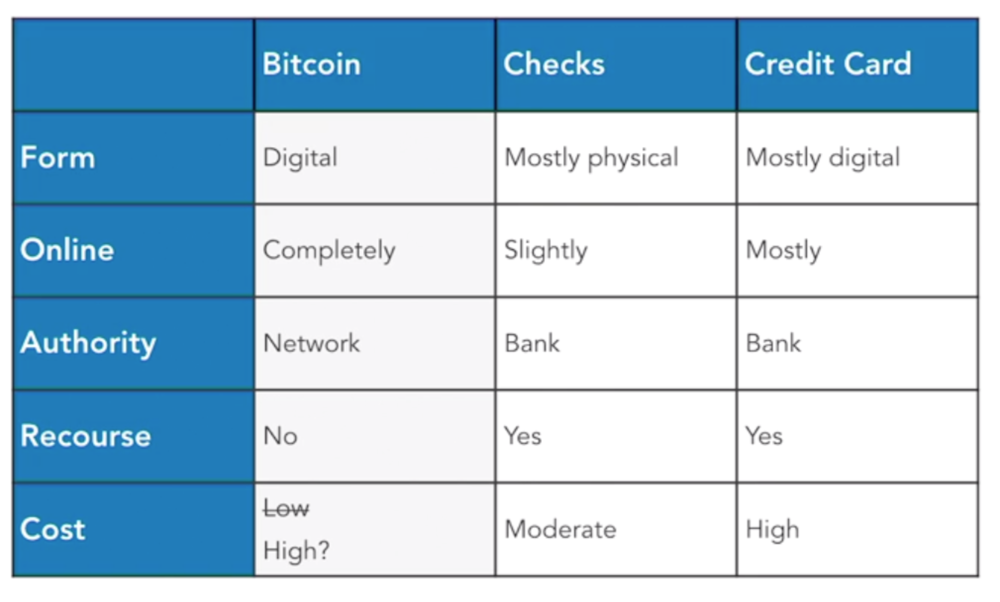
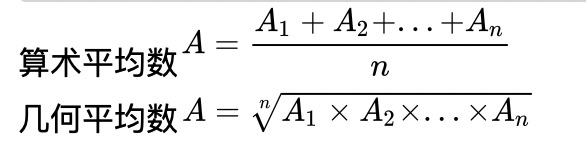

[TOC]


# 比特币


## 初始化文章

[http://article.gmane.org/gmane.comp.encryption.general/12588](http://article.gmane.org/gmane.comp.encryption.general/12588)

```
From: Satoshi Nakamoto <satoshi <at> vistomail.com>
Subject: Bitcoin P2P e-cash paper
Newsgroups: gmane.comp.encryption.general
Date: Friday 31st October 2008 18:10:00 UTC (over 9 years ago)
I've been working on a new electronic cash system that's fully
peer-to-peer, with no trusted third party.

The paper is available at:
http://www.bitcoin.org/bitcoin.pdf

The main properties:
 Double-spending is prevented with a peer-to-peer network.
 No mint or other trusted parties.
 Participants can be anonymous.
 New coins are made from Hashcash style proof-of-work.
 The proof-of-work for new coin generation also powers the
    network to prevent double-spending.

Bitcoin: A Peer-to-Peer Electronic Cash System

Abstract.  A purely peer-to-peer version of electronic cash would
allow online payments to be sent directly from one party to another
without the burdens of going through a financial institution.
Digital signatures provide part of the solution, but the main
benefits are lost if a trusted party is still required to prevent
double-spending.  We propose a solution to the double-spending
problem using a peer-to-peer network.  The network timestamps
transactions by hashing them into an ongoing chain of hash-based
proof-of-work, forming a record that cannot be changed without
redoing the proof-of-work.  The longest chain not only serves as
proof of the sequence of events witnessed, but proof that it came
from the largest pool of CPU power.  As long as honest nodes control
the most CPU power on the network, they can generate the longest
chain and outpace any attackers.  The network itself requires
minimal structure.  Messages are broadcasted on a best effort basis,
and nodes can leave and rejoin the network at will, accepting the
longest proof-of-work chain as proof of what happened while they
were gone.

Full paper at:
http://www.bitcoin.org/bitcoin.pdf

Satoshi Nakamoto
```


## 论坛

bitcointalk.org


## bitcoin vs checks vs Credit Card




# 地址

**比特币地址**的样子是一串长度为30左右的字母和数字组成的字符串，以“1” 或“3”开头的地址最为常见，最新的地址格式以“bc1”开头，例如：


17CZJCqnTXoEkXgE19XeY1mSE1t8aLnShu

3Lhub8aeQtQDBvNbNEyth8Tu7CiGNg2GSQ

bc1q2svykmvk06dutkxdw96rl0z28l4qa7u9yjaq6s


比特币的地址有多种格式，最新的是Bech32格式，以“bc1”开头，但一些比较古老的交易所对这个地址不支持。


另外是我们常用的以“3”开头的地址，这个也被称为隔离见证地址，有更多的优点。在软件中不要勾选“生成原生隔离见证Bech32地址”那个选项，就可以生成这样的地址，

以前的“1”开头的地址称为旧地址格式了，已经较少使用了，在新的Bitcoin Core钱包软件里，需要高级命令才能生成这样的地址。


# 指标


## 恐慌贪婪指数

每天通过不同的来源和数据分析人们的情绪，来形成一个简单的指数，实时数据见如下网站：https://alternative.me/crypto/fear-and-greed-index/

它从六个方面来收集数据：波动，资金量，社交媒体，调查，市值占比，关键词趋势。


1.波动（占25%）
评估当前的波动及比特币最大的下跌量，并且同过去30天、90天的平均值比较。

2.市场资金出入量、交易量（占25%）

3.社交媒体（占15%）

4.调查（占15%）（疫情期间暂停）

5.市值比重（占10%）

6.关键词趋势（占比10%）


## NVT

NVT 市值与交易量的比率 （Network Value to Transactions Ratio）
NVT=比特币总市值/每日链上交易量（以美元为单位、非交易平台成交额）


以 7 月 13 日为例，比特币市值 1702.49 亿美元，当日链上交易量 21.93亿美元，我们选取 coinmetrics.io 数据
NVT（Bitcoin）=1702.49 （亿美元）/21.93（亿美元）= 77.63

后来发现使用一天的链上交易量具有滞后性，就改为90天移动均线。
于是用总市值除以链上交易量的90天移动均线作为NVTS指标

NVTS=总市值 / 链上交易量的90天移动均线（美元、非交易平台成量）

一般认为，NVTS > 100 , 比特币被高估；NVTS< 50 , 比特币被低估；
在 50 和 100 之间时，比特币价格处在合理区间范围内，目前值为84。

今年3月12大跌NVTS最低48（BTC 4000美元）；
2017年大牛市NVTS最高107（比特币2万美元）；去年NVTS最高为113（2019年BTC最高1.4万）；


目前在网站1https://coinmetrics.io/charts/#assets=btc_right=NVTAdj90或http://charts.woobull.com/bitcoin-nvt-signal/可以查询比特币的实时 NVT


## MVRV 

MVRV 的计算公式是 MVRV = Market Cap（流通市值） / Realised Cap（已实现市值）

已实现市值 Realised Cap 是链上所有币的数量乘以“最后市场价格”的求和。每个比特币最后一次转账时的价值之和。

比如假设比特币只有一个投资者 A，昨天以 10000 美元的价格买入 10 个比特币，今天比特币价格跌倒 8000 美元时卖出 3 个。那么此时，
比特币总市值 Market Cap= 8000*10 = 80000 美元，已实现市值 Realised Cap = 7*10000（上次交易的最后市场价格）+ 3*8000 = 94000 美元，MVRV = 80000/94000 = 0.85 左右。

一般认为，当 MVRV<1 时，比特币价格被严重低估；1< MVRA < 2 时，比特币价格被部分低估；MVRV 处在2-3 区间说明存在过热现象，3-4 区间则可以认为存在巨大泡沫。

目前在网页https://www.qkl123.com/data/mvrv/btc或https://coinmetrics.io/charts/#assets=btc_right=CapMVRVCur或http://charts.woobull.com/bitcoin-mvrv-ratio/可以查看实时比特币 MVRV 指数。


## ahr999 （也称囤币指数）

https://ahr999.com/index.htm





在什么区间内购买比特币最划算呢？同时满足两个条件：
* 比特币价格低于200日定投平均成本，意味着在这个时候买币，可以跑赢定投的人。
* 比特币价格低于指数增长模型的估值，意味着在这个时候，币价被低估了。


定义两个比值，比特币价格/指数增长估值，比特币价格/200日定投成本（http://www.btcie.com/ratio/）。在这两个比值同时小于1时候，就是比特币价格被低估，并且直接购买比特币比长期定投更划算的时候。


ahr999指数 = （比特币价格/200日定投成本） * （比特币价格/指数增长估值）

ahr999指数小于0.45，这就是抄底区间；
在0.45与1.2之间，这就是定投区间；
在1.2与5之间，这就是等待起飞的区间。
大于5的时间，逃顶的时间


## 减半价格关系指数（100TUI）

该指数以比特币对美元价格为基础，根据距离最近的 BTC 区块奖励减半日期的天数计算，并使用颜色渲染。渐变色的变化表现了区块奖励减半日与价格之间的关系。
距离区块奖励减半日越远，红移越强；距离减半日越近，蓝移越强。在该指数图表中，我们可以从中观察到减半日这一比特币供给发生变化的事件对比特币市场价格造成的影响。
图中蓝色结束的点就是减半日，大家可以看下减半日与币价的关系
查看网站1：https://digitalik.net/btc/查看网站2：http://gbi.news/zh/market-data/


