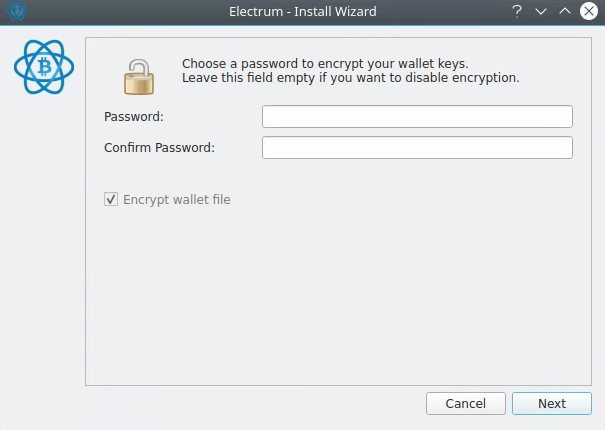

[toc]


# 轻钱包

只保留与你有关的账本记录，所需的磁盘空间比全节点钱包小1000倍，同步速度超快，几分钟就完成


## SPV 

这里用到的技术是简单支付验证（SPV）技术，SPV（Simplified Payment Verification）不保存完整的区块信息，只保存区块头信息。大多数用户并不关心背后复杂的技术原理，只需知道它与其它钱包的区别、安全性风险就足够了。

这类轻钱包虽然安全性不如全节点钱包，但假如你不是腰缠万贯，这种钱包的安全性能也可满足使用要求。由于SPV钱包没有保存全部区块数据，所以它在处理交易的时候需要联网才能进行。


在bitcoin.org上挑选轻钱包软件时，你只需认准Simplified Verfication标志即可，你更需要注意它与Centralized Validation的区别，后者是指中心化验证，也就是说SPV钱包软件是连接到一个中心服务器进行交易的验证，理论上是可以造假的。对于大额交易，还是亲自登录到blockchain.info等网站上输入交易ID，查查是否有6次以上确认最靠谱。


# Electrum (maybe outdated, follow official website)

Linux	Install dependencies:	

```
sudo apt-get install python3-pyqt5 libsecp256k1-0 python3-cryptography -y
```


Download package 

```
wget https://download.electrum.org/4.1.2/Electrum-4.1.2.tar.gz
```


Verify signature

```
wget https://download.electrum.org/4.1.2/Electrum-4.1.2.tar.gz.asc
gpg --keyserver keys.gnupg.net --recv-keys 6694D8DE7BE8EE5631BED9502BD5824B7F9470E6
gpg --verify Electrum-4.1.2.tar.gz.asc
```

```
$ gpg --verify Electrum-4.1.2.tar.gz.asc Electrum-4.0.9.tar.gz
gpg: Signature made Sat 19 Dec 2020 04:07:21 AM JST
gpg:                using RSA key 6694D8DE7BE8EE5631BED9502BD5824B7F9470E6
gpg: Good signature from "Thomas Voegtlin (https://electrum.org) <thomasv@electrum.org>" [unknown]
gpg:                 aka "ThomasV <thomasv1@gmx.de>" [unknown]
gpg:                 aka "Thomas Voegtlin <thomasv1@gmx.de>" [unknown]
gpg: WARNING: This key is not certified with a trusted signature!
gpg:          There is no indication that the signature belongs to the owner.
Primary key fingerprint: 6694 D8DE 7BE8 EE56 31BE  D950 2BD5 824B 7F94 70E6
```

> You can ignore this:
>
> WARNING: This key is not certified with a trusted signature!
> gpg:          There is no indication that the signature belongs to the owner.
> as it simply means you have not established a web of trust with other GPG users


Run without installing:	

```
tar -xvf Electrum-4.0.9.tar.gz
pip3 install --upgrade pip
pip3 install pycryptodomex pyqt5
python3 Electrum-4.0.9/run_electrum
```

Or install with PIP:	

```
sudo apt-get install python3-setuptools python3-pip
python3 -m pip install --user Electrum-4.0.9.tar.gz
```


## initialisation


* 这里如果返回，种子会变


* 有单词提示





# Appendix

https://electrum.readthedocs.io/en/latest/coldstorage.html

https://mp.buchuju.net/lesson/669ed7b8-f5a9-4978-934d-ecf64a1dd1f7


