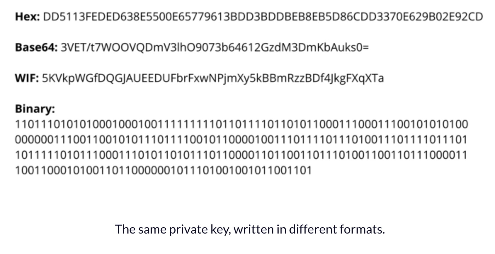
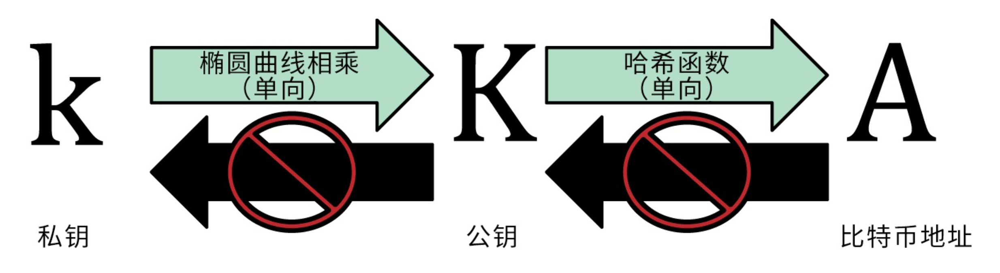

[toc]


# Private key

a private key for Bitcoin (and many other cryptocurrencies) is a series of 32 bytes. Now, there are many ways to record these bytes. It can be a string of 256 ones and zeros (32 * 8 = 256) or 100 dice rolls. It can be a binary string, Base64 string, a [WIF key](https://en.bitcoin.it/wiki/Wallet_import_format), [mnemonic phrase](https://github.com/bitcoin/bips/blob/master/bip-0039.mediawiki), or finally, a hex string. For our purposes, we will use a 64 character long hex string.




## 32 bytes

Bitcoin uses the **ECDSA**, or Elliptic Curve Digital Signature Algorithm. More specifically, it uses one particular curve called **secp256k1**.

Now, this curve has an order of 256 bits, takes 256 bits as input, and outputs 256-bit integers. And 256 bits is exactly 32 bytes. So, to put it another way, we need 32 bytes of data to feed to this curve algorithm.

There is an additional requirement for the private key. Because we use ECDSA, the key should be positive and should be less than the order of the curve. The order of secp256k1 is `FFFFFFFFFFFFFFFFFFFFFFFFFFFFFFFEBAAEDCE6AF48A03BBFD25E8CD0364141`, which is pretty big: almost any 32-byte number will be smaller than it.


## Cryptographically strong RNG

Along with a standard RNG (random number generation) 

This method is usually much more secure, because it draws entropy straight from the operating system. The result of such RNG is much harder to reproduce. You can’t do it by knowing the time of generation or having the seed, because there is no seed. Well, at least the user doesn’t enter a seed — rather, it’s created by the program.

In Python, cryptographically strong RNG is implemented in the `secrets` module. Let’s modify the code above to make the private key generation secure

```
import secrets

bits = secrets.randbits(256)
print(bits)
bits_hex = hex(bits)
print(bits_hex)

private_key = bits_hex[2:]
print(private_key)

>>>
9138976318288522481132697828447841686925836552785867534050609495529084110128
0x14347a2fb534005b30c132f8fffa2d7da6a4fc02e9439efcf04403e715874530
14347a2fb534005b30c132f8fffa2d7da6a4fc02e9439efcf04403e715874530
```


Below is insecure method which can be attacked by brute-force with a few variants 

```
import random

bits = random.getrandbits(256)
print(bits)
bits_hex = hex(bits)
print(bits_hex)

private_key = bits_hex[2:]
print(private_key)

>>>
65358812825735084032636193620386220831461791295226259059545162764499623487988
0x907fc6f15933b0a265a83eb9ee4c199ded80267815f69034e885aad953de29f4
907fc6f15933b0a265a83eb9ee4c199ded80267815f69034e885aad953de29f4
```


## public key

```
import codecs
import ecdsa as ecdsa

private_key = '60cf347dbc59d31c1358c8e5cf5e45b822ab85b79cb32a9f3d98184779a9efc2'

private_key_bytes = codecs.decode(private_key, 'hex')
key = ecdsa.SigningKey.from_string(private_key_bytes, curve=ecdsa.SECP256k1).verifying_key
key_bytes = key.to_string()
key_hex = codecs.encode(key_bytes, 'hex')
bitcoin_byte = b'04'
public_key = bitcoin_byte + key_hex
print(public_key)

>>>
b'041e7bcc70c72770dbb72fea022e8a6d07f814d2ebe4de9ae3f7af75bf706902a7b73ff919898c836396a6b0c96812c3213b99372050853bd1678da0ead14487d7'
```


## convert to address

```
b'041e7bcc70c72770dbb72fea022e8a6d07f814d2ebe4de9ae3f7af75bf706902a7b73ff919898c836396a6b0c96812c3213b99372050853bd1678da0ead14487d7'
```


```

```


## 随机数生成私钥

The bitcoin private key is just a number. You can pick your private keys randomly using just a coin, pencil and paper: Toss a coin 256 times and you have the binary digits of a random private key you can use in a bitcoin wallet. The public key can be then generated from the private key.

The first and most important step in generating keys is to find a secure source of entropy, or randomness. Creating a bitcoin key is essentially the same as “Pick a number between 1 and 2^256

Bitcoin software uses the underlying operating system’s random number generators to produce 256 bits of entropy (randomness).

More accurately, the private key can be any number between 1 and n - 1, where n is a constant (n = 1.158 * 1077, slightly less than 2256) defined as the order of the elliptic curve used in bitcoin 

To create such a key, we randomly pick a 256-bit number and check that it is less than n - 1. In programming terms, this is usually achieved by feeding a larger string of random bits, collected from a cryptographically-secure source of randomness, into the SHA-256 hash algorithm which will conveniently produce a 256-bit number. If the result is less than n - 1, we have a suitable private key. Otherwise, we simply try again with another random number.


Do not write your own code to create a random number or use a “simple” random number generator offered by your programming language. Use a cryptographically-secure pseudo-random number generator (CSPRNG) with a seed from a source of sufficient entro‐ py. Study the documentation of the random number generator li‐ brary you choose to make sure it is cryptographically secure. Cor‐ rect implementation of the CSPRNG is critical to the security of the keys.


# private key format

```
Private Key HEX: 101cc368f0bfb12d175e1772320cbc1a55d2a2be2ffb42d9df1f9cd570634c15              
Private Key WIF: 5HwP9eyb8TtubbcXwREgVHgyBnZrNpHw7PpGeitGeSkmk8MQ8RT           
Private Key WIF compressed: Kwm2mCcmdwi79hmqZByPHrfQzc7zwHjjqDhe5VsJ4GgCV4BgSzZT           
```


# Private key / Public key / Address




# FAQ


## 私钥重合

私钥本质上是256位的二进制数，有人可能就会担心了，如果我用的随机数与别人的重合了，该怎么办？

2的256次方，大概是1E+77这样的天文数字，1后面有77个零

```
In [27]: 2**256
Out[27]: 115792089237316195423570985008687907853269984665640564039457584007913129639936

In [28]: len(str(2**256))
Out[28]: 78
```


有这样一个比方。任意两个随机生成的地址正好相同的可能性，相当于两个人从地球上捡起了同一粒沙子，再把这粒沙子看做地球，然后这两个人又从这个地球里捡起了同一粒沙子。


所以用真随机数作为私钥，地址是不可能重合的。如果地址重合了，相当于你中了一个本星系群（比银河系还高一个等级的天体系统）里的超级大彩票！

在Bitcoin Core等钱包里，随机数生成算法已经非常专业，重合的概率为0，可以放心使用。

多说一句，比特币的这个原理，决定了Bitcoin Core可以在完全无网络的环境下，随机生成一堆地址，你可以放心使用，绝对重合不了，这也是冷钱包的基本原理。

如果你能猜到别人的私钥，那就去猜中本聪的私钥吧，据说他的100多万个BTC从来没动过。


## 双重支付(Double-Spend)

区块链技术解决了数字货币支付中的一项关键难题，称为“双重支付”，英文是double-spend，即一笔数字资产既支付给了A，又支付给了B。有些书或网络文章中也把double-spend直译为“双花”

在去中心化交易技术之前，双重支付问题通过中心化的机构来解决，比如：银行。你用手机银行给别人付了一笔钱，银行把余额变动一下，只要银行的记账系统没有错误，想多花是绝对不可能的。当然信用卡账户允许你0余额还可以支付一定数量的资金，能否透支那都是银行说了算，比特币世界里不让透支。


比特币的创始人中本聪设计了一套完整的体系解决了双重支付这个难题，共享大账本（区块链）、去中心化的网络（比特币协议）、交易验证系统（交易脚本）和货币发行（挖矿）等。
大家可能会想，又是挖矿、又是工作量证明，为什么把新区块的产生搞得那么复杂？一个主要原因就是解决在没有任何信任关系的网络中的双重支付的问题，当然这种挖矿机制还能够解决虚假交易、垃圾交易等问题。


这种技术也可以解决"拜占庭将军问题"，即一支分散在多处的军队里混入少数叛徒，如何才能通过一致的行动来保证战争的胜利。

假如你在两台安装有Bitcoin Core的电脑上分别发出了2笔交易（相同的BTC输入来源，支付给A和B），技术上讲，这两笔交易都是合法的交易，这些交易都会向全网广播，矿工在收到这些交易时，不会将两个交易都记录在区块链上。如果有矿工故意作假，把A和B都打包，交易广播后还有许多其他节点要进行验证，仍会拒绝承认这个区块，也就是说这笔交易的确认数会一直为0。小额交易等待1次确认就行，大额交易等待6次以上的确认就足够的安全。

在比特币世界里想透支，是不可能的。除了创世区块中的50个BTC是凭空出现的，以后的BTC都是挖矿获得的。你是否拥有1个BTC？通过比特币地址可以查个底朝天，一直追踪到这笔资金的诞生记录。这笔钱是不是你的？通过加密和签名算法来保证，无法伪造。

传统互联网上我们可以把一首mp3音乐复制无数份，发给许多人，如何判定谁真正拥有这首音乐？在区块链中，你的BTC无法双重支付，可以明确每一笔BTC的归属权。不需要中心机构的参与，就可以准确地实现归属权的转移，价值互联网也就因此而来。


# Appendix

https://www.freecodecamp.org/news/how-to-generate-your-very-own-bitcoin-private-key-7ad0f4936e6c/

Mastering Bitcoin

https://bitinfocharts.com/top-100-busiest_by_transactions-bitcoin-addresses.html

