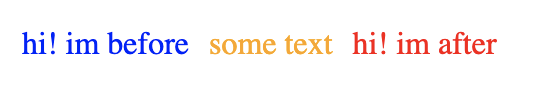

[TOC]

# display

用于控制layout的属性，每一个标签有一个默认的display value 作为控制，较多使用block 或者inline作为默认值

## none

从文档流中移除

如script标签，用于隐藏和显示元素

和visibility不同的是，`display:none`会渲染页面， `visibility:hidden` 尽管隐藏了元素，但是始终会占用页面位置

```
p {
    display: none;
}
```

## block

按照块级元素显示，前后带换行符，自己独占一行。

如div, p, form标签，从左到右尽可能的占用空间.  在html5中，如header, footer, section

从内联元素变成块元素 ，可以设定行高

```
span1 {
    display: block;
}
```

## inline

按照内联元素显示，一个挨着一个, 不会破坏页面布局和

从块元素变成内联元素，不能设定行高

如span, a标签等，包裹住定义的文本

```
<span>my text</span>
```

## inline-block 行内排版

按行内标签进行排版，但是可以设置 宽高，如图片

```
span1 {
    background-color: red;
    height: 400px;
    weight: 400px;
    display: inline-block;
}
```

## flex 伸缩效果

```
display: flex;
```

### justify-content 排布方式

```
justify-content: flex-start; // 从左向右 默认
justify-content: flex-end; // 从右向左
justify-content: center； //中间显示 
justify-content: space-between; // 两端对齐方式
justify-content: space-around; // 两边空白 环绕对其
```

### flex-direction 主轴调整

```
flex-direction: row; // 主轴水平
flex-direction: row-reverse; // 主轴水平反转
flex-direction: column; // 主轴水平方向变成了垂直方向，侧轴永远都是垂直主轴的
flex-direction: column-reverse; // 主轴竖着反转
```

### flex-wrap 子元素换行

默认子元素没有换行

```
flex-wrap: wrap; // 子元素换行
flex-wrap: nowrap; // 默认值
flex-wrap: wrap-reverse; // 反转+换行
```

## align-items 侧轴对齐

```
align-items: flex-start; // 侧轴开始
align-items: flex-end; // 侧轴开始
align-items: center;
align-items: stretch; // 拉伸效果，但是需要弄掉子元素的高度
```

## align-content

```
align-content: flex-start; //子元素换行后有空白行
```

## 颜色表示

## RGB

```
rgb(red, gree, blue)
```

> 每个参数定义颜色强度，0-255之间，或者0%-100%

```
p {color: rgb(255,255,0);};
p {color: rgb(100%,100%,0);};
```

### 十六进制

rgb的另一种写法

`#RRGGBB`

```
#000000 - #FFFFFF 之间
```


## `:before` `:after`

`:before` and `:after` create pseudo elements as 'children' for the element they are applied to. They are often used for certain stylings, or error messages.

```
<p>some text</p>
```


```
p:after {
    content: 'hi! im after';
    color: red;
    padding: 0 10px;    
}

p:before {
    content: 'hi! im before';
    color: blue;
    padding: 0 10px;
}

p {
    color: orange;
}
```





### Hover 案例

```
div {
    width: 300px;
    height: 50px;
    background: yellow
}

div:before {
    content: "Before";
    background: red;
}

div:hover:after {
    content: "Hovered After";
    background: blue;
    color: white;
}
```

http://jsfiddle.net/XjUM8/2/


