[toc]

# Data Lake

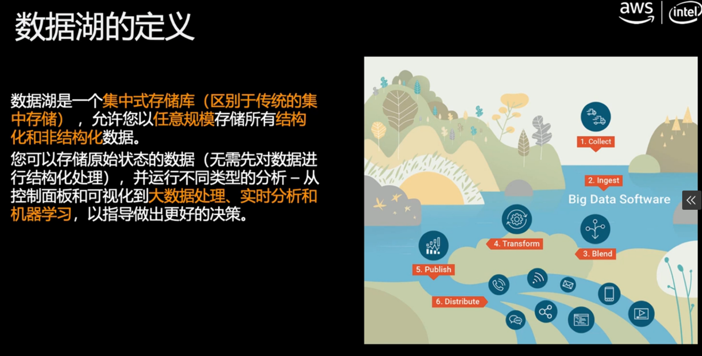

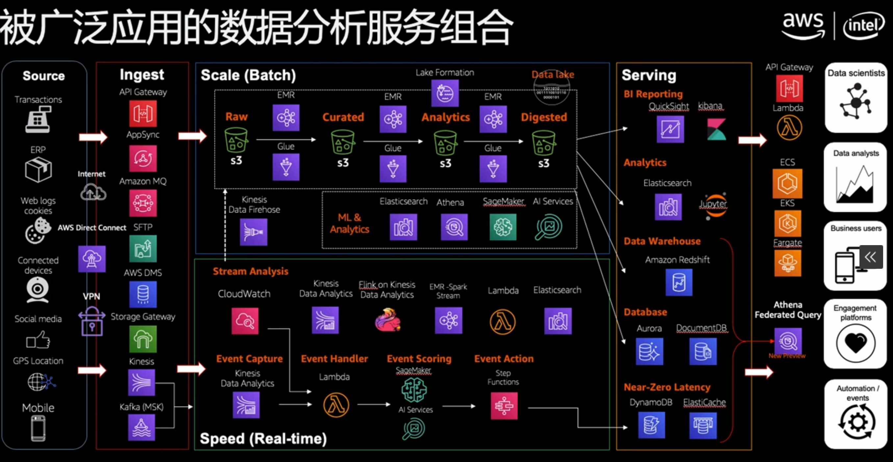

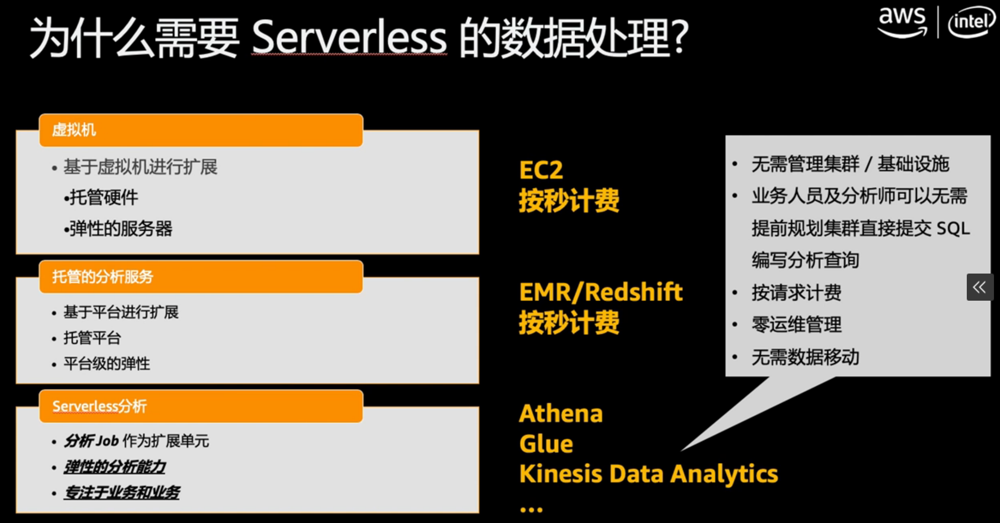

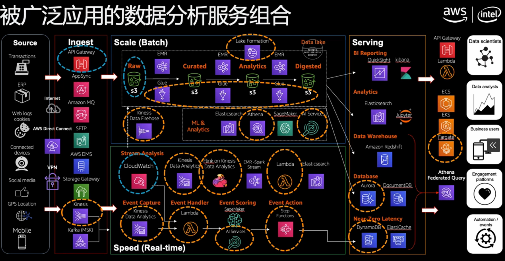

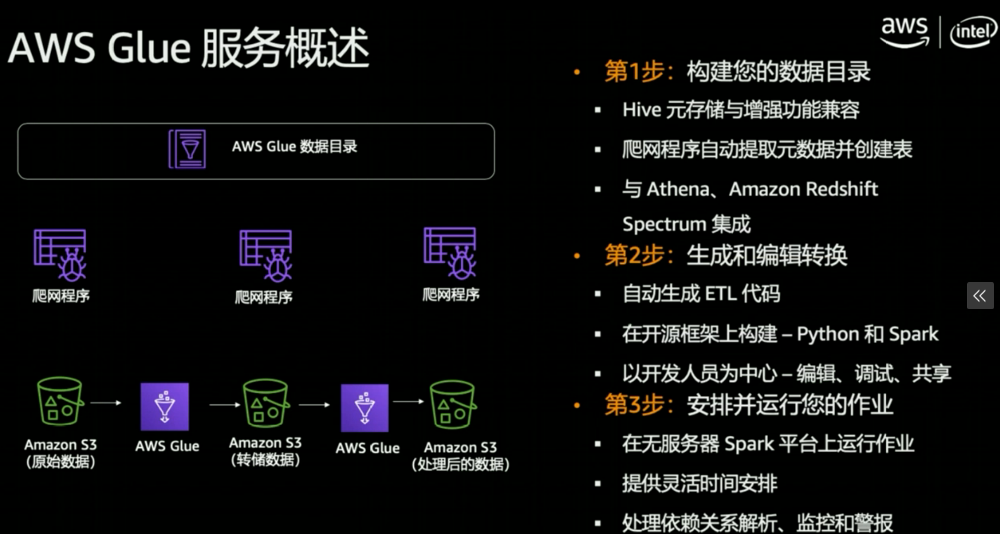

## Disadvantages

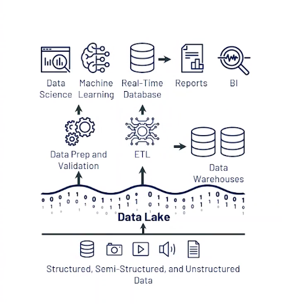

* Poor BI support
* Complex to set up
* Poor Performance
* Unreliable data swamps

# Lake House

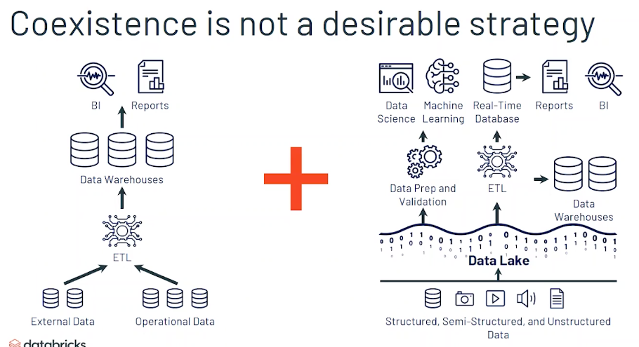

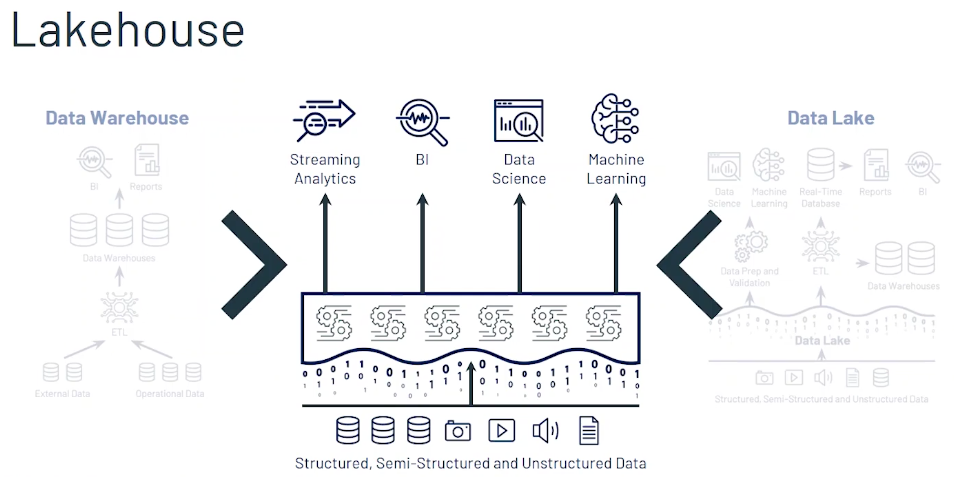

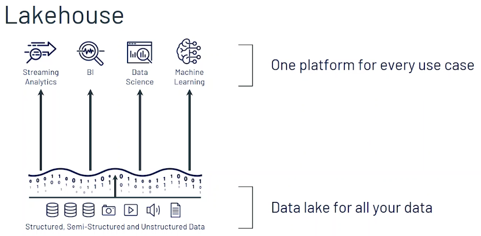

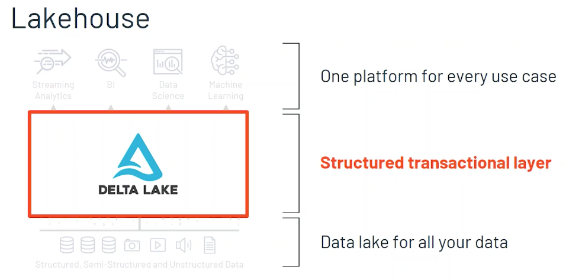

## Structured transactional layer 

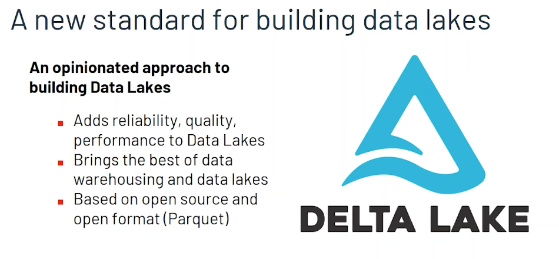

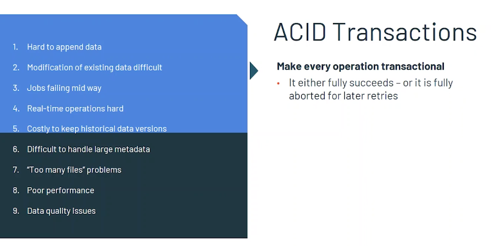

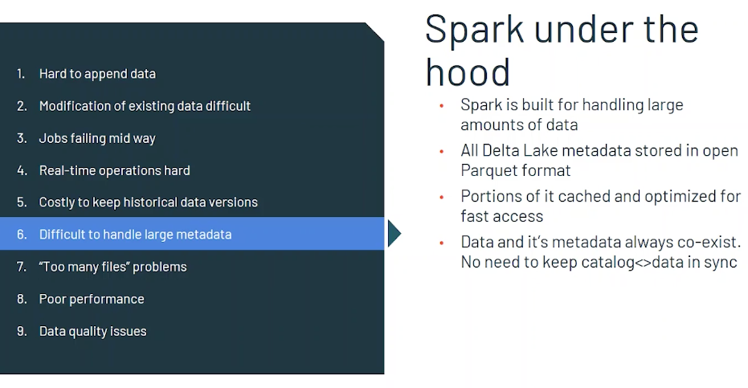

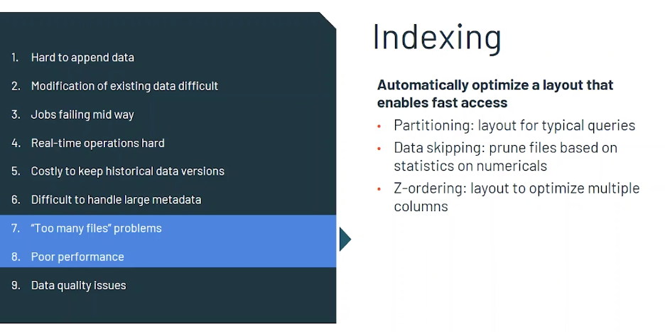

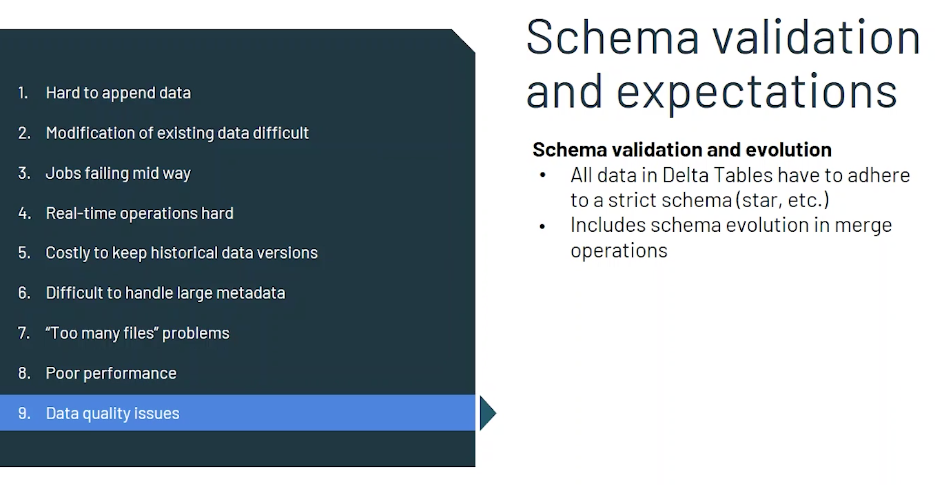

## High-performance query engine

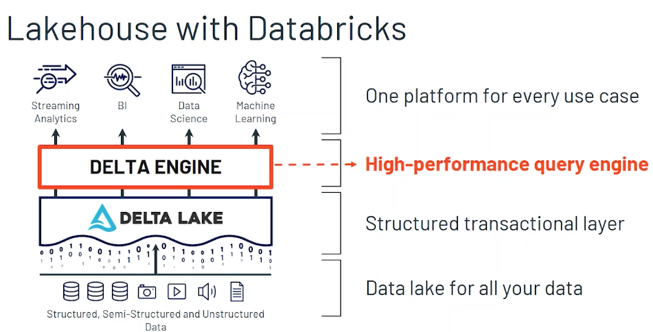

# Databricks & AWS Data lake implementation

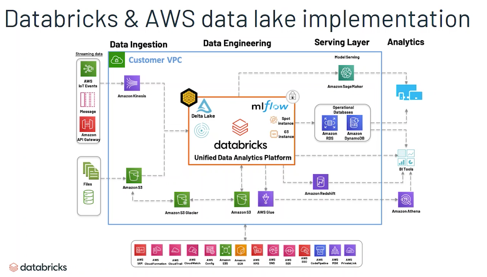

## Delta Lake at Digital Turbine

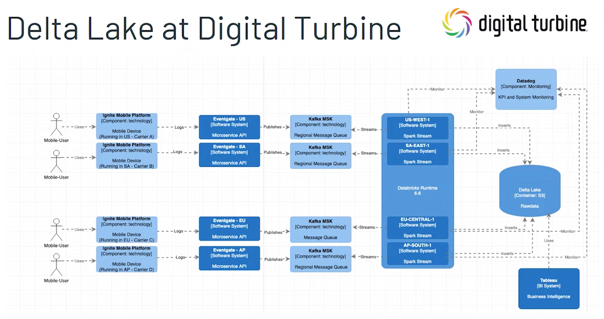

# Optimize Databricks Costs

https://tech.scribd.com/blog/2020/optimize-databricks-cluster-configuration.html

